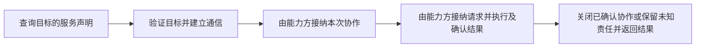
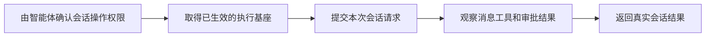
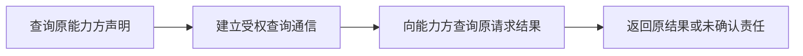
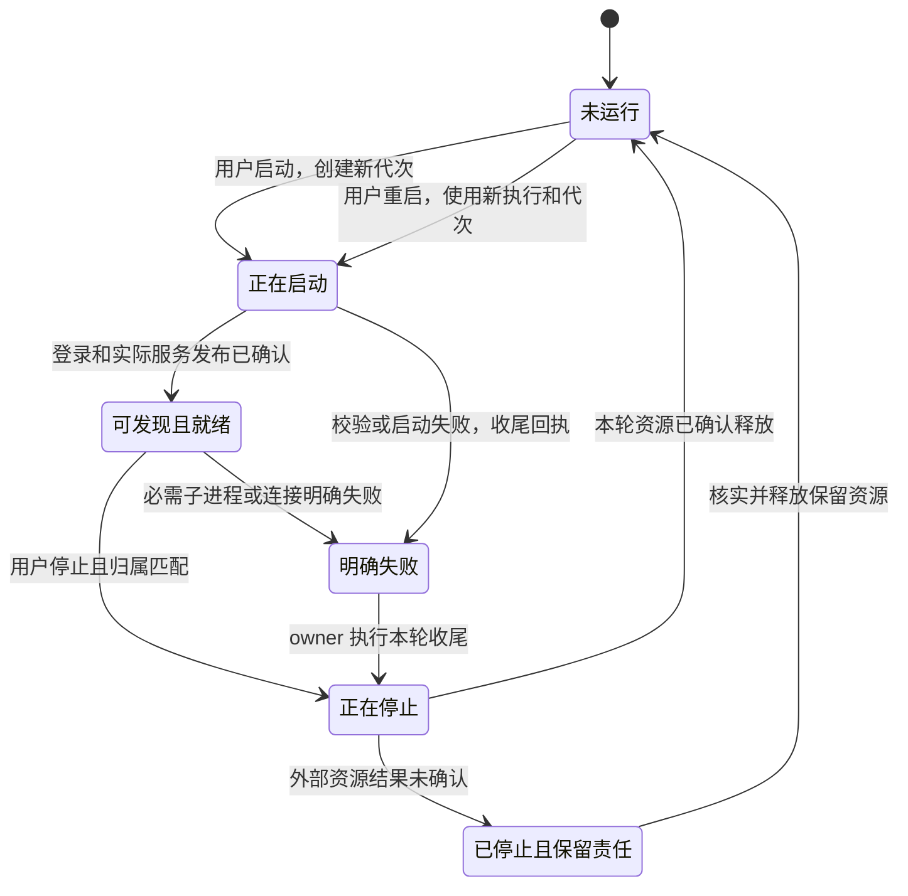
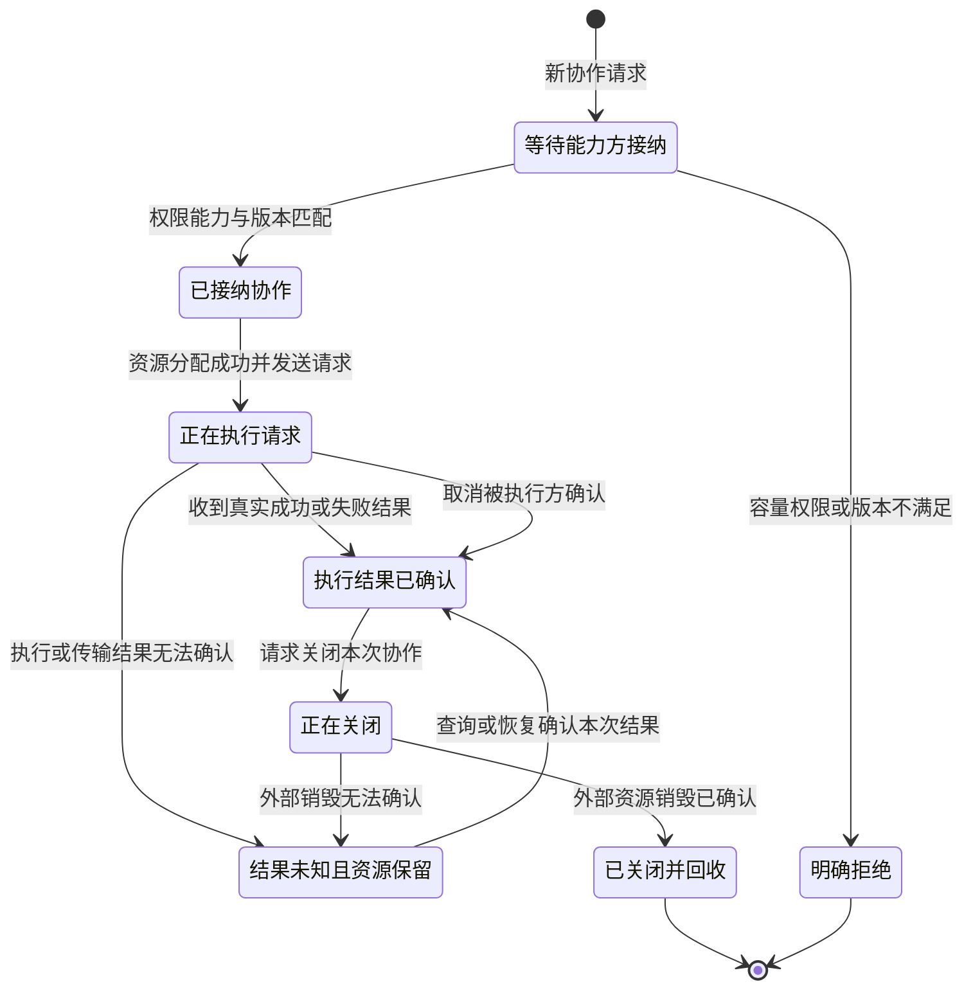
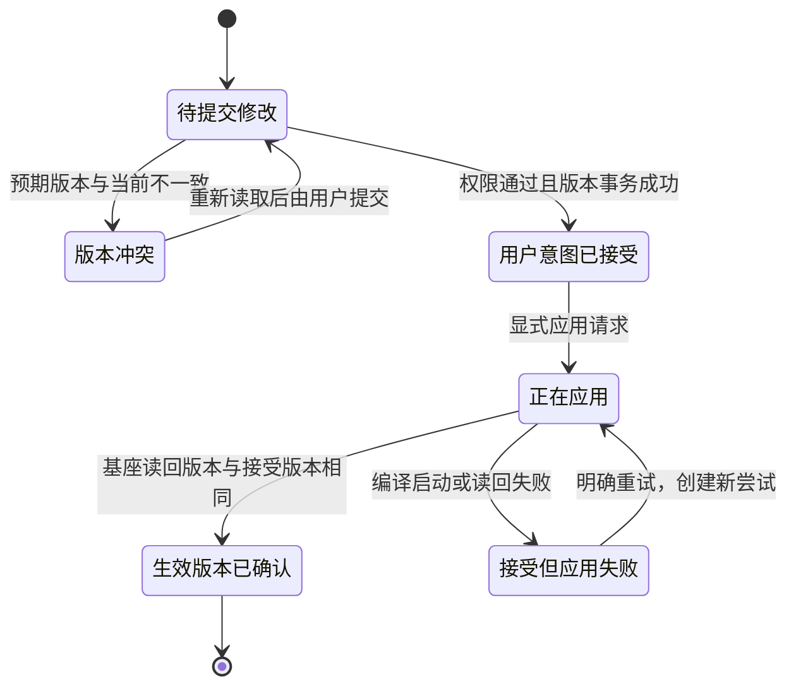
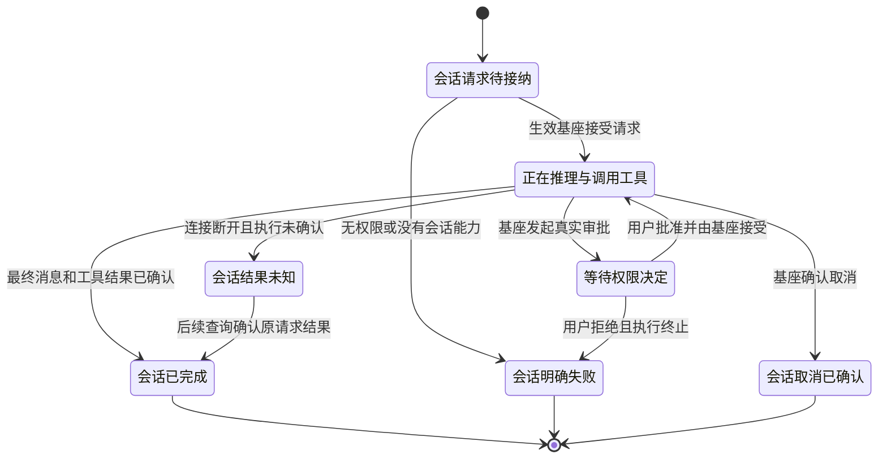

# AgentTeams 行为 DAG 与生命周期模型 v1

本模型定义本地用户 MVP 的目标行为。审计基线与实现偏离见 [现状审计](teams-behavior-audit-20261002.md)。
graph JSON 是拓扑真源；以下中文图解释业务语义，映射表用于连接现有 owner，不是第二个执行图。
所有 `teams.*@1` 是项目设计 binding，**尚未注册为 DAGpipe SDK Operator**。目前实现由 TS 模块承担；缺失边明确标为待实现。
事件、具体 ARC、公开边界、宿主接入及执行分类见 [行为契约](teams-behavior-contracts.md)。SDK 的 Object 不证明字段契约已校验。

## 角色、对象与边界

- 用户：选择运行端点、提供或消费的服务、资源容量及模型。用户只编辑 config.toml。
- provider Agent：声明服务，独立决定匹配、权限及资源 admission，执行请求并管理 Work 资源。
- receiver Agent：按显式 target/service/operation 提交协作请求，不拥有 provider 的容量或权限。
- runtime：进程、启动归属、内部配置投影；network：链路、generation、连接与未知传输结果；server：目录与连接 admission。
- Console：可选观察/配置/Session 客户端；关闭它只关闭它自己的连接，不终止 provider Work。
- config：用户 provider/model 意图与版本提交；adapter：推导执行基座配置及保留 Session/工具/审批语义。

每次 graph 执行绑定 project/graph/version/execution/attempt；进程启动另绑定 owner token 和 generation。图无跨节点回边；生命周期可以产生下一次执行。
调用方选择重试必须遵守该对象语义：观察可重新查询，配置需重新读取 revision，未确认业务执行不得自动重放。

## 行为图

### B1 一次启动

文件：`dagpipe/graphs/daemon-start.graph.json`。输入 start.intent，输出 start.receipt。

完成条件：bridge 和两个不同 PID daemon 在线，目录包含实际可用的 enabled 服务；不是仅进程存活或 HTTP health。
启动失败后停止本轮已启动的 children、撤销目录/监听并写失败 receipt；该失败由 runtime 调用 B6 收尾，不通过继续成功图隐藏错误。
启动不隐式完成用户 Work。已有 configured startup task 必须明确标为启动任务，不能替代用户提交。

### B2 一次 Agent Work

文件：`dagpipe/graphs/agent-work.graph.json`。输入 work.intent，输出 work.receipt。

每次用户发起使用新 Work/request identity；相同幂等标识可查询原回执，但必须明确“已执行结果”。禁止把旧成功当新执行。
能力方决定容量与政策，provider/receiver 均允许一对多。超过容量、无权限、旧 generation、未声明 operation 均返回明确拒绝。
业务结果来自执行 payload；控制状态、route、generation、权限和执行诊断放 typed control/error chain，绝不镜像进业务 metadata。
资源结束条件：request allocation 经确认执行结束才释放；Work context 经 destroy 确认才释放。unknown 进入保留状态，不能沿成功 close 边假释放。
B2 v2 的 request 节点使用真实公开 request 契约，allocation/executor/record 留在 provider 内部；不假设存在三个可独立调度的远端 API。异常收尾由持有 typed ownership/dispatch facts 的宿主执行，不能从 journal 重建控制真相。

### B3 一次配置应用

文件：`dagpipe/graphs/provider-config.graph.json`。输入 config.intent，输出 config.receipt。

用户 TOML 表达 provider 实例、显式模型、绑定与 credential env reference；内部 TOML 表达发现的 catalog、accepted/effective revision、resolved 进程/路径及错误。
Console 修改必须进入同一 config owner 的版本事务，不新增第二份 editable JSON。迁移前当前 JSON store 是已有 durable owner，不可直接删除。
接受 revision 不等于生效。失败保留 accepted revision 与 apply error；无 silent fallback。empty catalog 可以显式添加模型，不猜模型。
字段级原子写入、两个 TOML 的并发责任及崩溃恢复需在配置 delivery unit 细化；不能凭图给不存在的事务保证。

### B4 一次 Console 观察

文件：`dagpipe/graphs/console-observe.graph.json`。输入 console.intent，输出 console.receipt。

目录负责 presence/generation/capability；Agent 管理入口负责 Session/config/Work 投影；Console 不重建运行真相。
目录离线行可显示但不能发送管理指令；Manager permission 拒绝与链路 unavailable 不能伪装成空成功。
取消/关闭只释放 Console listener、registration 和自身连接。此次观察结束不改变 Agent Work。

### B5 一次 Session 请求

文件：`dagpipe/graphs/session-request.graph.json`。输入 session.intent，输出 session.receipt。

此图为待补入口。已有 managed OpenCode 派发不能证明 daemon Console Session 接线完成。
成功要保留消息、tool call identity/arguments/result、权限请求与回复的语义；approval pending 是进行中，不是完成。
取消经 Agent adapter 确认并收取最终状态；浏览器断开不等于请求已取消。被动能力 Agent 明确不支持 Session 合法，无需挂模型。

### B6 一次停止

文件：`dagpipe/graphs/daemon-stop.graph.json`。输入 stop.intent，输出 stop.receipt。

generation/owner 不匹配必须拒绝，不触碰其他进程。进程 exit 不能证明外部 browser context 已销毁。
stop.receipt 可以是 stopped-clean、stopped-with-retained-obligations 或 failure；只有 stopped-clean 表示资源全收口。
unconfirmed 对象保留明确 owner/资源/恢复动作；不得无期限静默占用，也不编造回收成功。

### B7 一次版本交付

文件：`dagpipe/graphs/version-delivery.graph.json`。输入 delivery.intent，输出 delivery.receipt。

用户安装包、runtime hash、安装入口及真实效果必须绑定精确候选。包内用户入口与治理安装 smoke 要验同一个对象。
代码未变不重跑全量。复用 `scripts/lifecycle-adapter.mjs` 的 stage state/fingerprint/receipt；目前其粗粒度 pnpm-verify/installed stage 不等于所有功能已有 fine-grained reuse。
失败进入项目既有阶段 blocked/invalidated；从首个失效节点重入，远端/PID/runtime 等可变边界刷新。候选改变使依赖图中受影响下游失效，不按会话重启失效。

### B8 一次 Work 查询或恢复观察

文件：`dagpipe/graphs/work-query.graph.json`。输入 work.query.intent，输出 work.observation.receipt。

查询创建新的图执行身份，保留原 Work/request 身份；不重新 propose/request。连接收尾由宿主负责；query 成功不代表外部资源已销毁。后续显式清理走新的生命周期动作，unknown 返回保留责任和解除条件。BB04、BB07 验证查询不产生新业务执行。

## 状态机与异常终点

静态 graph 画正常的数据依赖，不表达全部条件控制流。预期业务拒绝可返回 typed outcome；未知异常由 graph execution failure 终止，owner 执行适用 teardown 并保存失败 journal/receipt。
**DAGpipe Runtime 不会自动从 state transition 发图，也不会自动运行补偿或 cleanup**。本模型把触发责任留给项目 runtime，后续适配必须验证失败终点，不能把异常塞成假成功继续运行。

## Operator 设计绑定与实现 owner

下表按图内顺序列出，每个 operator_version 均为 `1`。这些名字不是声称已有注册实现。

| 图/中文行为 | Operator binding | 唯一 owner 与源码锚点 | 当前边界 |
|---|---|---|---|
| B1 编译意图；取得归属 | compile-local-intent；claim-daemon-owner | runtime：local-config.ts、local-process.ts | 已有；简化用户配置待补 |
| B1 启通信桥 | start-local-bridge | runtime：local-supervisor.ts，使用 server/relay-process.ts | 已有；server 独占监听 admission |
| B1 接纳 daemon | admit-local-daemons | server：relay.ts/admission.ts，runtime 驱动 agent-process.ts | 已有真实 socket 历史证据 |
| B1 发布服务 | publish-enabled-services | agent-host：cli-executor.ts，runtime/capability-publication.ts 投影 | 固定声明须改为 enabled 服务 |
| B1 回报就绪 | observe-local-ready | runtime：local-supervisor.ts/local-process.ts | 已有 |
| B2 查询声明；建立通信 | resolve-peer-service；open-work-link | network：relay-client.ts/work-channel.ts，runtime/agent-work-client.ts 消费 | 已有；CLI 新任务入口缺 |
| B2 接纳协作 | admit-provider-work | agent：work-resource.ts，agent-host/work-host.ts 的 propose 公开入口 | 已有账本语义，禁止 CLI 复制 |
| B2 接纳请求并执行及确认结果 | request-provider-work | agent-host：work-host.ts 的 request 公开入口，内部使用唯一 ledger/executor | 已有公开契约；真实 enabled service 和 SDK 宿主接线缺 |
| B2 确认关闭或保留并返回结果 | settle-provider-work | runtime：agent-work-client.ts 的 close/dispose；资源销毁仍由 provider 决定 | 用户 payload 回执待暴露；unknown 不 close 假释放 |
| B8 查询原请求；返回观察 | query-provider-request；return-work-observation | agent-work-client.ts 的 get → provider WorkHost.get，runtime projection | SDK 查询图未接；观察不重放、不更改资源状态；finally 释放查询连接 |
| B3 允许修改 | authorize-config-edit | agent-host：console-ingress.ts | 已有 |
| B3 接受意图 | accept-config-revision | config：runtime-config.ts，runtime/console-config.ts | JSON durable store 已有；TOML 用户源待接 |
| B3 推导配置 | derive-opencode-config | opencode-adapter：src/index.ts、src/managed-config.ts | 已有，派生输出非 editable |
| B3 应用与读回 | apply-opencode-revision；confirm-effective-revision | runtime：managed-config-owner.ts、managed-opencode.ts | 已有；配置 owner 保存 effective 事实 |
| B4 观察身份 | authorize-console-access | console-host：src/auth.ts/server.ts | 已有；可启动用户入口缺 |
| B4 发现端点；读 Agent | discover-visible-endpoints；read-authorized-agent-state | runtime：console-hub.ts、relay-console-client.ts；server 目录真源 | 已有；Agent managers policy 独立 |
| B4 视图；返回 | project-console-view；return-console-view | console-host：src/http-api.ts，ui/teams-console/ 消费 | 已有；用户包静态资源缺 |
| B5 会话授权 | authorize-session-request | agent-host：console-ingress.ts | 接口边界已有，daemon 实际会话待接 |
| B5 取得生效基座 | resolve-effective-runtime | runtime：managed-config-owner.ts | 已有 use() 契约 |
| B5 提交；观察；结果 | dispatch-opencode-session；observe-session-outcome；return-session-result | opencode-adapter：src/index.ts；runtime/agent-process.ts 组装 | adapter 已有；daemon sendSession 当前明确拒绝 |
| B6 归属校验 | verify-stop-owner | runtime：local-process.ts | 已有 generation/token 校验 |
| B6 排空或保留 | drain-or-retain-work | agent-host：work-host.ts，runtime 驱动 | unknown 必须保留责任；外部清理验收待补 |
| B6 停止；释放；回执 | stop-owned-children；release-owned-runtime；persist-stop-receipt | runtime：local-supervisor.ts/local-process.ts/local-config.ts | 已有；验证全部 own 资源终点 |
| B7 源码；构建；回放 | verify-affected-source；build-user-package；replay-installed-entry | development-governance：scripts/lifecycle-adapter.mjs、package.json | 分阶段 reuse 已有；用户 package 同源尚缺 |
| B7 审查；远端；清理 | review-exact-candidate；integrate-and-confirm-remote；cleanup-owned-delivery | primary integration owner：独立 review、Git、资源 receipt | 按现有授权闭环，不虚构 runtime Operator |

## ARC 契约与检查

CLI schema 仅使用 `Object`，不会校验下列字段。运行接入前必须在唯一 owner 中绑定现有 typed contract；这张表是设计约束，不是当前已通过的 SDK schema gate。

| ARC 组 | 必须保留的事实 | 验收方式 |
|---|---|---|
| start.intent→config.resolved→owner.claimed | config revision、endpoint/service intent、resolved references；pid/token/generation 控制资源 | 新 HOME 配置编译；invalid intent 不启动子进程 |
| bridge.ready→daemons.admitted→services.published→start.receipt | admission identity、directory generation、enabled declarations、真实 PID readiness | 两 daemon socket discovery；未启用 browser 不可匹配 |
| work.intent→service.resolved→link.verified | 显式 target/capability/version/operation，独立 business payload，link/generation control | target mismatch、旧代次明确拒绝 |
| work.admitted→execution.outcome | provider policy revision、work/request id、原 WorkReply；allocation/execute/record 是 provider 内部职责 | 一对多与超过容量拒绝，不能超卖 |
| execution.outcome→work.receipt | succeeded/failed/unknown、原业务结果、typed error、资源 confirmed/released/retained | 两次新操作结果不同；unknown 不重放、不假释放 |
| config.intent→edit.authorized→revision.accepted | expected revision、用户 provider/model、授权主体、durable revision | CAS 冲突、凭据缺失、重启持久化 |
| substrate.configured→substrate.applied→config.receipt | 派生配置 hash、实际 runtime readback、accepted/effective/error | RCC/显式备用独立请求，无自动 fallback |
| console.intent→console.authorized→directory.observed→agents.observed→view.projected→console.receipt | auth/origin 事实、可见目录 generation、Agent state 与错误、只读 projection | 真浏览器目录发现，越权失败；Console-offline Work |
| session.intent→session.authorized→runtime.resolved→session.dispatched→session.outcome→session.receipt | session/request identity、effective revision、消息/工具/权限语义、final/unknown | Console 真消息、一次真实 tool/approval 正反路径 |
| stop.intent→stop.authorized→work.settled→children.stopped→runtime.released→stop.receipt | expected generation/owner、confirmed external destruction、retained obligation、进程退出 | 旧代次拒绝；停止后 own PID/端口消失 |
| delivery.intent→source.verified→package.built→entry.verified→candidate.reviewed→remote.confirmed→delivery.receipt | exact candidate/tree/base、输入指纹、产物/runtime hash、review、remote SHA、cleanup | 阶段故障后恢复只跑失效节点；pack 安装→真实入口→远端→资源移除 |

## 必需验证与失效边

先运行受影响 graph 的 `dagpipe graph validate` 与 `inspect`。graph binding/owner 改变同时更新已有架构 map，不增加另一套 module registry。
各功能定向测试及真实入口见 [交付计划](../goals/teams-user-delivery-plan.md)。源码、依赖、配置、图、环境或产物变化按对应 ARC 依赖传播失效；仅文档解释变化无需重建全部 runtime。
本次 graph 校验不能把“目标映射”升级成“执行已接线”；产品开发必须先让独立 design review 通过，然后在作者真实入口验收后做独立 exact architecture review。
