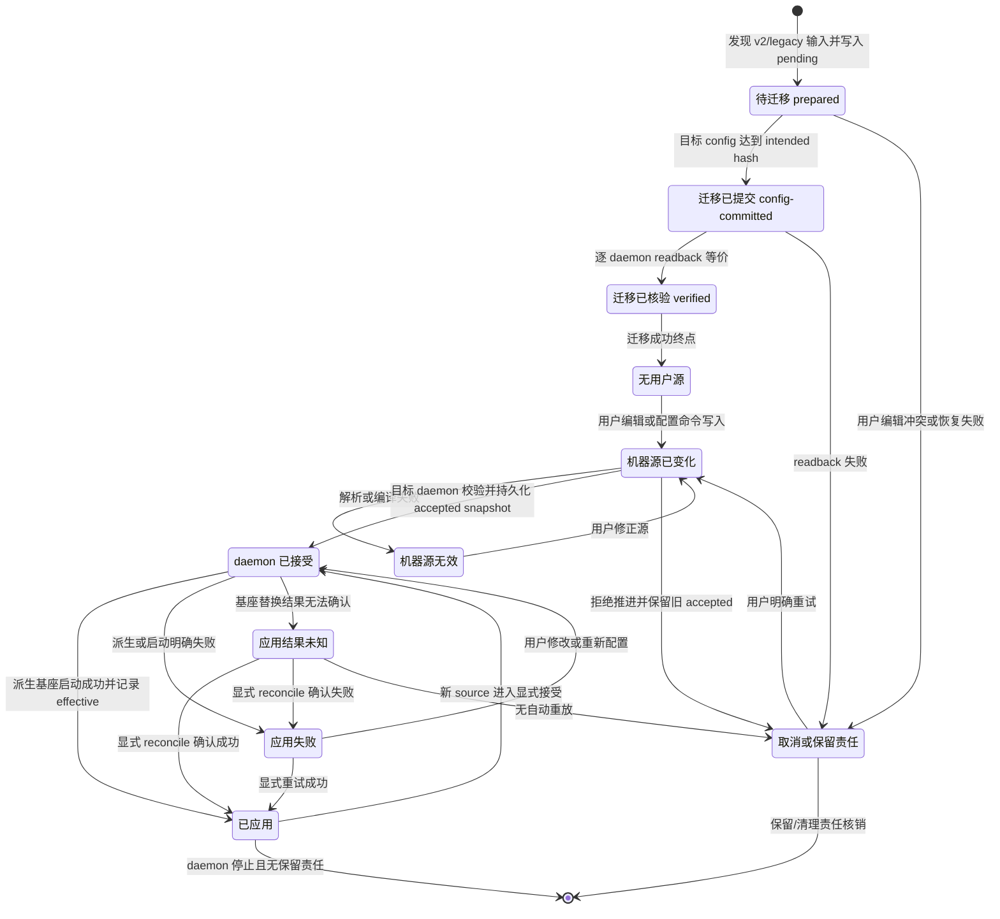

# Teams 本地配置真源 v3 编码前窄设计

状态：U2 编码前 design candidate r4，针对 r3 findings 修订，等待独立设计准入；不是产品实现或 U2 完成。当前组合基线：`71094acb886c48c71c9e4812acc822cbe65497a3`；作者输入 `c3aa36fc637e2da4ac821d1b26d587eadbbf1268`、历史 r2 输入 `8d143ae8bab7594d25402282a4a2ed33d06919b0` 与原始草稿 `20051913b8145d176d50afdae563adb6737d2779` 仅作来源。owner 是 config/runtime 本地 launcher、`RuntimeConfigStore` 与 `createManagedConfigOwner` 的同一配置接缝。遵守 `teams-provider-config.md`：`config.toml` 仅承载机器共享用户意图；每个 daemon 在 `internal.toml [configRuntime.accepted.<agentId>]` 保存自己接受的 source 快照；effective/apply 是独立运行事实，机器 source revision 不能冒充 daemon accepted。迁移与 unknown 恢复复用同一 internal owner，不新增 store、manager 或 scheduler。

本设计只回答 U2：`~/.agentteams/config.toml` 是用户意图唯一编辑源；`~/.agentteams/internal.toml` 是系统/运行状态真源；Console、bridge 和多 provider 不再要求用户编辑 JSON；已有 `RuntimeConfigStore` 的 CAS 落到同一 TOML 真源且不破坏 launcher 字段。设计同时冻结 U2 的 async 接缝与实现范围：`runtime/local-config.ts`、`runtime/process-config.ts`、`config/runtime-config.ts`、`runtime/console-config.ts`、`runtime/agent-process.ts` 配置部分、`runtime/managed-config-owner.ts`、`control-protocol/console-api.ts`/`console-wire.ts` 的 config projection 部分以及对应真实调用者测试都属于同一 U2 实现 owner；U4/U6 在该接缝冻结前不得写这些文件，U6 只消费同一 owner API。

## 1. 现状接口锚点

以下锚点是当前候选基线里存在的事实，用于实现时复用而不是发明新 API。

| 真源/接口 | 位置 | 结论 |
|---|---|---|
| `config.toml` v2 用户 intent：`version/relay/endpoints` | `runtime/local-config.ts` `parseLocalConfigText` [477-520](../../runtime/local-config.ts:477) | v2 仍保留 `relay.config` 和 `endpoints.*` 运行时细节；本设计升级为 v3 |
| `loadLocalConfig` 编译 `internal.toml` v1 | [527-626](../../runtime/local-config.ts:527) | 已用 `configRevision` 哈希去重，已保留 launcher/daemon 字段；v3 复用同一读改写合并模式，并在正常 `parseLocalConfigText` 前恢复 pending migration |
| `internal.toml` 原子写和同机锁 | [265-349](../../runtime/local-config.ts:265) | `writeLocalInternalConfig` 用 temp+rename；`withLocalInternalConfigLock` 用 `internal.toml.internal.lock` 和 PID stale reclaim |
| launcher 启动锁 | `runtime/local-process.ts` [233-261](../../runtime/local-process.ts:233) | 单独 `.launcher.lock`，不覆盖本设计的 internal lock |
| `RuntimeConfigPersistence` | `config/runtime-config.ts` [76-79](../../config/runtime-config.ts:76) | 当前只 `load/save(VersionedRuntimeConfig)`，同步 JSON 持久化；U2 改为 async 的机器 source + per-daemon accepted/observation 端口 |
| `RuntimeConfigStore` CAS | [116-132](../../config/runtime-config.ts:116) | `expectedRevision` 只对内存 state 做 CAS；新契约必须把它解释为目标 daemon accepted CAS，并在同一临界区校验机器 source 未漂移 |
| JSON 持久化 | [425-449](../../config/runtime-config.ts:425) | `createJsonFileConfigPersistence` 是当前唯一持久化适配器 |
| daemon 在当前 JSON 上建 store | `runtime/agent-process.ts` [240-247](../../runtime/agent-process.ts:240) | `config.openCode.configFile` 指向独立 JSON，这是当前第二个 editable 真源；U2 改为 TOML store，并在 Session 入口前完成 owner 恢复 |
| Console 配置绑定 | `runtime/console-config.ts` [7-82](../../runtime/console-config.ts:7) | 已校验 target、CAS、apply fail；仍消费上述 JSON store，且 `readProjection` 目前没有 `applyState` |
| Console projection parser | `control-protocol/console-api.ts` [53-81](../../control-protocol/console-api.ts:53)、`control-protocol/console-wire.ts` [80-115](../../control-protocol/console-wire.ts:80) | `configs` 目前只允许 `agentId/acceptedRevision/effectiveRevision/providers/error`，必须增加 durable `applyState` 的 typed 校验 |
| Managed owner uncertain | `runtime/managed-config-owner.ts` [9-47](../../runtime/managed-config-owner.ts:9) | `uncertain` 目前只在进程内；重启后没有 public 初始化/reconcile 端口，不能从 durable `applyState` fence `use` |
| credential env ref 解析 | `runtime/process-config.ts` [22-25](../../runtime/process-config.ts:22) | 仅接受 env reference，解析值不进入声明 |
| Console 当前 JSON 入口 | `runtime/console-process.ts` [8-32](../../runtime/console-process.ts:8) | 用户目前需要 Console JSON；v3 改为 internal 派生 projection |
| CLI init 当前生成 relay.json/TLS | `cli/agentteams.mjs` [31-91](../../cli/agentteams.mjs:31)、[304-345](../../cli/agentteams.mjs:304) | 需接入 v3 默认模板；`cli/agentteams.mjs` 不在本设计写入范围，U2 实现时由集成 owner 分配 |

结论：当前最关键的缺口不是再来一套配置 store，而是把 `RuntimeConfigStore` 的机器 source 写入、目标 daemon accepted 快照、catalog observation 与 effective fact 分别落到唯一 TOML owner，并让所有写方走同一个 TOML/system lock，避免 launcher 字段丢写。全机 source revision 不是 accepted；每个 daemon 只从自己的 accepted slice 恢复运行。

## 2. 唯一真源与状态归属

定义两个 durable 真源，不再定义第三个 TOML/JSON 用户源。

| 文件 | 角色 | 内容 |
|---|---|---|
| `~/.agentteams/config.toml` | 用户意图唯一编辑源 | bridge 开关；独立 Agent 身份、运行意图、服务/连接；Console 可选身份；LLM provider 实例；manual model 条目；Agent/Model binding。不存 PID、generation、系统选择的动态端口、child JSON、accepted/effective revision |
| `~/.agentteams/internal.toml` | 系统配置和运行状态，用户不编辑 | 机器 sourceRevision/sourceHash、runtime generated bridge/Console/daemon child projection、launcher/daemon PID/generation/startToken/state/error、每 daemon `acceptedRevision/acceptedSourceRevision/acceptedSourceHash` 与 accepted snapshot、每 daemon discovered catalog observation、每 daemon effectiveRevision/lastApplyError/applyState、`[migration]` pending/崩溃恢复记录 |
| `.internal/projections/*.json` | 派生 child 配置 | 只从 `internal.toml` 生成，不反向读回，用户不维护 |

不采用“config.toml 改写 internal、internal 再反写 config.toml”的双向同步。`config.toml` 只承载用户意图；`internal.toml` 只承载运行真相；child JSON 只是投影。对于 provider/model，用户/Console 提交的 provider、manual model、binding 先由唯一 TOML 事务 owner 写入 `config.toml` 并形成新的 machine sourceRevision/sourceHash；目标 daemon 的 accepted snapshot 只有在它接受该 source 时才写入自己的 `[configRuntime.accepted.<agentId>]`。`accepted snapshot` 是该 daemon 已接受事实的可恢复绑定，不是第二个用户编辑源。机器 source 变化只改变 source 身份，不自动改变任何 daemon 的 accepted；catalog observation 只写目标 daemon 的 accepted observation，不写 `config.toml`、不推进 machine source、不推进 accepted revision。

三层事实必须分开：

| 事实 | 含义 | 唯一 owner |
|---|---|---|
| machine sourceRevision/sourceHash | `config.toml` 当前用户源版本与字节哈希 | 机器级 source 版本分配 owner |
| daemon acceptedRevision/acceptedSourceRevision/acceptedSourceHash + snapshot | 某个 daemon 已接受并可恢复的用户意图 | 该 daemon 的 accepted slice |
| daemon effectiveRevision/applyState/lastApplyError | 该 daemon 受管基座已确认对齐或失败/unknown 的运行事实 | 该 daemon 的 effective slice |

## 3. `config.toml` v3 用户 schema

目标：普通用户只编辑这一份文件。系统生成 bridge 端口、TLS、child launch 参数、OpenCode executable/directory/config path、Console assets 路径和 PID/generation，不在 `config.toml` 中让用户手写。

示例（RCC primary、GoAIChat 显式 backup、provider/receiver、可选 Console）：

```toml
version = 3

[bridge]
enabled = true

[agents.provider]
enabled = true
role = "provider"
label = "Local provider"

[agents.provider.identity]
# agentId 由 [agents.provider] 表键注入；不在此重复
hostId = "local"
machineId = "local"
accountId = "local"
agentKind = "custom"
label = "Local provider"

[agents.provider.runtime]
scopeId = "local"
dataDirectory = "data/provider"
policy = { revision = 1, allowedConsumers = ["receiver"], allowedManagers = [] }
cli = { camoExecutable = "/missing/camo", searchExecutable = "/usr/bin/rg", searchRoot = "files", profilePrefix = "teams-provider" }

[agents.provider.services.file-search]
version = "1"
operations = ["search"]
resources = [{ resourceId = "search-slot", capacity = 2, unit = "slot" }]

[agents.receiver]
enabled = true
role = "receiver"
label = "Local receiver"

[agents.receiver.identity]
hostId = "local"
machineId = "local"
accountId = "local"
agentKind = "custom"
label = "Local receiver"

[agents.receiver.runtime]
scopeId = "local"
dataDirectory = "data/receiver"
policy = { revision = 1, allowedConsumers = [], allowedManagers = [] }
cli = { camoExecutable = "/missing/camo", searchExecutable = "/usr/bin/rg", searchRoot = "files", profilePrefix = "teams-receiver" }

[agents.receiver.connect]
targetAgentId = "provider"
capabilityId = "file-search"
capabilityVersion = "1"
operation = "search"
demands = [{ resourceId = "search-slot", amount = 1 }]

[console]
enabled = true
username = "admin"
passwordEnv = "AGENTTEAMS_CONSOLE_PASSWORD"
agentIds = ["provider", "receiver"]

[providers.rcc]
protocol = "openai-responses"
apiBaseUrl = "http://127.0.0.1:4444/v1"
label = "RCC"
enabled = true

[providers.goaichat]
protocol = "openai-chat"
apiBaseUrl = "https://llm.goaichat.top/v1"
label = "GoAIChat"
enabled = true
credentialEnv = "GOAICHAT_API_KEY"

[[models]]
provider = "rcc"
id = "gpt-5.5"
label = "RCC configured model"

[[models]]
provider = "goaichat"
id = "qwen3.8-max"
label = "GoAIChat backup"

[agents.provider.model]
primary = { provider = "rcc", model = "gpt-5.5" }
backup = { provider = "goaichat", model = "qwen3.8-max" }
```

约束：

- `version = 3` 必填。未知表/未知字段 fail closed，不静默忽略。
- `role = receiver|hybrid` 且无 `connect` 时拒绝。
- `[agents.*.identity]` 保留协议 `HostIdentity` 的其余字段（`hostId/machineId/accountId/agentKind/label`）；`agentId` 由 `[agents.<id>]` 的表键提供，parser/compiler 在构造 `HostIdentity` 时注入。`identity.agentId` 是重复来源，出现即 `INVALID_INPUT`；`scopeId` 归 `[agents.*.runtime]`，与 `control-protocol/frames.ts` 现有声明一致。
- `[agents.*.runtime]` 保留有用户选择意义的 `scopeId/dataDirectory/policy/cli`；`leasePort/presenceIntervalMs`、本地 transport timeout/limits、TLS、child 启动参数只在 `internal.toml` 配置。新机器由系统选择 bridge/daemon/Console 端口并持久化实际值；不要求用户为本地 bridge 或每个 daemon 分配端口。已有 internal 端口占用时显式失败，不静默改端口。
- 本地 `[bridge]` 只声明 enabled 意图；端口/TLS/admission credential 引用由内部配置 owner 维护。当前本地 MVP 不让用户配置独立 relay JSON 或公网 directListener。无效内部材料、端口占用、凭据缺失在 compile/start 显式失败，不生成 fallback endpoint；外部网络连接配置留到后续已建模阶段。
- `[agents.*.services.*]` 是 U2 保存的简化用户意图：`version`、operation 名称集合和资源 `resourceId/capacity/unit`；它不是线上 `CapabilityDeclaration`。这与现有 `runtime/local-supervisor.ts` 的 endpoint projection 允许字段一致。U3 按启用的真实 adapter 补齐 `sharing/allocationScope`、operation schema 与 cancellation；未知 operation、没有对应 adapter 或无法生成 schema 时，U3/U2 的 compile 边界显式失败，不能广播空壳能力。
- `[agents.*.connect]` 的 `capabilityId/capabilityVersion/operation/demands` 必须能在 provider 的 `[agents.*.services.*]` 中找到；U2 只做结构/引用校验，U3/U4 负责实际匹配和 Work。
- `providers.*.credentialEnv` 是环境变量引用，只存引用；值不落任何配置/投影/日志。
- 无 `credentialEnv` 表示 `auth.kind = none`；有字段表示 `bearer`。不允许把 secret 写在 `apiBaseUrl` 或普通字符串字段。
- `[[models]]` 全部视为 manual model entry；discovered models 只写入 `internal.toml`。
- `[agents.*.model]` 的 `primary/backup` 引用必须命中已声明 provider 和 manual/discovered model；引用失败在 parser 层显式拒绝。
- manual model entry 不依赖 catalog discovery 成功；catalog 为 `empty/stale/error` 时，已显式声明的 manual model 仍可被 binding 选择。discovered catalog 不得自动替换 manual entry，也不得因 provider/model 失败自动切到 backup；backup 只在用户显式选择时生效。
- passive Agent 不写 `model` 和任何 provider；`openCode` 不再出现在用户配置中，是否生成 managed OpenCode 由 runtime 根据 Agent 是否有 `[agents.*.model]` 推导。
- `connect` 只保存 service 选择：`targetAgentId/capabilityId/capabilityVersion/operation/demands`。v2 的 `workId/requestId/payload` 不再配置化，Work 输入归 U4 请求路径，避免 CLI 读 startup receipt 冒充新任务。
- Console 的 `username` 和 `passwordEnv` 是用户可选收敛入口；监听地址、端口、TLS、UI assets 路径由系统生成。

## 4. `internal.toml` v2 schema 示例

内部文件版本升到 `version = 2`。机器级 `sourceRevision/sourceHash` 表示当前 `config.toml` 用户源身份；每 daemon 的 `acceptedSourceRevision/acceptedSourceHash` 表示该 daemon 已接受用户源身份。三者同时存在，不能互相替代。daemon 重启只恢复它最后接受的 accepted snapshot；无效或尚未接受的 source 不得冒充 accepted。

```toml
version = 2
sourcePath = "<absolute config.toml path>"
sourceRevision = 3
sourceHash = "sha256:<当前 config.toml 哈希>"
generatedAt = "2026-10-02T00:00:00.000Z"
updatedAt = "2026-10-02T00:00:00.000Z"

[configRuntime.accepted.provider]
acceptedRevision = 3
acceptedSourceRevision = 3
acceptedSourceHash = "sha256:<provider 已接受的 config.toml 哈希>"
snapshot = '{"providers":{...},"models":[...],"bindings":{...}}'

[configRuntime.effective.provider]
effectiveRevision = 3
applyState = "clean"

[configRuntime.accepted.receiver]
acceptedRevision = 2
acceptedSourceRevision = 2
acceptedSourceHash = "sha256:<receiver 已接受的 config.toml 哈希>"
snapshot = '{"providers":{...},"models":[...],"bindings":{...}}'

[configRuntime.effective.receiver]
effectiveRevision = 1
applyState = "uncertain"

[configRuntime.effective.receiver.lastApplyError]
code = "RESULT_UNKNOWN"
message = "use-session outcome unknown; explicit reconcile required"

[migration]
formatVersion = 1
phase = "verified"
fromConfigVersion = 2
fromInternalVersion = 1
preparedAt = "2026-10-02T00:00:00.000Z"
committedAt = "2026-10-02T00:00:00.100Z"
verifiedAt = "2026-10-02T00:00:00.200Z"
sourceBeforeHash = "sha256:<迁移前 config.toml 哈希>"
intendedSourceHash = "sha256:<候选 v3 config.toml 哈希>"
candidateConfigText = "<durable pending record 中保存的完整候选 v3 TOML>"
legacyInputs = [
  { kind = "config.toml", path = "<absolute v2 config.toml path>", sha256 = "<v2 source hash>" },
  { kind = "relay", path = "<absolute legacy relay JSON path>", sha256 = "<legacy relay hash>" },
  { kind = "provider", path = "<absolute legacy provider JSON path>", sha256 = "<legacy provider hash>" },
]
consoleMigrationInput = { path = "<explicit absolute path; absent when not provided>", sha256 = "<legacy console hash>" }
recovery = '{"accepted":{...},"effective":{...},"catalogs":{...},"bindings":{...}}'

[configRuntime.catalogs.provider.rcc]
state = "ready"
refreshedAt = "2026-10-02T00:00:00.000Z"
providerFingerprint = "sha256:<provider intent fingerprint used for this catalog>"
observedAcceptedRevision = 3
observedAcceptedSourceRevision = 3
observedAcceptedSourceHash = "sha256:<provider accepted source hash>"
observedEndpoint = "http://127.0.0.1:4444/v1"
observedCredentialRef = "AGENTTEAMS_PROVIDER_AUTH"
entries = [
  { provider = "rcc", model = "gpt-5.5", origin = "discovered", label = "RCC catalog", availability = "unavailable" },
]

[bridge]
projectionPath = "<absolute .agentteams/.internal/projections/relay.json path>"
# 示例机器已选择并持久化的端口；不是默认值，也不得在冲突时改写
config = '{"version":1,"listen":{"host":"127.0.0.1","port":42137},...}'

[console]
projectionPath = "<absolute .agentteams/.internal/projections/console.json path>"
# 示例机器已选择并持久化的端口；不是默认值，也不得在冲突时改写
config = '{"version":1,"identity":{...},"listen":{"host":"127.0.0.1","port":42138},...}'

[launcher]
pid = 12345
generation = 4
startToken = "uuid"
state = "running"

[daemon.provider]
projectionPath = "<absolute .agentteams/.internal/projections/provider.json path>"
config = '{"version":1,"identity":{...},"endpoint":{"role":"provider"},...}'
enabled = true
entryPath = "<absolute installed runtime/agent-process.js path>"
startToken = "uuid"
pid = 12346
generation = 4
state = "online"

[daemon.receiver]
projectionPath = "<absolute .agentteams/.internal/projections/receiver.json path>"
config = '{"version":1,"identity":{...},"endpoint":{"role":"receiver","connect":{...}},...}'
enabled = true
entryPath = "<absolute installed runtime/agent-process.js path>"
startToken = "uuid"
pid = 12347
generation = 4
state = "online"
```

设计决策：

- `[bridge]`/`[console]`/`[daemon.*]` 的 `config` 是运行时内部序列化的小型 child JSON 字符串。它仍是 internal projection，不放在用户可编辑 JSON 文件中；更大重构（把 child JSON 改成纯 TOML 表）不阻断 U2。新机器由系统选择端口并写入 actual bound port；示例值不是默认值。已有 internal 端口与当前 bind 冲突时显式失败，不静默换端口。Console projection 持久化实际绑定的非零端口；临时 bind 的 `0` 只可作为选择过程，不能作为最终 durable projection 值。
- `[configRuntime.catalogs.<agentId>.<providerId>]` 只保存该 daemon 的 observation：discovered models、stale/unavailable、refresh error、该观察对应的 `providerFingerprint`，以及 `observedAcceptedRevision/observedAcceptedSourceRevision/observedAcceptedSourceHash/observedEndpoint/observedCredentialRef`。manual models 只存在 accepted snapshot 与 `config.toml`，observation 不写 manual entries。异步 refresh/apply 返回时只有在这些身份仍等于当前 accepted snapshot 的 exact identity 时才可写入，否则丢弃为 stale observation 并返回 `REVISION_CONFLICT`，不能把旧基座标记为新 revision。机器 source 在观察期间漂移但目标 daemon accepted 未变时，允许保留该 observation，因为它归属于 acceptedSource identity；命令入口若已漂移则仍先返回 `SOURCE_CHANGED`。`loadDaemonUnlocked()` 只按目标 daemon accepted snapshot 的 provider intent fingerprint 判断 catalog 是否 stale，不能因较新的未 accepted machine source 自动失效或重标为最新 source；不一致时 catalog 为 `stale`，只从 accepted snapshot 重组 manual entries。
- `[configRuntime.accepted.<agentId>]` 是每个 daemon 已接受配置的唯一 durable slice；`[configRuntime.effective.<agentId>]` 是该 daemon 的 apply/use uncertainty fact。一个 store 实例绑定一个 daemon Agent，只读机器 source 与自己的 accepted/effective slice，只写自己的 accepted/effective slice。各 daemon 之间不共享、不合并 accepted snapshot。
- `applyState='uncertain'` 是同一 config-owned internal fence，覆盖 apply replacement 与 active Session/use exchange 的未确认责任；volatile `uncertain` 与 durable `applyState` 不得分叉。`clean` 只表示没有未确认的 in-flight/unknown apply/use，不等于最后一次操作一定成功；显式失败可以同时保留旧 `effectiveRevision` 与结构化 `lastApplyError`。只有 `effectiveRevision == acceptedRevision` 且不存在 `lastApplyError` 才表示该 accepted revision 已对齐。
- `[migration]` 是 `internal.toml` 内唯一 pending migration 真源，先于 `config.toml` 替换写入；它保存候选源、输入 hash 与逐 daemon 恢复数据，恢复时不重新枚举 legacy 输入。
- `[launcher]`/`[daemon.*]` 继续保存 lifecycle 字段。任何 config store 写入 internal 必须读改写，保留原 launcher/daemon 字段，不得整体覆盖。

## 5. `RuntimeConfigPersistence` 与同一 TOML 真源映射

保留现有 `RuntimeConfigStore` 的公开命令名与 CAS 语义，但把持久化适配器拆成机器 source、本 daemon accepted、本 daemon observation 三部分。当前接口是同步 `load/save`，而唯一的同机跨进程锁 `withLocalInternalConfigLock` 是异步 API；不能在一个新的 async TOML adapter 里偷偷调用同步文件 API，否则锁形同虚设。U2 实现必须把 store 的 read/mutation/apply/refresh 全部升级为 async，并只保留这一套 async 实现；禁止 sync/async 双实现或双路径。

最小端口形状（字段名可在实现时等价调整，但 async、machine source / per-daemon accepted / observation 分离、exact source 与 accepted revision 语义不可省略）：

```ts
interface ConfigTargetIdentity {
  readonly agentId: string
  readonly targetGeneration: number
  readonly acceptedRevision: number
  readonly acceptedSourceRevision: number
  readonly acceptedSourceHash: string
  readonly endpointFingerprint: string
  readonly credentialRef?: string
}

interface DaemonRuntimeConfigView extends VersionedRuntimeConfig {
  readonly sourceRevision: number
  readonly sourceHash: string
  readonly acceptedSourceRevision: number
  readonly acceptedSourceHash: string
  readonly applyState: 'clean' | 'uncertain'
}

interface ProviderCatalogObservation {
  readonly state: 'ready' | 'empty' | 'stale' | 'error'
  readonly discoveredEntries: readonly ModelEntry[] // origin must be 'discovered'
  readonly refreshedAt?: string
  readonly error?: ConfigApplyError
  readonly providerFingerprint: string
  readonly observedAcceptedRevision: number
  readonly observedAcceptedSourceRevision: number
  readonly observedAcceptedSourceHash: string
  readonly observedEndpoint: string
  readonly observedCredentialRef?: string
}

interface RuntimeConfigApplyRequest {
  readonly target: ConfigTargetIdentity
  readonly config: DaemonRuntimeConfigView
}

interface RuntimeConfigApplier {
  apply(request: RuntimeConfigApplyRequest): Promise<ConfigApplyResult>
}

interface ManagedOperationIdentity {
  readonly operationId: string
  readonly kind: 'apply' | 'use-session'
  readonly target: ConfigTargetIdentity
  readonly substrate: {
    readonly pid?: number
    readonly effectiveRevision: number
    readonly effectiveHandleFingerprint: string
  }
}

interface ManagedConfigUncertainty {
  readonly target: ConfigTargetIdentity
  readonly operation: {
    readonly operationId: string
    readonly kind: 'apply' | 'use-session'
  }
  readonly error: ConfigApplyError
  readonly substrate: {
    readonly pid?: number
    readonly effectiveRevision: number
    readonly effectiveHandleFingerprint: string
  }
}

interface ManagedConfigUncertaintyFence {
  /** One operation record per ambiguous exchange/replacement; upsert by operationId, never a single overwrite. */
  readonly operations: readonly ManagedConfigUncertainty[]
}

// These methods are internal primitives. The caller must already hold
// withLocalInternalConfigLock; they never acquire or re-enter that lock.
interface RuntimeConfigPersistence {
  loadDaemonUnlocked(agentId: string): Promise<DaemonRuntimeConfigView>
  saveMachineSourceUnlocked(input: {
    readonly text: string
    readonly expectedSourceRevision: number
    readonly expectedSourceHash: string
    readonly mutateStoreSections: (currentText: string) => string
  }): Promise<{ readonly sourceRevision: number; readonly sourceHash: string; readonly text: string }>
  acceptMachineSourceUnlocked(agentId: string, input: {
    readonly sourceRevision: number
    readonly sourceHash: string
    readonly expectedAcceptedRevision: number
    readonly expectedAcceptedSourceHash: string | undefined
  }): Promise<{ readonly acceptedRevision: number; readonly acceptedSourceRevision: number; readonly acceptedSourceHash: string }>
  saveObservationUnlocked(agentId: string, observation: {
    readonly kind: 'target-observation'
    readonly catalogObservations?: Readonly<Record<string, ProviderCatalogObservation>>
    readonly effectiveRevision?: number
    readonly lastApplyError?: ConfigApplyError | null
    readonly applyState?: 'clean' | 'uncertain'
    readonly uncertain?: ManagedConfigUncertainty
    readonly expectedUncertain?: ManagedConfigUncertainty
    readonly removeUncertainOperationId?: string
    readonly target: ConfigTargetIdentity
  } | {
    readonly kind: 'owner-fence'
    readonly uncertain: ManagedConfigUncertainty
    readonly expectedUncertain?: ManagedConfigUncertainty
  }): Promise<void>
}
```

`loadDaemonUnlocked()` 只返回机器 source 与目标 daemon 的 accepted/effective 合并视图。`admitMachineSource()` 是唯一机器 sourceRevision/sourceHash 分配实现；`saveMachineSourceUnlocked()` 是唯一写 `config.toml` 的 store mutation primitive，并在调用者持锁时调用前者。`acceptMachineSourceUnlocked()` 只写目标 daemon 的 accepted slice；`saveObservationUnlocked()` 只写目标 daemon 的 effective/catalog observation，manual entries 永远从 accepted snapshot 重组，不通过 observation 写回。JSON-only adapter 只保留给迁移 fixture 与测试，不作为生产 daemon 的第二编辑入口。`RuntimeConfigStore` 的内存 state 只能作为锁内事务缓存，不能当作冲突判据。

`RuntimeConfigPersistence` 的 `*Unlocked` 方法是锁内 primitive，自己不再获取 `withLocalInternalConfigLock`；命名、类型和调用边界共同阻止 async store 方法在锁内重入同一把锁。`RuntimeConfigStore` 是唯一的 public lock owner：read 入口短锁 reload；pure mutation 在一个短锁临界区完成 config.toml + 目标 accepted 写入；`refreshProviderModels` 与 `applyAcceptedConfig` 分成 capture/reconcile 两个短锁阶段，外部 provider/OpenCode/stop/closed 工作全部在锁外。禁止在 `*Unlocked` 方法内部调用 `withLocalInternalConfigLock`，禁止任何嵌套同锁。

`saveObservationUnlocked()` 按 typed `kind` 区分同一 owner 的两类 patch。`target-observation` 在锁内重读当前 accepted identity；`target.agentId/targetGeneration/acceptedRevision/acceptedSourceRevision/acceptedSourceHash/endpointFingerprint/credentialRef` 任一与当前目标 daemon accepted snapshot 不一致时，返回 typed `APPLY_TARGET_MISMATCH` 或 `REVISION_CONFLICT` 并零写入。这一 exact-target CAS 保持 effective/catalog/error observation 的原边界。

`owner-fence` 只接收 uncertainty record，不允许同时携带 catalog、effectiveRevision、lastApplyError、clean 或 accepted/source 字段。唯一 config owner 的 port 在外部操作前 capture operation identity，并在调用 primitive 前核实它仍属于该 owner 的实际 handle/operation；锁内核验 record 的 agentId/targetGeneration 属于该 daemon generation，operationId 重申时与已有 record 全部 identity 相同。它不比较旧 operation 的 acceptedRevision 与 current acceptedRevision，因此 accepted 前进不丢弃旧 unknown。该分支只 upsert fence、设置 applyState=uncertain，错误保存在 record.error；当前 accepted/source/effective/catalog/lastApplyError 原样保留。它不是放宽 target-observation CAS，也不是另一个 store、锁或通用旧代次写入口。`saveMachineSourceUnlocked()` 的 `expectedSourceRevision/expectedSourceHash` 是锁内重读后传入 primitive 的复核值，不是 Console 命令新增的客户端字段。只有显式接受命令或目标 daemon 自己的 start/restart reconcile 可以推进 accepted。

`saveObservationUnlocked()` 是对目标 observation slice 的显式 patch，不是缺省字段清空操作。`lastApplyError` 的三态固定为：字段 absent 保留当前 error，`null` 显式删除该 daemon 的 durable error 字段，`ConfigApplyError` 设置/替换结构化 error；`null` 不作为 durable TOML 值保存。其他 optional observation 字段 absent 同样保持原值。

| observation 来源 | 必须提交的字段 | 保证 |
|---|---|---|
| exact target 的 apply/readback 或 recovery reconcile 确认成功且无任何 uncertainty record | `effectiveRevision: target.acceptedRevision`、`applyState:'clean'`、`lastApplyError:null` | 同一短锁内更新 observation 并明确清除旧 error；成功不留下此前失败错误 |
| exact target 的 apply/readback 或 recovery reconcile 确认成功但仍有 owner fence record | `kind:'target-observation'` 只移除 own exact record：`removeUncertainOperationId` + `expectedUncertain`，可同时写新 `effectiveRevision`；其他 record 尚在时保留 lastApplyError，只有最后一个 record 被移除才可写 `applyState:'clean'` 与 `lastApplyError:null` | 成功不能清掉不是自己 exact operationId/kind/target/substrate 的另一个并发 unknown record |
| 明确 apply 失败 | 结构化 `lastApplyError`，按结果保留旧 effective；只有 owner 确认不存在 uncertain 责任时才可写 `applyState:'clean'` | 失败不清 error、不把旧 effective 标为新 accepted 已生效 |
| unknown 或仍有未确认责任 | `kind:'owner-fence'`、`uncertain: ManagedConfigUncertainty`（按 operationId upsert，含本次 error）；重申同一既有责任时提交相同 `expectedUncertain` 和 record | 只写该 responsibility，不写新 target 的 observation/error；不能清 fence/error；同一 owner 的 exact identity CAS 使成功 apply/catalog refresh 不能清另一个操作留下的 fence |
| catalog refresh（含 ready/empty/error） | 仅 `catalogObservations` 与 `target`，省略 effective/apply/error/fence 字段 | 保留既有 `effectiveRevision/applyState/lastApplyError/uncertain`，catalog error 仅在 catalog observation 内 |

上述 target-observation 的成功清除和明确失败均在 exact current target 核验后执行；owner-fence 则执行独立的 exact owner/operation/generation 核验，不能受 accepted 前进误拒绝。任一所属身份冲突维持零写入。该三态是同一 observation owner 的写入语义，不增加第二错误真源或状态机。

`ManagedConfigUncertainty` / `ManagedConfigUncertaintyFence` 不是新的 store、scheduler 或控制状态副本；它们把已经存在的 volatile uncertainty 序列化为同一 `effective.<agentId>` fence 的 typed identity。fence 是一个按 `operationId` upsert 的记录集，不是单个 boolean 或单条最新记录；`applyState='uncertain'` 当且仅当记录集非空。`target` 绑定操作开始时的 accepted/source identity，`substrate` 绑定实际已启动 handle 的 exact runtime identity。accepted revision 可以在旧 `use()` 活动期间前进，但 fence 的 `target.acceptedRevision` 和 `substrate.effectiveRevision` 仍描述旧操作/基座；新 accepted 的 snapshot 与 effective/source facts 不得被旧 fence 覆盖或清空。

映射规则：

| RuntimeConfig 字段 | durable 文件 | 谁拥有 |
|---|---|---|
| `providers` | `config.toml [providers.*]` | 用户/Console 提交的机器 source intent；目标 daemon accepted 后再进入 own snapshot |
| `catalogs[*].entries` 中 `origin:'manual'` | `config.toml [[models]]` | 用户/Console 提交的 manual model；目标 daemon accepted 后再进入 own snapshot |
| `catalogs[*]` 的 discovered/missing/state/error/fingerprint | `internal.toml [configRuntime.catalogs.<agentId>.*]` | 该 daemon 的 runtime 观察；不含 manual entries |
| `agents` | `config.toml [agents.*.model]` | 用户/Console binding intent；目标 daemon accepted 后再进入 own snapshot |
| machine `sourceRevision/sourceHash` | `internal.toml` 根 | 机器 source 版本分配 owner |
| `acceptedRevision/acceptedSourceRevision/acceptedSourceHash` | `internal.toml [configRuntime.accepted.<agentId>]` | 目标 daemon 已接受事实 |
| `effectiveRevision` | `internal.toml [configRuntime.effective.<agentId>]` | 各 daemon 自己的 apply observation |
| `lastApplyError` | `internal.toml [configRuntime.effective.<agentId>]` | 各 daemon 自己的 apply observation |
| `applyState/uncertain`（新增内部字段） | `internal.toml [configRuntime.effective.<agentId>]` | 各 daemon 自己的唯一 durable config fence；`uncertain` 保存 exact runtime operation identity，Console projection 只投影 `applyState`，不把完整内部 identity 当业务 payload |

`loadDaemonUnlocked(agentId)` 实现：调用者持锁时读 `config.toml` 字节和 `internal.toml` 机器 source/目标 daemon slices，将机器 source 身份与 accepted snapshot 的 manual entries、binding 及该 daemon 的 discovered observation 合并成 `DaemonRuntimeConfigView`；文件格式不是 JSON，但外部语义与现有 `RuntimeConfigStore` 兼容。若磁盘 sourceHash 与 daemon acceptedSourceHash 不同，视图显示 source 已变化、accepted 仍为旧事实，不能把新 source 自动写成该 daemon accepted。

`RuntimeConfigStore` 的 pure mutation 只进入一次 `withLocalInternalConfigLock(internalPath)`，并在该临界区内完成以下步骤；持久化 `*Unlocked` primitive 不重复取锁，也不执行外部网络、provider、OpenCode 或进程等待：

1. 重读当前 `config.toml` 与 `internal.toml` 根级 machine source；
2. 校验 `expectedSourceRevision === sourceRevision` 且 `expectedSourceHash === 当前 config.toml 字节哈希`；
3. 解析并编译候选完整 TOML，校验 store-owned provider/model/binding 与所有引用；任何错误在写入前显式失败。
4. 从最新完整 TOML AST/typed root 只替换 provider/model/binding 用户段，保留 `bridge/agents.*.identity/services/connect/console` 等同一文件中的其他用户段。
5. `saveMachineSourceUnlocked()` atomic rename 写入 `config.toml`，由 `admitMachineSource()` 以 `sourceRevision + 1` 和写入后 `config.toml` 的实际字节哈希更新机器 source；这一步不代表任何 daemon 已接受。
6. 仅对目标 daemon，`acceptMachineSourceUnlocked()` 以该 daemon `acceptedRevision + 1` 写入 own accepted snapshot、`acceptedSourceRevision` 和 `acceptedSourceHash`。其他 daemon 不因这次命令自动接受，也不写自己的 accepted slice。

Console 命令携带现有 `expectedRevision`，它表示目标 daemon accepted CAS；同一临界区还必须校验机器 sourceRevision/sourceHash 未漂移。Console 编辑 provider/manual model/binding 时，`RuntimeConfigStore` mutation 进入一次锁，先调用唯一 `saveMachineSourceUnlocked()` 写 `config.toml`，再对目标 daemon 调用 `acceptMachineSourceUnlocked()`；完成后只保证机器 source 已更新且目标 daemon 已接受。其他 daemon 只在下一次显式接受或适用重启 reconcile 时推进自己的 accepted。

目标 daemon 接受新 source 只有两个触发点：Console/CLI 配置命令显式指向该 daemon；该 daemon 自己的 start/restart reconcile 在 parse/compile 与引用校验成功后写自己的 accepted slice。`load`/`status`/`read` 永不接受，任何命令也不会替其他 daemon 接受。restart 时若 machine source 无效或校验失败，该 daemon 不写 accepted，只恢复最后接受的 snapshot 并显式暴露 source error；不能把 pending/invalid source 冒充为已接受。

`saveObservationUnlocked()` 更新 `internal.toml [configRuntime.catalogs.<agentId>.*]` 和 `[configRuntime.effective.<agentId>]`；它不碰 `config.toml`，不改 accepted slice，也不写其他 daemon 的 slice。所有写都必须重新读取当前 internal 并合并，绝不构造只有 config runtime 的替代整个文件。

### 5.1 mutation 分类与 revision 语义

| mutation | 写 `config.toml` 与机器 source | 写 internal observation | daemon acceptedRevision |
|---|---|---|---|
| `putProviderInstance` / `removeProviderInstance` | 是 | 机器 source `+1`；仅目标 daemon accepted `+1`；该 provider catalog 失效 | source 与目标 accepted 各自 `+1` |
| `putModelEntry`（manual） | 是 | 机器 source `+1`；仅目标 daemon accepted `+1`；合并 manual entry | source 与目标 accepted 各自 `+1` |
| `bindAgentModel` / `selectAgentBackup` | 是 | 机器 source `+1`；仅目标 daemon accepted `+1`；不改 catalog | source 与目标 accepted 各自 `+1` |
| `refreshProviderModels` | 否 | 仅写 catalog observation；仅 exact source/endpoint/credential 身份仍当前时 | 都不变 |
| `applyAcceptedConfig` | 否 | 仅写本 daemon effective/apply fact；仅 exact accepted/source/endpoint/credential 身份仍当前时 | 不变 |

`refreshProviderModels(expectedRevision, providerId, client, credentials)` 只有一个短锁 capture、一个锁外 provider 调用和一个短锁 reconcile：

1. capture lock：`loadDaemonUnlocked()` 后按完整 `ConfigTargetIdentity` 校验 `expectedRevision`、目标 generation、机器 source identity、provider endpoint 与 credential reference；机器 source 已漂移返回 `SOURCE_CHANGED`，目标 accepted/generation/endpoint/credential 不符返回 `APPLY_TARGET_MISMATCH` 或 `REVISION_CONFLICT`，零写入。锁在外部 provider 调用前释放。
2. unlocked work：只使用 capture 得到的 provider intent 与 credential reference 做模型 discovery；锁不持有于 network/model operation，不等待 startup/stop/closed。
3. reconcile lock：重新 `loadDaemonUnlocked()`，要求 `target` 的全部 identity 仍等于当前 accepted snapshot；不符则返回 `REVISION_CONFLICT` 并丢弃 observation。持锁调用 `saveObservationUnlocked()`，只写该 daemon catalog observation，省略 `effectiveRevision/applyState/lastApplyError` 以保留此前 apply 事实与 error/fence。

成功、空目录与 catalog error 都不得推进 machine source 或 daemon accepted；否则“发现模型”会冒充用户修改。机器 source 在锁外调用期间漂移但目标 accepted 未变时，observation 仍以 acceptedSource identity 归属并可写入；Console 命令入口若在 capture 时已发现机器 source 漂移，仍返回 `SOURCE_CHANGED`。该结果只可显示为“对 acceptedRevision 的观察”，不得标成最新 machine source。现有测试中把 refresh 计入 revision 的断言必须在 U2 实现中更新，这是有意的契约修正。

typed 错误语义冻结如下，`SOURCE_CHANGED` 与 `MIGRATION_CONFLICT` 加入现有 `ConfigErrorCode` union；它们只扩展本配置契约，不改变现有 `ServiceErrorCode` 的语义：

| 结果码 | 触发条件 | 保证 |
|---|---|---|
| `SOURCE_CHANGED` | Console 入口或锁内复核发现 `config.toml` 字节/source identity 已漂移 | 不写 `config.toml`/internal，要求重新 readback 后重试 |
| `REVISION_CONFLICT` | `expectedRevision` 不等于目标 daemon acceptedRevision，或 accepted identity 在 refresh/apply 期间变化 | 不写 accepted/effective/observation |
| `APPLY_TARGET_MISMATCH` | target generation、accepted source、endpoint fingerprint 或 credential reference 与当前目标 daemon 不符 | 不调用外部基座、不写 accepted/effective/observation；保留现有 owner 与责任 |
| `MIGRATION_CONFLICT` | 显式 legacy 输入解析、provider/binding 合并冲突，或同一 daemon 的候选不一致 | 迁移整体零写入，旧输入保持原样 |
| `FORBIDDEN` / `CONFLICT` | 目标 daemon 不匹配 / 现有 apply 活动或 uncertain 冲突 | 保留现有错误语义，不新增状态机 |

## 6. CAS、手工编辑冲突与 accepted/effective 唯一 owner

### 6.1 accepted vs effective 的可见性边界

- `sourceRevision/sourceHash` 表示机器级 `config.toml` 当前用户源；它不等于任何 daemon 的 accepted。
- `acceptedRevision/acceptedSourceRevision/acceptedSourceHash` 表示目标 daemon 已接受并有可恢复 snapshot 的用户源；可以被 Console/CLI readback，但不表示运行基座已经使用该 revision。
- `effectiveRevision` 只表示本 Agent 的受管基座已确认对齐到的 accepted revision；Session/model 请求只能按本 Agent 的 effective binding 执行。
- `applyState='uncertain'` 时，即使 `effectiveRevision` 数值未变，也必须拒绝把该基座当作 clean；readback 必须显示 uncertain，不能只显示旧 revision。
- `lastApplyError` 是失败/unknown 的公开结构化原因，不能被清空为“成功”直到 exact target 的 apply/readback 或 recovery reconcile 确认成功；该成功 observation 必须显式传 `lastApplyError:null`，仅写 `applyState:'clean'` 或省略 error 都不表示清除。

### 6.2 accepted/effective 唯一 owner

- user intent 的唯一编辑真源是 `config.toml`；机器 sourceRevision/sourceHash 的唯一 durable owner 是 `internal.toml` 根级。
- acceptedRevision/acceptedSourceRevision/acceptedSourceHash 与 accepted snapshot 的 durable owner 是 `internal.toml [configRuntime.accepted.<agentId>]`；只有绑定该 Agent 的 daemon config owner 能接受并写自己的 slice。一个 daemon 的 accepted 不能作为另一个 daemon 的 accepted。
- effectiveRevision/lastApplyError/applyState 的 durable owner 是 `internal.toml [configRuntime.effective.<agentId>]`；只有该 Agent 的 daemon config owner 能写自己的子表。任何进程都不从日志/UI/payload 重建 accepted/effective。
- 不允许第二个配置 DB；`config.toml` 和 `internal.toml` 是两份不同语义文件，不是两份 config DB。
- 机器 source 版本分配只有一个 owner；它产生的是用户源版本，不是 daemon accepted。各 daemon 只写自己的 accepted/effective slice。其他 daemon 只在显式接受或适用重启 reconcile 后推进自己的 accepted；任何一次 load/status 都不得声称所有 daemon 已接受。
- `read()` 返回机器 source 身份与目标 daemon accepted/effective 合成视图；`readEffective()` 的 `acceptedRevision/acceptedSourceRevision/acceptedSourceHash` 来自目标 daemon accepted slice，`effectiveRevision/lastApplyError/applyState` 只来自同一 Agent 的 effective slice。

### 6.3 Console CAS

Console 命令携带现有 `expectedRevision`。每次命令在 `withLocalInternalConfigLock(internalPath)` 下：

1. 重读 `config.toml` 字节并计算 `sourceHash`。
2. 重读 `internal.toml` 根级 sourceRevision/sourceHash 与目标 `[configRuntime.accepted.<agentId>]`。
3. 若当前 `sourceHash != machine.sourceHash` 或 `sourceRevision != machine.sourceRevision`：返回 `SOURCE_CHANGED`，不写入任何文件。外部编辑造成的机器 source 漂移必须先走显式接受边界。
4. 若 `expectedRevision != 目标 acceptedRevision`：返回 `REVISION_CONFLICT`，不写入。
5. 否则在内存 state 上做现有 mutation，调用 `saveMachineSourceUnlocked()` 写 `config.toml` 并由 `admitMachineSource()` 推进机器 source，再调用 `acceptMachineSourceUnlocked(agentId, ...)` 写目标 daemon accepted；两步在同一锁内完成。
6. 写临时文件后、rename 前再重读一次 `config.toml` 字节并复核 hash；若外部编辑器已改写则删除 temp 并返回 `SOURCE_CHANGED`。
7. 任何锁等待超时或文件校验失败都返回 error，不静默重试，不覆盖已有 intent。

外部编辑器不参与该锁，且 POSIX rename 没有可移植的 compare-and-swap。实现能保证“事务入口与 pre-rename 复核”检测到的手工编辑冲突；对于恰好在 pre-rename 复核与 rename 之间落盘的第三方写入，不声称可以检测。这是当前文件契约的真实边界，不增加一个伪安全层。

### 6.4 手工编辑

- 人工编辑 `config.toml` 不需要带 CAS；它是用户意图真源。
- 下一次进入 `loadLocalConfig()` 的显式编译边界（start/status 前的 config compile）或 daemon store load 会发现 source hash 变化；所有入口必须调用同一个 `admitMachineSource(internalPath, configText)` 实现，在 internal lock 内只递增一次机器 sourceRevision，不允许各自写 source 版本。
- `admitMachineSource()` 只推进机器 source，不自动接受。目标 daemon 必须通过 `acceptMachineSourceUnlocked(agentId, ...)` 写入 own accepted snapshot，且只有在 parse/compile 和引用校验成功后完成。其他 daemon 保持自己的旧 accepted，等待显式接受或适用重启 reconcile。
- 手工编辑不自动热 apply；`effectiveRevision` 不随 source hash 变化前进。若 Agent 有 model binding 且 `accepted != effective`，daemon 只能在显式 `config.apply` 或重启 reconcile 成功后把 effective 推进。
- 手工编辑与 Console 的冲突表现为：Console 提交旧 `expectedRevision` 时以 `REVISION_CONFLICT` 失败；机器 source 已漂移时以 `SOURCE_CHANGED` 失败。绝不 merge 两方编辑。
- 手工编辑后的文件如果 parse/compile 失败，机器 source 与所有 daemon accepted 保持上一个有效值，命令显式失败；不能把无效文本标记为 machine source 或 daemon accepted，也不能继续用新文本生成 projection。

### 6.5 崩溃/重试

- 写 `config.toml`：沿用当前 `writeLocalConfig` 的 temp+rename 语义；任何异常保留原文件。当前实现没有 fsync，本设计不声称电源故障级 durability；若实现要升级为 fsync，必须作为显式变更并补对应故障测试。
- 写 `internal.toml`：沿用现有 temp+rename；任何异常保留原文件。
- 两文件间没有“双文件原子性”。temp+rename 只提供单文件进程中断级替换：崩溃点若发生在 rename 前，原文件保持；rename 后，新文件完整可见。实现不声称 fsync、电源故障 durability、目录项 durable，或 `config.toml`/`internal.toml` 的双文件原子提交。断电恢复若没有 fsync 支持，只能显式报告 `UNVERIFIED`，不能宣称数据安全。
- 非迁移的常规运行恢复规则是：`config.toml` 始终是用户 intent 真源；若机器 sourceHash 与磁盘 hash 不一致，显式 source admission 只推进机器 source；若某 daemon `acceptedSourceHash` 与机器 source 不同，该 daemon 仍以 own accepted snapshot 运行并显示 accepted 落后，不能自动声称所有 daemon 已接受。
- 崩溃发生在 `saveMachineSourceUnlocked` 内：可能看到 `config.toml` 已更新而机器 sourceRevision/sourceHash 或 daemon accepted slice 尚未更新。下一次显式 source admission 只推进机器 source；不能因此宣称任一 daemon accepted，也不能把未验证文本当成 daemon accepted snapshot。
- 崩溃发生在 `acceptMachineSourceUnlocked` 内：daemon accepted snapshot 要么是旧完整版本，要么是新完整版本；不存在“机器 source 新、所有 daemon 已接受”的推断。
- 若 `saveMachineSourceUnlocked` 已提交而随后的 `acceptMachineSourceUnlocked` 失败，命令返回显式 error：新 `config.toml`/machine source 保留为用户意图，目标 daemon accepted 保持旧 snapshot，其他 daemon 不变；重试是新显式命令，不伪造成功 receipt。
- 崩溃发生在 `saveObservationUnlocked` 内：internal 要么是新旧完整版本，不产生半写；catalog 可重刷，apply error 可重试，不模拟成功。
- 默认不自动重放刷新/apply；重试必须是新显式命令或新的 daemon 生命周期。

### 6.6 apply 的活动/uncertain 基座

- 当前 `RuntimeConfigStore.applyAcceptedConfig` 已有 `applyInFlight` 并发守卫（[551-583](../../config/runtime-config.ts:551)），设计保留。
- `createManagedConfigOwner` 保留现有 single owner 与 volatile `changing/active/uncertain` 内存状态（[9-47](../../runtime/managed-config-owner.ts:9)）；U2 把每个 apply unknown 与 active `use()`/Session exchange unknown 都映射到同一 durable `applyState='uncertain'`，不新增第二套 manager、scheduler、store 或后台重试器。`applyState = "clean" | "uncertain"` 是该责任的唯一 durable fence；`clean` 只表示没有未确认的 apply/use 责任，不表示最近一次操作一定成功。
- `applyAcceptedConfig` 分两段短锁：capture lock 在锁内读取目标 daemon accepted/effective/generation、`acceptedSourceRevision/acceptedSourceHash`、provider endpoint fingerprint 与 credential reference，构造完整 `ConfigTargetIdentity` 后释放；之后不持锁调用 applier。reconcile lock 重新读取目标 accepted identity，只有 exact target 仍匹配时才调用 `saveObservationUnlocked()` 写 effective/error/applyState。锁不跨 provider HTTP、模型调用、OpenCode startup/stop 或 closed wait。
- target generation、accepted source、endpoint fingerprint 或 credential reference 任一不匹配，返回 `APPLY_TARGET_MISMATCH`；若仅 accepted revision 在外部工作中前进，返回 `REVISION_CONFLICT`。两种情况都零写入 apply observation、不推进 effective，并把结果 report 为 stale，不能把旧结果标成最新 accepted/source。
- `ManagedConfigOwner` 必须获得一个 async owner-owned persistence port；writer ownership 固定在同一 `createManagedConfigOwner` 实例，不是 Session caller、Console、U6 adapter 或通用 store mutation helper：

```ts
interface ManagedConfigOwnerPersistence {
  readRecovery(ownerAgentId: string): Promise<
    | { readonly state: 'clean' }
    | { readonly state: 'uncertain'; readonly fence: ManagedConfigUncertaintyFence }
  >
  persistUncertainty(input: {
    readonly fence: ManagedConfigUncertainty
    readonly expectedAcceptedRevision: number
  }): Promise<{ readonly persistence: 'committed' }>
  clearUncertainty(input: {
    readonly expectedFence: ManagedConfigUncertainty
    readonly effectiveRevision: number
    readonly currentTarget: ConfigTargetIdentity
  }): Promise<{ readonly persistence: 'committed' }>
}
```

这三个方法使用同一短锁和 store：readRecovery 只读取，persistUncertainty 调用 `saveObservationUnlocked(kind:'owner-fence')`，clearUncertainty 调用其 `kind:'target-observation'` 分支；不定义另一个文件、payload 镜像或重试服务。`expectedAcceptedRevision` 必须等于传入 fence.target 的 capture revision，不与 current accepted 比较，也不代替 owner/operation/generation 核验。`expectedFence` 是 clear-only 的 exact-CAS 参数，只移除匹配的 operationId/kind/target/substrate 记录，不能清另一个并发 unknown。clear 只有记录集清空后才写 clean 和 lastApplyError:null；否则仅移除指定记录并保留其他 fence/error。

`createManagedConfigOwner` 的 owner-scoped options 必须显式携带 `persistence: ManagedConfigOwnerPersistence`（另一个选项是 runtime launch seam）；`runtime/agent-process.ts` 从 async `RuntimeConfigStore` 构造这个 port 并传入 owner。U2 不再允许无 persistence 的 owner 在 production daemon 中运行；测试可注入 fake port，但持久化写入路径必须与 production 同一 caller/semantics。

`saveObservationUnlocked()` 的 clean 写也必须遵守同一个 CAS：任何 `applyState:'clean'` 都只能在 owner 确认当前 durable fence 为 `None`，或在移除最后一个 matching `expectedFence` 后发生。`uncertain` 写按 `operationId` upsert：同 operationId 已存在时要求 matching `expectedUncertain`，否则 append 新 record；已有的其他 operation record 保持不变。普通 catalog patch 不提交 `applyState/expectedFence/removeUncertainOperationId`，因此零 fence 写入；unrelated success 不能绕过 owner port 手工写 clean。

apply unknown 的路径：capture lock 构造 `kind:'apply'` 的 operation identity，锁外执行 applier；RESULT_UNKNOWN 或无法确认外部结果的 throw 经 persistUncertainty/owner-fence 分支 upsert record（含 error），派生 applyState=uncertain。即使 accepted 已前进，也仅以旧 operation 的 target/substrate 标明责任，不覆盖新 accepted/source/effective/lastApplyError；target mismatch 只阻止写新 effective，不丢弃 unknown。uncertain/reconcile 未完成时拒绝新的 apply/stop/use，返回 CONFLICT/UNAVAILABLE，不能继续使用旧基座。

active `use()`/Session exchange unknown 的完整路径固定为：`active++` 前，owner 由同一实例构造 `kind:'use-session'` 的 `ManagedOperationIdentity`，capture 当时 accepted/source identity 与实际 handle 的 `pid/effectiveRevision/effectiveHandleFingerprint`。U6 Session facade 在 callback 内部捕获 expected explicit adapter errors（例如明确 404/400/权限失败）并返回 typed result；这些错误不会 throw 到 owner，因此不设置 uncertainty。任何真正 ambiguous 的 throw 到达 owner 时，必须先设置 volatile `uncertain=true`，然后在返回/重抛前 await `persistUncertainty()` 写同一 `applyState='uncertain'` fence。该 caller 在 lock 外调用，短锁只由 owner-owned port 的 reconcile 阶段持有；不得让 U6 读取日志或业务 payload 重建控制责任。

uncertainty persistence 的失败终点也固定：若 `persistUncertainty()` 因磁盘写失败、owner/agent 不匹配或 identity mismatch 失败，owner 保持 volatile `uncertain=true` 和当前 owned handle 责任，显式返回 typed `UNAVAILABLE`（durable persistence 失败）或 `APPLY_TARGET_MISMATCH`/`REVISION_CONFLICT`，不得报告“已 durable fenced”。随后 `apply/use/stop/replacement` 都保持拒绝；本地和 owned-resource cleanup responsibility 继续归当前 owner/生命周期。此保证仍受 §6.5 约束，不发明 fsync、两文件原子性或进程中断后的额外 durability。

`createManagedConfigOwner` 新增一个 public startup/reconcile 端口 `recover(options): Promise<'clean' | 'uncertain'>`，由同一个 owner 实例持有。`runtime/agent-process.ts` 在构造 `createConsoleConfigBinding` 与开放 Session/Session command 前调用它；`recover()` 在 ingress 前读取同一 store 的 durable owner facts，若为 `uncertain`，在任何 `use()` 前把 volatile `uncertain=true` 并返回 `uncertain`。Session request 的 unknown/取消义务仍按 U6 的 Session identity/obligation facts 保留；config reconcile 不推断该 Session request 的最终业务结果。

owner 不得仅凭“进程重启后 volatile=false”或“effectiveRevision 仍是旧值”清 uncertain；durable `applyState='uncertain'` 是新进程的 public fence。若无法确认前一基座已终止，owner 必须保留 uncertain 与资源 owner，返回 `RESULT_UNKNOWN`/`CONFLICT`，不得 launcher 新基座。正常 restart 的 reconcile 证据顺序固定为：读取 durable accepted/effective/applyState/fence；uncertain 时先确认 fence 所指的旧 substrate termination（pid/startToken 或 owner 提供的确认），否则保留责任；再以 `expectedFence` exact-CAS 和 current target 做一次真实 apply/readback。成功才通过 `clearUncertainty()` 在同一 observation patch 内记录新 effective、`applyState:'clean'`、`lastApplyError:null` 并移除旧 fence；失败保留 accepted/effective/error/fence，Session/model `use()` 继续显式拒绝。catalog refresh、unrelated success 或只读取 readback 都不得使用该 clear path，也不能覆盖当前 accepted/effective/source facts。

U2 只定义/实现 config-owner startup/reconcile 端口和上述 persistence caller；U6 的 Session readiness/obligation 是独立生命周期事实。两者共享的唯一协调 proposal 是同一 `createManagedConfigOwner` 增加 `recover()` 并在 `agent-process.ts` 打开 Session 前 await；U6 不在自己内部复制 recover、uncertainty fence 或 config persistence，也不把 Session readiness 当成 config 已干净。

已准入 U5 Console 设计的 serializer 接缝：U2 的 closed internal schema 必须接纳独立 `[consoleRuntime]` 系统表，保留其字段，并提供 `teams-local-console-v1.md §3.2.1` 的同短锁 typed patch port。U5 唯一拥有 lifecycle 字段；U2 只负责 reload/owned-field merge/atomic rename，不把它并回 `[console]` 或参与 Console start/stop。端口及并发公开验收随 U2 实现交付，当前仍是设计依赖。

## 7. 同一机多 daemon writer lock 与 launcher 字段保留

已有 `withLocalInternalConfigLock` 已提供跨进程锁（PID stale 清理）。实现规则：

- 低层持久化锁的唯一 owner 是 `RuntimeConfigStore` 的公开入口；`RuntimeConfigPersistence` 只提供 `*Unlocked` primitive，不获取锁，也不允许 async store 方法在 primitive 内重入。pure mutation 在一个短锁内完成 read-modify-write；capture/reconcile 操作只锁内做读取或 identity 复核与 observation 写入，锁在外部 I/O 前释放。
- 所有写 `internal.toml` 的函数必须复用 `withLocalInternalConfigLock`：launcher state、daemon state、config store。existing configured-work 写路径在 U2 移交给 D3/U4 前不得新增独立锁；不得新增第二个 internal 锁文件。
- `withLauncherStartLock` 保持 `.launcher.lock` 作为启动互斥；它和 internal lock 有明确顺序：launcher 先拿 launcher lock 再拿 internal lock。ConfigStore 只拿 internal lock，不反向拿 launcher lock，避免死锁。
- 写 internal 时每次从磁盘重新读 `[launcher]`、`[daemon.*]` 的 PID/generation/startToken/state/config/projection，只更新自己拥有的 sections。现有 `loadLocalConfig` 的合并逻辑（[594-622](../../runtime/local-config.ts:594)）就是这个模式的模板；config store 沿用，不要把整个 internal 替换成只有 `[configRuntime]` 的版本。
- 禁止嵌套获取同一 internal lock；`refresh/apply/startup/stop/closed` 等可能长期等待的外部工作不得在持锁期间执行。lock 超时按现有 5s 显式失败，不无限等待。

## 8. 迁移：v2 config + relay/Console/provider JSON

目的：迁移不能丢 accepted/effective revision、provider binding、manual model、credential refs、discovered catalog、Console 显式输入或 TLS/listen 观察；未确认迁移前不删除或改写旧唯一数据。本节只定义一套 write order 和一套 recovery algorithm，全文其他章节必须引用同一套，不得出现 config-first 或 scan-and-guess 变体。

### 8.1 Pending record、owner 与版本化阶段

`internal.toml [migration]` 是 pending migration 的唯一 durable owner。它必须完整保存迁移开始时的输入快照，因此恢复不再枚举或重读 legacy 输入：

| 字段 | 含义 |
|---|---|
| `formatVersion` | pending record 版本，首版为 `1` |
| `phase` | 只能是 `prepared`、`config-committed`、`verified` |
| `preparedAt/committedAt/verifiedAt` | 对应 phase 的写入时间；未到达的 phase 字段 absent |
| `fromConfigVersion/fromInternalVersion` | 迁移来源版本 |
| `sourcePath/sourceBeforeHash` | 迁移前 `config.toml` 的绝对路径与字节 hash |
| `intendedSourceHash` | 候选 v3 `config.toml` 的完整字节 hash |
| `candidateConfigText` | 候选 v3 TOML 的完整 durable 文本，恢复直接使用，不重新编译 legacy |
| `legacyInputs[]` | `{kind,path,sha256}`，含 v2 `config.toml`、`relay.json`、每个 endpoint 的 `openCode.configFile` 和显式 provider migration input；不扫描目录、不按文件名猜路径 |
| `consoleMigrationInput` | 显式 Console JSON 的 `{path,sha256}`；未提供时字段 absent，迁移后 Console 保持 disabled |
| `recovery` | 逐 daemon 的 accepted snapshot/binding/manual model、accepted/effective revision、`lastApplyError/applyState`、discovered catalog observation；按 daemon ID 分开保存 |

`phase` 推进规则固定为：`prepared` -> `config-committed` -> `verified`。`prepared` 表示 pending 已 durable、`config.toml` 尚未被本迁移替换；`config-committed` 表示目标 `config.toml` 已等于 `intendedSourceHash`，但逐 daemon recovery 尚未完成 readback 验证；`verified` 表示所有逐 daemon 恢复数据与 readback 等价。任何冲突或异常都保留当前 phase 与 pending record，不得向前伪造。

parser/startup owner 是 `loadLocalConfig(path)`：它在读取/解析普通 v2/v3 配置之前，先读取 `internal.toml` 的 `[migration]`；若存在非 `verified` pending，就调用同一文件内的 `resumePendingMigration()`。实际调用 `loadLocalConfig` 的公开入口是 `runLocalProcess`、`startLocalProcess`、`statusLocalProcess`、`stopLocalProcess`、`runLocalConfiguredWork`，以及 `init` 结束时的初始化校验；这些入口不得各自实现迁移分支。`startAgentProcess` 消费 `loadLocalConfig` 已生成的 internal projection，不重新读取 legacy JSON。

### 8.2 唯一 write order

1. `loadLocalConfig` 在 internal lock 内完成预检：读取 v2 `config.toml`、显式 Console 输入、v2 endpoint 的 `openCode.configFile` 与显式 provider migration input；逐文件校验并计算 hash；构造完整候选 v3 `candidateConfigText`、`intendedSourceHash` 和逐 daemon `recovery`。任何解析/引用/冲突错误都在第一笔写入前返回 `MIGRATION_CONFLICT`，零写入。
2. 仍在同一 internal lock 内，把 `internal.toml` 写为 internal v2 并设置 `[migration] phase='prepared'`，完整写入上表字段。`config.toml`、relay/Console/provider legacy 文件此时均保持原路径、原内容不动。若此写入失败，迁移未开始，旧配置仍可正常运行。
3. 释放并重新取得 internal lock，重读目标 `config.toml` 字节。若 hash 等于 `sourceBeforeHash`，用 temp+rename 写入 `candidateConfigText`；若 hash 已等于 `intendedSourceHash`，说明上一次在 config 写后中断，直接继续；若 hash 是其他值，返回 `MIGRATION_SOURCE_CONFLICT`，不覆盖用户编辑，保留 `prepared` pending 与所有 legacy 输入。
4. 重读 `config.toml` 并要求 hash 等于 `intendedSourceHash`；在同一 internal lock 内把 `[migration] phase` 更新为 `config-committed`，并保留第 2 步已捕获的 `recovery`。
5. 从 `internal.toml` 恢复逐 daemon accepted/effective/catalog/binding，执行只读 readback 等价校验；全部通过后，在 internal lock 内把 `[migration] phase` 更新为 `verified`。`verified` 是迁移唯一成功终点；未到达前不得停止 product 对 legacy 输入的读取，也不得删除/改名 legacy 文件。

### 8.3 唯一 recovery algorithm

`loadLocalConfig` 的恢复入口固定为：

1. 先读 `internal.toml`；若存在 `[migration].phase != 'verified'`，不得先解析当前 `config.toml` 或重新枚举 legacy 输入，直接进入 pending recovery。
2. 校验 `candidateConfigText` 的 hash 等于 `intendedSourceHash`，并校验 `recovery` 的 typed 结构；结构损坏返回 `MIGRATION_CONFLICT`，保留 pending。
3. 读取目标 `config.toml` 字节：等于 `sourceBeforeHash` 时按第 8.2 步写入候选；等于 `intendedSourceHash` 时继续；其他 hash 时返回 `MIGRATION_SOURCE_CONFLICT`，不覆盖用户编辑、不推进 phase、不触碰 legacy。
4. 目标 hash 已达 `intendedSourceHash` 后，按 `prepared` -> `config-committed` -> `verified` 顺序补齐缺失的 phase；每次写 phase 前都重新确认目标 hash，防止恢复过程中用户改写目标源。
5. legacy 文件只在第 8.2 步预检时读取一次并记录 hash。恢复不读取它们的内容；若路径缺失或 hash 变化，只记录 `legacyInputDrift` 作为诊断，仍从 `candidateConfigText`/`recovery` 完成 pending，绝不重新扫描目录或猜测输入，也绝不改写 legacy 文件。迁移开始后 legacy 输入按 `prepared` 时的快照冻结；这是唯一冻结规则，不用“取最新文件”或“忽略冲突”变体。
6. 迁移完成后，运行期只从 v3 `config.toml` 与 internal v2 读取；legacy 文件保留为证据，不能被反向同步。只有 U2 实现后的 focused tests 与 BB02/BB08/BB10 黑盒 readback 证明 providers/manual models/bindings/credential refs/每 daemon accepted/effective/TLS/listen/Console auth 均等价后，才允许核销旧输入；核销不等于删除文件，实际删除/改名必须单独授权并记录 owner。

### 8.4 中断与 durability 边界

- 进程在 internal lock 内、`prepared` 写入前中断：`config.toml` 与 legacy 未变，下一次按普通迁移重新预检。
- 进程在 `prepared` 已 durable、`config.toml` 写入前中断：下一次 `loadLocalConfig` 从 pending 恢复，使用 captured candidate/recovery，不重新枚举 legacy。
- 进程在 `config.toml` 已 rename、`phase='config-committed'` 写入前中断：下一次看到目标 hash 等于 `intendedSourceHash`，补齐 phase 后继续，不覆盖用户编辑。
- 进程在 `config-committed` 写入后、`verified` 写入前中断：下一次只做 readback 等价校验并推进 `verified`。
- temp+rename 只保证单文件在进程中断下的替换完整性；没有 fsync、电源故障 durability、目录项 durability 或两文件原子性保证。断电/电源故障未验证时必须报告 `UNVERIFIED`，不能声称零丢失。legacy 源在任何中断点都保持原路径、原内容。

### 8.5 禁止

- 不用临时脚本批量替换文件；不把旧 JSON 改名为 `config.toml`；不把旧 JSON 继续当 editable source。
- 不在 `config.toml` 与 legacy JSON 之间双向同步；迁移只从 `prepared` 快照到 v3/internal，后续真源只有 v3。
- 不在多个 provider JSON 冲突时静默选一个、把多个 daemon accepted 合并成单个 revision，或只迁移当前 daemon 的 store。
- 不因 pending 存在而自动接受新 machine source；accepted 仍只由目标 daemon 的显式接受或 restart reconcile 推进。

## 9. bridge/Console/TLS/assets 的系统生成

- `init` 仍是入口：生成 `~/.agentteams/config.toml` v3 模板、`.internal/` 目录和 TLS。生成内容全部系统-owned。
- 目录/权限：`~/.agentteams/` 与 `.internal/projections/` 使用 `0700`；`config.toml`、`internal.toml`、child projection 与私钥使用 `0600`。TLS 证书和私钥放在 `.internal/tls/`，不使用源码树相对路径。
- 新机器由系统选择 bridge 监听端口并把实际 bound 非零端口写入 internal bridge projection；`config.toml [bridge]` 只声明 `enabled`，不写固定 `48010` 默认值。host/port/TLS 路径是系统 resolved state。已有 internal 端口占用时显式失败，不静默换端口或改用户文件。
- Console 默认关闭；启用时监听 `127.0.0.1`，由系统选择非零可用端口并把实际 bound 端口写入 internal console projection。`username` 与 `passwordEnv` 是 v3 用户意图；未提供 `passwordEnv` 时拒绝启动，不生成默认密码。
- Console 静态 assets 由 U1 packaging 安装位置派生；`runtime/console-process.ts` 只消费 U5 安装后的绝对路径，不读取源码目录。该读取接线归 U5，U2 只定义 internal projection 字段。
- managed OpenCode 只有在 Agent 有 `[agents.*.model]` 时派生；executable/directory/config path/port/startup timeout 都由 internal 生成，用户不写 JSON。系统选择并持久化实际可用的非零 port；已有 persisted port 冲突显式失败。derived config 路径固定为 `.internal/projections/opencode-<agentId>.json`，不反向读回。
- credential 只写 env variable name。缺 env 时在 `start`/`apply`/refresh 对应环节显式 `CREDENTIAL_UNAVAILABLE`，不生成默认 secret。
- child JSON（relay/provider/receiver/console/opencode derived config）只从 `internal.toml` 投影，生命周期内不反向读回；用户不编辑。

## 10. 需要新增或调整的公开接口

现有（真实已有）：

- `loadLocalConfig(path)`
- `withLocalInternalConfigLock(path, task)`
- `projectLocalChildConfigs(internalPath)`
- `RuntimeConfigStore`
- `createJsonFileConfigPersistence(filePath)`（保留给迁移/旧测试）
- `createConsoleConfigBinding`
- `loadAgentDeclaration` / `parseAgentDeclaration`（现有协议校验入口）
- `loadAgentProcessConfig(path)`
- `loadConsoleProcessConfig(path)`

U2 核心待补（必须由 U2 config owner 实现；不得当作今天已存在）：

- async `RuntimeConfigPersistence.loadDaemonUnlocked/saveMachineSourceUnlocked/acceptMachineSourceUnlocked/saveObservationUnlocked`、`DaemonRuntimeConfigView`、`ConfigTargetIdentity`、`ProviderCatalogObservation`、`RuntimeConfigApplyRequest` 与 `APPLY_TARGET_MISMATCH`（JSON adapter 只作迁移测试 fixture）。
- `createTomlRuntimeConfigPersistence({configPath, internalPath, agentId})`；生产 daemon 的唯一 persistence。
- async `createRuntimeConfigStore(...)`：唯一 public lock owner；read 短锁 reload；pure mutation 单短锁；`refreshProviderModels`/`applyAcceptedConfig` 采用 capture -> unlocked external work -> reconcile，并同时校验 machine source identity 与目标 daemon accepted identity。
- `admitMachineSource(internalPath, configText)`：`loadLocalConfig` 与 TOML persistence 共用的唯一机器 sourceRevision/sourceHash 分配实现；`saveMachineSourceUnlocked()` 是唯一 store mutation primitive 并调用它。
- `acceptMachineSourceUnlocked(agentId, ...)`：目标 daemon 唯一 accepted snapshot 写入实现；不自动为其他 daemon 接受。
- `loadLocalConfig` 对 `version = 3` 的 parser/compiler，以及 internal `version = 2` + root source identity、`[configRuntime.accepted.*]`、`[configRuntime.effective.*]`、`[configRuntime.catalogs.*]`、`[migration]` pending phases。
- `resumePendingMigration()`：`loadLocalConfig` 在普通解析前调用的唯一恢复实现；按 `[migration]` 的 `candidateConfigText`/`intendedSourceHash`/`recovery` 补齐 `prepared -> config-committed -> verified`，不重新枚举 legacy 输入。
- v3 `[agents.*.identity/runtime/services/connect]` 到现有 `AgentDeclaration` + `AgentProcessConfig` 的 compiler；U2 只编译/校验并投影，不在本单元实现 U3 adapter schema 或 U4 Work。
- `projectLocalChildConfigs` 新增 console/opencode projection；它仍只从 internal 投影。
- TOML read-modify-write/serializer：只替换 store-owned provider/model/binding 段，保留 bridge/agent identity/services/connect/console 等非 store 用户段。
- `ConfigApplyResult.status:'uncertain'` 与 durable `applyState` fence。
- `ConsoleProjectionV1.configs[].applyState: 'clean' | 'uncertain'`；`control-protocol/console-wire.ts` 的 projection parser 与 `runtime/console-config.ts` 的 readback 必须包含并校验该字段。
- `ManagedConfigOwnerPersistence` + `ManagedConfigUncertainty`：同一 config owner 的 async uncertainty persistence port，只由 `runtime/managed-config-owner.ts` 持有/caller；把 `apply` 与 active `use()`/Session ambiguity 序列化为同一 `internal.toml` fence。
- `createManagedConfigOwner(...).recover()`：public startup/reconcile 端口；`runtime/agent-process.ts` 在开放 Session/Session command 前 await，并从 store 的 durable `applyState/uncertain` 初始化 owner 的 volatile uncertain fence。U6 只消费 `recover()`/readiness，不实现该端口。

同一 U2 实现 owner 的接缝改造（唯一 owner，不拆给 U4/U6）：

- `runtime/console-config.ts`：把同步 store 调用全部改为 await，并在 `readProjection` 中重新读取 machine source、目标 daemon accepted/effective 与 applyState；这是 U2 config dispatch 的接缝，不是 U5 HTTP/UI。
- `control-protocol/console-api.ts` / `control-protocol/console-wire.ts`：只改 config projection typed `applyState` 与 closed parser；不把内部 uncertainty identity 放进 wire payload。
- `runtime/agent-process.ts` 配置部分：用 TOML store 替换 `createJsonFileConfigPersistence(config.openCode.configFile)`，构造唯一 owner-owned persistence port，在开放 Session/Session command 前 await `managedOwner.recover()`，并把 durable `applyState/uncertain` 接到 `use/apply/stop`。`runtime/agent-process-config.spec.ts` 目前只覆盖 child config 读取，没有覆盖 `RuntimeConfigStore` 构造或 owner persistence 构造；U2 必须在该 spec 增加配置接缝用例。U4/U6 在 U2 接缝冻结前禁止写该文件；之后若需扩展 Work/Session 行为，必须分别获得对应 owner 授权并保持该配置接缝不变。
- `runtime/managed-config-owner.ts`：single owner 的 `recover/apply/use/stop`、operation identity、async persistence caller 与 failure/held-resource semantics；U6 只在同一实例上消费 `recover()`/readiness，不得复制 `persistUncertainty/clearUncertainty`。
- `config/runtime-config.ts` 及其真实调用者测试：`config/runtime-config.spec.ts`、`config/config-boundary.spec.ts`、`runtime/console-config.spec.ts`、`runtime/managed-config-owner.spec.ts`、`runtime/managed-config-live.spec.ts`、`runtime/agent-process.spec.ts`、`control-protocol/console-api.spec.ts`、`control-protocol/console-wire.spec.ts` 的受影响配置面。所有调用点一次迁移到 async，不保留 sync/async 双实现。

其他独立集成依赖：

- `runtime/console-process.ts`：从 internal console projection 读取，而不是用户 Console JSON；归 U5。
- `cli/agentteams.mjs`：生成 v3 模板、初始化 internal/TLS，并提供显式 legacy Console JSON 迁移输入；归 U1/U2 集成 owner。当前 v2 config 没有 Console 指针，因此不提供显式输入时 Console 迁移不适用，不能按文件名猜测。
- `scripts/blackbox-user-mvp.mjs`：BB02/BB08/BB10 的真实驱动；归 U7。

## 11. 边界与依赖

| 边界 | owner | U2 只交付什么 | 不由 U2 交付什么 |
|---|---|---|---|
| U1 packaging/install | U1 | `config.toml` v3 字段需求和系统生成路径契约 | tarball、assets 安装、CLI 默认模板 |
| U3 capability executor | U3 | 保存 `services/operations/resources` 简化意图并校验引用 | 把 operation 编译成真实 adapter schema、执行能力、资源账本 |
| U4 按需 Work | U4 | 删除 v2 `connect.workId/requestId/payload` 配置化入口的契约；不得写 U2 配置接缝 | CLI `work`、新请求 identity、Work result、configured startup replay |
| U5 Console 用户入口 | U5 | 生成 internal console projection 的字段契约；消费 typed `applyState` readback | Console HTTP/UI、浏览器入口、`runtime/console-process.ts` 消费接线 |
| U6 Session/OpenCode | U6 | 与 U2 共享 `createManagedConfigOwner.recover()` 这一 single-owner proposal；消费 durable `applyState` fence | Session send/cancel、OpenCode runtime 接线、managed child 生命周期；不新增第二 manager 或 Session readiness 替代 config fence |
| U7 blackbox driver | U7 | BB02/BB08/BB10 的输入、断言和证据字段 | driver 实现、最终安装包回放 |

U2 的实现范围是 `runtime/local-config.ts`、`runtime/process-config.ts`、`config/runtime-config.ts`、`runtime/console-config.ts`、`runtime/agent-process.ts` 的配置接缝、`control-protocol/console-api.ts`/`console-wire.ts` 的 config projection typed 字段/parser、`runtime/managed-config-owner.ts` 的 config-owner semantics，以及上列真实调用者测试。`runtime/managed-config-owner.ts` 是 U2 的 single owner：`recover()` 及 uncertainty persistence caller 由 U2 定义/实现，U6 只在同一实例上消费 `recover()`/readiness，不另建 manager、不复制 fence 或持久化 caller。U4/U6 在 U2 接缝冻结前禁止写这些文件；`cli/**`、`agent/**`、`console-host/**`、`ui/**` 的其他行为不归 U2。

## 12. 验收设计

### 12.1 设计本体的写入范围

本 design candidate 只改动：

- `docs/design/teams-local-config-v3.md`
- `docs/evidence/u2-config-design-20261003/**`

不改产品代码、maps/goals/graphs，不 commit/merge/push。

U2 实现 unit 应对应下表列出的未来 source + test ownership；U6 只消费同一 U2 owner API，不复制实现：

| 未来 source owner | 未来 test/spec owner | 所有权边界 |
|---|---|---|
| `runtime/local-config.ts` | `runtime/local-config.spec.ts` | v3 parse/compile、internal v2、migration recovery |
| `runtime/process-config.ts` | `runtime/agent-process-config.spec.ts` | env credential ref 解析与配置 seam |
| `config/runtime-config.ts` | `config/runtime-config.spec.ts`、`config/config-boundary.spec.ts` | async persistence primitives、CAS、accepted/effective/observation/fence |
| `runtime/console-config.ts` | `runtime/console-config.spec.ts` | config command dispatch、typed `applyState` readback |
| `runtime/agent-process.ts` 配置接缝 | `runtime/agent-process.spec.ts` | store/owner 构造、Session 前 `recover()`、公开 projection |
| `control-protocol/console-api.ts` | `control-protocol/console-api.spec.ts` | projection typed `applyState` |
| `control-protocol/console-wire.ts` | `control-protocol/console-wire.spec.ts` | projection closed parser 校验 |
| `runtime/managed-config-owner.ts` | `runtime/managed-config-owner.spec.ts`、`runtime/managed-config-live.spec.ts` | single owner、`recover()`、operation identity、uncertainty persistence caller |

禁止：`cli/**` 语义、`network/**`、`agent/**`、`agent-host/**`、`console-host/ui` 业务、`server/**`、graphs/maps/goals、config/credentials、services/installs、commit/merge/push（除非已获交付授权）。上表之外的产品路径不得作为 U2 的实现借口。

### 12.2 focused 红测/开发测试

精确命令：

```text
pnpm install --frozen-lockfile
pnpm --dir opencode-adapter build
pnpm build:runtime
pnpm exec vitest run --no-file-parallelism --configLoader runner runtime/local-config.spec.ts runtime/agent-process-config.spec.ts config/runtime-config.spec.ts config/config-boundary.spec.ts runtime/console-config.spec.ts runtime/managed-config-owner.spec.ts runtime/managed-config-live.spec.ts runtime/agent-process.spec.ts control-protocol/console-api.spec.ts control-protocol/console-wire.spec.ts
pnpm exec tsc -p tsconfig.runtime.json --noEmit
```

BB driver 契约（U7 实现前不可运行；不得把它写成当前已通过）：

```text
HOME=<candidate-owned-temp-home> node scripts/blackbox-user-mvp.mjs --case BB02 --package <candidate-package-abs-path> --evidence-dir docs/evidence/u2-config-design-20261003/bb02
HOME=<candidate-owned-temp-home> node scripts/blackbox-user-mvp.mjs --case BB08 --package <candidate-package-abs-path> --evidence-dir docs/evidence/u2-config-design-20261003/bb08
HOME=<candidate-owned-temp-home> node scripts/blackbox-user-mvp.mjs --case BB10 --package <candidate-package-abs-path> --evidence-dir docs/evidence/u2-config-design-20261003/bb10
```

最小新增红测：

1. v3 config.toml 解析成功且不读取 relay.json/console JSON；internal v2 生成 relocation path。
2. RuntimeConfigStore `saveMachineSourceUnlocked` 只推进机器 source；`acceptMachineSourceUnlocked(agentId)` 只写该 daemon accepted；`saveObservationUnlocked` 只写该 daemon effective/catalog；三者都不含 secret value；`refreshProviderModels` 不推进 machine source 或 daemon accepted。
3. 手工编辑 config.toml 后，持有旧 expectedRevision 的 Console mutation 返回 `SOURCE_CHANGED`；daemon acceptedRevision 冲突返回 `REVISION_CONFLICT`；目标 daemon accepted 不变，其他 daemon accepted 不被冒充。
4. 两个并发 config store mutation 在 internal lock 下串行，且 launcher/daemon 字段不丢。
5. crash 后机器 sourceHash 与 daemon `acceptedSourceHash` 不一致时，load 只推进机器 source 并保持 daemon accepted/effective 旧事实；不得把新 config 写成 daemon accepted，effective 保持旧值直到显式接受和 apply。
6. apply 活动/uncertain 时拒绝再次 apply；`lastApplyError/applyState` 持久化并在 restart 后由 public readback 与 `recover()` 可读。
7. Console mutation 只替换 providers/manual models/bindings，保留同一 `config.toml` 中的 bridge/agent identity/services/connect/console 字段。
8. `saveMachineSourceUnlocked` 在写入前检测到手工编辑时返回 `SOURCE_CHANGED` 且 `config.toml` 字节完全不变；成功写入后只记录新机器 source 与目标 daemon accepted，其他 daemon accepted 不变。
9. legacy provider JSON 的每 daemon accepted/effective revision、binding、manual model、credential env ref、discovered catalog 均被逐 daemon 迁移；provider/binding 冲突时零写入并返回 `MIGRATION_CONFLICT`。
10. 未显式提供 legacy Console JSON 时 `[console].enabled=false`；提供时 auth/agentIds/TLS/listen 均随 internal projection 保留，不按文件名猜测。
11. 迁移失败不删除或改写 legacy JSON，`[migration].phase` 只允许停在 `prepared/config-committed`，未完成 readback 时不得进入 `verified`。
12. refresh/apply 完成后目标 daemon accepted identity 已变化时返回 `REVISION_CONFLICT` 且不写 observation；机器 source 单独漂移但不改变目标 accepted 时，accepted observation 仍可写入。
13. `saveObservationUnlocked()` 不能写 manual model entry；catalog refresh/error 后 manual entries 仍由 accepted snapshot 精确重组，不产生第二份 manual 真源。
14. migration 中断红/绿：在同一真实 `loadLocalConfig`/lock 入口上，分别在第 8.2 步的每次 write 后强制中断（prepared 前、prepared 后、config rename 后、`config-committed` 后、`verified` 前），下一次 `loadLocalConfig` 必须只从 `internal.toml [migration]` 恢复并到达同一 `verified`；每次断言 legacy 文件字节和 hash 不变、用户显式 Console 输入仍被保留、provider/manual model/binding/credential ref/每 daemon accepted/effective/catalog 无静默丢失。
15. migration 输入红测：缺失 legacy、hash 漂移、用户把目标 `config.toml` 改成非 `sourceBeforeHash`/非 `intendedSourceHash`、pending `recovery` 损坏分别显式失败或保留 pending；禁止 re-scan、猜测输入、覆盖用户编辑或声称成功。
16. apply/refresh 锁红绿：用可阻塞的 provider/OpenCode fake 或真实 slow entry，断言 capture/reconcile 之外 internal lock 可被 launcher/另一个 daemon 取得且 5s timeout 不触发；外部工作期间同锁不可重入，完成后 identity 变化必须 `REVISION_CONFLICT`/`APPLY_TARGET_MISMATCH` 且零 observation 写入。
17. durable uncertain restart/安装后测试：真实写入 `applyState='uncertain'` 后重启实际 `agent-process`/public Console consumer；readback 必须投影 `applyState`，Session/`use` 在 `recover()` truthful reconcile 前拒绝，重启本身不得清 uncertain；reconcile 成功/失败分别进入 clean 或保留 uncertain。
18. identity P2 红测：`agents.<id>` 表键注入 `HostIdentity.agentId`；缺失键/空键/重复 `identity.agentId` 均显式失败，其他 HostIdentity 字段原样保留，不新增重复 agentId 来源。
19. observation 清除红测：先保留一次真实配置 apply 失败 error，再以相同目标的合法新 apply/readback 确认成功；公开 readEffective 必须有新 effective、clean 且无旧 lastApplyError，durable error 字段已移除；缺显式 `null` 的 patch 不得清除。
20. catalog 刷新保留红测：已有 apply error/uncertain fence 后分别取得 ready/empty/catalog-error 观察；refresh 只写 catalog，公开 readback 的旧 effective/error/uncertain 均不变，Session/use 仍拒绝。
21. unknown/reconcile 失败保留红测：未知 apply 写 uncertain 与结构化 error，省略 error 的责任更新保留旧 error；重启/reconcile 未确认成功不清 fence/error。只有 exact target 的成功 reconcile 同时清两者，target mismatch 零写入。
22. uncertain use persistence 红测：注入一个 callback 抛出 ambiguous exchange error 的 active `use()`；断言 owner 在错误返回给 caller 前调用了唯一的 async `persistUncertainty` caller，`internal.toml [configRuntime.effective.<agentId>]` 已写 `applyState='uncertain'` 且 fence 的 operationId/kind/target/substrate 与该次 use 的 exact handle identity 一致；新 owner + `recover()` 后仍返回 uncertain/拒绝 use，不能从 clean 启动。
23. concurrent success cannot clear another unknown 红测：一个 use/apply 已写入 uncertainty fence，同时另一个 unrelated catalog refresh 或成功 apply/readback 完成；后者的写入只能成功清自己的 exact `expectedFence`/target，公开 readEffective 与 durable internal 仍保持另一操作的 uncertain/fence/lastApplyError，不能用一个全局 boolean 或省略字段静默清掉。
24. accepted change while old active use cannot drop fence 红测：旧 use 捕获 target `acceptedRevision=N` 与旧 substrate effective identity 后，latest accepted 前进到 `N+1`（apply 被 active/candidates 拒绝）；旧 use 抛 ambiguous error 时 durable fence 仍以旧 operation/target/substrate 写入，不覆盖新 accepted/source facts，也不能被新 target 的后续成功 refresh/apply/recover 当作 stale observation 清除；新 accepted/effective 只能由自己的 exact operation 更新。
25. durable uncertainty persistence failure 红测：让 `persistUncertainty` 写盘失败/返回 identity mismatch；owner 必须保持 volatile `uncertain=true`，向 caller 返回显式 `UNAVAILABLE` 或 `APPLY_TARGET_MISMATCH`/`REVISION_CONFLICT`，不声称 durable fence；随后同 owner 的 `use/apply/stop/替换` 均拒绝，当前 handle 与 owned-resource cleanup responsibility 保留，恢复需真实 owner/reconcile 而不能靠重启或 no-op reset。

### 12.3 U2 用户黑盒用例

BB02：独立 `HOME` 下仅编辑 v3 `config.toml`（bridge/provider/receiver），运行 `agentteams init`、`start`、`status`；`agentteams init` 必须已由 U1/U2 集成 owner 提供 v3 默认模板，这是黑盒前置依赖而不是替代入口。断言两个独立 daemon PID 经真实 local socket 注册/广播/发现/协商连接；`internal.toml` 持有派生配置；用户没有编辑 relay JSON/console JSON/provider JSON。

BB08：应用服务/provider/model 配置，`stop/start`，accepted/effective 区分持久、新 generation 生效、旧 generation 拒绝；无第二份 editable JSON。

BB10：RCC 显式模型请求；provider catalog 空时仍可显式选择 manual model；切到 GoAIChat 后有效；制造 source hash 冲突和缺失 credential 时各自显式失败，无自动 failover。

每个用例证据必须绑定：候选 commit/tree、安装 CLI/runtime hash、独立 `HOME` 路径、输入 `config.toml` sha256 与 revision、公开命令/请求序列、`internal.toml` 中对应 observation、两个 daemon PID/generation、业务结果或显式 error、清理后进程/listener/temp HOME 状态。不得用私有函数测试、mock daemon 或“日志里看到”替代公开结果。

真实入口证据要求：独立 HOME、真实 CLI/daemon/公开接口，不是源码私有函数或 mock。实现 unit 未跑这些前不得称 U2 完成。`node scripts/blackbox-user-mvp.mjs --case ...` driver 待 U7 实装；未实现前不得假装可运行。

U2 的 planned blackbox obligation（非当前 PASS）：在真实 daemon/Console/Session 公开入口可用后，BB08/BB10 相关用例必须额外覆盖 `ManagedConfigOwner.use()` ambiguous exchange 的 durable fence 与 restart/recover 行为；expected explicit adapter error 必须保持 current，而 true unknown 必须写 `internal.toml` 同一 `applyState/fence`、重启不得从 clean 服务、只有旧 substrate termination + exact-target reconcile 后才能解除。黑盒证据仍必须绑定独立 HOME、真实公开命令序列、durable internal 读回与清理后的进程/listener/temp 状态。

### 12.4 业务语义图与状态图

复用的 `docs/design/dagpipe/graphs/provider-config.graph.json` 是 provider 配置对象流的唯一 graph；U2 不修改这个已准入图。该 graph 当前五节点单源单汇，通过 `dagpipe graph validate`，本轮未发现需要改变图；若实现发现图本身需要变化，只记录精确变更请求，不在本设计或 U2 worker 内改图。

一次配置命令的中文业务 SESE DAG：


该图没有回边；C/D 的 source 与目标 accepted 写入同属一个短锁临界区，完成 accepted 写入后才释放锁，随后 E 在锁外执行。短锁不提供两文件原子提交或 fsync 保证，进程中断/局部提交仍按 §6.5 显式恢复或返回失败。目标身份在外部工作期间变化时，只记录显式失败，不把旧结果标成最新 source，也不静默复用旧 effective。重试、手工编辑后的下一次接受、catalog refresh 和 apply 重试都开启新的执行身份，不改写本次已结束边。

配置生命周期状态图（可循环，不混入单次 graph）：



typed 字段与终点：

| 事件/状态 | typed 字段或结果 | 成功/失败/取消/收尾 |
|---|---|---|
| 配置命令输入 | `agentId/expectedRevision/provider/model/binding` | 目标 daemon 不符返回 `FORBIDDEN`；CAS 不符返回 `REVISION_CONFLICT`；均零写入 |
| migration pending | `formatVersion/phase/candidateConfigText/intendedSourceHash/recovery` | `prepared -> config-committed -> verified`；用户目标源被改写或 recovery 损坏时保留 pending 并显式失败 |
| machine source | `sourceRevision/sourceHash` | 外部编辑与保存竞争时返回 `SOURCE_CHANGED`；不声称 POSIX CAS |
| daemon accepted | `acceptedRevision/acceptedSourceRevision/acceptedSourceHash/snapshot` | 成功才写目标 daemon slice；其他 daemon 不自动接受 |
| effective/apply/use | `ConfigTargetIdentity/effectiveRevision/applyState/lastApplyError/ManagedConfigUncertainty` | target 不符返回 `APPLY_TARGET_MISMATCH`；`applied` 且 `effectiveRevision == acceptedRevision` 成功；`failed` 保留旧 effective 与 error；`uncertain` 先持久化 exact operation/substrate fence，保留责任，均不伪造成功 |
| 取消或保留 | 无成功 receipt，保留旧 accepted/effective/error/fence 与资源 owner | 显式恢复或核销前不得删除旧基座、旧 JSON 或未确认资源；persistence 失败不得伪装 durable 责任 |

节点/边到公开 owner 与 API 的映射：

| 业务节点/事件 | owner | 公开接缝 |
|---|---|---|
| pending migration 恢复 | runtime config parser/startup | `loadLocalConfig` -> `resumePendingMigration` |
| 校验目标与 source 未漂移 | runtime config dispatch | `createConsoleConfigBinding`、`createRuntimeConfigStore` async read |
| 编译 provider/模型/绑定 | config | TOML parser/compiler；`RuntimeConfigStore` validation |
| 写 config.toml 与机器 source | config/runtime | `saveMachineSourceUnlocked` + `admitMachineSource` |
| 写 daemon accepted snapshot | config/runtime | `acceptMachineSourceUnlocked` |
| 应用 OpenCode 配置 | runtime | `RuntimeConfigApplier`、`createManagedConfigOwner` |
| 持久化 use/apply uncertainty | runtime owner | `ManagedConfigOwnerPersistence.persistUncertainty` -> `saveObservationUnlocked` |
| 恢复 durable uncertain | runtime | `createManagedConfigOwner.recover`、`agent-process` Session 前 await |
| 清除 exact uncertain fence | runtime/config | `ManagedConfigOwnerPersistence.clearUncertainty` -> `saveObservationUnlocked` |
| 记录 effective/failed/clean | runtime/config | `saveObservationUnlocked`、`readEffective` |

## 13. 剩余明确依赖与门槛

- U2 compiler 与 D3/U4 接缝集成是后续依赖。U2 独立交付时可完成配置真源、async store、per-daemon accepted/effective、迁移与配置层测试；在 D3/U4 接通真实 CLI/receiver 之前只能标基础候选，不能声称用户 P1 完成。
- CLI v3 默认模板、legacy Console 路径参数和真实 blackbox driver 是跨界依赖；driver 待 U7 实装，未实现前不得写入通过证据。
- 当前 v2 `config.toml` 没有 legacy Console 文件指针；若集成 owner 不提供显式迁移输入，Console 迁移明确为“不适用并保持 disabled”，不得扫描目录猜文件。
- U4 按需 Work、U6 Session/cancel 不归 U2；U2 只保证 v3 不再配置 `workId/requestId/payload`，startup orchestration 的删除与实际接缝归 D3/U4，并在 U2 配置接缝冻结后再由对应 owner 扩展。
- 未确认旧 JSON 已被 v3 readback 等价验证前，旧文件不删除；删除动作留 U2 实现验证后显式执行。
- 本文档是 design candidate；只有独立 design review PASS、实现红测/黑盒/U7 driver 可用后，才可称 U2 完成。
