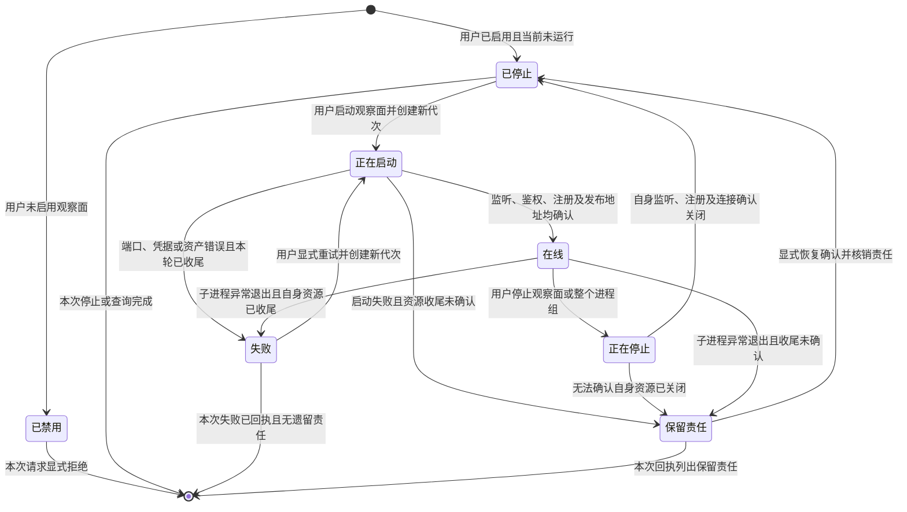

# AgentTeams U5 窄 Console 设计 v1

状态：U5 编码前 design candidate r3，feature `b0f7f3b`，实际基线
`c3aa36fc637e2da4ac821d1b26d587eadbbf1268`。本文只是设计准备，不是产品实现、不是 U5
完成，也不是任何 PASS。文中所有“提案 / 待接入 / 未实现”标记的接口都尚未存在于产品代码，
不得被当作既有 API 使用。产品源码在本次任务中只读。r1 独立审查的两个 P1 分别由三张独立
Console 生命周期 SESE 图和 `[consoleRuntime]` 独立运行事实表修正；五张 architecture map
只登记本设计的 design/pending 绑定。r3（round 12）追加 §6.5 声明明细投影契约与 §13.6
浏览器验收断言集，记录 BB09 补链；这两节只新增 Console 观察投影与验收断言，不改 §1–§5
的 U5 生命周期契约，也不构成实现或 PASS。

owner 接缝：`runtime/local-process.ts` + `runtime/local-supervisor.ts`（唯一本地
launcher/supervisor 生命周期 owner）与 `runtime/console-process.ts` + `console-host/**`
（Console 自身 listener/registration owner）。依赖 U1（同包安装路径）、U2（配置 intent/internal
projection）、D3/U4（launcher 本地控制通道）、U6（Session 执行/取消），相应产品接线均为 pending，见第
12 节。

---

## 1. 目标与非目标

### 1.1 目标

普通用户安装同一份 `agentteams` tarball 后，只编辑 `~/.agentteams/config.toml`，即可让可选
Console 从同一安装包启动：

- 用户从不编辑 Console JSON、`internal.toml`、证书/令牌/端口/asset 路径。
- 新机器端口由系统选择；系统选择的实际绑定端口、实际 URL、launcher generation、Console
  generation、Console identity 作为内部事实持久化到 `internal.toml`。
- 已持久化端口被占用时显式失败，不静默改端口、不杀其它 listener。
- Console 是 launcher/supervisor 拥有的可选子进程，不是独立用户配置进程。
- 关闭 Console 只关闭 Console 自己的 listener/registration/连接；bridge、daemon、Work 保持存活。
- Console 崩溃/重启不虚构 availability，也不凭空获得管理权限。

### 1.2 非目标

- 不新增第二套 launcher、控制总线、scheduler 或 graph family。
- 不让 Console 成为 Work 数据通道，不做 relation governance。
- 不做 public Relay / NAT / STUN、移动端入口、自动重试/重放。
- 不实现 Session 执行/取消（U6 拥有）；不在本文发明 Session API。
- 只新增三张 Console 生命周期 graph，并在五张 architecture map 登记设计绑定；不改既有八图、
  root goals/package/lock/AppSDK/memory/凭据，不提交/合并/推送。
- 不安装依赖、不运行产品服务、不做真实推理。

---

## 2. 当前锚点（已读、真实存在）

| 关注点 | 现有实现（真实符号） | 现状 |
| --- | --- | --- |
| CLI 命令面 | `cli/agentteams.mjs` `usage()`[:100](../../cli/agentteams.mjs:100)、`parseArgs`[:110](../../cli/agentteams.mjs:110)、`agentteamsCommand`[:348](../../cli/agentteams.mjs:348) | 只有 `init/start/status/work/stop`，无 Console 子命令 |
| launcher 生命周期 | `runtime/local-process.ts` `startLocalProcess`[:294](../../runtime/local-process.ts:294)、`statusLocalProcess`[:366](../../runtime/local-process.ts:366)、`stopLocalProcess`[:440](../../runtime/local-process.ts:440) | 拥有 detached launcher、generation、startToken、state/error |
| supervisor 子进程注册表 | `runtime/local-supervisor.ts` `planLocalProcesses`[:210](../../runtime/local-supervisor.ts:210)、`createLocalSupervisor`[:306](../../runtime/local-supervisor.ts:306) | 目前只启动 `relay` 与 enabled Agent daemon；无 Console 子进程 |
| internal 真源 | `runtime/local-config.ts` `readLocalInternalConfig`[:351](../../runtime/local-config.ts:351)、`projectLocalChildConfigs`[:429](../../runtime/local-config.ts:429)、`writeLocalInternalLauncherState`[:715](../../runtime/local-config.ts:715) | launcher/daemon PID/generation/startToken/state 已持久化；无 `[console]` 段 |
| Console 进程（旧） | `runtime/console-process.ts` `loadConsoleProcessConfig`[:8](../../runtime/console-process.ts:8)、`runConsoleProcess`[:34](../../runtime/console-process.ts:34) | 直接消费用户 Console JSON（`--config <file>`）；不是 launcher 子进程 |
| Console runtime | `runtime/console-runtime.ts` `startConsoleRuntime`[:21](../../runtime/console-runtime.ts:21) | 拥有自身 listener/registration；`agentIds=[]` 走目录发现 |
| Console HTTP auth/origin | `console-host/src/auth.ts` `createConsoleAuthorization`[:6](../../console-host/src/auth.ts:6) | Basic auth + `Sec-Fetch-Site` + 精确 Origin 已实现 |
| Console HTTP API | `console-host/src/http-api.ts` `createConsoleApiHandler`[:34](../../console-host/src/http-api.ts:34) | 未授权 401；owner 失败 502，不推断结果 |
| Console 静态服务 | `console-host/src/server.ts` `createConsoleServer`[:15](../../console-host/src/server.ts:15) | 静态资源与 API 均经 authorize；CSP/nosniff/no-store/路径穿越防护 |
| Agent 管理准入 | `agent-host/console-ingress.ts` `createConsoleIngress`[:12](../../agent-host/console-ingress.ts:12) | Relay 认证建立 peer，管理权限由 Agent policy 独立判定 |
| Console 投影契约 | `control-protocol/console-api.ts` `ConsoleProjectionV1` | 已有 agents/sessions/configs/notifications/works/relations；缺 U2 的 `applyState` |
| 已有 D3/U4 本地控制 | `docs/design/teams-behavior-contracts.md` 第 69–73 行 | 声明 launcher 自有本地 Unix socket 控制入口；typed union + generation；Console 不得转发 Work |

---

## 3. 唯一契约选择（冻结，不是备选列表）

### 3.1 用户 intent（`config.toml`，U2 拥有）

U2 `teams-local-config-v3.md` 当前候选选择了 `config.toml` v3 的 Console 段，尚待独立设计准入。U5 消费、不重定义：

```toml
[console]
enabled = true
username = "admin"
passwordEnv = "AGENTTEAMS_CONSOLE_PASSWORD"
agentIds = ["provider", "receiver"]   # 可选；缺省/空表示按目录发现已准入 daemon
```

- `username` + `passwordEnv` 是用户唯一可选收敛入口；`passwordEnv` 只存环境变量名，绝不存值。
- 监听 host、端口、TLS、UI/asset 路径、identity 一律由系统生成，用户不写。
- Console 默认 `enabled = false`；缺 `[console]` 或 `enabled=false` 时不启动、不占端口。

### 3.2 内部投影与运行事实（`internal.toml`，U2 schema，物理分区）

U5 消费 U2 的 `[console]` internal 段（`projectionPath` + 序列化 child projection
`config`）；Console child JSON 只由 `internal.toml` 派生，是 adapter output，永不作为第二
可编辑输入。U2 唯一拥有 config/schema、intent 编译、child projection 与同一短锁 serializer。
U5 不能扩展或重写 `[console]`，也不能写 enabled/credential/daemon/config slice。

U5 的 launcher 生命周期 owner 只写独立系统表 `[consoleRuntime]`，其中保存 Console 自己的
PID/generation/startToken/state/url/origin/identity/error 运行事实。两表物理分区，字段无重叠，
因此没有两个 owner 写同一字段。以下是待 U2 schema 接纳的完整边界；在 U2 实现完成前均标记
pending，不宣称已存在：

```toml
[console]
projectionPath = "<absolute .agentteams/.internal/projections/console.json>"
config = '{"version":1,"identity":{...},"listen":{"host":"127.0.0.1","port":42138},...}'

[consoleRuntime]
enabled = true
pid = 42139
generation = 4                # Console 自己的 generation
startToken = "uuid"           # Console 自己的 startToken
state = "online"              # disabled|stopped|starting|online|stopping|failed|retained
url = "http://127.0.0.1:42138"
origin = "http://127.0.0.1:42138"
identityRef = "console:local" # 系统生成的 Console 网络 identity 引用
error = "<typed message>"     # 仅失败时存在
```

- `[console]` 仍仅承载 U2 projection/config；`enabled` 只按用户 intent 投影，U5 不写。
- `[consoleRuntime]` 是 U5 唯一 durable 运行事实表；U2 serializer 保留该表但不解释运行状态。
- `listen.port` 是系统选择并实际绑定成功的非零端口；`0` 只可作为选择过程，不能作为持久值。
- `url`/`origin` 是实际绑定的绝对 URL，二者一致；`identityRef` 只引用、不复制秘密。
- 已持久化端口被占用 ⇒ `state=failed` + 显式 `error`；不改写端口、不杀 listener。

#### 3.2.1 `[consoleRuntime]` typed patch 与唯一 API

U5 runtime 不新建 store、锁文件或 TOML serializer。U2 在现有 `runtime/local-config.ts`
增加一个与 `writeLocalInternalLauncherState` 同层的 public 端口，并复用现有
`withLocalInternalConfigLock(internalPath, task)`：

```ts
type ConsoleRuntimeState = 'disabled' | 'stopped' | 'starting' | 'online' | 'stopping' | 'failed' | 'retained'
type ConsoleRuntimeError = { code: ConsoleErrorCode; message: string }

type ConsoleRuntimePatch = {
  enabled?: boolean
  pid?: number | null
  generation?: number
  startToken?: string | null
  state?: ConsoleRuntimeState
  url?: string | null
  origin?: string | null
  identityRef?: string | null
  error?: ConsoleRuntimeError | null
}

// 提案，未实现：唯一 caller 是 runtime/local-process.ts 的 launcher lifecycle owner。
// 该函数自己取得 internal 短锁；调用者不得持锁，也不得在锁内调用外部进程操作。
export async function writeLocalInternalConsoleRuntime(
  path: string,
  patch: Readonly<ConsoleRuntimePatch>,
): Promise<string>
```

允许写字段只有 `ConsoleRuntimePatch` 列出的 `[consoleRuntime]` 字段。`enabled` 只做用户 intent
的只读镜像，U5 必须从当前 U2 projection 写入，不能独立改写用户选择。`pid` 只有正整数或
`null`；`generation` 只有非负安全整数；`state` 只能取上述七个值；`url`/`origin` 必须是由当前
实际 bind 产生的 `http://` 或 `https://` 绝对 URL；`error` 的 `code` 取本设计的 typed code，
`message` 是非空诊断文本。`startToken`/`identityRef` 是非空字符串。

patch 的三态冻结如下：

| 输入状态 | 语义 |
| --- | --- |
| 字段缺失 | 保留当前值，不触碰 |
| 显式 `null` | 删除该 optional 字段 |
| 带值 | 设置/替换该字段 |

`state=starting` 要求 `pid` 与 `startToken` 已设置；`state=online` 要求
`pid/startToken/generation/url/origin/identityRef` 均存在且 `error` 已清除；
`state=stopped`/`disabled` 清除 `pid/startToken/url/origin/error`；`state=failed` 必须有 typed
`error` 且不得保留 online 的 URL 假象；`state=retained` 保留失败/责任字段并带恢复所有者信息。
不满足组合时在写盘前显式失败，不能做部分写入。

唯一持锁合并算法（U2 实现，U5 只调用）：

1. 调用 `withLocalInternalConfigLock(internalPath, task)` 获取唯一 internal 短锁；
2. 锁内重新读取最新完整 `internal.toml`，包括 U2 的 `[console]`、`configRuntime`、
   `[launcher]`、`[daemon.*]` 及未知内部片段；
3. 只替换 `[consoleRuntime]` 的 patch-owned 字段，校验 patch 组合与 generation 单调性；
4. 复用现有 temp + atomic rename serializer 写回完整文档；
5. 释放锁后才允许 supervisor 启动/停止/等待 Console 子进程或执行 readiness/registration I/O。

禁止跨外部 operation 持锁。launcher 的标准顺序是：短锁捕获/写 `starting` → 锁外启动/等待
ready → 短锁写 `online` 或 `failed`/`retained`；stop 同理先短锁写 `stopping`，锁外关闭/等待，
再短锁写 `stopped`/`retained`。同一 launcher 的 generation guard 防止旧 attempt 回写新状态；
U2/user intent/configRuntime/daemon/launcher 字段在每次合并中必须保持完整。U5 产品实现前必须
由 U2 schema 接纳 `[consoleRuntime]` 与上述同锁端口，未接纳时保持 pending，不声称可调用。

### 3.3 公开 CLI（冻结）

```text
agentteams status
agentteams console status
agentteams console start  [--generation <launcher-generation>]
agentteams console stop   [--generation <launcher-generation>]
```

- 只有这四个 Console 公开动作；**没有** `--port` / `--url` / `--assets` / `--username` /
  `--password` 参数。全部来自 `config.toml` intent + `internal.toml` projection。
- `agentteams status` 在既有输出上新增 Console 行（不删除既有字段）。
- `--generation` 语义与现有 `stop --generation` 一致：不匹配即 `STALE_GENERATION`。

冻结输出（键名固定，值按状态裁剪）：

```text
console=enabled|disabled
consoleState=disabled|stopped|starting|online|stopping|failed|retained
consoleGeneration=<n>
consoleUrl=<absolute-url>        # 仅 online
consolePid=<pid>                 # 仅 online/starting
consoleError=<typed-message>     # 仅 failed/retained
```

`console status` 在 launcher 未运行时明确报 `launcher=stopped`，不虚构 online；不得打印
password 值，只可打印 credential 是否已配置/可解析（如 `consoleCredential=configured|missing`）。

### 3.4 launcher 本地控制扩展（复用 D3/U4 唯一通道）

复用 `teams-behavior-contracts.md` 第 69–73 行声明的 launcher 自有本地 Unix socket 控制入口
（socket 路径/认证引用/当前 generation 存 `internal.toml`，用户不配置 socket/token/端口）。
**不新建第二 bus/scheduler。** 在该通道的 typed union 上新增 Console 生命周期动词（提案，未实现）：

```ts
type LocalConsoleControlRequest =
  | { kind: 'console.status'; correlationId: string; expectedLauncherGeneration: number; expectedConsoleGeneration?: number }
  | { kind: 'console.start';  correlationId: string; expectedLauncherGeneration: number; expectedConsoleGeneration?: number }
  | { kind: 'console.stop';   correlationId: string; expectedLauncherGeneration: number; expectedConsoleGeneration?: number }

type LocalConsoleControlReply =
  | { kind: 'console.result'; correlationId: string; ok: true;  status: ConsolePublicStatus }
  | { kind: 'console.result'; correlationId: string; ok: false; error: { code: ConsoleErrorCode; message: string } }
```

- CLI `console start|stop|status` 通过该 socket 提交；launcher 校验 `expectedLauncherGeneration`
  与 peer 凭据后，只对本 supervisor 的 Console 子进程做 start/stop/observe。
- Work 动词保持完全独立；Console 生命周期不经 Console、不经 Work 通道。
- Console 未运行时 `console.status` 只读 `internal.toml` 投影；launcher 未运行时 CLI 直接
  读取 `internal.toml`，显式报 stopped。

---

## 4. 生命周期与 generation 模型

### 4.1 状态集合

| 状态 | 语义 | 唯一 owner |
| --- | --- | --- |
| `disabled` | `[console].enabled=false`；不占端口、不启动 | U5 supervisor plan |
| `stopped` | enabled 但当前未运行；端口/URL 已持久化 | U5 launcher |
| `starting` | 正在 bind/registration/readiness；已有 pid+startToken | U5 supervisor |
| `online` | listener 已 bind、auth 初始化、registration ready、URL 已发布 | U5 Console runtime |
| `stopping` | 正在收尾自身 listener/registration/连接 | U5 supervisor |
| `failed` | 启动/运行失败且已收尾；保留 typed error | U5 launcher |
| `retained` | 无法确认清理完成，保留责任与恢复动作 | U5 launcher |

### 4.2 Console 子进程生命周期状态图（不是 SESE 执行图）



- 上图是生命周期状态机，允许跨执行的显式重试循环；多种状态不能被称为单一 DAG 输出。
- 一次启动、停止、观察分别复用 B1/B6/B4 的 SESE graph 和收据出口；每次重试生成新执行身份。
  §9 记录 Console 子生命周期接入现有 launcher 节点的精确边界，不新增第二执行图。
- 无跨节点回边修改 bridge/daemon 真源；Console 子状态机不触碰 launcher 主状态。

### 4.3 状态机（含非法转移）

| 当前 | 事件 | guard | 次态 | 非法 |
| --- | --- | --- | --- | --- |
| disabled | `console start` | — | disabled（拒绝，显式 `CONSOLE_DISABLED`） | 是 |
| stopped | `console start` | enabled；credential 可解析；asset 存在；端口空闲 | starting | 缺任一则 failed |
| starting | readiness ok | listener/auth/registration 全就绪 | online | — |
| starting | 任一步失败 | — | failed（清理仅本轮 Console 资源） | — |
| online | `console stop` | generation 匹配 | stopping→stopped | generation 不匹配 `STALE_GENERATION` |
| online | 子进程崩溃 | launcher 观察到 exit | failed | 不得改 bridge/daemon 状态 |
| failed | `console start` | 新 generation | starting | 复用旧 generation 是非法 |
| retained | 恢复确认 | 显式动作 | stopped | 无确认不得进 stopped |

### 4.4 generation / startToken 规则

- launcher generation 与 Console generation 分离：launcher 每成功 start 递增；Console 每次
  start/restart 递增自己的 `generation` 并换新 `startToken`。
- 旧 generation 的请求/回执由 launcher 或 Console 显式拒绝（`STALE_GENERATION`），不复活旧链。
- readiness 定义：listener 已 `exclusive` bind、`createConsoleAuthorization` 初始化成功、
  relay registration 就绪、`url`/`origin` 与 `internal.toml` 一致并已持久化。仅“进程存活”
  不算 online。
- crash/restart 不发明 availability：崩溃后 `internal.toml` 写 `state=failed`；`agentteams
  status` 只显示 failed/stopped，不显示 online。restart 用持久化 intent + 同一 projection，
  新 generation，端口仍为持久值。

---

## 5. 角色、身份与事件模型

### 5.1 角色与权限边界

| 角色 | 拥有 | 不拥有 |
| --- | --- | --- |
| 用户 | 编辑 `config.toml`；经 CLI 触发 Console start/stop/status | 不写 internal/JSON/端口/证书 |
| launcher/supervisor | launcher generation、Console 子进程 PID/startToken/state、本地控制 socket | 不拥有 Agent Work 结果、不拥有管理准入 |
| Console 进程 | 自身 listener、registration、自身连接、只读投影 | 不拥有 Agent 运行真相、不授予管理权 |
| Agent 管理 policy | `allowedManagers`/account/scope 的管理准入 | 不来自 Console identity |
| Work provider Agent | Work admission/执行/资源账本 | 不经 Console |
| U6 Session Agent | Session 执行/取消 | 由 U6 拥有，U5 不实现 |

**Console identity ≠ 管理权。** HTTP Basic 只授权浏览器访问 Console；Relay admission 只授权
Console 网络 identity；管理权限由 Agent-side `allowedManagers` 独立判定；配置修改权由 U2
config owner/CAS 拥有；Session 由 U6 拥有。

### 5.2 事件（producer / consumer / correlation / guard / state effect / payload boundary）

| 事件 | producer | consumer | correlation | guard | state effect | payload 边界 |
| --- | --- | --- | --- | --- | --- | --- |
| `console.start.requested` | CLI | launcher socket | correlationId | enabled、launcher generation | starting | 无秘密、无业务 payload |
| `console.start.failed` | supervisor | launcher→CLI | correlationId | 端口/凭据/asset | failed | 只带 typed error code |
| `console.ready` | Console runtime | supervisor | startToken | listener+auth+registration | online | 只带 url/pid/generation |
| `console.stop.requested` | CLI | launcher socket | correlationId | generation | stopping | 无 payload |
| `console.stopped` | supervisor | launcher→CLI | correlationId | 清理确认 | stopped | 无 payload |
| `console.retained` | supervisor | launcher→CLI | correlationId | 清理未确认 | retained | 带 owner/资源/恢复动作 |
| `console.crashed` | supervisor | launcher | startToken | exit 观测 | failed | 不改 daemon 状态 |
| `console.observe.request` | 浏览器 | Console HTTP | 无（请求级） | auth+origin | 无 | 只读投影 |
| `console.command` | 浏览器 | Console→Agent ingress | correlationId | manager policy+generation | Agent 拥有 | 控制帧，无 Session payload |
| `console.session` | 浏览器 | Console→Agent ingress | correlationId | manager policy+session identity | U6 拥有 | 独立 Session ingress |

所有控制真相只走 typed control frame/资源；不写入 request/response payload、`metadata`、
调试日志或隐式上下文。任何 receipt 不含秘密。

---

## 6. 端口（input / output / control / error）

### 6.1 Console 观察（B4，静态治理）

- input：`console.intent`（浏览器请求 → auth/origin）
- control：`authorize-console-access`（`createConsoleAuthorization`）
- output：`console.receipt`（`ConsoleProjectionV1`）
- error：401 未授权；跨站/错 origin 拒绝；Agent policy `FORBIDDEN`；链路 `UNAVAILABLE`

### 6.2 Console 生命周期（U5，新增，复用 launcher 控制通道）

- input：`[console].enabled` + CLI 子命令
- control：launcher 本地 Unix socket `console.status|start|stop`
- output：`ConsolePublicStatus`（internal 投影）
- error：`CONSOLE_DISABLED`、`CONSOLE_PORT_OCCUPIED`、`CONSOLE_CREDENTIAL_MISSING`、
  `CONSOLE_ASSET_MISSING`、`STALE_GENERATION`、`NOT_RUNNING`、`CONSOLE_RETAINED`

### 6.3 Console 配置修改（B3，U2 拥有）

- Console 命令（`ConsoleCommandV1` 的 `config.*`）进入 U2 唯一 config owner 的 CAS；
  U5 只传输、不新增第二 editable store。

### 6.4 Console Session（B5，U6 拥有）

- Console 的 `sendSession`/`session-message` 是独立业务入口；U5 只区分观察/配置/Session，
  不拥有执行/取消语义。

### 6.5 声明明细投影契约（BB09 round 12，提案）

BB09 要求「展示两个真实 daemon 及权威服务/资源」。当前 Console 观察行只承载
`capabilities: string[]`，无法表达 service version/operation 与 resource capacity/unit，因此
本轮在既有 typed projection 上增加一个**可选**字段。canonical owner 是
`control-protocol/console-api.ts`；字段放在 runtime 两个变体与 directory 变体的共同部分：

```ts
readonly capabilityDetails?: readonly {
  readonly capabilityId: string
  readonly version: string
  readonly operations: readonly string[]
  readonly resources: readonly {
    readonly resourceId: string
    readonly capacity: number
    readonly unit: 'slot' | 'context'
  }[]
}[]
```

语义（冻结）：

- 内容是 Agent 的**已发布声明摘要**，不是剩余容量、实时用量或分配账本。
- 复用 `EndpointCapabilitySummary`/`EndpointResourceSummary` 的字段类型；runtime 不得反向依赖
  control-protocol 类型。
- 声明→摘要映射：`OperationDeclaration.operation` → `operations[]`；`ResourceDeclaration` 只保留
  `resourceId`/`capacity`/`unit`，`sharing`/`allocationScope` 不进入摘要。
- `capabilities: string[]` 现有意义不变。明细缺失时 UI 必须显示「服务/资源明细不可用」；
  不得根据 ID 猜明细。
- `capabilityDetails: []` 表示来源明确声明没有服务；某 capability 的 `resources: []` 表示该服务
  明确声明无资源。
- parser 接受新 optional 字段并关闭其嵌套对象；复用既有字符串与 capacity/unit 校验语义；
  非法字段或形状显式拒绝，绝不 strip。
- 不新增声明 revision、hash、allocation state 或可用量字段。
- 同包新 producer 必须发出完整明细。`optional` 只保留既有 v1 行的可解析性；本轮只承诺同包
  protocol/UI 配套交付。

生产者（两 producer 复用同一个 canonical 声明→摘要 helper）：

1. `runtime/agent-process.ts` 从 `advertisedCapabilities` 投影明细；`projectRuntimeAgentRow`
   接收并传递它。
2. `runtime/console-hub.ts` 从 `peer.declaration.capabilities` 投影同一字段。
3. hub 合并在线 directory 行与 runtime 行时，`capabilities` 与 `capabilityDetails` 必须来自
   **同一**来源；不得一个取 directory、另一个留 runtime。
4. 声明→摘要的转换只有一个 canonical helper，与类型/parser 同属 control-protocol；两 producer
   复用，不另建状态存储。
5. UI `model.ts` 复用该类型；`render.ts` 展示 capability id、version、operations、resource id、
   capacity、unit，沿用既有安全文本 DOM 渲染与 locale，不拼接不可信 HTML。

动态 `allocations` **本轮明确不做**。理由：当前可复用的公开契约是声明摘要；BB06 另以公开
拒绝与真实 context 副作用证明动态容量行为。引入 allocations 需要新的 Provider-ledger→Console
权限、聚合、freshness 与重启语义，超出本轮最小补链。UI 必须标「声明容量」，不得标为
「剩余容量」。

### 6.6 配置投影行与封闭 wire 校验（round 15，提案）

Console 配置投影行（`ConsoleProjectionV1.configs[]`）在既有字段上增加一个**可选**
已接受 binding 字段。canonical owner 仍是 `control-protocol/console-api.ts`；producer
是 U2 config owner（`runtime/console-config.ts`），U5 只透传与解析。字段与语义见
`teams-provider-config.md` §4.1（首次 accept 前 `null`、与 `acceptedRevision` 同源、
`backup` 不自动 dispatch）。本轮**不新增 UI 产品流程**；该字段只用于公开读回，UI 不
据此发起第二次 dispatch。

配置行字段（冻结）：

```ts
readonly agentId: string
readonly acceptedRevision: number
readonly effectiveRevision?: number
readonly applyState?: 'clean' | 'uncertain'
readonly acceptedBinding?: {
  readonly primary: { readonly providerInstanceId: string; readonly modelId: string }
  readonly backup?: { readonly providerInstanceId: string; readonly modelId: string }
} | null
readonly providers: readonly ConsoleProviderView[]
readonly error?: ConsoleServiceError
```

封闭 wire 校验（`control-protocol/console-wire.ts` `parseConsoleWireReply`）：

- `configs[]` 与 `acceptedBinding`/`primary`/`backup` 逐层用 `assertEnvelopeKeys`
  关闭字段集；未声明的嵌套字段（如 `credential`/`endpoint`/`revision`）显式拒绝，
  绝不 strip。
- `acceptedBinding` 允许缺失（既有 v1 行）、允许显式 `null`（首次 accept 前），
  或为 `{ primary, backup? }`；`primary` 必需，`providerInstanceId`/`modelId` 必须为
  非空字符串；`backup` 可选且同样校验。
- 空对象、缺 `modelId`、空字符串或多余嵌套键都显式拒绝。解析后不做形状改写。

---

## 7. 安全

- **凭据分离**：HTTP Basic（`username` + `passwordEnv`）只用于浏览器访问 Console；与
  Agent 管理准入、Relay credential、Work credential 分离，不共用一个秘密。
- **精确 origin**：`createConsoleAuthorization` 要求 `url.origin === options.origin`；错 origin
  与 `Sec-Fetch-Site` 跨站拒绝。
- **静态 + API 均鉴权**：`createConsoleServer` 对静态资源与 `/api/**` 都先 `authorize`；
  未授权 API/静态返回 401；owner 失败返回 502 且不推断结果。
- **Agent-side manager policy**：`createConsoleIngress` 在 Relay 认证之后独立检查
  `allowedManagers`/account/scope 与 generation；Relay admission 不等于管理权。
- **目录发现与准入**：`agentIds=[]` 时 Console 按已准入目录发现 daemon，只显示
  presence/generation/capability；离线行可显示但不可发管理指令。不静默允许所有 agent，
  也不把 Console identity 写进任何 Agent 的允许列表。
- **秘密不外泄**：password 值绝不进入 URL、业务 payload、`metadata`、receipt、日志或
  `internal.toml`；`internal.toml` 只存 `passwordEnv` 引用/解析状态。
- **BB09 取凭据**：必须经当前配置 owner（`config.toml` + env reference）取得凭据，不得省略
  auth，也不得另建凭据 store。

---

## 8. owner 映射与缺失边

| 能力 | owner | 现有/提案 | 缺口 |
| --- | --- | --- | --- |
| Console intent schema | U2 `runtime/local-config.ts`/`runtime/console-config.ts` | 提案（U2 pending） | v3 未实现 |
| Console internal schema / intent projection | U2 | 提案 | 现有 internal 无 `[console]`；U5 只消费，不改字段 |
| Console internal lifecycle facts | U5 launcher | 提案 | U5 拥有 `[consoleRuntime]`；经 U2 唯一 serializer/短锁只合并运行事实 |
| Console 子进程 plan | U5 `runtime/local-supervisor.ts` `planLocalProcesses` | 提案 | 现只 plan relay+daemon |
| Console start/stop/status CLI | U5 `cli/agentteams.mjs` + `runtime/local-process.ts` | 提案 | 现只有 start/status/work/stop |
| launcher 控制通道 | D3/U4 | 提案 | 现只有 launcher→Agent ready/status；U5 仅增加独立 Console 动词处理器 |
| Console runtime | U5 `runtime/console-runtime.ts` | 已有 | 需接 internal projection |
| Console process config | U5 `runtime/console-process.ts` | 已有（读 JSON） | 需改为读 internal 派生投影 |
| HTTP auth/origin/静态/API | U5 `console-host/src/*` | 已有 | 需接真实 Console URL/asset 路径 |
| Agent manager policy | agent-host `console-ingress.ts` | 已有 | 生产接线 pending |
| 安装路径/asset 派生 | U1 | 已有设计 | U1 重绑 pending |
| Session 执行/取消 | U6 | 候选设计，产品缺失 | teams-session-delivery.md 待准入；U5 只消费管理投影 |

缺失边：CLI→launcher 控制 socket（D3/U4 未实现）；U2 schema/serializer 接纳
`[consoleRuntime]`（未实现）；U5 typed patch port（未实现）；Console 子进程纳入 supervisor
（U5 未实现）；真实浏览器到真实 daemon 的管理准入（生产接线 pending）。

---

## 9. 三张独立 Console 生命周期图（新增静态治理产物）

Console start、stop、status 是三条独立外部对象流，分别拥有 SESE graph：

| 外部对象流 | graph | 唯一 input | 唯一 output |
| --- | --- | --- | --- |
| 启动 Console | `docs/design/dagpipe/graphs/console-start.graph.json` | `console.start.intent` | `console.start.receipt` |
| 停止 Console | `docs/design/dagpipe/graphs/console-stop.graph.json` | `console.stop.intent` | `console.stop.receipt` |
| 观察 Console | `docs/design/dagpipe/graphs/console-status.graph.json` | `console.status.intent` | `console.status.receipt` |

这三张图只表达成功拓扑和静态治理，不是 DAGpipe SDK executable；图中 `operator@version`
均为 design binding。B4 的 `console-observe.graph.json` 不变。B1/B6 也保持字节不变，不能把
Console-only start/stop 混入 daemon bridge/daemon 节点或 B6 Work drain。Console offline 不改变
bridge、daemon 或 Agent Work。

### 9.1 start：唯一 owner、effects 与终止

| graph node | 业务步骤 | owner | effects |
| --- | --- | --- | --- |
| `verify-console-start-request` | 核验 CLI 请求、peer、enabled 与 launcher generation | `runtime/local-process.ts` | 无持久写入 |
| `resolve-console-child-projection` | 读取 U2 `[console]`、当前 `[consoleRuntime]`、credential/asset 引用 | `runtime/local-config.ts` | 只读 |
| `start-console-child` | 创建唯一 Console generation/startToken，并在 supervisor 锁外启动子进程 | `runtime/local-supervisor.ts` | Console child/listener |
| `confirm-console-readiness` | 确认 exclusive bind、auth、registration、URL/origin | `runtime/console-runtime.ts` | Console runtime readiness |
| `persist-console-start` | 只写 `[consoleRuntime]` 并返回最终 receipt | `runtime/local-process.ts` 调用 U2 port | durable consoleRuntime patch |

typed input 是 `{correlationId, expectedLauncherGeneration, expectedConsoleGeneration?}`；
typed success receipt 是
`{outcome:'started', launcherGeneration, consoleGeneration, pid, startToken, state:'online', url, origin, cleaned:boolean}`。
typed failure receipt 是 `{outcome:'failed', code, message, cleaned:boolean, retained?}`。

失败/取消不进成功图边：

- `CONSOLE_DISABLED`：零子进程、零端口、零 Console runtime patch；只返回拒绝。
- `STALE_GENERATION`/`NOT_RUNNING`：零 Console 写入，保留既有运行事实。
- credential/asset/port failure：只关闭并核对本轮 Console child/listener/registration；
  bridge、daemon、Work 不变。已确认清理时 `state=failed, cleaned=true`；未确认时
  `state=retained, cleaned=false` 并记录 owner、资源、恢复动作。
- CLI/process cancellation：launcher 是清理 owner；无法确认时进入 retained，不生成 online。

图的最终 receipt 必须诚实区分 started/failed/retained，失败绝不包装成功。caller 对 retained
只能发起独立恢复或清理动作；下一次 start 拥有新 execution/attempt/generation，不能跨图回边。

### 9.2 stop：只关 Console，不 drain Work

| graph node | 业务步骤 | owner | effects |
| --- | --- | --- | --- |
| `verify-console-stop-request` | 核验 launcher/console generation、PID/startToken owner | `runtime/local-process.ts` | 无持久写入 |
| `stop-console-child` | 只对 matched Console child 发停止信号 | `runtime/local-supervisor.ts` | Console child stop |
| `release-console-runtime` | 关闭 listener、registration、自身连接 | `runtime/console-runtime.ts` | Console-only resources |
| `confirm-console-termination` | 确认 matched PID 退出与本轮责任 | `runtime/local-supervisor.ts` | 观察 exit/retained |
| `persist-console-stop` | 只写 `[consoleRuntime]` 并返回最终 receipt | `runtime/local-process.ts` 调用 U2 port | durable consoleRuntime patch |

typed input 与成功/失败 receipt 同 start；success receipt 使用 `outcome:'stopped'` 与
`state:'stopped'`。本图不调用 `drain-or-retain-work`、不修改 `[launcher]`/`[daemon.*]`、不发送
daemon stop。Console stop 完成后新 Work 必须仍可独立执行，这是 BB09 的单独断言，不是本图
成功节点内部动作。

失败/取消终点：generation/PID/startToken 不匹配时返回 typed error 且零状态改写；listener、
registration 或 exit 无法确认时保留 Console owner/资源/恢复动作，写 `retained`；不得因为
daemon 健康而把 Console 资源未确认显示为 stopped-clean。caller 对 retained 发起独立清理，
清理失败继续显式保留责任。

### 9.3 status：只读分类，不改配置或运行态

| graph node | 业务步骤 | owner | effects |
| --- | --- | --- | --- |
| `verify-console-status-request` | 核验 CLI 请求、peer 与 generation | `runtime/local-process.ts` | 无持久写入 |
| `read-console-runtime-facts` | 读取 `[console]` projection 与 `[consoleRuntime]` | `runtime/local-config.ts` | 只读 |
| `observe-console-child` | 核对 launcher、matched PID/startToken 和可选 B4 registration presence | `runtime/local-supervisor.ts` + B4 observe | 只读 |
| `classify-console-state` | 合成 public state/error，不把旧事实推断成 online | `runtime/local-process.ts` | 无写入 |
| `return-console-status` | 返回 `ConsolePublicStatus` | `runtime/local-process.ts` | 无写入 |

typed input 只含 correlation/generation。success receipt 是
`{outcome:'observed', console, consoleState, consoleGeneration, launcher, launcherGeneration, credential:'configured'|'missing', url?, pid?, error?}`。
launcher stopped、旧 PID 不存在、URL 端口已关闭等必须反映为 stopped/failed/retained；
credential 值永不返回。观察失败（文件、socket 或 child observation 不可读）返回 typed
`CONSOLE_STATUS_UNAVAILABLE`，不能静默显示 healthy。status 不刷新 config revision、不调用
Agent mutation、不授予 manager 权限。

### 9.4 配置并发验收

配置并发不新增 Console lock 或副本。U5 patch 与 U2 projection/configRuntime 写入都经过唯一
`withLocalInternalConfigLock`，以 reload-latest 后合并，再 atomic rename。验收必须证明：

- U5 写 `[consoleRuntime]` 后，U2 的 `[console]`、`configRuntime`、`[launcher]`、
  `[daemon.*]` 仍逐字段完整；
- U2 修改/替换 `[console]` 后，`[consoleRuntime]` 的 PID/generation/startToken/state/url/origin/identity/error
  不被清空或覆盖；
- 两个并发 caller 串行提交，最终文档同时保留双方 owned fields；
- 外部操作前后锁已释放；没有跨 start/stop/status 的外部 operation 持锁；
- unknown/非规范 `[consoleRuntime]` schema 使 U2 serializer 显式失败，不猜测修正。

这些是 U5 实现期的黑盒/集成验收，目前均为 design/pending。

---

## 10. 提案改动路径（编码阶段，非本次）

| 路径 | owner | 动作 |
| --- | --- | --- |
| `runtime/local-config.ts` | U2 | internal `[console]` schema/projection 与 `[consoleRuntime]` serializer/短锁端口；只接纳 U5-owned patch |
| `runtime/local-process.ts` | U5/D3-U4 | `console start/stop/status` 公开函数；复用控制 socket |
| `runtime/local-supervisor.ts` | U5 | `planLocalProcesses` 纳入可选 Console 子进程 |
| `runtime/console-process.ts` | U5 | 改读 internal 派生投影，非用户 JSON |
| `runtime/console-runtime.ts` | U5 | 从投影取 host/port/origin/asset/credential |
| `console-host/**` | U5 | 复用现有 auth/http/静态；必要时仅接真实 URL/asset |
| `cli/agentteams.mjs` | U5 | 新增 `console status|start|stop` 与 status Console 行 |
| `ui/teams-console/**` | UI worker | 独立 owner；fixture 不替代真实浏览器验收 |

不改：既有八张 graph JSON、root goals、package/lock、`.appsdk/**`、memory。五张 architecture
map 只新增本设计的 `design` 绑定，不升级任何当前实现事实。

---

## 11. 禁止事项（prohibition table）

| 禁止 | 原因 |
| --- | --- |
| 用户编辑 Console JSON / internal / 端口 / token / 证书 / asset 路径 | 破坏单一 intent 源 |
| 第二 launcher / 控制总线 / scheduler | 违反唯一 owner |
| Work 经 Console 转发 | Console 非 Work 通道 |
| 静默改端口 / 杀其它 listener | 破坏系统选择的持久事实 |
| 浏览器与 Agent 管理共用凭据 | 混淆授权层 |
| 秘密进入 URL/payload/metadata/receipt/日志 | 泄密 |
| 从 Console identity/presence/UI 推断管理权 | 越权 |
| 自动重试/重放 | 违反 B2/B8 |
| relation governance / public NAT / mobile | 非目标 |
| U5 实现 Session 执行/取消 | U6 拥有 |
| 源码树 asset fallback | 违反同包安装 |
| 声称 graph/BB09/产品已 PASS | 本任务只是设计 |

---

## 12. 依赖（均为 pending，不视为已批准契约）

- **U1**（同包安装）：`teams-package-delivery.md` 定义 `staticRoot=console-host/static`、
  `uiRoot=ui/teams-console`，安装根为 `<prefix>/node_modules/agentteams`。U5 从同一安装根
  派生路径；U1 重绑 `.appsdk` artifact_paths 前等价性为 `UNVERIFIED`。
- **U2**（配置 intent/internal projection）：`teams-local-config-v3.md` 当前候选定义 `config.toml`
  v3 用户 `[console]` 与 `internal.toml` v2 的 `[console]` projection/config；新增 `applyState`
  到 Console 配置投影。U5 依赖 U2 额外接纳独立 `[consoleRuntime]` 系统表和同一 internal 短锁
  typed patch port（见 §3.2.1）；该依赖未实现前 U5 只保留 design，不声称 API 存在。
- **D3/U4**（launcher 本地控制通道）：`teams-behavior-contracts.md` 第 69–73 行声明的
  唯一 launcher 自有本地 Unix socket typed union。U5 复用它做 Console 生命周期。
- **U6**（Session 执行/取消）：实际候选是 `docs/design/teams-session-delivery.md`，位于当前
  U6 独占工作树，尚待独立准入。U5 不另建 Session API/config/recovery；只消费 Agent 的
  `sessionCapable/sessionAvailability/sessionEffectiveRevision` typed 管理投影。能力声明不等于
  readiness，只有 availability=`current` 才发送 Session 动作；被动 Agent 明确不支持。
  开放 Session ingress 前由 U6 await U2 同一 ManagedConfigOwner.recover，durable uncertain
  不因 Console 重启或 daemon 重启清除；U5 不写 apply fence，也不将 config reconcile 成功
  视为 Session unknown 已有最终结果。

---

## 13. BB09 黑盒契约（提案，未实现）

> 以下命令/断言均为**提案**，当前产品未实现。fixture `ConsoleClient` 或 asset/health smoke
> **不是** BB09 证据；必须真实浏览器 + 真实 daemon 发现 + 关闭 Console 后新 Work 成功。

### 13.1 环境

同包 tarball、源码树外、隔离 HOME/owned 端口/listener：

```sh
tmp="$(mktemp -d)"
prefix="$tmp/prefix"; test_home="$tmp/home"; cache="$tmp/npm-cache"
mkdir -p "$test_home" "$prefix" "$cache"
HOME="$test_home" npm_config_cache="$cache" \
  npm install --prefix "$prefix" --no-audit --no-fund "$tarball"
cli="$prefix/node_modules/.bin/agentteams"
```

### 13.2 步骤与期望

| 步骤 | 命令 | 期望（业务/副作用） |
| --- | --- | --- |
| init | `HOME="$test_home" "$cli" init` | 只生成 `config.toml`/派生文件；用户不写 JSON |
| 启动 | `HOME="$test_home" "$cli" start` | bridge+两 daemon online；generation 递增 |
| 状态 | `HOME="$test_home" "$cli" status` | 显示 `console=enabled`、`consoleUrl`、pid/generation |
| Console status | `HOME="$test_home" "$cli" console status` | `consoleState=online`；不打印 password |
| 浏览器发现 | Camo 打开 `consoleUrl` | 发现两个真实 daemon 及权威服务/资源/Work 视图 |
| 授权静态/API | 带 Basic 的 `curl` 静态 + `/api/v1/projection` | 200，content-type 正确 |
| 未授权 | 无凭据 `curl` 静态 + API | 401 |
| 错 origin | 带错误 Origin 的请求 | 拒绝（401/403） |
| Agent policy | 以未列入 `allowedManagers` 的 Console 发管理命令 | 显式 `FORBIDDEN`，无副作用 |
| 停 Console | `HOME="$test_home" "$cli" console stop` | 仅 Console 子进程/listener 消失；daemon PID/generation 不变 |
| 新 Work | `HOME="$test_home" "$cli" work --request <fixture>` | 真实执行并返回结果；不经 Console |
| 重启 | `HOME="$test_home" "$cli" console start` | 用持久化 intent，新 Console generation |

### 13.3 失败/清理契约

| 场景 | 期望 |
| --- | --- |
| 缺 asset | 启动失败，仅清理本轮 Console 资源；daemon/Work 不动 |
| 端口被占 | 显式失败，不改端口、不杀占用 listener |
| 缺凭据 | 显式 `CONSOLE_CREDENTIAL_MISSING` |
| 清理无法确认 | `retained`，带 owner/资源/恢复动作 |

### 13.4 证据与清理

- 记录：tarball hash/candidate SHA；config/internal hash（不含秘密）；Console URL/PID/generation；
  停 Console 前后两 daemon PID/generation；授权/未授权 HTTP 状态；Camo 截图/DOM（两 daemon
  服务/资源/Work）；新 Work 结果。
- 清理：确认仅本轮 Console listener/child 消失、daemon/listener 保留；占用端口场景下既有
  listener 不动；隔离 HOME/prefix/tmp 在保留证据后移除。

### 13.5 配置并发互不覆盖黑盒用例（提案，未实现）

> 该用例必须在 U2 `[consoleRuntime]` schema/短锁端口和 U5 launcher 实现后，通过真实 CLI 与
> 隔离 HOME 执行；不得用 mock serializer 或私有锁断言替代。

前置：同一隔离 HOME 下先运行 `agentteams start`，确认 Console 已 online；记录
`internal.toml` 的 `[console]`、`[consoleRuntime]`、`[launcher]`、`[daemon.*]` 各字段和
Console PID/generation/startToken。然后并发执行两个互不等待的真实入口：

```sh
HOME="$test_home" "$cli" console status &
status_pid=$!
HOME="$test_home" "$cli" console start --generation "$launcher_generation" &
start_pid=$!
wait "$status_pid"; wait "$start_pid"
```

预期外部结果：两个命令各自返回自己的 typed receipt，不出现 `internal config update is already
in progress` 之外的无解释失败；Console runtime 最终状态由实际 start attempt 决定，status
只反映当时或之后的真实观察，不伪造 online。

完成后重读 `internal.toml` 并断言：

- U2 `[console] projectionPath/config` 与 `configRuntime` 字段集合逐项不变；
- `[launcher]` 的 pid/generation/startToken/state 不被 Console patch 改写；
- `[daemon.*]` 的 pid/generation/startToken/state/config 不被 Console patch 改写；
- `[consoleRuntime]` 只由 U5 写，字段组合符合 §3.2.1；若 start 成功，generation 只递增且
  startToken 更新；若失败/retained，回执与 durable state 一致；
- 另一个配置 owner 同时更新 `[console]` 或 `configRuntime` 时，U5 patch 不清空对方字段，
  U2 写也不清空 `[consoleRuntime]`；最终文件是完整可解析 TOML。

证据：两个命令的 argv/exit code/完整 stdout/stderr；launcher generation；`internal.toml`
前后 hash 与脱敏字段 diff；console PID/startToken/generation；最终公开 `console status`；
失败时保留的 owner/资源/恢复动作。未实现前本用例只属 design。

### 13.6 浏览器验收断言集（BB09 round 12）

§13.2 的步骤表是早期提案；本轮 BB09 以安装后的真实 Camo 入口执行，断言与证据文件如下。
证据根为 `$RUN/full/cases/BB09/`（focused 使用同形目录）。真实配置只写隔离 HOME 的
`config.toml`，两个 daemon 都明确授权 `__console`，拒绝场景另设独立 fixture。

| 权威要求 | 黑盒断言 | 证据文件 |
| --- | --- | --- |
| 安装资产真实入口 | URL 来自 installed CLI；Camo clean URL 加载，title 正确，无加载错误，projection fetch 200 | `browser-start.json`、`browser-clean-navigation.json`、`browser-page.json`、`browser-dom.json`、截图 |
| 目录发现（缺省/空 `agentIds`） | installed status 记录两个独立 daemon PID；主 BB09 场景的 browser projection/DOM 中两个 agentId、label、machineId、online 状态对应；Relay 目录过滤的 account 不匹配/scope 不匹配负例（HTTP 200 且 `agents=[]`）与同域正例（恰两个目标 ID）由真实 Relay + 真实 Console runtime + 真实 HTTPS `/api/v1/projection` 的 driver spec 覆盖 | `bb09-status.json`、`browser-projection.json`、`browser-agents-dom.json`；`scripts/blackbox-user-mvp.spec.ts` 的 `BB09 HTTP projection account mismatch`、`BB09 HTTP projection scope mismatch`、`BB09 HTTP projection same domain` |
| 静态绑定（显式 `[console].agentIds`） | 独立隔离 fixture（自有 HOME/prefix/data dir/动态端口/Camo profile）内两个同域 daemon 显式授权 `__console`；安装态 projection 恰为显式两个 ID 且 online；卡片与详情按值对应 label/machineId 与 `capabilityDetails`；不重复配置交互、离线 Work 与完整 Session | `cases/BB09/static-binding/` 下 `npm-pack.json`、`npm-install.json`、`init.json`、`bb09-static-start.json`、`bb09-static-status.json`、`browser-start.json`、`browser-clean-navigation.json`、`browser-projection-status.json`、`browser-projection.json`、`browser-agents-dom.json`、`browser-detail-action.json`、`browser-detail-dom.json`、`browser-resources-dom.json`、`browser-cleanup.json`、`cleanup.json`、`static-binding.json` |
| 权威服务/资源 | browser API 返回真实 producer 的 `capabilityDetails`；DOM 展示 capability/version/operation/resourceId/capacity/unit，并与公开 installed status 的声明对应 | `browser-projection.json`、`browser-resources-dom.json` |
| 观察交互 | 点击 Agent 详情，drawer 显示对应 Agent 的声明；刷新仍从 owner projection 读回 | `browser-detail-action.json`、`browser-detail-dom.json` |
| 配置交互 | 真实点击「服务配置」、选择目标 Agent、先执行一次真实 `refreshModels` 并等到该动作**真正结束**（本次动作的成功 notice 出现、该卡片的操作按钮恢复可用、live region 无错误），再选择模型并在真实点击前证明 bind 按钮已启用；公开 accepted revision 恰前进 1，另一 Agent 不变；DOM 刷新显示读回值 | `browser-config-actions.json`、`browser-config-before.json`、`browser-config-refresh-after.json`、`browser-config-bind-preclick.json`、`browser-config-after.json` |
| auth 拒绝 | fresh 未认证 profile 页面/API 401；未认证管理命令 401，配置无变化 | `browser-unauthenticated.json`、`auth-refusals.json` |
| origin 拒绝 | 对安装后 listener 发 authenticated 错 Origin/cross-site 请求，返回既有 401；合法同源 browser 操作仍成功 | `origin-refusals.json`、`browser-same-origin.json` |
| Agent policy 拒绝 | 隔离未授权 manager fixture（`allowedManagers = []`）经公开管理入口得到 HTTP 200 + `FORBIDDEN`；新建且尚未 accept 的 Agent 视图 revision 为 0、durable accepted slice 可以不存在，命令显式携带 `expectedRevision: 0`；前后 durable slice 存在性与原始 revision 严格不变（缺失→缺失、`0`→`0` 通过；缺失↔`0` 或任意推进失败） | `agent-policy-refusal.json`（含命令输入、前后 durable 原始 revision 与 slice 存在性、观察来源＝目标 Agent 的 durable internal store） |
| Console 可关闭 | installed `console stop` 后 Console PID/listener 消失，两 daemon PID/generation 不变 | `bb09-console-stop.json`、`bb09-status-after-console-stop.json` |
| Console 离线后新 Work | 关闭后才生成的新 Work/request ID；真实 file-search 返回对应 fixture 文件 | `bb09-work-without-console.json` |
| 生命周期失败终点 | 保留既有 unavailable/disabled 检查；失败有显式结果及零新增子进程 | 既有失败文件与 cleanup receipt |
| 清理 | browser profiles、fixture child、listener 和临时安装均无残留 | `browser-cleanup.json`、`cleanup.json` |

配置交互场景使用既有 stub provider，只验证 Console→config owner 的提交/读回；不在该场景生成
real-provider PASS。O1 的「选择后无配置数据」只证明控件能力，不能替代本表的配置提交。

配置交互的次序与 owner 边界：`config.refreshModels` 只写 catalog observation，**不推进**
accepted revision；accepted revision 只能由真实 accept 路径（如 `config.bindModel` → `mutate`）
推进。BB09 的配置交互因此先执行一次真实 refresh（断言 accepted revision 不变），再执行一次
真实 bind（断言 accepted revision 恰前进 1，且另一 Agent 配置不变）。**模型选项出现在 DOM 里
不等于该动作已经结束**：Console 在动作进行中把操作按钮置为 disabled，动作结束时的重渲染又会按
投影重建控件（本场景该 Agent 尚无生效绑定，模型下拉回到占位符）。驱动因此必须在同一次轮询里
等到本次动作的成功 notice 与按钮恢复可用，选择模型后在真实点击前断言 bind 已启用；选择与点击
之间不得插入其他 Console 动作。BB09 汇总目录发现与静态绑定两份观察，任一子场景失败则 BB09
不得 passed。

---

## 14. 设计验证与限制

- 本设计只做针对性检查：`git diff --check`、`git diff --cached --check`、Markdown
  link/fence、五张 map JSON parse/引用检查，以及三张新增图各自的 `dagpipe graph validate`。
- 既有八张 graph JSON 均保持字节不变；`console-observe.graph.json` 仍由 B4 单独拥有。
- 未做：产品实现、build、typecheck、安装、服务重启、live replay、BB09 真实浏览器验收、
  full test。均不得声称通过。
- 第一分歧（first divergence）：现有 Console 是独立 `--config <JSON>` 进程，没有 launcher
  生命周期、没有同包用户启动入口、internal 无 `[console]`，因此无法满足“只编辑 config.toml
  即可启动可选 Console”与“关闭 Console 不动 Work”。
- 未决依赖：U2/U6 窄设计待准入、D3/U4 控制通道未实现、U1 路径重绑 pending。

---

## 15. 关键文件

- 本设计：`docs/design/teams-local-console-v1.md`
- 运行笔记：`docs/evidence/u5-console-design-20261003/run-notes.md`
- 行为模型/契约：`docs/design/teams-behavior-model.md`、`docs/design/teams-behavior-contracts.md`
- 已有观察图：`docs/design/dagpipe/graphs/console-observe.graph.json`
- 新增生命周期图：`docs/design/dagpipe/graphs/console-start.graph.json`、
  `docs/design/dagpipe/graphs/console-stop.graph.json`、
  `docs/design/dagpipe/graphs/console-status.graph.json`
- U2 依赖：`/Volumes/Intel/playground/agentteams/u2-config-design-20261003/docs/design/teams-local-config-v3.md`
