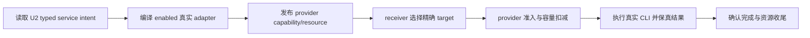
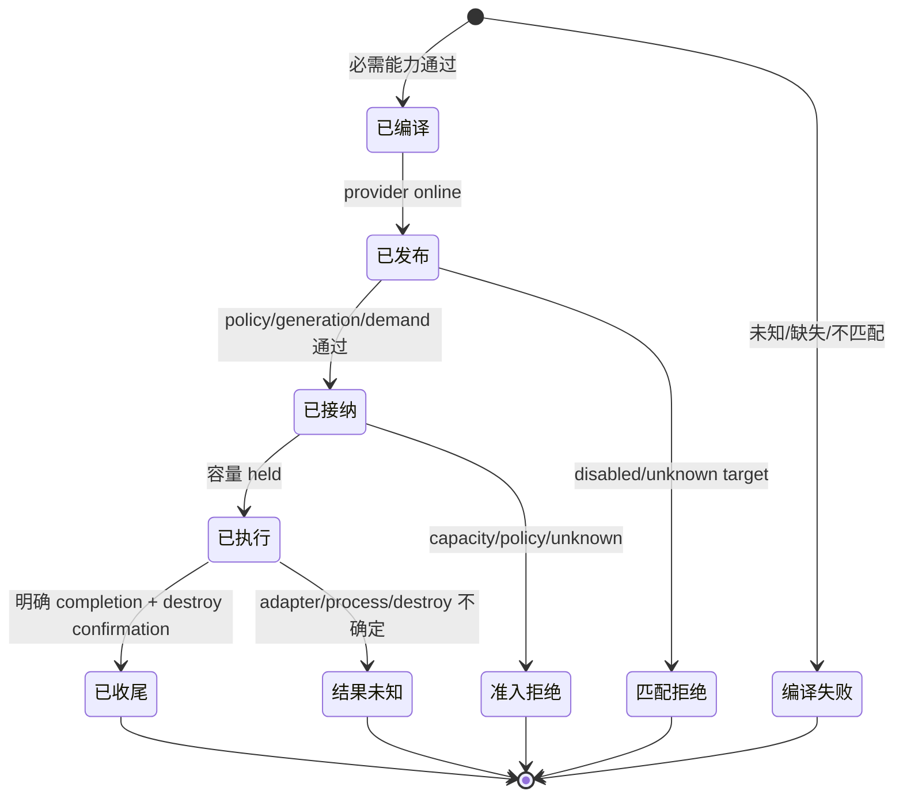

# Teams 本地真实服务声明 v1 设计候选

状态：U3 / `9b84aaa` 编码前窄设计候选 r4，修订 r3 独立审查的 caller 与空服务依赖缺口；不是修复、实现、黑盒 PASS 或 U3 完成。当前基线：`73eaf0944f1a9d0c8d47009d5b9780c5ae8068d6`。owner：agent-host 的 declaration compiler、CLI executor，以及 runtime 的 daemon JSON consumer 接缝；provider `WorkLedger` 仍是唯一 admission/capacity 真源。

U2 的 CONFIG DESIGN 已定义在 `docs/design/teams-local-config-v3.md`：`[agents.*.services.*]` 只保存简化用户意图，U3 负责 adapter schema、execution 与资源语义。该设计事实不等于 U2 源码已合并。当前存在的 U2 源码 producer 是未合并、未安装、未架构 PASS 的 frozen source candidate：

| producer 事实 | 精确绑定 |
|---|---|
| worktree / branch / base | `/Volumes/Intel/playground/agentteams/u2-config-seams-20261004` / `codex/u2-config-seams-20261004` / `73eaf0944f1a9d0c8d47009d5b9780c5ae8068d6` |
| staged tree / blob | tree `b068173695c9183f8748850bc8dc903e0635c11f`；`runtime/local-config.ts` blob `e6394710e6d71f8b6c700a7644c37a5f2653a57e` |
| file hash | SHA256 `7471042543dae4062d9f17b86cafe94590626dfaba29c3aa5d8d0224cf5e50d5` |
| primary receipt | `/Users/fanzhang/.codex/task-evidence/agentteams/receipts/u2-config-seams-20261004/primary-consumption-receipt.json`；`focused=29/29`、`mappedRegression=23/23`、`build=0`、`typecheck=0`、`publicConsumer=true` |
| admission facts | `sdkAdmission=false`、`architectureReview=false`、`installedMvp=false`；不得把该 tree 写成已合并、已安装或 full Work |

该 producer 的真实 API 是 `runtime/local-config.ts` 中的 `LocalServiceIntent`，不是本设计自造的等价类型：

```ts
export interface LocalServiceIntent {
  readonly capabilityId: string
  readonly version: string
  readonly operations: readonly string[]
  readonly resources: readonly {
    readonly resourceId: string
    readonly capacity: number
    readonly unit: 'slot' | 'context'
  }[]
}
```

`LocalDaemonSpec.services?: readonly LocalServiceIntent[]` 与 daemon JSON `endpoint.services` 都由 `localServiceIntent()` 从同一 `services.*` 表投影。public consumer 已实际读到该投影，raw 绑定为 U2 worktree 的 `docs/evidence/776fcad-u2-config-seams-20261004/primary-raw/public-consumer.command.json` 与 `public-consumer-output.jsonl`。U3 只消费这个精确数组，不复制 parser、store、lock 或 CAS。

## 1. 唯一契约与现状缺口

本设计只回答：U2 已保存的 enabled services 如何实例化真实 adapter、编译为 `CapabilityDeclaration`，并只发布/匹配/执行这些 enabled services。现状 `createCliWorkExecutor` 固定广播 `browser` 与 `file-search`，且两者固定 `capacity:2`；即使 `/missing/camo` 也会被发布。这是已证实的 feature gap，不是已复现 bug，禁止用“修复”措辞。

U2 producer 已把 `LocalServiceIntent[]` 投影到 daemon JSON `endpoint.services`，但当前 `runtime/agent-process.ts` 的 `loadAgentProcessConfig()` 仍只允许 `endpoint.role/connect`，`AgentEndpointConfig` 也没有 `services`。因此 U2 的 JSON 还不能被当前 U3 consumer 读取；这是 U3 实现必须闭合的 consumer seam，不是 U2 producer 的既有能力。精确实现点是 `runtime/agent-process.ts`：把 `services` 加入 endpoint 字段校验，按 `LocalServiceIntent` 读取，并在 provider/hybrid 创建 executor 时传入该数组；旧 decoder 的“当前已接受 daemon JSON”说法禁止出现。

复用现有 B1/B2，不新增第二拓扑：



| 层 | 唯一真源/owner | 禁止 |
|---|---|---|
| 用户意图 | U2 `config.toml`：`capabilityId`（由服务表键产生）、字符串 `version`、`operations[]`、`resources[{resourceId,capacity,unit}]` | U3 新增第二 schema/store、第二 ledger 或默认 browser |
| operation 合同 | `cliOperationDeclarations`：input/output schema 与 cancellation | compiler 复制 schema、adapter 另写 cancellation |
| resource 语义 | adapter owner：`resourceId/unit/sharing/allocationScope` | U2/user 覆盖 sharing、scope 或 schema |
| capacity | U2 typed intent 只允许替换同资源 `capacity/unit`；adapter 必须接受 | 用户声明 adapter 不认识的 resource/unit |
| admission | provider `WorkLedger.requestWork` | host/receiver 自行减账本、预扣容量或绕过 proposal |
| execution | `WorkExecutor.execute/destroy` 对真实 CLI 调用 | mock 内部调用充当用户交付证据 |

启用判定：`browser` 启用要求可执行 `camoExecutable` 可运行且 `profilePrefix` 符合当前 owned-prefix 合同；`file-search` 启用要求可执行 search executable 与绝对、真实、非 symlink 的 readonly `searchRoot`。缺任一必需能力在 provider 编译边界显式失败；disabled 服务不得因为默认 CLI 字段存在而发布。receiver 若无本地 provider service，仍通过同一 `createCliWorkExecutor({services:[]})` 构造 capability-empty 的 `WorkExecutor`，不初始化任何 CLI adapter；它满足既有 `WorkHost` 的必填 executor 依赖，未知执行显式失败，不创建第二 executor 实现。当前 `sharedcaller` 没有产品入口，仍由后续 runtime seam owner 处理，不是 U3 fallback。

Console 是可选观察/配置客户端，不是 Work、目录匹配或服务执行的 required relay/data path。service/enabled/operation/resource/config 控制事实只走 typed config、声明或既有 control frame；不得写入 `WorkRequest.payload`、`WorkReply.payload`、metadata 或诊断日志。U3 不增加 default browser、无条件 fallback、降级双路径或按日志重建控制状态。

## 2. Typed input/output

U3 不重新声明 `LocalServiceIntent`。唯一类型引用是 U2 的 `runtime/local-config.ts` 导出类型，消费端只允许 type-only import：

```ts
import type { LocalServiceIntent } from '../runtime/local-config.ts'
```

该 import 只携带 DTO 类型，不导入 parser、store、lock、CAS 或任何可写配置路径；Agent/CLI executor 不读取或持久化配置，也不拥有第二 editable source。U3 的 runtime consumer 把 exact projected array 交给唯一 compiler；compiler 不改变其字段含义：

```ts
interface CliWorkExecutorOptions {
  readonly services: readonly LocalServiceIntent[]
  readonly camoExecutable?: string
  readonly searchExecutable?: string
  readonly searchRoot?: string
  readonly profilePrefix?: string
}
interface CompiledLocalService {
  readonly declaration: CapabilityDeclaration
  readonly execute(work: AgentWork, request: WorkRequest, allocations: readonly ResourceAllocation[]): Promise<RequestCompletion>
  readonly destroy(work: AgentWork, allocations: readonly ResourceAllocation[]): Promise<{ readonly destroyed: true }>
}
```

`services` 来自 daemon JSON 的真实 `endpoint.services` 数组；每项必须保留 `capabilityId`、字符串 `version`、字符串数组 `operations` 和 `resources`。缺少字段、类型不符、重复 service、未知 adapter、未知 version、未知 operation、未知 resource、重复 operation/resource、capacity 非正、unit 与 adapter 不匹配，均在 adapter compile boundary 以 `UNSUPPORTED_OPERATION` 或 `INVALID_INPUT` 失败，不发布 declaration、不创建进程、不写 ledger。空数组是合法的 disabled 结果：不发布 capability，不初始化任何 adapter。

compiler 输出仍为现有 `CapabilityDeclaration`：`operations` 从 `cliOperationDeclarations` structured clone；capacity/unit 只能替换 adapter 已声明的同一 resource；`sharing/allocationScope` 永远取 adapter 原值。合法映射：

| service | 允许 operations | adapter 固定资源语义 |
|---|---|---|
| `browser` | 必须完整启用 `context.create`、`navigate`、`snapshot`、`context.destroy` 四个 operations | `browser-context: context/shared/work`；`browser-slot: slot/shared/request` |
| `file-search` | `search` | `search-slot: slot/shared/request` |

browser operation 子集同样拒绝：navigate/snapshot/destroy 依赖该 Work 先 create 的 context，MVP 不增加外部 context 注入或第二生命周期模式。没有启用 browser 时，`camoExecutable`/profile 可为空，目录发现必须没有 browser，findProvider/matching 必须显式 `NOT_FOUND` 或 `UNSUPPORTED_OPERATION`，不得启动进程。receiver-only 或没有 provider services 的 daemon 构造同一 capability-empty executor，但不创建 browser/search adapter，也不把 CLI 配置字段当成隐式启用。空服务的 `execute` 返回明确 `UNSUPPORTED_OPERATION`；`destroy` 仅在不存在 Work-owned adapter 且没有未释放 allocation 时确认无外部资源，否则显式报告 retained，不能假释放。

## 3. 角色、事件、owner、effects

| 角色/事件 | owner | 主要 effects | 成功/失败终点 |
|---|---|---|---|
| 编译已启用服务 | agent-host compiler | 不写账本、不启动 CLI | valid declarations、无 capability 的空集，或启动失败；unknown/不匹配失败 |
| 发布 provider 声明 | B1 `publish-services` / agent-host + network | directory publication | 只出现 enabled declarations；receiver 空广播 |
| receiver 选择 target | D3/U4 WorkIntent / receiver runtime | network grant | 精确 capability/version/operation/target；不猜替身 |
| Work 准入 | B2 provider `WorkLedger.requestWork` | policy/generation/resource 原子扣减 | accepted 或 `FORBIDDEN`、`STALE_GENERATION`、`RESOURCE_EXHAUSTED`、unknown |
| 执行 CLI | agent-host executor | search process；Work-owned browser profile/context | 保真业务 payload/error；未知结果保留外部责任 |
| 完成与收尾 | provider ledger + executor | request 终态；确认销毁后释放 allocation | succeeded/failed；unknown/retained 不得假释放；取消仅返回 unsupported |

生命周期状态及终点（不是另一张 SESE graph）：



取消终点受现有 operation declaration 约束：当前 CLI operations 全部 `cancellation: unsupported`，因此公开 cancel 必须返回 `UNSUPPORTED_OPERATION`，不得把 transport disconnect 当成取消。Work proposal/request 未发出前的本地 compile/discovery failure 无 provider allocation。

## 4. 完整 caller 映射

| 当前/未来 caller | 当前边界 | U3 映射 |
|---|---|---|
| `runtime/agent-process.ts` | `loadAgentProcessConfig()` 当前只读 `endpoint.role/connect`，`createCliWorkExecutor(config.cli)` 固定广播；receiver 也构造 executor，仅以 `advertisedCapabilities=[]` 隐藏 | 作为 U3 的 JSON consumer seam，读取 `LocalServiceIntent[]` 并传入唯一 compiler；provider/hybrid 编译 enabled services；receiver-only 传空数组；同一 capability-empty executor 满足既有 WorkHost 依赖但不创建 adapter；只广播本地 enabled set |
| executor 直接测试 caller | `agent-host/cli-executor.spec.ts`、`runtime/agent-process.spec.ts`、`network/relay-client.spec.ts:310` 都直接调用 `createCliWorkExecutor`，当前无 `services` | 所有 caller 显式传真实 typed service intent；Relay 回归只声明 `file-search@1/search` 与 `search-slot`，不启用 browser；adapter 失败测试保留原失败条件；禁止默认空服务或旧固定广播 fallback |
| `startAgentProcess` publish | `publishedDeclaration.capabilities = advertisedCapabilities` | 继续发布 compiler 输出，不经 Console/status 重建 |
| `AgentWorkClient.findProvider/open` | 按 capability/version/operation 精确选择 | 保持；disabled browser 因 provider 未声明而失败 |
| `WorkHost.propose/request/close` | policy、generation、atomic ledger、trusted executor | 保持唯一 owner；不改 capacity 算法 |
| `cli-adapter/operation-declarations.ts` | schema/cancellation 唯一公开声明 | compiler 唯一读取来源 |
| `createWorkLedger` | requestWork 容量、unknown/retain、completion/release | provider-only；host 不复制账本 |
| D3/U4 launcher socket/SDK WorkIntent | 待实现，复用 B2/B8 图 | U3 只保证 enabled target 可发现；不新增 scheduler/driver |
| 最终 BB consumer | D4/U7 同包统一 driver（待实现） | 消费已交付 U3 unit consumer；driver 不复制服务 owner |

## 5. 黑盒验收（精确、可重跑）

以下“现有”只表示测试入口已经存在于当前源码树；在 U3 implementation 尚未写 product change 前，它们不是本设计的 PASS。实现阶段的 regression gate 必须先保留这些既有入口，再新增 exact service seam cases。现有入口不能在 U3 变更中删改语义或失去绑定。

| 状态 | 文件 / 命令 | 覆盖 |
|---|---|---|
| prerequisite regression 1（U2 合并后适用） | `pnpm exec vitest run runtime/local-config.spec.ts` | 当前 HEAD 未含 v3/services 覆盖；该覆盖精确绑定上述 U2 frozen candidate，合并后验证其 parser/projection；当前树的旧测试不冒充 U2 证据 |
| prerequisite regression 2 | `pnpm exec vitest run runtime/local-two-agent.spec.ts` | TOML → launcher → 两个真实 daemon → local socket Work |
| prerequisite regression 3 | `pnpm exec vitest run runtime/agent-process.spec.ts` | provider/receiver process、目录声明、真实 socket 请求/重启 |
| prerequisite regression 4 | `pnpm exec vitest run agent-host/cli-executor.spec.ts agent/work-resource.spec.ts agent-host/work-host.spec.ts` | 真实 rg、adapter/envelope、容量、unknown、close |
| prerequisite regression 5 | `pnpm exec vitest run network/relay-client.spec.ts -t 'executes a real CLI Work between registered daemons over Relay without a Console'` | 显式 file-search service intent 的既有真实 CLI/socket caller；必须执行非零用例并保留实际 request/admission/result 断言 |
| PENDING service compile | future `runtime/agent-process.spec.ts` cases: `reads LocalServiceIntent endpoint.services and publishes only compiled enabled declarations`; `rejects unknown adapter version operation and resource at the provider compile boundary` | consumer 读取真实 projected array；provider 无目录/无 ledger effect 时 compile 失败 |
| PENDING disabled/receiver | future `runtime/agent-process.spec.ts` case: `receiver without provider services supplies an empty executor and publishes no capability`; future `cli-executor.spec.ts` case: `does not instantiate browser adapter when browser service is absent` | receiver-only 与 disabled services 保留 WorkHost 必填依赖，不初始化 browser/search adapter |
| PENDING capacity | future `runtime/local-two-agent.spec.ts` case: `two consumers hold configured browser capacity and the third request is rejected without another context` | 两个 consumer 实际持有 context；第三 request 得到 `RESOURCE_EXHAUSTED`；不新建 context，释放后容量恢复 |
| PENDING public installed | `HOME=<isolated> node scripts/blackbox-user-mvp.mjs --case BB03 --package <candidate-package> --evidence-dir <dir>` and `--case BB06` | 最终安装入口、真实 browser/Camo、两 consumer 和 cleanup |

`scripts/blackbox-user-mvp.mjs` 当前不存在；`scripts/lifecycle-adapter.mjs` 不是 BB03/BB06 driver。上面的 PENDING cases 必须用真实 provider admission、真实 CLI/adapter effect 和公开/daemon 入口；不允许用 fixture discovery、零匹配 filter、mock ledger 内部调用或私有状态断言替代 provider 真 admission。当前设计验证不运行这些用例；implementation 未通过前不得记 PASS：

1. readonly search：真实 provider 使用配置 `/usr/bin/rg` 或当时实际绝对 rg path、自有 fixture root；通过 Work request 查询固定文本，断言 `matched`、路径不逃逸 root；再查询缺失值，断言 `no_match`；最后用错误 query/path，断言 typed `INVALID_INPUT`/`UPSTREAM_ERROR` 且 request-slot 释放。
2. browser disabled/missing：provider 不声明 browser 时 `status`/directory 不含 browser，receiver `findProvider` 返回 `NOT_FOUND`；直接以 browser capability 发 proposal 返回 capability/policy 失败；证明没有 camo daemon/start/stop 调用。
   operation 子集分别从用户配置声明 navigate-only、snapshot-only、destroy-only、create-only，断言 provider 在发布前明确拒绝，目录无该 browser capability、无新 context 或 CLI 进程。
3. browser enabled：通过真实 `camo` 的 `context.create -> navigate -> snapshot -> context.destroy` 各发一次 Work request；断言 contextId/profile/sessionId 保真，snapshot HTML 非空，destroy 返回 `state:stopped`，Work close 后才释放 `browser-context`。
4. 两 consumer / capacity：两个 receiver 对同一 provider 各持一个活动 browser context，均 accepted；第三 consumer 在两个 `browser-context` 仍 held 时 request 返回 `RESOURCE_EXHAUSTED`，不得多建 context。销毁/关闭任一 Work 后容量恢复；unknown context 必须保持 retained，不能由 host 强行减账。
5. unknown/cancel/cleanup：CLI 超时、destroy 失败、进程 owner loss 分别返回 `RESULT_UNKNOWN`/UNAVAILABLE retained receipt；所有 operation cancellation 返回 unsupported；stop 后只回收本轮自有 daemon/临时文件/进程，unknown browser 列 provider/work/resource 与解除动作。

最终安装 BB03/BB06 由 D4/U7 同一 installed driver 消费，不能由 U3 新建 scheduler/driver；当前设计验证不启动 browser/daemon、不安装、不跑全 suite。

U3 standalone real provider harness 可以在同一候选源码树验证自己的 executor/resource 行为，但最终安装包的 BB06 仍必须走 U4 的 persistent request lifecycle；在该 lifecycle seam 未实现前，BB06 不是 PENDING-with-file-search-substitute，而是 blocked on that exact dependency。不得用 file-search-only 或 one-shot create/destroy 冒充 browser capacity-holding BB06。

## 6. DAG delta、allowlist 与 shared paths

既有 B1/B2 已有“服务发布 -> 选择/准入/执行/收尾”对象边，本候选不重画拓扑、不修改 graph JSON。实现准入检查固定运行：

```sh
dagpipe graph validate docs/design/dagpipe/graphs/daemon-start.graph.json
dagpipe graph validate docs/design/dagpipe/graphs/agent-work.graph.json
```

“U2 intent -> compiled declaration”是 `publish-services` 节点内部实现，不是独立外部对象流，因此不需要新增节点或边；primary 仍须在实现准入时确认该节点绑定。若 primary 认定必须显式化该内部对象，唯一 delta 请求是给 B1 `publish-services` 增加 U2 typed intent 输入 ARC/operator 说明并重新 validate；届时 U3 设计不得 PASS 到实现，直到图补链完成。

U3 实现 future allowlist 精确为：`agent-host/cli-executor.ts`（唯一 compiler、adapter schema/resource sharing/allocation/executable validation、lazy adapter creation及同一空服务 executor）、`agent-host/cli-executor.spec.ts`（对应 unit/real adapter tests）、`runtime/agent-process.ts`（只改 endpoint `services` 解析、`AgentEndpointConfig.services` 和传入 compiler 的 consumer 接线，receiver-only 显式传空数组）、`runtime/agent-process.spec.ts`（consumer/disabled/receiver cases及直接 executor caller）、`runtime/local-two-agent.spec.ts`（真实 local provider Work 与 capacity case）、`network/relay-client.spec.ts`（仅将既有直接 executor caller 改为显式 file-search service intent，保留测试行为与断言）。`agent/work-resource.spec.ts` 只允许作为现有 capacity regression 的读取/运行目标，不改 `agent/work-resource.ts`。

明确禁止：修改 `runtime/local-config.ts` 或任何 U2 parser/store/lock/CAS、修改 `config/**`、修改 `agent/work-resource.ts` 或 `agent-host/work-host.ts` 的 admission/capacity 算法、修改 B1/B2 graph JSON、Console/UI、D3/U4 SDK adapter、scheduler/driver，或新增第二 editable service source。U2 source candidate 合并前，U3 只能完成设计；实现必须在 U2 seam 已按当前 owner 合并后开始。即使 U2 已合并，U3 也只读 `LocalServiceIntent` 值，不写配置或持久化。

U4 persistent request lifecycle dependency：当前 U4 公开 `work submit` 是 one-shot，提交后关闭该 Work。browser 的 `context.create -> navigate -> snapshot -> context.destroy` 必须跨请求保留同一 context，BB06 还要求两个 receiver 持有活动 context 直到容量边界。因此 U4 必须先提供持久 request lifecycle seam（同一 Work/context 在多请求间可继续、close 仍由 provider ledger 确认），U3 才能通过最终安装 driver 完成 BB06。本设计不新增 unreviewed public API、不把 one-shot create/destroy 当 BB06 PASS，也不把 full MVP 缩小为 file-search。

本候选完成后停写，保留给 primary 独立 design review。本设计检查只验证既有 B1/B2 graph 拓扑并记录 U2 seam 依赖，不把“实现绑定”或设计检查冒充当前执行 PASS。
