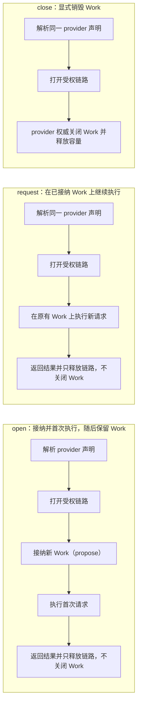

# Teams 本地公开 Work 入口 v1（设计）

状态：设计候选，未实现、未安装、未 review。本文只闭合「公开 CLI → receiver 已授权
network client → 已装 DAGpipe host」缺失的接缝，不改 graph 拓扑，不新增 scheduler、
ledger、fallback 或第二套控制真源。写入范围仅本文件与
`docs/evidence/4b6c377-u4-persistent-design-20261004/**`（r2 的 graph 写入范围见下方修订
说明）。U4 只获准在 U2
`docs/design/teams-local-config-v3.md` 增加 `[workControl]` 控制资源契约附录；该文件其余
内容及其实现仍归 U2 config owner，实际 parser/serializer 由 U2 在 U4 seam 顺序实施时
分配，U4 不与 U2 共享写入。

修订 r2（`4b6c377` / `codex/u4-persistent-design-20261004`）：§11 追加**持久 Work 生命周期**
（同一已接纳 Work 上多次 request + 显式 close），闭合 BB06 容量保持所需公开契约。该修订
的写入范围仅本文件、`docs/design/dagpipe/graphs/work-open.graph.json`、
`docs/design/dagpipe/graphs/work-request.graph.json`、
`docs/design/dagpipe/graphs/work-close.graph.json`（三者新增）与
`docs/evidence/4b6c377-u4-persistent-design-20261004/**`；`agent-work.graph.json` 保持
`agentteams.agent-work@2` 一次性语义不变，`work-query.graph.json` 不受影响（get-only 语义
不变）。§0–§10 的既有一次性 submit/get-only query 语义保持不变，仍为默认与兼容路径。
r2 由 primary 架构纠正驱动：open / 继续 request / close 是三个独立用户意图来源，用**独立
SESE graph 结构**表达（`work-request` 图结构上无 admit 节点、open/request 用
`return-held-work` 取代 `settle-work`），不再用 Operator 内部 route-skip（`admission`/
`closure`）。本修订只写设计，不实现、不安装、不 review、不声明 PASS。

修订 r3（`4b6c377` / `codex/u4-persistent-design-r3-20261004`）修正独立 review 暴露的契约
缺口：open/request 的 `--payload` 改为必填并保留显式 `null`；request/close 显式携带
open 时解析出的原 provider service 绑定（provider、generation、capability/version、
operation）；继续请求使用独立 **PENDING** `teams.continue-provider-work@1` 契约，不再复用
`AdmittedWork` 输入冒充本地接纳；close/continue 的 retained/unknown 责任只能来自 provider
回执或显式传输未确认，不得从本地 propose 状态、日志、business、snapshot 或 receipt 重建。
本修订只做 design ownership 与静态图 admission，不注册 Operator、不声明 SDK/安装 PASS。

修订 r4（`4b6c377` / `codex/u4-persistent-design-r4-20261004`）修正 r3 独立 review 的三个
P1：持久 open/request/close 使用 **capability-level Work**，由 `AgentWorkClient.findProvider`
的显式 typed service selection 只匹配 provider capability declaration 并返回不带 Endpoint
的 `AgentWorkTarget`；one-shot/query 保留既有 Endpoint binding 与固定 operation，两条路径
之间没有 fallback。browser 等声明资源的 capability 每次 open/request 都显式携带完整
`--demands`，省略只对无声明资源的 capability 合法，否则由 owning admission 显式失败。
resource/mainline/behavior contract 统一五张 graph 真源，并把新 graph、Operator、typed
host/runner 与 `AgentWorkClient` 变更标为 **PENDING**。

修订 r5（`4b6c377` / `codex/u4-persistent-design-r5-20261004`）修正 r4 独立 review 的单一 P1：
持久 Work 的观察/恢复 `work query` 之前固定为既有 endpoint selection 且只携 workId/requestId，
在多匹配 provider、open 未固定 target 或 connect 配置随后改变时会按当前目录/配置重新选服务，
无法保证访问原 provider ledger（capability-only provider 更无 endpoint 查询合同）。本修订在同一
设计内补齐持久 query 的显式 binding：CLI、typed IPC 与 QueryIntent 接收并贯穿 open/request
control receipt 的原 provider/generation/capability/version/operation，使用与 Work 匹配的
`serviceSelection: capability`（复用既有 `AgentWorkClient.findProvider` typed selection 与既有
`work-query` graph/runner，无第二个 resolver、ledger、query scheduler 或 fallback）；one-shot
query 保留既有 endpoint selection 与其固定 operation/endpoint policy，两种模式由显式
`serviceSelection` discriminator 区分。查询用**当前受权连接代次** `linkGeneration` 建立新连接，
与原 Work 的 `targetGeneration` 分开记录，不静默覆盖也不把 unknown 提升为已知；request/close
仍保留原 `targetGeneration` 的显式 `STALE_GENERATION` 校验。BB06c/BB06e/BB07 与 maps 同步
补 explicit binding 与两匹配 provider / connect 改变 / capability-only 反例。本修订只做设计，
不声明 runtime/SDK/install PASS。

修订 r6（`4b6c377` / `codex/u4-open-binding-design-20261004`）修正 r5 独立 review 的单一 P1：
持久 open 以前允许缺省 `targetAgentId`，由 receiver 在 dispatch 后选 provider 并把 generation 只在
最终 `work.held.receipt` 回传；一旦 provider 已接纳并执行 initial request 而本地 socket 在最终
回执前断开，CLI 既不知 provider ID 也不知原 generation，query/close 的必填 binding 不可得。
本修订要求**调用方在任何 open provider 副作用之前已持有完整 provider/capability/version/
operation/generation binding**：open 显式携带 CLI 在 dispatch 前固定的 `targetAgentId`/
`targetGeneration`（来自显式参数、已显式声明的 connect `targetAgentId`，或该选定 Agent ID 的
既有 typed 公开 local daemon status projection），不后选 provider、不猜测/补 0 generation、不写
config generation、不新增 status endpoint；`resolve-service` 只校验该精确 provider/generation 的
capability declaration。未确认/失败 `control` 携带该固定 binding 与生成的
`workId`/`requestId`/`executionId`/`attemptId`，故恢复不依赖最终回执或 `open.json`。新增 BB06h
黑盒义务覆盖首次 open 最终回执完全丢失后的 query/close。不新增 durable binding store、
prepare/ACK 协议、第二 resolver、execution ledger、scheduler 或 fallback。本修订只做设计，
不声明 runtime/SDK/install PASS。

## 0. 目标与已证实缺口

目标：用户只用正式 CLI 与 `config.toml`，即可在不启动 Console 的情况下提交一次新的
Work、拿到真实业务结果，并在之后用原 Work/request 身份显式查询该结果；查询不重放业务
副作用。

当前真源已证实的缺口：

> 状态说明：以下四条是 U4 设计准入时的基线缺口，用于固定本设计的动机与范围。它们已由本
> 设计的实现关闭，证据见 `docs/evidence/4b6c377-local-public-work-20261005/`。本节保留为
> 设计时基线，不再描述当前实现状态；当前公开 Work 覆盖以
> `docs/architecture/verification-map.json` 的 `teams-l1-cli` 和
> `docs/architecture/mainline-call-map.json` 的 work-open/request/close 链为准。

- `cli/agentteams.mjs` 的 `work` 命令调用 `runLocalConfiguredWork`，只轮询
  `internal.toml [configuredWork]` 启动回执，不发起新执行。
- `runtime/agent-process.ts` 的 `loadAgentProcessConfig` 仍要求
  `endpoint.connect.payload`，`parseV3Connect` 已不接受该字段，故新 v3 默认配置启动直接
  失败 `endpoint.connect.payload is required`。
- 现有 child IPC 只有 ready/status 回传（`local-supervisor.ts` 的 `waitForReady` 只处理
  `daemon.registered`/`daemon.status`），没有 CLI → 运行中 receiver 的新请求入口。
- D3/U4 候选中的 graph Operator 与 `AgentWorkClient` 公开方法存在，但尚未安装，也没有公开
  caller 把一次 submit/query 接到它们。

本设计选定**唯一**最小实现：launcher 自有的本机 Unix socket 控制入口，转发到 receiver
child IPC，再由 receiver 现有的 `AgentWorkClient` + D3/U4 `runWorkExecution` 执行。
Console 不是数据路径。除该 socket 外不引入新的公开 API 或第二个 daemon。

## 1. 输入依赖与准入条件（不是已接受 commit）

| 依赖 | 身份 | 状态 | 对本设计的约束 |
|---|---|---|---|
| 本候选基线 | branch `codex/u4-public-work-design-20261003`，HEAD `b969e9740704977326c5054fb3afbeab8d523e36`，tree `b6464bbec1804ea0e3e58b0a955a4547586bb267` | 已核实 | graph/CLI/runtime 读取真源 |
| U2 配置候选 | worktree `/Volumes/Intel/playground/agentteams/u2-config-impl-20261003`，HEAD `b969e9740704977326c5054fb3afbeab8d523e36`，tree `7cf779b6f2f6b729ce9eac60377927b974848a1a`，staged 未提交 | **未合并、未安装** | 当前 tree 已有 v3 service-selection `connect`，但 `internal.toml` 尚无 `[workControl]` parser/serializer；本文 §4 的 U4 控制资源附录是未来 U2 owner 实现契约，不是可用接口 |
| D3/U4 runner 候选 | worktree `/Volumes/Intel/playground/agentteams/d3-u4-work-20261003`，HEAD `de099b79f153e6fd220b98d5ee89f4777b7cfb53`，tree `c8ec9ba3d97d922f6c13262009aa71295cd0075c`，untracked | **未合并、未安装** | 提供 `runWorkExecution(client, request)` 与 typed runner protocol；10/10 socket harness 属作者证据，不等于产品安装验收 |

准入条件（全部满足前不得实现产品代码）：

1. 本设计与 U2 `teams-local-config-v3.md` 的 `connect` 契约一致（无 Work 业务字段），且
   §4 的 `[workControl]` 字段/生命周期已由 U2 config owner 纳入同一 internal schema 与
   parser/serializer；当前未实现；
2. D3/U4 `host.ts`/`protocol.ts` 接口与本文 §5 一致，且 U1 pack manifest 形状与本文一致；
3. 本文通过独立设计 review；
4. 上述候选集成到同一候选树后，公开入口才有可执行对象。

任一条件不满足时停在设计/能力确认，不用 mock 成功，不假装 admission 已通过。

## 2. 公开 CLI 合同

`work` 成为带子命令的父命令。提交与查询是两个独立语义，不共享 identity 生成。

```text
agentteams work submit --config <path> --payload <json> [--receiver <agentId>] [--generation <n>]
agentteams work query  --config <path> --work-id <id> --request-id <id> [--receiver <agentId>] [--generation <n>]
agentteams work query  --config <path> --service-selection capability --work-id <id> --request-id <id> --provider <agentId> --provider-generation <n> --capability-id <id> --capability-version <version> --operation <op> [--link-generation <n>] [--receiver <agentId>] [--generation <n>]
```

- `--config`：可选；缺省 `$HOME/.agentteams/config.toml`。
- `--payload`：submit 必填；单个 JSON 值（对象/数组/标量均可），CLI 原样解析为
  `JsonValue`，不做字段白名单、不改写、不裁剪。空字符串、非法 JSON 为 `INVALID_INPUT`。
- `--work-id`/`--request-id`：query 必填；原样透传，不做猜测补全。
- `--receiver`：可选；显式选择 receiver Agent ID。
- `--generation`：可选；显式要求当前 launcher generation，仅用于陈旧调用拒绝。
- `--service-selection <endpoint|capability>`：query 可选，缺省 `endpoint`。`endpoint` 是
  one-shot/既有查询基线，保留既有 endpoint selection 与固定 operation/endpoint policy；
  `capability` 是持久 Work 观察/恢复路径，必须同时提供 `--provider`、`--provider-generation`、
  `--capability-id`、`--capability-version`、`--operation`，缺任一为 `INVALID_INPUT`，不做
  默认推断、不从当前 config/目录重选 provider。
- `--provider <agentId>` / `--provider-generation <n>`：capability query 必填；复用 CLI 在
  首次 open **dispatch 前**已固定的 `providerAgentId` 与原 Work `targetGeneration`（由该
  open/request 的 `control` 回显，CLI 先于回执已持有；见 §11.4），是 Work 的 immutable
  identity，不随目录/配置变化。`--provider-generation` 与 `--generation`（launcher 代次）
  是两个不同真源，不共用一个字段名。
- `--capability-id <id>` / `--capability-version <version>` / `--operation <op>`：capability
  query 必填；复用 CLI 在 dispatch 前已固定的原 capability/version 与该 request 的原
  operation（由 open/request `control` 回显，非新 receipt 才得知）。
- `--link-generation <n>`：capability query 可选；本次查询新连接的**当前受权 provider
  generation**。缺省时由 receiver 在查询时以 capability selection + 原 `--provider` 解析
  provider 当前代次并用于 `open`。它必须与原 `--provider-generation` 分开记录，绝不覆盖或
  改写原 Work generation，也不把 unknown/retained 提升为已知。
- `submit` 不读 `internal.toml` 的 `[configuredWork]`，不读任何启动回执；每次调用生成新的
  `workId`/`requestId`（见 §6）。
- `query` 不携带业务 payload，不生成新 Work/request ID。

stdout 只输出一行 JSON 结果，stderr 输出显式错误；错误时退出码非 0。

成功（submit/query 同形，业务值原样保留、与控制回执物理分离）：

```json
{
  "status": "completed",
  "control": {
    "projectId": "agentteams-local-work",
    "graphId": "agentteams.agent-work",
    "graphVersion": "2",
    "executionId": "<fresh>",
    "attemptId": "<fresh>",
    "workId": "<workId>",
    "requestId": "<requestId>",
    "providerAgentId": "<provider>",
    "targetGeneration": 1,
    "requestState": "succeeded",
    "workClosure": "closed"
  },
  "business": "<original JsonValue>",
  "cleanup": { "channelsOpened": 1, "channelsDisposed": 1 },
  "evidence": {
    "execution": "completed",
    "graphId": "agentteams.agent-work",
    "graphVersion": "2",
    "nodeSchedule": ["resolve-service", "open-link", "admit-work", "request-work", "settle-work"],
    "nodeCompletion": ["resolve-service", "open-link", "admit-work", "request-work", "settle-work"],
    "hostOperations": ["agentWork.findProvider", "agentWork.open", "agentWork.propose", "agentWork.request", "agentWork.close", "agentWork.dispose"]
  }
}
```

query 的 `endpoint` 模式（缺省，one-shot）与 submit 同形，但 `graphId` 为
`agentteams.work-query`、`graphVersion` 为 `1`、`nodeSchedule` 为
`resolve-service/open-link/query-request/return-observation`、`control.observed` 为 `true`，
且 `workId`/`requestId` 是原值；`executionId`/`attemptId` 是新值。query 的 `capability`
模式（持久 Work）额外要求 `control.serviceSelection` 为 `"capability"`，并原样携带
`control.providerAgentId`、`control.targetGeneration`（原 Work generation）、
`control.linkGeneration`（本次受权连接代次）、`control.capabilityId`、
`control.capabilityVersion`、`control.operation`；`business` 仍为 provider ledger 中的原
WorkReply payload。`status` 为 `completed` 表示宿主得到明确观察终态，不表示资源被释放。

失败输出：

```json
{ "status": "failed", "error": { "code": "<CODE>", "message": "<message>" }, "control": { "executionId": "<fresh>", "attemptId": "<fresh>", "workId": "<id>", "requestId": "<id>", "requestState": "unknown", "workClosure": "retained" } }
```

执行后的结果直接保留 D3/U4 `ProjectExecutionReceipt` 的全部字段，包括 `control.error`、
`business`、`cleanup` 与 `evidence`；不投影成一个会丢字段的 CLI 简化结果。上面的失败例
仅说明确实报告 unknown/retained 的情况，不是所有失败的默认状态。未调用 provider 的输入、
编译、runner 校验失败不生成 `requestState` 或 `workClosure`；本地投递后未收到终态时只报告
`deliveryState: unconfirmed` 与已生成的身份，不能推定 provider 已分配资源。之后显式 query
取得 provider 的权威状态。CLI 在 socket 断连的非零退出回执中保留这些身份，便于用户查询。
持久 open/request/close 的未确认/失败 `control` **必须**同时携带 CLI 已固定的原 binding
（`providerAgentId`/`targetGeneration`/`capabilityId`/`capabilityVersion`/`operation`）与
生成的 `workId`/`requestId`/`executionId`/`attemptId`；即使最终 `work.held.receipt` 从未
送达（例如 provider 已接纳并执行 initial request 后本地 socket 断开），调用方仍持有可用
query/close 的完整绑定，不从 open.json、当前 config、日志或 business 重建。
capability query 的失败输出同样保留 `serviceSelection`、原 provider/generation、
capability/version/operation 与 work/request identity，便于用户以原身份重试或显式 close；
不得把原 provider 静默替换为当前目录中的其他匹配 provider，也不得把 `NOT_FOUND`/`FORBIDDEN`
投影成成功或资源释放。

本地错误码包括（上游 provider/SDK 原错误码及错误链同样保留，不归一化为这些本地码）：`INVALID_INPUT`、
`LOCAL_CONTROL_UNAVAILABLE`、`STALE_GENERATION`、`RECEIVER_NOT_FOUND`、`NOT_AUTHORIZED`、
`DAGPIPE_RUNNER_MISSING`、`UNSUPPORTED_PLATFORM`、`GRAPH_HASH_MISMATCH`、
`RUNNER_HASH_MISMATCH`、`EXECUTION_FAILED`、`HOST_PROTOCOL`、`RESULT_UNKNOWN`。

## 3. 配置：service 选择 vs 启动 Work 兼容/移除

- `[agents.<receiver>.connect]` 继续只描述 service 选择：`targetAgentId`、`capabilityId`、
  `capabilityVersion`、`operation`、`demands`。它是 target/service 意图，不是一次执行的
  identity，也不是业务 payload。
- `workId`/`requestId`/`payload` **移除**出用户配置。Work 输入归公开请求路径（U4），
  每次 `work submit` 携带。
- `endpoint.connect.payload is required` 及其 receiver 连接解析一并移除；receiver 只要求
  存在 `connect`（service 选择），不要求业务字段。
- 启动不再执行配置业务：删除 `runConfiguredWork` 启动编排、`internal.toml [configuredWork]`
  写入，以及 CLI 读 `configuredWork` 冒充新执行的整条链。`start` 只发现/连接 service 并
  发布 status；没有任何自动 replay、startup receipt 或旧链 fallback。
- `internal.toml` 仍只保存派生运行事实（launcher、daemon、control socket 及其对既有
  launcher generation/startToken 的 typed ref），不复制 generation/token 真源，不保存
  Work 业务结果真源；durable 结果仍归 provider ledger。

receiver 选择规则（无隐式多路）：

1. 显式 `--receiver`：匹配该 enabled agent 的声明 `agentId`。
2. 缺省：恰好一个 enabled receiver/hybrid 且带 `connect` 时选它。
3. 缺省且存在多个候选：显式失败 `RECEIVER_NOT_FOUND`（消息要求 `--receiver`），不任选、
   不轮询、不 fallback。

## 4. 本地控制接缝：唯一缺失 seam 与 typed IPC

选定的唯一缺失 seam：launcher 在启动时创建**本机 Unix domain socket**。socket 相对
`internal.toml` 所在目录的固定路径为 `.internal/work-control.sock`；launcher 生成并只写
以下 typed 扩展到 U2 唯一 internal owner：

```toml
[workControl]
socketPath = "<absolute path resolved from internal.toml dir>/.internal/work-control.sock"
launcherGeneration = 4
launcherStartToken = "<equal to [launcher].startToken>"
```

字段类型固定为 `socketPath: string`、`launcherGeneration: integer`、
`launcherStartToken: string`；无 token 副本。`[launcher].generation` 与
`[launcher].startToken` 仍是唯一生命周期真源，`[workControl]` 的两个字段必须是其启动时
exact ref；不符即 `HOST_PROTOCOL`/`STALE_GENERATION` 显式失败。U2 config owner 的
`runtime/local-config.ts` 扩展 `LocalInternalConfig`、closed parser 与 serializer，
提供同内部锁的 `writeLocalInternalWorkControl` / `readLocalInternalWorkControl` 和
cleanup primitive；U4 launcher 调用该端口，不直接解析/改写 TOML。所有写必须在
`withLocalInternalConfigLock` 内 read-modify-write，保留现有一切
`configRuntime/launcher/daemon/consoleRuntime` 字段。

CLI 连接 socket 后，launcher 校验 `socketPath`、`launcherGeneration` 与
`launcherStartToken` 后经现有 child IPC 转发给 receiver；receiver 用自身已注册身份执行。
socket 文件 `0600`，目录 `0700`，用户不可配置、不编辑。启动顺序固定为：launcher 先取
`.launcher.lock`，再取 internal lock 写 `[workControl]`；socket `listen` 成功且回读
exact ref 后才发布 `running` 并开放 admission/CLI submit；任一失败关闭 listener、移除
部分 `[workControl]` 项并进入现有失败清理，且此窗口内不得接受 Work。`stop` 在任何
terminal/error path 上先停止 admission、关闭 socket，再在同一 internal lock 内删除
`[workControl]`，不删除 `[launcher]` ownership 或任何其他 section。
不新增公开网络 API、不让 Console 转发、不让 CLI 用 Agent 身份再次登录目录或抢占 generation。

传输边界（封闭 typed union，一次连接一次请求）：

```text
CLI → launcher:  { "kind": "work.submit", "requestId": "<local-correlation>", "control": { "receiverAgentId": "<id>", "expectedLauncherGeneration": <n>, "startToken": "<token>", "executionId": "<fresh>", "attemptId": "<fresh>", "workId": "<fresh>", "requestId": "<fresh>" }, "business": "<JsonValue>" }
CLI → launcher:  { "kind": "work.query",  "requestId": "<local-correlation>", "control": { "serviceSelection": "endpoint", "receiverAgentId": "<id>", "expectedLauncherGeneration": <n>, "startToken": "<token>", "executionId": "<fresh>", "attemptId": "<fresh>", "workId": "<original>", "requestId": "<original>" } }
CLI → launcher:  { "kind": "work.query",  "requestId": "<local-correlation>", "control": { "serviceSelection": "capability", "receiverAgentId": "<id>", "expectedLauncherGeneration": <n>, "startToken": "<token>", "executionId": "<fresh>", "attemptId": "<fresh>", "workId": "<original>", "requestId": "<original>", "targetAgentId": "<original>", "targetGeneration": <original>, "capabilityId": "<original>", "capabilityVersion": "<original>", "operation": "<original request operation>", "linkGeneration"?: <current> } }
launcher → CLI:  { "kind": "work.result", "requestId": "<local-correlation>", "receipt": "<ProjectExecutionReceipt>" }
launcher → CLI:  { "kind": "work.error",  "requestId": "<local-correlation>", "error": { "code": "<CODE>", "message": "<message>" } }
```

launcher → receiver child 沿用现有 Node IPC channel，新增同一 typed union（带
`localCorrelation`、`receiverAgentId`、`expectedLauncherGeneration`、`expectedAgentGeneration`），
receiver 回 `work.result`/`work.error`。未知 kind、字段缺失、correlation 不匹配均为
`HOST_PROTOCOL` 显式错误并只结束该次请求，不静默跳过、不当作成功。
`serviceSelection: "capability"` 的 query 帧只由 launcher 校验并转发，不解释、不重选 provider；
receiver 以该帧的原 provider/generation/capability/version/operation 构造 QueryIntent，
`targetGeneration` 与原 `linkGeneration` 分开贯穿（见 §11.4）。

归属与校验边界：

- launcher 拥有 socket 生命周期及 `[workControl]` 的写入/清理由 U4 caller 发起；U2
  `runtime/local-config.ts` 是 `internal.toml` 的唯一 parser/serializer/lock owner。
  `[launcher].generation/startToken` 是生命周期与 start-ownership 唯一真源，
  `[workControl]` 只保存其 exact ref。
- receiver 拥有 Work 执行与 `AgentWorkClient` 调用；它按自身注册身份（`accountId/scopeId/
  agentId`）发起，不从 payload/metadata 重建控制状态。
- provider 拥有 admission/policy/resource ledger。receiver 的 `allowedConsumers` 只是
  预过滤，不是 grant；最终授权与资源分配仍在 provider。
- generation 校验：launcher 比对 `expectedLauncherGeneration` 与持久化 launcher generation；
  receiver 比对 `expectedAgentGeneration` 与自身 network generation。两者都来自各自运行
  投影，不从日志/snapshot/payload 重建。陈旧代次拒绝 `STALE_GENERATION`。
- auth 校验：start token 沿用 launcher 启动时生成的 `[launcher].startToken`，不产生第二份
  `[workControl]` token；CLI 从 `internal.toml` 读取该 ref 与 matching generation 后
  提交，任一不符为 `NOT_AUTHORIZED` 或 `STALE_GENERATION`。socket 目录/文件权限限当前用户。
- 控制事实只走该 typed control resource 与 error chain，不写入业务 payload 或 metadata。

## 5. 执行接线：已装 runner + 精确 graph + 已注册 SDK

receiver 内的唯一执行入口为 `executeProjectWork(controlFrame)`，其返回
`ProjectExecutionReceipt`，并调用 D3/U4 `runWorkExecution(client, request)`：

- `graphPath`：submit 用 `agentteams.agent-work@2`，query 用 `agentteams.work-query@1`；
  §11 起 open/request/close 分别用 `agentteams.work-open@1`、`agentteams.work-request@1`、
  `agentteams.work-close@1`；全部取自安装 pack 内 `runtime/dagpipe/graphs/`，不读源码目录、
  不查 `process.cwd()`。
- `runnerPath`：安装 pack 内 `runtime/dagpipe/bin/darwin-arm64/agentteams-dagpipe-runner`，
  由 pack root 派生，`spawn` 直接执行，不经 shell、不查 `PATH`。
- 执行前核对 pack `runtime/dagpipe/manifest.json`：runner 文件 SHA-256 == `runner.sha256`；
  两 graph 文件 SHA-256 == 对应 `graphs[].sha256`。任一不符在**任何业务副作用前**显式失败
  （`RUNNER_HASH_MISMATCH`/`GRAPH_HASH_MISMATCH`）；缺 runner 或架构不符
  `DAGPIPE_RUNNER_MISSING`/`UNSUPPORTED_PLATFORM`。
- SDK 注册边界：`dagpipe sdk path` 只在构建期由 `runtime/dagpipe/build.mjs` 使用，把
  `pipeline_runtime@0.1.1` 的身份与聚合输入 hash 冻结进 manifest/build receipt。运行期
  **不**读取 `$HOME/.local/share/dagpipe/sdk`、不依赖源码 worktree。运行期只需已装 runner
  binary + 两 graph + manifest；runner 内的 Operator registry 由该 binary 自带。
- `projectId` 固定 `agentteams-local-work`；`executionId`/`attemptId` 每次调用新生成
  （§6）。`intent.control` 携带 receiver/provider/capability/operation/work/request/policy
  facts；业务 `JsonValue` 只作为 `intent.business` 原样交给 runner。
- host 只按 runner 给定的 node 顺序 dispatch 固定 typed port（`findProvider/open/propose/
  request/get/close/dispose`），不自行排序、不重跑 graph、不复制 provider 状态。

## 6. submit vs query 事实

| 事实 | `work submit` | `work query` |
|---|---|---|
| graph | `agentteams.agent-work@2`（一次性，本修订不变；§11 open/request 另见 `work-open@1`/`work-request@1`） | `agentteams.work-query@1` |
| serviceSelection | `endpoint`（既有一次性基线） | 缺省 `endpoint`（one-shot 基线）；持久 Work 观察用显式 `capability`，必须携原 provider/generation/capability/version/operation |
| workId/requestId | 每次调用**新生成** | **保留原值** |
| executionId/attemptId | 每次调用新生成 | 每次调用新生成（新 B8 execution/attempt） |
| 业务 payload | 用户输入，原样 | 不携带 |
| 对 provider 的 effect | propose + request（真实执行） | 仅 get（观察） |
| 重放 | 不适用 | **禁止** propose/request 重放 |
| 结果 | 真实业务结果 + 收尾 | 原 provider 回执，不新增业务执行 |
| Console | 不需要 | 不需要 |

`workId`/`requestId` 由 CLI 在本地入口生成（UUIDv4 或等价随机、唯一、非派生），经 typed
control 帧传递，不经配置、不从启动回执读取。

## 7. unknown / failed / retained 与公开结果保真

- provider 拥有 policy 与资源 ledger；receiver/CLI 不持有第二份资源账本，不从 journal/
  snapshot/日志重建控制状态。
- `unknown`（含 `RESULT_UNKNOWN`）保留 provider 资源责任：`requestState: "unknown"`、
  `workClosure: "retained"`，携带明确 owner 与恢复动作（后续显式 query）。不自动重发、
  不假释放、不把断线当完成。
- `failed`：仅当 provider 确认 failed/cancelled 才 close；close 失败保留业务结果与
  `cleanupError`，`status` 变 `failed`，不写成完整成功。
- 公开结果无损：`business` 为原始 `JsonValue`，不做截断/改写/字段裁剪；control receipt 与
  business 物理分离；execution journal 只作执行证据，业务决策不得从日志重建。

## 8. launcher / daemon 清理语义

- CLI 连接断开**不**取消 provider Work：请求已提交后 receiver 继续持有，结果归 provider
  ledger；之后用原 identity 显式 query 观察。不自动 cancel/retry。
- launcher `stop` 关闭 control socket、经 U2 `writeLocalInternalWorkControl(undefined)`
  在同一 internal lock 内删除 `[workControl]`、停止 receiver child；不删除 provider
  ledger 中的业务结果。仅移除本轮自有资源。
- receiver child 退出时 `consumerWork.dispose()` 释放连接；未终态 Work 由 provider 保留。
- provider 端未终态 Work 在 daemon stop 时按现有 `WorkHost`/ledger 语义处理；进程消失不
  等于完成，也不等于释放。
- 缺失 runner/架构不符/hash 不符时，除显式错误回执外不产生业务副作用，也不遗留子进程；
  失败清理必须可核验（无残留 runner 进程、无未关闭 channel）。

## 9. 未来 caller 与测试范围（待实现，非现有 PASS）

未来实现的最小 caller/owner 与测试文件（写作用途，最终由 Primary 与对应 unit owner 定稿）：

| 范围 | 未来文件 | 断言 |
|---|---|---|
| CLI 语法/JSON/错误 | `cli/agentteams.mjs`、`cli/agentteams.spec.ts` | `work submit`/`work query` 解析、capability query 原 provider/capability binding 与 `--link-generation`、stdout JSON 形状、显式错误码 |
| launcher socket 与 typed frame | U4：`runtime/local-work-control.ts`、`runtime/local-work-control.spec.ts`、`runtime/local-supervisor.ts`、`runtime/local-process.ts` 及其 tests。U2 顺序实施：`runtime/local-config.ts` 的 `[workControl]` schema/parser/serializer/locked-write primitive 与 `runtime/local-config.spec.ts` | token/generation/receiver 校验、correlation、未知 kind、断连不取消；launcher 实际创建/转发/关闭；U2 测试先证明 preserve/reload/start/stop/unclean-exit/stale-ref |
| receiver 执行接线 | `runtime/agent-process.ts`（去 configuredWork）、`runtime/agent-process.spec.ts` | 提交新 identity、query 不重放、runner/graph hash 校验 |
| runner 执行 | D3/U4 `runtime/dagpipe/host.ts`、`runtime/dagpipe-work.spec.ts` | 精确 graph、identity 隔离、host 不重排 |

未来黑盒命令序列（安装后的正式 CLI；本轮**未执行**，不是 PASS）：

```sh
# 前置：独立临时 HOME + 独立 npm prefix；config.toml 只含 provider/receiver/connect；
# provider searchRoot 下创建 A/B 两个不同标记 fixture。
export HOME="$test_home"; CLI="$prefix/node_modules/.bin/agentteams"
"$CLI" start

# BB04：submit A、submit B，再显式 query 原请求
"$CLI" work submit --config "$cfg" --payload '{"query":"marker-A"}' > "$ev/submit-a.json"
"$CLI" work submit --config "$cfg" --payload '{"query":"marker-B"}' > "$ev/submit-b.json"
work_a=$(node -e 'console.log(require(process.argv[1]).control.workId)' "$ev/submit-a.json")
req_a=$(node -e 'console.log(require(process.argv[1]).control.requestId)' "$ev/submit-a.json")
"$CLI" work query --config "$cfg" --work-id "$work_a" --request-id "$req_a" > "$ev/query-a.json"
# 断言：A/B workId/requestId 互异；submit-a 与 submit-b business 分别命中对应 fixture；
# query-a business == submit-a business，control.workId/requestId 原值，executionId/attemptId 新值；
# query 未新增 provider 执行。

# BB05：未授权 consumer / 未声明 operation / 旧 generation / 错误 target
"$CLI" work submit --config "$cfg_bad_op" --payload '{"query":"x"}'; test $? -ne 0
# 断言：各自显式错误、无新增 provider 执行/资源副作用、不表现为空结果或成功。

# BB07：提交后断开本地 socket 或停止自有 provider，再经新授权连接查询
# one-shot 基线（endpoint selection，保持既有形式，无 provider binding）：
"$CLI" work query --config "$cfg" --work-id "$work_a" --request-id "$req_a" > "$ev/query-after-disconnect.json"
# 持久 Work 恢复观察必须显式绑定原 provider/capability（capability selection）：
"$CLI" work query --config "$cfg" --service-selection capability --work-id "$work_p" --request-id "$req_p" \
  --provider "$prov_p" --provider-generation "$gen_p" \
  --capability-id "$cap_p" --capability-version "$ver_p" --operation "$op_p" > "$ev/query-persistent-after-disconnect.json"
# 断言：failed/unknown 与事实一致；get 不调用 propose/request、不新增业务执行；
# unknown 不自动重发/假释放；retained owner/状态/恢复动作明确；确认销毁后有最终回执；
# 持久 query 到达原 provider ledger（两匹配 provider / connect 改变 / capability-only 亦如此），
# 不按当前 config 重选 provider，linkGeneration 与原 targetGeneration 分开。
# 首次 open 回执完全丢失（BB06h）时，CLI 未确认回执已含 dispatch 前固定的原 binding，故本查询仍可达。

# BB11：安装 CLI 真实提交与查询，再以隔离候选做 compile 负例
"$CLI" work submit --config "$cfg" --payload '{"query":"marker-A"}' > "$ev/bb11-submit.json"
"$CLI" work query --config "$cfg" --work-id "$work_a" --request-id "$req_a" > "$ev/bb11-query.json"
# 断言：submit/query 分别关联精确 graph、SDK、registry、CompiledGraph 与 journal；
# query 无新增业务执行；未注册 Operator / ARC 契约错误 / 缺 effects 的 compile 显式失败且无副作用；
# Object 字段约束由 typed boundary 验证，不冒充 SDK Record schema。
```

上述命令的 expected 结果以 §2 的 JSON 形状与 §6 的 identity 事实为准；黑盒 receipt 必须
绑定 candidate commit/tree、安装包版本/hash、runner/graph/manifest 指纹、配置 revision、
公开请求与结果、实际副作用、失败终点和资源收尾。

## 10. 保留的依赖义务与集成条件

- U2、D3/U4 候选均**未合并、未安装**；本文不宣称 admission 成功，不修改其候选树。
- 实现前必须把本文接缝与 U2 `connect`、D3/U4 `host.ts`/`protocol.ts`、U1 pack manifest
  冻结到同一候选树，再运行 §9 的未来测试与项目契约要求的适用验证。
- 已有 B2 `agent-work.graph.json@2` 与 B8 `work-query.graph.json@1` 保持拓扑真源，本修订
  不改动二者。§11 的持久 Work 修订新增三张独立 SESE graph：`work-open@1`、
  `work-request@1`、`work-close@1`（见 §11.5），并新增三个 Operator 绑定义务。本文只声明
  公开 caller 与 typed IPC 边界，不新增第二套调度/账本。

## 11. 持久 Work 生命周期扩展（同一 Work 多请求 + 显式 close）

状态：设计候选，未实现、未安装、未 review。本节用**独立 graph 结构**表达 open / 继续
request / close 三种不同用户意图，不把分支或 skip 藏进 Operator 内部。复用既有
`AgentWorkClient` 公开端口；新增三个 Operator 绑定（`teams.return-held-work`、
`teams.continue-provider-work`、`teams.close-provider-work`）标注为 **required /
unimplemented**，不是现有已注册能力。
不新增 scheduler、不新增 receiver 账本、不新增隐藏 route 表、不做 fallback、不自动 replay、
不把日志当控制真源。provider 仍是 admission / policy / 资源账本的唯一 owner。

### 11.1 已证实缺口（当前 API 限制）

- B2 现有 `agentteams.agent-work@2` 的 `settle-work` 节点在 host 层映射到
  `agentWork.close`+`agentWork.dispose`（D3 候选 `runtime/dagpipe/host.ts`
  `OPERATOR_OPERATIONS['teams.settle-provider-work']`），即**每次 submit 必 close**；没有
  「保留已接纳 Work」的路径，无法支撑 BB06 的容量保持。
- `AgentWorkChannel` 现有公开方法只有 `propose`/`request`/`get`/`close`/`dispose`
  （`runtime/agent-work-client.ts`）。`request` 只接受
  `workId/requestId/operation/demands/payload`，不含 provider 身份/代次绑定。
- `WorkHost`（`agent-host/work-host.ts`）已有 `propose/request/get/close`，且 `close` 已
  委派 `executor.destroy` 并等待 `confirmWorkDestroyed`；provider 侧**无需新增**
  admission 或账本能力，缺的是公开入口如何表达「继续」与「显式 close」。
- CLI / launcher socket / receiver IPC 目前只有一次性 `work.submit` 与 `work.query`
  两类帧（§2、§4），没有 open/continue/close 帧。
- D3 host 现有 Operator registry **没有**「只 dispose 不 close」的收尾 Operator、没有
  独立 continuation Operator（现有 `teams.request-provider-work@1` 的公开契约输入是
  `AdmittedWork`，但 `work-request` 结构上没有 admit 节点），也没有独立的
  provider-authoritative close Operator（close 现被包在 `teams.settle-provider-work` 内）。

结论：缺口是**公开控制语义 + 三个新 Operator 绑定**，不是 provider 执行能力。最小扩展 =
三张独立 SESE graph（open / request / close），复用既有 `resolve/open/admit/request`
Operator 与既有 host 端口；新增 `teams.return-held-work@1`、
`teams.continue-provider-work@1`、`teams.close-provider-work@1`（全部 **required /
unimplemented**）。

### 11.2 中文语义 DAG（成功路径，各自 SESE，无回边，无图内分支）



技术 graph id 与节点 id（与上方语义一一对应）：

- `agentteams.work-open@1`：`resolve-service → open-link → admit-work → request-work →
  return-held-work`
- `agentteams.work-request@1`：`resolve-service → open-link → continue-work →
  return-held-work`（结构上**无** `admit-work` 节点）
- `agentteams.work-close@1`：`resolve-service → open-link → close-work`

「继续」不是运行时在 `admit-work` 内部跳过 propose：`work-request` 图**没有** `admit-work`
节点，且使用独立 `teams.continue-provider-work@1`，其输入是当前已验证 link + 原
`workId`，不携带本地 `accepted` 自证。「保留」也不是运行时在 `settle-work` 内部跳过
close：open/request 图用 `return-held-work` 取代 `settle-work`；close 用独立
`close-work` 节点。分支/跳过语义全部由 graph 结构表达，Operator 边界之外无隐藏 route
表，Operator 内部无 skip 分支。

生命周期状态机（Work 级）：`admitted → active(holding Work-scoped allocation) → closed`。
request 级：`running → succeeded | failed | cancelled | unknown`。`close` 仅在 provider
确认 `confirmWorkDestroyed` 后把 Work 置 `closed` 并释放 Work-scoped 容量；`unknown` /
`running` / `cancel_requested` 时 provider 的 close 显式拒绝（`RESULT_UNKNOWN`），保留责任，
不做假释放。三张子图各自 SESE，无跨节点回边；重试/继续是**新 execution/attempt**。

### 11.3 角色、事件、契约与 owner

| 角色 | 事件（生产 → 消费） | 契约与守卫 | 唯一 owner |
|---|---|---|---|
| CLI（用户入口） | `work open` / `work request` / `work close` / 既有 `submit`/`query` | 生成/保留 workId 与 requestId；每次调用新 execution/attempt；**open 在 dispatch 前固定完整 provider/generation/capability/version/initial operation binding**（显式参数或已显式声明/已投影的 typed 输入），binding 不完整即失败且无副作用；request/close 显式携带同一原绑定；open operation 只是初始 operation，后续 request 各自显式 operation，close 使用 open 捕获的 operation | U4 caller（`cli/agentteams.mjs`） |
| launcher | socket 帧 → child IPC 转发 | 校验 socket ownership/launcher generation/startToken；不解释业务 | U4（`runtime/local-work-control.ts`、`runtime/local-supervisor.ts`） |
| receiver | 执行入口 `executeProjectWork` | 绑定自身已注册身份；按 graph 调 host；不持资源账本；持久图在 Endpoint admission 之前只按 CLI 已固定的精确 provider/generation 校验其 capability declaration，不后选 provider、不改绑其他 epoch，也不从 receipt/日志重建 grant | U4（`runtime/agent-process.ts`、`runtime/dagpipe/host.ts`） |
| provider | `propose`/`request`/`get`/`close` | 独占 admission/policy/容量/ledger；`close` 委派 `executor.destroy`；按 durable ledger 校验原 Work/consumer 归属 | agent（`agent-host/work-host.ts`、`agent/work-resource.ts`） |
| SDK runner | 解析 graph、注册 Operator、调度节点 | 节点顺序由 SDK Runtime 按 graph 决定；不做业务决策、不 skip 节点 | D3/U4（`runtime/dagpipe/runner/src/bin/runner.rs`） |

控制事实只走 typed control 帧与 error chain：`workId`、`providerAgentId`、
`targetGeneration`、`capabilityId`、`capabilityVersion`、`operation`、`demands` 等
**不得**写入业务 payload、`metadata`、日志或 snapshot。业务 `JsonValue` 只作为
`intent.business` 原样交给 runner，原样返回；open/request 的 `business` 必须存在，显式
`null` 是合法原值，字段缺失才是 `INVALID_INPUT`。receiver **不**从 provider 回执或日志
重建 grant/admission 真源；授权与容量只由 provider ledger 决定。

持久图与持久 query（capability 模式）的 `serviceSelection` 固定为 `capability`，该选择
发生在 `AgentWorkClient.findProvider` 内、任何 Endpoint admission 之前。capability selection
只读取 `peer.declaration.capabilities`，不读取 `peer.endpoints`；它不会在 Endpoint
selection 失败后切换，也不会把已选 Endpoint 剥掉。one-shot `agent-work@2` 与 one-shot
query 保持 `endpoint` selection 和其固定 operation，原 Endpoint admission/policy 语义不变。

### 11.4 最小 typed 控制扩展（CLI → launcher socket → receiver → runner）

CLI 保留既有 `work submit`（一次性）与 `work query`（get-only），新增三个子命令：

```text
agentteams work open    --config <path> --operation <op> [--demands <json>] --payload <json> [--provider <agentId>] [--provider-generation <n>] [--capability-id <id>] [--capability-version <version>] [--receiver <agentId>] [--generation <n>]
agentteams work request --config <path> --work-id <id> --provider <agentId> --provider-generation <n> --capability-id <id> --capability-version <version> --operation <op> [--demands <json>] --payload <json> [--receiver <agentId>] [--generation <n>]
agentteams work close   --config <path> --work-id <id> --provider <agentId> --provider-generation <n> --capability-id <id> --capability-version <version> --operation <op> [--receiver <agentId>] [--generation <n>]
```

以下 CLI 签名、typed frame 字段与 receipt 字段是 **PENDING implementation contract**；
当前 `cli/agentteams.mjs` 只有一次性 submit/query，不能把它们写成已存在能力。

- `--payload <json>`：**open/request 必填**，是单个原样 `JsonValue`（对象、数组、标量或
  显式 `null` 均可）。CLI 在建立 socket/发送帧/任何副作用前区分 absent 与显式 `null`：
  absent 是 `INVALID_INPUT`，不得注入 `{}`、`null` 或其他默认值；显式 `null` 必须作为
  `business: null` 保留到 runner。close 没有业务 payload，typed 帧不携带 `business`。
- `--demands <json>`：open/request 可选，但**不做资源默认值**。省略只对当前 selected
  capability 不声明任何资源时合法；该唯一情形使用空 demand 集 `[]`。只要 capability
  声明了任一资源，省略就必须由 owning admission（`WorkHost.request`）以显式
  `INVALID_INPUT`（缺少该资源 demand）拒绝，且在 allocation/execution 前失败。browser
  capability 同时声明 `browser-context` 与 `browser-slot`，因此每个 browser open/request
  都必须显式携带两者；close 没有 request，也不携带 demands。
- `--generation <n>`（§2 既有语义）：可选，期望的 **launcher generation**，仅用于陈旧
  launcher 调用拒绝；语义不变，新子命令沿用。
- provider target generation（本修订新增）：open/request/close 的控制帧都**必须**携带。
  request/close 必填 `--provider-generation <n>`；open 可由该显式参数或下述精确 Agent 的
  typed status projection 固定。它与 launcher generation 是不同真源，不共用字段名。
- `--provider <agentId>` / `--provider-generation <n>`（open，**dispatch 前固定 binding**）：
  open 必须在任何 provider 副作用之前确定完整 binding。provider Agent ID 来自显式
  `--provider` 或已显式声明的 `[agents.<receiver>.connect].targetAgentId`；generation 来自
  显式 `--provider-generation` 或该选定 Agent ID 的既有 typed 公开 local daemon status
  projection（`LocalDaemonEndpointProjection.generation`，由既有 `runtime/local-process.ts`
  status owner 投影，不新增 status endpoint）。任一来源都缺时 CLI 在建立 socket/发送帧前以
  `INVALID_INPUT` 失败，不隐式选择 provider、不猜测/补 0 generation、不把 generation 写进
  config、不依赖最终回执。CLI 把已确定的 provider/generation 与 capability/version/initial
  operation 连同本地生成的 `workId`/`requestId`/`executionId`/`attemptId` 一起放进
  `work.open` 控制帧。
- `--capability-id <id>` / `--capability-version <version>`：request/close **必须**显式携带
  open 结果中同一 Work 的原 capability binding。`--operation` 对 open 是 initial
  operation，对 request 是本次 operation，对 close 是 open 捕获的原 operation；它不是
  Work 的 immutable binding。open 的 capability/version 与 initial operation 来自显式字段
  或已接受的 connect 意图（`[agents.<receiver>.connect]`），CLI 在 dispatch 前已持有，绝不
  来自未来的 receipt；receiver 只按该精确 provider/generation 校验其 capability
  declaration。open 结果回显同一 `providerAgentId`、`targetGeneration`、`capabilityId`、
  `capabilityVersion`、`operation`（初始 operation），用户后续 request/close 原样复用前四项，
  request 另带本次 operation，close 带 open operation。Work/consumer/provider/generation/
  capability/version 在 Work 生命周期内 immutable；operation 只在单个 request 内固定。
  禁止从旧 receipt、日志、business、snapshot 或“当前 config 应该没变”的假设补字段。
- **PENDING** `AgentWorkClient` typed selection：`runtime/agent-work-client.ts` 的
  `findProvider` 增加显式 discriminated `serviceSelection`。持久图 intents/ARCs 与持久
  query 传 `{ kind: 'capability' }`，只匹配 `peer.declaration.capabilities` 的
  capabilityId/version/operation，并返回不带 `endpoint` 的 `AgentWorkTarget`；one-shot
  submit 与 one-shot query 传 `{ kind: 'endpoint' }`，保留既有 Endpoint binding 与固定
  operation。该选择在 Endpoint admission 之前完成；两种模式不互相 fallback，不新增第二个
  resolver/client。
- `work open`：新 `workId`/`requestId`；CLI 在 dispatch 前固定 provider Agent ID、
  provider generation、capability/version 与 initial operation（显式参数或已显式声明/已投影的
  typed 输入，见上），`resolve-service` 只按该精确 provider/generation 校验其 capability
  declaration，**不后选 provider、不改绑其他 epoch**；执行 `work-open` 图
  （propose → request → 保留）。binding 不完整时 CLI 在建立 socket 前失败。
- `work request`：**必须**携带原 `workId` 与原 capability binding，新
  `requestId`/execution/attempt；执行 `work-request` 图（无 propose、无 admit 节点）。
- `work close`：无业务 payload、无 request、无 demands；仍必须携带原 capability binding
  与 open operation，执行独立 `work-close` 图。
- `work query`（持久 Work 观察/恢复）：保留既有 `work query`（one-shot，endpoint selection
  基线，不新增 binding），并新增 capability 模式。capability 模式**必须**显式携带原
  `workId`/`requestId`、原 `--provider`/`--provider-generation`/`--capability-id`/
  `--capability-version` 与本次观察的 `--operation`（取自原 open/request control receipt），
  由显式 `--service-selection capability` 区分；它复用既有 `work-query` graph 与 runner，
  只把 `resolve-service` 的 `serviceSelection` 从 `endpoint` 换成 `capability`，不新增第二个
  query graph、resolver、ledger 或 scheduler。capability query 绝不按当前
  `[agents.<receiver>.connect]` 或目录重新选 provider；provider 缺失/声明变化显式失败，
  不 fallback 到其他匹配 provider。

typed 帧扩展（封闭 union，一次连接一次请求；未列字段视为 `HOST_PROTOCOL`）：

```text
CLI → launcher: { "kind": "work.open",    "requestId": "<corr>", "control": { "receiverAgentId", "expectedLauncherGeneration", "startToken", "executionId", "attemptId", "workId": "<fresh>", "requestId": "<fresh>", "targetAgentId": "<fixed-before-dispatch>", "targetGeneration": <fixed-before-dispatch>, "capabilityId", "capabilityVersion", "operation", "demands", "policyRevision"? }, "business": "<JsonValue>" }
CLI → launcher: { "kind": "work.request", "requestId": "<corr>", "control": { "receiverAgentId", "expectedLauncherGeneration", "startToken", "executionId", "attemptId", "workId": "<original>", "requestId": "<fresh>", "targetAgentId": "<original>", "targetGeneration": <original>, "capabilityId": "<original>", "capabilityVersion": "<original>", "operation", "demands" }, "business": "<JsonValue>" }
CLI → launcher: { "kind": "work.close",   "requestId": "<corr>", "control": { "receiverAgentId", "expectedLauncherGeneration", "startToken", "executionId", "attemptId", "workId": "<original>", "targetAgentId": "<original>", "targetGeneration": <original>, "capabilityId": "<original>", "capabilityVersion": "<original>", "operation": "<captured open operation>" } }
CLI → launcher: { "kind": "work.query",   "requestId": "<corr>", "control": { "serviceSelection": "capability", "receiverAgentId", "expectedLauncherGeneration", "startToken", "executionId": "<fresh>", "attemptId": "<fresh>", "workId": "<original>", "requestId": "<original>", "targetAgentId": "<original>", "targetGeneration": <original>, "capabilityId": "<original>", "capabilityVersion": "<original>", "operation": "<original request operation>", "linkGeneration"?: <current> } }
launcher → CLI: { "kind": "work.result", "requestId": "<corr>", "receipt": "<ProjectExecutionReceipt>" }
launcher → CLI: { "kind": "work.error",  "requestId": "<corr>", "error": { "code", "message" } }
```

`expectedLauncherGeneration` 校验 launcher 代次；`targetGeneration` 校验 provider 代次。
**open 也显式携带 `targetAgentId`/`targetGeneration`**：两者由 CLI 在 dispatch 前从显式
参数或已显式声明的 connect / 既有 typed status projection 固定（见 §11.4），receiver 不再
在 open 时后选 provider 或记录新代次。receiver 在副作用前解析**精确** provider 声明：持久
open/request/close 与持久 query 都以
`serviceSelection: capability` 只匹配该 `targetAgentId` 的 capability declaration；当前 provider 必须同时声明
控制帧携带的 `capabilityId`/`capabilityVersion`/本次 `operation`，缺声明即显式失败
（`TARGET_CONTRACT_CHANGED`/`UNSUPPORTED_OPERATION`），不静默改绑、不 fallback、不读取旧
receipt 补字段。**open/request/close** 另要求当前 generation 必须等于原 `targetGeneration`，
不等即 `STALE_GENERATION`；**query capability 帧例外**：它用当前受权 `linkGeneration` 建立
只读连接，原 `targetGeneration` 只作 Work identity，不要求等于当前代次（见下方持久 query
段落）。capability selection 不进入 Endpoint admission，也不在 Endpoint failure 后重试；
provider ledger 再权威校验原 `workId` 与 consumer 归属，不匹配即
`NOT_FOUND`/`FORBIDDEN`。**不使用** `admission`/`closure` 之类的 route-skip 控制字段：
「继续」由图选择（无 admit 节点）表达，「保留」由图选择（`return-held-work`）表达。

以下均为同一实现单元的 **PENDING typed host/runner 契约**：open/request/close 的
`targetAgentId`/`targetGeneration` 必须贯穿 `service.resolved`、`link.verified` 以及
admit/continue/close Operator 输入，不能在预校验后丢弃。open 的 target 已由 CLI 在
dispatch 前固定，`resolve-service` 只校验该精确 provider 声明与代次；request/close 在
resolve 后必须比较原代次，并以原 provider/generation/capability/version 和
`serviceSelection: capability` 构造不带 `endpoint` 的 `AgentWorkTarget` 调
`agentWork.open`；connect/grant admission 再次拒绝陈旧 generation。代次竞态显式
`STALE_GENERATION` 且无副作用，不静默改绑其他 provider/epoch。channel 的目标绑定不可变，
后续 request 使用该原 generation，close 使用该已认证原目标的 channel；不得再次目录查询
并用新 generation 替换原绑定，也不得先做 Endpoint selection 再把 Endpoint 剥掉。若
channel 在操作前失效，显式失败并保留未确认边界，不重开到新实例。

`ProjectExecutionReceipt.control` 的 **PENDING held-work 扩展**必须从最终
`work.held.receipt` ARC 投影 `workId`、`requestId`、`providerAgentId`、`targetGeneration`、
`capabilityId`、`capabilityVersion`、本次 `operation`、适用的 `deliveryState` 与
`workClosure`；open 的最终 ARC 回显 CLI 在 dispatch 前已固定的 provider/generation/
capability/version/operation binding（与 `work.open` 控制帧一致），且不带 Endpoint。CLI
只原样输出该 typed receipt，不从配置、business 或日志补字段。当前 D3
receipt 缺 capability/version/operation，必须与 host、runner、CLI 同一实现单元补齐；
通过公开 open → request/close 消费这些字段的测试才能闭合。后续 request 可在同一
capability 的声明范围内显式选择其他 operation；close 使用 open 捕获的初始 operation，
避免把最后一次 request 的 operation 误当 open operation。

配置变化或 provider 声明缺失时，receiver 在副作用前停止；provider 中可能仍存在的 Work、
request 结果和 Work-scoped allocation 不被 receiver 释放，也不被复制成第二账本。用户只能
用原身份显式 `work query`/`work close`，或在恢复同一声明后重试；本轮不提供自动改绑或自动
恢复。`work close` 只有在当前声明仍能解析到原 provider/generation 且 provider ledger 确认
原 Work/consumer 后才进入 close。

持久 Work 的 `work query`（capability 模式）复用同一 `work-query@1` graph/runner，只把
`resolve-service` 的 `serviceSelection` 设为 `capability`，并以 QueryIntent 的原
`providerAgentId`/`capabilityId`/`capabilityVersion`/`operation` 让 `AgentWorkClient.findProvider`
在原 provider 的 capability declaration 上解析（不读 Endpoint、不查当前 config）。查询用
**当前受权连接代次** `linkGeneration` 建立新连接：缺省时 receiver 在查询时以 capability
selection + 原 `providerAgentId` 解析 provider 当前代次并用于 `agentWork.open`；显式
`--link-generation` 时按该值校验。`linkGeneration` 与原 Work `targetGeneration` 是两个独立
事实，都原样出现在 query receipt/failure identity 中；查询**不得**把 `linkGeneration` 写回或
覆盖原 `targetGeneration`，也不得在 provider 代次变化后把 unknown/retained 提升为已知。provider
重启后的 get 仍以 provider durable ledger 为权威：`WorkHost.get` 按已认证 consumer + 原
`workId` 读取 provider 自己的账本，命中即返回原 WorkReply，未命中/非归属显式
`NOT_FOUND`/`FORBIDDEN`。request/close 不受此放宽影响：仍绑定原 `targetGeneration`，代次不等
即显式 `STALE_GENERATION`。该 capability query 是 **PENDING typed contract**，与持久图同一
实现单元落地；本轮不注册 Operator、不声明 runtime/SDK/install PASS。

one-shot 保持 `[agents.<receiver>.connect]` 的固定 operation/demands 契约。
持久模式的 connect 意图用于初始 provider/capability/version 选择和 initial open 意图；
open 在 dispatch 前固定完整 binding，并显式给出 initial operation 与完整 demands。
后续 request 使用原 immutable provider/generation/capability/version binding，**不**按
当前 connect 重选，也**不**受 connect 的单值 operation/demands 限制。每次 request 必须
显式给出本次 operation 与完整 demands；初始 demands 不作为后续默认值。receiver 在
副作用前按原 provider 的已启用 capability declaration 预校验本次 operation/资源集合，
provider 在 `WorkHost.request` 内按其 policy/ledger 权威复核并独占容量裁决。越界显式
拒绝，无副作用、不 fallback 到其他 operation。`capabilityId`/`capabilityVersion` 决定
`resolve-service` 以 capability selection 校验哪个 provider 声明；`operation`/`demands`
决定该 provider 上本次执行的资源请求。browser 的每次 open/request 必须显式携带
`browser-context` 与 `browser-slot`，省略不会被补默认值，声明资源缺失时由 owning
admission 拒绝。此区分不新增 U2 配置字段、resolver、ledger 或 scheduler。

### 11.5 graph 变更（genuine business change）

- `agent-work.graph.json`：**不变**，保持 `agentteams.agent-work@2` 的一次性语义
  （resolve → open → admit → request → settle(close+dispose)）。
- `work-open.graph.json`（**新增**）：`agentteams.work-open@1`，单输入 `work.open.intent`、
  单输出 `work.held.receipt`，5 节点 `resolve-service → open-link → admit-work →
  request-work → return-held-work`；复用既有 Operator `teams.resolve-peer-service` /
  `teams.open-work-link` / `teams.admit-provider-work` / `teams.request-provider-work`，
  末节点为新 Operator `teams.return-held-work`（**required / unimplemented**）。
  `work.open.intent` **必须**携带 CLI 在 dispatch 前固定的 `targetAgentId`/`targetGeneration`/
  `capabilityId`/`capabilityVersion`/initial `operation`；`resolve-service` 只校验该精确
  provider 声明与代次，不后选 provider、不改绑其他 epoch；binding 缺失即失败且无副作用。
- `work-request.graph.json`（**新增**）：`agentteams.work-request@1`，单输入
  `work.request.intent`、单输出 `work.held.receipt`，4 节点 `resolve-service → open-link →
  continue-work → return-held-work`；**结构上无 `admit-work`**，故不可能 repropose。
  `continue-work` 绑定 **PENDING** `teams.continue-provider-work@1`，输入是
  `work.request.link`（当前已验证 link + 原 service 绑定 + 原 `workId` + fresh
  `requestId` + 本次 `operation` + `demands` + 原业务 payload），不是 `AdmittedWork`，
  也不携带任何本地 `accepted`
  自证字段。该 Operator 只调用既有 `agentWork.request` host 端口；provider
  `WorkHost.request` 以已认证 consumer + durable `workId` 为权威接纳检查。现有
  `teams.request-provider-work@1` 的 `AdmittedWork → WorkOutcome` 契约只继续服务
  `work-open`/`agent-work`，其行为契约表中的输入描述必须在实现单元同步为这组未来契约；
  本 docs phase 明确标记为 **PENDING contract update**，不宣称当前已注册或已可运行。
- `work-close.graph.json`（**新增**）：`agentteams.work-close@1`，单输入
  `work.close.intent`、单输出 `work.close.receipt`，3 节点 `resolve-service → open-link →
  close-work`；末节点为新 Operator `teams.close-provider-work`（**required /
  unimplemented**，provider-authoritative close，不走 `settle-provider-work` 的
  request-completion ARC）。
- 三个新 Operator 的 registry/契约更新义务（**未来实现，非本修订写入**）：
  - `teams.return-held-work`：host 映射 `agentWork.dispose` **仅此一个**端口；返回业务结果
    与 `workClosure: retained`，**不**发 `agentWork.close`。
  - `teams.continue-provider-work`：host 映射既有 `agentWork.request`；输入
    `work.request.link` 必须含原 `workId`、fresh `requestId`、已验证 `channelRef`、
    原 provider/generation、capability/version、本次 operation、demands 与原业务 `JsonValue`
    （显式 `null` 合法）。不调用
    `agentWork.propose`，不自行验证或伪造 `accepted`；provider ledger 的 consumer/workId
    校验是唯一接纳真源。
  - `teams.close-provider-work`：host 映射 `agentWork.close` + `agentWork.dispose`，等
    provider `confirmWorkDestroyed` 后才返回 `workClosure: closed`；输入必须携带原
    provider/generation、capability/version、open operation、workId 与已验证 channelRef，
    沿上述不可变原目标 channel 关闭，不从当前目录替换目标；close 不携带 request/demands。
  - D3/U4 `runtime/dagpipe/host.ts` 的 `OPERATOR_OPERATIONS`、runner Operator registry 与
    项目 `compile()` registry 必须显式登记这三个 Operator 及其版本；未登记前 `work-open` /
    `work-request` / `work-close` 不得安装或运行。
- 当前 `host.ts` 的 failure receipt 只用 `context.admittedWorkId` 判断
  `RESULT_UNKNOWN → retained`，该字段只在本地 `agentWork.propose` 成功时设置。它是
  **PENDING host/runner contract change**：continue/close 必须从 provider 返回的 typed
  reply/confirmation 或显式 transport-unconfirmed error 生成责任，不得从本地 propose
  状态、日志、business、snapshot 或 receipt 反推 provider allocation。具体终点见 §11.6。
- `ProjectExecutionReceipt.control.deliveryState: 'unconfirmed'` 也是 **PENDING typed
  receipt extension**，当前 D3 host 没有该字段；实现单元必须在同一 host/runner contract
  change 中显式加入并测试，不能把现有 `RESULT_UNKNOWN` 异常文本冒充 provider unknown。
- `runtime/agent-work-client.ts` 与对应 `runtime/agent-work-client.spec.ts` 的
  **PENDING** typed selection 变更必须与 host/runner 同一实现单元完成：capability mode
  只匹配 provider capability declaration，返回不带 Endpoint 的 target；endpoint mode
  保留既有 Endpoint admission 与固定 operation；测试必须覆盖 capability selection
  不读取 Endpoint、Endpoint selection 不被 capability fallback 替换，以及 generation
  在 open/request/close 间保持原值。
- pack 义务（**未来实现**）：`runtime/dagpipe/manifest.json` 的 `graphs[]` 必须随 runner
  一起 ship 并 fingerprint `work-open@1`、`work-request@1`、`work-close@1`（以及既有
  `agent-work@2`、`work-query@1`）；缺任一 graph 或 SHA-256 不符时在任何业务副作用前显式
  失败（`GRAPH_HASH_MISMATCH`）。graph 选择由 CLI 子命令 → receiver graphPath 决定，不由
  运行时 route 表决定。
- 独立源的正当性：open / 继续 request / close 是三种独立用户意图来源（新 Work 接纳并保留、
  在已接纳 Work 上追加请求、显式销毁），SESE 单源单汇要求它们各自成图，不能作为 B2/B8 的
  回边或分支。三图复用同一 runner/registry 与 provider `WorkHost`。
- `work-query.graph.json`：**未受影响**。get-only 不 close；query 成功后连接由宿主
  dispose，Work 与容量责任留在 provider，显式销毁只经 `work-close`。

### 11.6 已知失败 vs 未确认 vs unknown/retained

- **provider 明确终态**：只有 provider WorkReply 的 control 给出 `succeeded`/`failed`/
  `cancelled` 才是 request 终态；close 只有在 provider 确认 `confirmWorkDestroyed` 后才
  返回 `closed`。
- **provider unknown/retained**：只有 provider 明确返回 `requestState=unknown` 时，
  continue 结果才可写 `requestState=unknown`、`workClosure=retained` 并附 owner 与显式
  `work query` 恢复动作。Work-scoped 分配保持占用；无 provider 确认前不得释放。
- **transport unconfirmed**：本地投递后 socket 断连、超时或 receiver 退出而没有 provider
  typed 终态时，只报告已生成身份与 **PENDING** `deliveryState=unconfirmed`。不得写
  `requestState=unknown`/`workClosure=retained` 来推定 provider 已分配资源，也不得自动
  重发或自动 close；该 obligation 通过原身份显式查询/关闭解除。持久 open/request/close 的
  unconfirmed `control` 仍携带 CLI 在 dispatch 前固定的完整 binding 与生成的
  `workId`/`requestId`/`executionId`/`attemptId`，故恢复不依赖最终回执或 `open.json`。
- **close failure**：provider 明确拒绝或返回 close error 时，保留原 business/identity 与
  结构化 `closeError`，`workClosure=close-failed`，`status=failed`，不写成完整成功。
  transport 未确认时只写 `deliveryState=unconfirmed`，不写 `closed`；责任按原 Work/
  provider identity 保留，等待显式 query/close。
- **本地 propose 不是 close/continue 的责任真源**：未来 host/runner 必须以 provider typed
  reply/confirmation 或 transport-unconfirmed 事实决定 unknown/retained/close-failed；
  现有 `context.admittedWorkId` 只在 `work-open` 的本地 propose 路径适用，不得作为
  `work-request`/`work-close` 的伪造依据。

### 11.7 CLI 断连 / receiver 重启 / generation 失效

- **CLI 断连**：请求已提交后 receiver 继续持有 Work（provider handler 生命周期归
  provider，socket 丢失 ≠ cancel）；结果归 provider ledger，之后用原身份显式 `work query`。
  不自动 cancel/retry。首次 `work open` 在最终 `work.held.receipt` 返回前断连时，CLI 仍持有
  dispatch 前已固定的 provider/generation/capability/version/operation 与生成的
  `workId`/`requestId`；用户以该 binding 显式 query/close 即可到达原 provider ledger，
  无需重放、无需读取最终回执。
- **receiver 重启**：receiver 获得新 agent generation；对旧 `expectedAgentGeneration`
  的调用显式 `STALE_GENERATION`。provider ledger 中的 Work 不受 receiver 重启影响，仍由
  provider 保留；后续继续/查询/关闭必须以当前有效 generation 重新建立受权链路。
- **provider generation 失效**：`work request`/`work close` 绑定 admission 时记录的
  `targetAgentId` + `targetGeneration`；generation 不匹配（provider 重启/代次推进）时
  显式 `STALE_GENERATION`，**不**静默改绑到新实例、**不** fallback 到其他 provider。
  provider 代次变化后的 Work 恢复是显式、单独授权动作，以 provider durable ledger 为
  权威，不是自动路径。
- **持久 query 与代次**：`work query`（capability 模式）用**当前受权连接代次**
  `linkGeneration` 建立只读连接，并以原 `targetGeneration` 作为 Work identity 一并回传；
  provider 重启/代次推进后的 get 仍以 provider durable ledger 为权威，命中原 Work 即返回，
  不把 unknown/retained 提升为已知，也不改写原 Work generation。receiver 当前
  `[agents.<receiver>.connect]` 配置变化**不得**静默重定向 Work 观察，也不得授予新授权；
  capability selection 只按原 provider 声明复核，provider policy 与 ledger 仍是权威。
  request/close 不享受此放宽：仍绑定原 `targetGeneration`，代次不等显式 `STALE_GENERATION`。

### 11.8 受影响未来文件 / maps / tests（待实现，非现有 PASS）

| 范围 | 未来文件 / 产物 | 断言 | 未来 owner |
|---|---|---|---|
| graph | `docs/design/dagpipe/graphs/work-open.graph.json`、`work-request.graph.json`、`work-close.graph.json`（本修订新增；`agent-work@2` 不变） | `dagpipe graph validate` SESE；pack manifest `graphs[]` 增三张 graph 条目 | U4（本设计作者） |
| Operator registry | D3/U4 `runtime/dagpipe/host.ts` `OPERATOR_OPERATIONS`、runner Operator registry、项目 `compile()` | 登记 `teams.return-held-work`（仅 dispose）、`teams.continue-provider-work`（既有 `agentWork.request`，无 propose）、`teams.close-provider-work`（close+dispose）及其版本 | D3/U4 runner owner |
| CLI | `cli/agentteams.mjs`、`cli/agentteams.spec.ts` | `work open/request/close` 解析、**open 在 dispatch 前固定 provider/generation（`--provider`/显式 connect/既有 typed status projection）且缺则失败无副作用**、open/request `--payload` 必填且保留显式 `null`、request/close 原 service 字段、`--provider-generation` 语义、`work query --service-selection capability` 的 provider/capability binding 与 `--link-generation` 语义、stdout JSON 形状、显式错误码 | U4 caller owner |
| launcher socket/IPC | `runtime/local-work-control.ts`、`runtime/local-supervisor.ts`、`runtime/local-process.ts` 及其 tests | open/request/close/capability-query 帧校验、correlation、断连不取消、未知 kind 显式错误 | U4 launcher owner |
| receiver 接线 | `runtime/agent-process.ts`（去 configuredWork）、`runtime/agent-process.spec.ts` | graph 选择（open/request/close）按子命令；**open 只按 CLI 已固定的精确 provider/generation 校验声明，不后选 provider**；`work-request` 不派发 propose；`return-held-work` 不 close；per-request operation/demands 预校验；provider 代次/ledger 归属复核 | U4 receiver owner |
| AgentWorkClient selection | `runtime/agent-work-client.ts`、`runtime/agent-work-client.spec.ts` | **PENDING** typed `serviceSelection`；capability mode 只匹配 provider capability declaration、返回不带 Endpoint 的 `AgentWorkTarget`，endpoint mode 保持既有 Endpoint admission/fixed operation；持久 query 用 capability mode 并固定原 provider，`linkGeneration` 与原 `targetGeneration` 分开；无重复 resolver、无 fallback；原 generation 在 open/request/close 间保持 | runtime client owner |
| query binding | `runtime/agent-process.ts`、`runtime/agent-process.spec.ts`、`docs/design/dagpipe/graphs/work-query.graph.json`（拓扑不变） | 持久 query 携原 provider/generation/capability/version/operation 与 work/request identity；两匹配 provider / connect 改变 / capability-only provider 均到达原 provider ledger；查询无 propose/request/close、不释放资源 | U4 receiver owner |
| runner / host | D3/U4 `runtime/dagpipe/host.ts`、`runtime/dagpipe/runner/src/bin/runner.rs`、`runtime/dagpipe-work.spec.ts` | 新 Operator 映射；`work-request` 图仅 resolve/open/request/return；`work-close` 图仅 close+dispose | D3/U4 runner owner |
| provider | `agent-host/work-host.ts`、`agent/work-resource.ts`（仅适用校验/容量接线，无新账本） | `close` 委派 `executor.destroy`；unknown/running 时拒绝 close 并保留；ledger 校验原 Work/consumer 归属 | agent provider owner |
| maps | `docs/architecture/verification-map.json`（`teams-behavior-dag-topology` 五图静态命令）、`docs/architecture/function-map.json`（`work_graph_execution` design paths）、`docs/architecture/resource-map.json`、`docs/architecture/mainline-call-map.json`（`work-query-user-entry-v1`） | r5 只做 design ownership/静态拓扑 admission：五图均 SESE 且静态 operator binding 存在；query 的 endpoint/capability 双模式与显式 binding 一致；`teams-work-sdk-installed`、三个新 Operator 注册、pack/manifest 指纹仍 PENDING，不能由本 map 变更宣称 runtime 可用 | 集成 owner（primary） |

### 11.9 未来黑盒命令 / 用例（待实现，未执行；非 PASS）

前置同 §9：隔离 HOME + 隔离 npm prefix；`config.toml` 含 provider/receiver/`connect`；
provider 启用 browser capability（`context.create`/`navigate`/`snapshot`/`context.destroy`）
且 `browser-context` 容量为 2（`agent-host/cli-executor.ts` 声明）；provider searchRoot 下建
fixture。以下命令**本轮未运行**，`scripts/blackbox-user-mvp.mjs` 尚待实现。

业务 payload 形状对齐 `cli-adapter/cli.ts` 的真实契约：`context.create` 的 payload 是 `{}`
或 `{ "initialUrl": "<url>" }`（**没有** `profile` 字段）；`navigate` 是
`{ "contextId": "<id>", "url": "<url>" }`；`snapshot`/`context.destroy` 是
`{ "contextId": "<id>" }`。`contextId` 来自 `context.create` 的**业务返回**
（`business.contextId`），必须原样回传，不猜测、不重造。身份/版本字段取自结果的
`control`；以下用 `node -e` 直接读取该 JSON，避免出现未定义的占位变量。

持久 open 的 `--provider`/`--provider-generation` 必须在调用前确定：来自显式参数，或该
provider 的既有 typed local daemon status projection（`LocalDaemonEndpointProjection.generation`）；
下面各 open 示例显式传入 `--provider`/`--provider-generation`，表示 binding 在任何 provider
副作用之前已固定，open 结果只是回显同一 binding。

```sh
# BB06a 同一 provider Work 上的 browser 上下文链路（create → navigate → snapshot → destroy → close）
# 同一 config.toml 的 connect.operation=context.create；整条链路不编辑 connect。
# 后续 operation/demands 每次显式给出，由原 provider capability declaration/policy/ledger 裁决。
"$CLI" work open --config "$cfg" --provider "$prov" --provider-generation "$gen" --operation context.create --demands '[{"resourceId":"browser-context","amount":1},{"resourceId":"browser-slot","amount":1}]' --payload '{}' > "$ev/open.json"
work_a=$(node -e 'process.stdout.write(require(process.argv[1]).control.workId)' "$ev/open.json")
prov_a=$(node -e 'process.stdout.write(require(process.argv[1]).control.providerAgentId)' "$ev/open.json")
gen_a=$(node -e 'process.stdout.write(String(require(process.argv[1]).control.targetGeneration))' "$ev/open.json")
ctx_a=$(node -e 'process.stdout.write(require(process.argv[1]).business.contextId)' "$ev/open.json")
cap_a=$(node -e 'process.stdout.write(require(process.argv[1]).control.capabilityId)' "$ev/open.json")
ver_a=$(node -e 'process.stdout.write(require(process.argv[1]).control.capabilityVersion)' "$ev/open.json")
op_a=$(node -e 'process.stdout.write(require(process.argv[1]).control.operation)' "$ev/open.json")

"$CLI" work request --config "$cfg" --work-id "$work_a" --provider "$prov_a" --provider-generation "$gen_a" \
  --capability-id "$cap_a" --capability-version "$ver_a" \
  --operation navigate --demands '[{"resourceId":"browser-context","amount":1},{"resourceId":"browser-slot","amount":1}]' \
  --payload "{\"contextId\":\"$ctx_a\",\"url\":\"about:blank\"}" > "$ev/navigate.json"
req_nav=$(node -e 'process.stdout.write(require(process.argv[1]).control.requestId)' "$ev/navigate.json")
"$CLI" work request --config "$cfg" --work-id "$work_a" --provider "$prov_a" --provider-generation "$gen_a" \
  --capability-id "$cap_a" --capability-version "$ver_a" \
  --operation snapshot --demands '[{"resourceId":"browser-context","amount":1},{"resourceId":"browser-slot","amount":1}]' \
  --payload "{\"contextId\":\"$ctx_a\"}" > "$ev/snapshot.json"
"$CLI" work request --config "$cfg" --work-id "$work_a" --provider "$prov_a" --provider-generation "$gen_a" \
  --capability-id "$cap_a" --capability-version "$ver_a" \
  --operation context.destroy --demands '[{"resourceId":"browser-context","amount":1},{"resourceId":"browser-slot","amount":1}]' \
  --payload "{\"contextId\":\"$ctx_a\"}" > "$ev/destroy.json"
"$CLI" work close --config "$cfg" --work-id "$work_a" --provider "$prov_a" --provider-generation "$gen_a" \
  --capability-id "$cap_a" --capability-version "$ver_a" --operation "$op_a" > "$ev/close.json"
# 断言：open/request 使用同一 workId、各自新 requestId；provider 只 propose 一次（无第二次接纳）；
#       同一 contextId 贯穿 navigate/snapshot/destroy；close 后 confirmWorkDestroyed 且 provider 报告 closed。
#       config.toml 字节不变；navigate/snapshot/context.destroy 不受 connect.operation 单值限制。

# BB06b 两 receiver 容量：各自 open 达容量，第三次被拒；close 一个后可再 open
"$CLI" work open --config "$cfgA" --provider "$provA" --provider-generation "$genA" --operation context.create --demands '[{"resourceId":"browser-context","amount":1},{"resourceId":"browser-slot","amount":1}]' --payload '{}' > "$ev/a-open.json"
work_capacity_a=$(node -e 'process.stdout.write(require(process.argv[1]).control.workId)' "$ev/a-open.json")
prov_capacity_a=$(node -e 'process.stdout.write(require(process.argv[1]).control.providerAgentId)' "$ev/a-open.json")
gen_capacity_a=$(node -e 'process.stdout.write(String(require(process.argv[1]).control.targetGeneration))' "$ev/a-open.json")
cap_capacity_a=$(node -e 'process.stdout.write(require(process.argv[1]).control.capabilityId)' "$ev/a-open.json")
ver_capacity_a=$(node -e 'process.stdout.write(require(process.argv[1]).control.capabilityVersion)' "$ev/a-open.json")
op_capacity_a=$(node -e 'process.stdout.write(require(process.argv[1]).control.operation)' "$ev/a-open.json")
"$CLI" work open --config "$cfgB" --provider "$provB" --provider-generation "$genB" --operation context.create --demands '[{"resourceId":"browser-context","amount":1},{"resourceId":"browser-slot","amount":1}]' --payload '{}' > "$ev/b-open.json"
"$CLI" work open --config "$cfgC" --provider "$provC" --provider-generation "$genC" --operation context.create --demands '[{"resourceId":"browser-context","amount":1},{"resourceId":"browser-slot","amount":1}]' --payload '{}'; test $? -ne 0
# close A 只使用 a-open.json 捕获的 workId/provider/generation/capability/version/open operation。
"$CLI" work close --config "$cfgA" --work-id "$work_capacity_a" --provider "$prov_capacity_a" \
  --provider-generation "$gen_capacity_a" --capability-id "$cap_capacity_a" \
  --capability-version "$ver_capacity_a" --operation "$op_capacity_a" > "$ev/a-close.json"
"$CLI" work open --config "$cfgA" --provider "$provA" --provider-generation "$genA" --operation context.create --demands '[{"resourceId":"browser-context","amount":1},{"resourceId":"browser-slot","amount":1}]' --payload '{}' > "$ev/a-reopen.json"
# 断言：第三次超容量显式拒绝且不多建 context（实际 browser-context 计数 == 2）；close A 后新 open 成功。

# BB06c get-only query 无执行副作用（显式绑定原 provider/capability，用捕获到的真实 requestId）
"$CLI" work query --config "$cfg" --service-selection capability --work-id "$work_a" --request-id "$req_nav" \
  --provider "$prov_a" --provider-generation "$gen_a" \
  --capability-id "$cap_a" --capability-version "$ver_a" --operation navigate > "$ev/query.json"
# 断言：query 只调 agentWork.get，不调 propose/request/close；不新增执行、不释放容量、不改 Work 状态；
#       control 保留 serviceSelection=capability、原 provider/targetGeneration/capability/version/operation 与 work/request identity。

# BB06d stale provider generation
"$CLI" work request --config "$cfg" --work-id "$work_a" --provider "$prov_a" --provider-generation 99 \
  --capability-id "$cap_a" --capability-version "$ver_a" \
  --operation snapshot --demands '[{"resourceId":"browser-context","amount":1},{"resourceId":"browser-slot","amount":1}]' \
  --payload "{\"contextId\":\"$ctx_a\"}"; test $? -ne 0
# 断言：STALE_GENERATION，无副作用，不静默改绑新实例。

# BB06f absent business payload
"$CLI" work open --config "$cfg" --operation context.create --demands '[{"resourceId":"browser-context","amount":1},{"resourceId":"browser-slot","amount":1}]'; test $? -ne 0
# 断言：INVALID_INPUT，未建立 socket/runner 副作用；显式 `--payload null` 仍是合法原值。

# BB06e unknown retained 与 Console-offline（持久 query 显式绑定 + 新受权连接代次）
# 中断本轮 socket / 停止自有 provider 后重启，再经新授权连接以原绑定查询；
"$CLI" work query --config "$cfg" --service-selection capability --work-id "$work_a" --request-id "$req_snapshot" \
  --provider "$prov_a" --provider-generation "$gen_a" \
  --capability-id "$cap_a" --capability-version "$ver_a" --operation snapshot > "$ev/query-unknown.json"
# 断言：unknown/retained 与事实一致，无自动重发/假释放，owner 与恢复动作明确；
#       control.linkGeneration 为当前受权连接代次，与原 targetGeneration 分开，不覆盖原 Work generation；
#       全程 Console 未启动，Work 仍可继续/查询/关闭。

# BB06g 原 provider 绑定反例（两匹配 provider / connect 改变 / capability-only provider）
# g1 两个匹配 provider：P1 与 P2 都声明同 capability/version/operation；work open 必须在 dispatch
#    前由显式 --provider P1 固定绑定（不能由 receiver 后选）；open 命中 P1 ledger；
#    query 仍以 --provider P1 命中 P1 ledger，而不是按目录任选 P2。
"$CLI" work query --config "$cfg" --service-selection capability --work-id "$work_a" --request-id "$req_nav" \
  --provider "$prov_a" --provider-generation "$gen_a" \
  --capability-id "$cap_a" --capability-version "$ver_a" --operation navigate > "$ev/query-two-providers.json"
# 断言：到达 P1 ledger（business == P1 结果）；P2 上无 propose/request/close，未释放任何资源。
# g2 connect 改变：open 后把 [agents.<receiver>.connect] 改成 P2；query 仍按原 --provider P1 命中，
#    不读当前 config、不静默重定向、不授予新授权。
# 断言：P1 ledger 命中；当前 config/目录变化不改变观察目标。
# g3 capability-only provider：provider 只声明 capability、无 Endpoint；endpoint-mode query 会失败，
#    capability-mode query 仍命中其 ledger。
"$CLI" work query --config "$cfg" --service-selection capability --work-id "$work_a" --request-id "$req_nav" \
  --provider "$prov_a" --provider-generation "$gen_a" \
  --capability-id "$cap_a" --capability-version "$ver_a" --operation navigate > "$ev/query-capability-only.json"
# 断言：capability-only provider 的原 WorkReply 返回；无 propose/request/close、无资源释放。

# BB06h 首次 open 最终回执完全丢失后的恢复（精确黑盒义务）
# 前置：P1 与 P2 都声明同 capability/version/operation；显式选中 P1 并在 dispatch 前固定
#       provider/generation/capability/version/initial operation；P1 已接纳 Work 并执行 initial request；
#       最终 work.held.receipt 在返回 CLI 之前因本地 socket 断连完全丢失。
"$CLI" work open --config "$cfg" --provider "$prov_p1" --provider-generation "$gen_p1" \
  --operation context.create --demands '[{"resourceId":"browser-context","amount":1},{"resourceId":"browser-slot","amount":1}]' \
  --payload '{}' > "$ev/open-lost.json"  # 非零退出；control.deliveryState=unconfirmed
# 断言（全部必须成立，且不依赖 open.json / 最终 receipt / 当前 config / 日志）：
#  1. open-lost.json 的 control 已含 dispatch 前固定的 providerAgentId=P1、targetGeneration、
#     capabilityId、capabilityVersion、operation 与生成的 workId/requestId/executionId/attemptId。
#  2. 以该 control 身份直接查询：query 到达 P1 ledger，无 propose/request 重放；
"$CLI" work query --config "$cfg" --service-selection capability --work-id "$work_lost" --request-id "$req_lost" \
  --provider "$prov_p1" --provider-generation "$gen_p1" \
  --capability-id "$cap_lost" --capability-version "$ver_lost" --operation context.create > "$ev/query-lost.json"
#     断言：business == P1 原 initial 结果（非重放），P2 上无任何副作用。
#  3. 显式 close 以同 binding 释放：
"$CLI" work close --config "$cfg" --work-id "$work_lost" --provider "$prov_p1" --provider-generation "$gen_p1" \
  --capability-id "$cap_lost" --capability-version "$ver_lost" --operation context.create > "$ev/close-lost.json"
#     断言：仅在 provider confirmWorkDestroyed 后 closed；容量释放；P2 未被选中或触及。
#  4. 全程不读取 open.json（该文件不存在或被删除）仍可完成 2、3。
```

上述期望以 §2 的 JSON 形状、§6 的 identity 事实与 §11.6/§11.7 的失败/代次语义为准。本节
所有 graph、Operator、pack、CLI、maps 条目均为**未来实现义务**，本轮只写设计，不声明 PASS。

## Primary 设计消费澄清

作者30412 exit0/turn.completed 后已停写。Primary 补齐 submit/query 帧中 CLI 生成身份的完整
传递，明确原 SDK receipt/错误保真、未投递/未收到终态不冒充 provider unknown/资源保留，
并列出缺失的既有 launcher/内部配置 caller。以上为编码前契约修订，不是实现证据。
`runtime/dagpipe/manifest.json` 和包布局引用 U1 已准入的
`docs/design/teams-package-delivery.md`（设计 main6526667），是最终包要求；U1 当前基础包
尚未生成该 runner manifest，故不能写成已可运行的安装对象。D3 依赖表中的 tree 是其
基线 Git tree，不包含未跟踪的 runner 源码；这些源码身份以 dependency-bindings.txt 中
独立的完整文件哈希绑定，不冒充已提交候选树。
