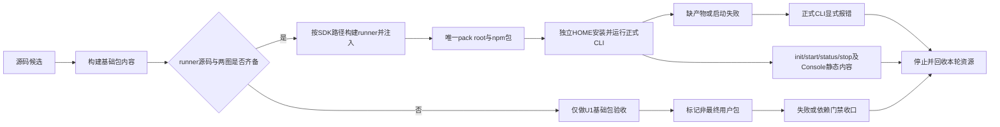
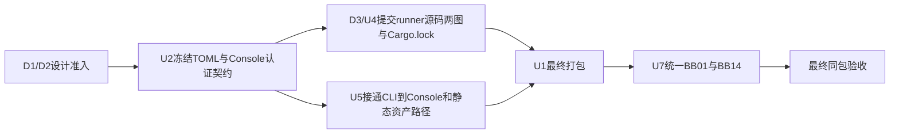

# AgentTeams U1 同包安装设计

状态：D1/D2 已准入；本设计在 r2/r3 FAIL 后补端口隔离、独立失败副本与唯一构建入口，待 r4 独立审查。SDK 同包与用户入口验收依赖 D3/U4、U2、U5；U1 只拥有打包，不拥有 runner 或业务实现。

基线：`codex/u1-package-design-20261003`，base/origin/main `20051913b8145d176d50afdae563adb6737d2779`，tree `5ef1208691ca82f19e625f3f54622d497849879e`。

原 worker 基线如上；Primary 在 worker exit0、停止写入后将设计候选组合到 `55c8282cbad3886022790d9ffb4b04a84b776820`。D1 `94b4633` 与 D2 `35ca32b` 均已独立 PASS、推送、清理，产品实现仍从当时最新 main 新建 worktree。

关联输入：

- [项目契约](../../AGENTS.md)
- [用户交付计划](../goals/teams-user-delivery-plan.md)
- D1 行为契约：本轮读取时的 `d1-behavior-contracts-20261003` worktree 已被其 owner 清理；同一文件现位于 `origin/main:docs/design/teams-behavior-contracts.md`，观察提交 `94b46334cd13e9fc7186c74b5206e70a0f429908`。
- [D2 SDK 探针结论](../evidence/d2-sdk-probe-20261003/README.md)；该结论只证明探针能力，不证明产品 runner。

## 1. 目标与非目标

目标是让普通用户通过一个 `npm pack` 产物获得同一版本的 CLI、Node runtime、Console、UI assets，以及 D3/U4 产出的 DAGpipe runner 与两张 Work graph。安装后不依赖源码树、当前工作目录、开发者 HOME 或机器私有 SDK path。

本设计不实现产品代码，不创建 runner、graph、CLI 命令或黑盒 PASS。最终用户包必须等 U2、D3/U4、U5 的对应公开入口完成；U1 可先交付并验证不含 runner 的基础包，但该候选不是最终用户包，不能用于关闭 SDK 同包验收。

硬边界：

- 一个用户包只有一个 staged pack root 和一个 producer，不在 npm pack 与 AppSDK artifact 之间维护第二份产品复制。
- D3/U4 没有产出 runner 产品源码时，U1 不生成 placeholder、不包装 D2 probe binary、不从 `target/debug` 或源码树运行。
- 构建只通过 `dagpipe sdk path` 解析已安装的 `pipeline_runtime 0.1.1` SDK，并记录 SDK 内容哈希；仓库不提交机器私有 home dependency。
- Console/UI 资产只从正式构建输出进入 pack root；缺失构建输出必须显式失败。
- CLI 安装入口只从自身安装路径派生资源；运行时不回退源码树。

## 2. 最小中文业务流程



单源是源码候选 `A`，单汇是本轮资源完成收口的 `M`。`D/E/H` 是基础候选的非发布终点；只有 `G -> I -> J -> M` 通过并绑定精确哈希，才可进入最终用户包验收。

## 3. 唯一 npm pack 布局

唯一 staged pack root：

```text
generated/modules/teams-source/lib/
```

`scripts/package-artifact.mjs` 是唯一 producer；AppSDK `teams-source` 的 `generated_outputs` 覆盖 `generated/modules/teams-source/**`，其中 `lib/` 就是同一 pack root；`npm pack` 直接以该 root 为 package root。不得再由另一个脚本复制出第二套 `lib/`、`dist/` 或 tarball 内容。

当前 `.appsdk/project.json` 的 `artifact_paths` 与 `scripts/artifact-smoke.mjs` 仍按旧的扁平路径检查 `console-host/index.mjs`、`runtime/runtime/...`、`ui/index.js`。U1 产品实现时必须把它们重绑到本设计的同一 pack root；该定向声明改动与 producer/smoke 同属 U1 的独占单元，由 Primary 审核，不再拆成并发写同一打包契约的第二任务。未重绑前，AppSDK artifact 与 npm pack 等价性为 `UNVERIFIED`。

最终用户包布局：

```text
package/
  package.json
  cli/
    agentteams.mjs
  generated/
    runtime-lib/
      runtime/...
      server/...
      network/...
      agent-host/...
      config/...
      opencode-adapter/src/...
  console-host/
    lib/index.mjs
    static/console.html
    static/console-entry.js
  ui/teams-console/
    index.js
    browser.js
    client/...
    assets/agentbrowser-icon.jpg
  runtime/dagpipe/
    manifest.json
    graphs/agent-work.graph.json
    graphs/work-query.graph.json
    bin/darwin-arm64/agentteams-dagpipe-runner
```

Node runtime 与源码路径保持同构，使现有 [CLI 安装路径派生](../../cli/agentteams.mjs) 继续从 `import.meta.url` 解析 `../generated/runtime-lib`，不依赖 `process.cwd()`。Console/UI 构建输出按服务路由扁平化：`ui/teams-console/lib` 的内容复制到 staged `ui/teams-console`，`ui/teams-console/assets` 复制到 staged `ui/teams-console/assets`。Console 与 UI root 由 U5 从同一安装根派生；`console-host/static` 对应 `staticRoot`，`ui/teams-console` 对应 `uiRoot`，服务映射见 [console-host/src/server.ts](../../console-host/src/server.ts)。

`package.json` 的最终发布字段必须固定为：

```json
{
  "name": "agentteams",
  "version": "<candidate-version>",
  "private": true,
  "type": "module",
  "bin": { "agentteams": "./cli/agentteams.mjs" },
  "files": [
    "cli",
    "generated/runtime-lib",
    "console-host/lib",
    "console-host/static",
    "ui/teams-console",
    "runtime/dagpipe"
  ],
  "engines": { "node": "^22.22.2" },
  "os": ["darwin"],
  "cpu": ["arm64"],
  "dependencies": {
    "toml": "4.3.0",
    "ws": "8.21.3"
  }
}
```

`node_modules` 不进入 tarball。生产依赖从 package metadata 安装，版本来源是 [package.json](../../package.json) 与 [pnpm-lock.yaml](../../pnpm-lock.yaml)；`pnpm-lock.yaml` 只用于构建和工作区安装，不变成第二个产品依赖声明。包版本取根 package.json，不再在 producer 固定第二个版本号；本轮使用本地 tarball 安装，未授权发布 npm registry。`engines` 的最低值取当前验证环境 `Node v22.22.2` 与锁文件要求；若扩大 Node 范围，必须先有该范围的安装、CLI 与 Console 黑盒证据。

## 4. 构建与 manifest/lock 来源

基础构建流程：

```sh
pnpm install --frozen-lockfile
pnpm build
pnpm build:governance
```

最终 SDK 同包构建流程：

```sh
node runtime/dagpipe/build.mjs
pnpm build:governance
npm pack generated/modules/teams-source/lib --pack-destination docs/evidence/u1-package-design-20261003/<candidate>
```

`runtime/dagpipe/build.mjs` 是 D3/U4 唯一 SDK/runner 构建入口，本命令当前只在 D3/U4 候选存在，U1 编码接线以其集成后冻结的接口为准。U1 调用一次该入口，读取其 stdout 返回的 runner/receipt 路径与 artifact SHA，核对 binary 实际哈希等于 receipt，再复制到 pack root 并绑定 manifest.buildReceiptSha256。producer不自行rsync SDK、生成Cargo manifest或另跑cargo。构建receipt缺失、不匹配、不同candidate/source时显式失败，不打包旧binary。

依赖定义由 D3/U4 提交的 Cargo.toml.template + Cargo.lock 维护；唯一build入口以dagpipe sdk path解析已安装SDK并生成隔离Cargo manifest。生成manifest可含当时解析的绝对SDK路径，仓库template不得提交机器私有home，用户包运行不读取SDK位置。SDK manifest/source/build-script输入按相对路径排序绑定内容，同时绑定runner源码、生成manifest、lock、工具链/target/build profile和graph。仅Cargo.toml/src/lib.rs的hash不足以代表完整SDK身份。构建receipt保存完整输入清单/聚合hash，U1复用，不维护第二份依赖输入真相。

manifest 与 lock 的唯一来源：

| 对象 | 唯一来源 | 产品包处理 |
|---|---|---|
| 用户包内容白名单 | 根 `package.json#files` 与 `scripts/package-artifact.mjs` 显式清单 | 进入 staged pack root |
| Node runtime 编译闭包 | [tsconfig.runtime.json](../../tsconfig.runtime.json) 的 `include` | 由 `build:runtime` 输出后复制 |
| Node 生产依赖 | 根 `package.json#dependencies` 与 `pnpm-lock.yaml` | 只写 package metadata，不复制 `node_modules` |
| Console/UI 输出 | [console-host/package.json](../../console-host/package.json)、[ui/teams-console/package.json](../../ui/teams-console/package.json) 的 build/files 定义 | 只接受真实构建输出 |
| Rust runner 与 SDK | D3/U4 的 `runtime/dagpipe/build.mjs`、runner template、Cargo.lock与实际SDK解析receipt | 核对receipt对应binary，只把runner、产品manifest与其身份引用放入包 |
| Work graphs | base 中已有 `agent-work.graph.json`；D1 closeout `94b4633` 已新增 `work-query.graph.json` | 原样复制两张最新 graph，不重写语义；实现前必须 rebase 到含 D1 closeout 的 main |

`scripts/package-artifact.mjs` 必须对每个必需输入先检查存在性；任何缺失都抛错，不创建空目录、空 JS、假 manifest 或 probe binary。基础包模式只允许省略 `runtime/dagpipe/**`，并在 receipt 中标记 `release_eligible=false`。最终模式必须要求 runner、两张 graph 和 manifest 全部存在，否则 `release_eligible=false` 且不生成最终 tarball。

## 5. DAGpipe runner 与两图同包

同一最终包固定包含：

```text
runtime/dagpipe/manifest.json
runtime/dagpipe/graphs/agent-work.graph.json
runtime/dagpipe/graphs/work-query.graph.json
runtime/dagpipe/bin/darwin-arm64/agentteams-dagpipe-runner
```

`manifest.json` 只记录可验证身份，不承载业务控制：

```json
{
  "schemaVersion": 1,
  "runner": {
    "path": "bin/darwin-arm64/agentteams-dagpipe-runner",
    "sha256": "<sha256>",
    "platform": "darwin",
    "arch": "arm64"
  },
  "sdk": {
    "crate": "pipeline_runtime",
    "version": "0.1.1",
    "buildInputsSha256": "<complete-sdk-inputs-sha256>"
  },
  "buildReceiptSha256": "<exact-runner-build-receipt-sha256>",
  "graphs": [
    { "id": "agent-work", "path": "graphs/agent-work.graph.json", "sha256": "<sha256>" },
    { "id": "work-query", "path": "graphs/work-query.graph.json", "sha256": "<sha256>" }
  ]
}
```

运行入口由 U4/U5 的 runtime adapter 从 pack root 派生 runner path，并以 `spawn` 直接执行；不通过 shell，不查询 `PATH`，不在找不到时退回 `target/release`、源码目录、D2 probe 或系统安装。缺 runner、架构不匹配或哈希不一致时，必须在任何 Work 业务副作用前显式失败。

平台与架构支持：

| 平台 | U1 MVP | 处理 |
|---|---|---|
| `darwin-arm64` | 支持 | 唯一必须构建并黑盒验证的目标 |
| `darwin-x64` | 未支持 | 无独立构建/验证前不得发布该 binary |
| `linux-*` | 未支持 | npm `os/cpu` 与 runtime 双重显式拒绝 |

如果后续扩展平台，仍使用同一 pack root 的 `bin/<platform>-<arch>/`，由构建矩阵分别产出和验证；不得用跨架构 fallback。

## 6. 路径与失败语义

安装后所有路径从 CLI 自身位置派生：

| 对象 | 安装后路径 | 失败语义 |
|---|---|---|
| CLI | `<prefix>/node_modules/agentteams/cli/agentteams.mjs` | 缺失时 Node/npm 入口失败 |
| Node runtime | `<prefix>/node_modules/agentteams/generated/runtime-lib/...` | 缺失时正式 CLI 报 `cli runtime artifacts are missing` |
| Console static | `<prefix>/node_modules/agentteams/console-host/static/...` | U5 启动时显式报缺 asset |
| UI assets | `<prefix>/node_modules/agentteams/ui/teams-console/...` | 请求返回明确 404/启动失败，不猜源码路径 |
| DAGpipe runner | `<prefix>/node_modules/agentteams/runtime/dagpipe/bin/darwin-arm64/...` | `DAGPIPE_RUNNER_MISSING` / `UNSUPPORTED_PLATFORM` |
| 用户配置 | `$HOME/.agentteams/config.toml` | 不存在时 `init` 创建，其他命令明确拒绝 |
| 内部状态 | `$HOME/.agentteams/internal.toml` | 派生状态，不作为用户配置真源 |

运行时代码不得读取 `import.meta.url` 以外的仓库位置、`process.cwd()` 下的 `generated/`、开发者 worktree、D2 evidence path 或 `$HOME/.local/share/dagpipe/sdk`。

## 7. BB01 / BB14 黑盒合同

### BB01：包外安装、正式 CLI、UI assets 与正常清理

owner：U1 + U5 + U7。

前置：精确 candidate、tarball、runner hash、SDK hash、graph hash、独立临时 HOME、独立 npm prefix及本轮端口隔离；`rg`、`openssl` 和当前包声明的 Node 版本可用。

独立 HOME 不隔离网络端口。U2 的 runtime 配置生成/启动 owner 必须为 bridge、daemon lease/服务监听、Console 选择可用本地端口，并把实际地址写 internal.toml/public status；用户不填写这些端口。监听直接使用系统分配的端口时，以本轮绑定后的实际地址发布；若现有 public owner 必须预选端口，明确记录本轮预检和选择结果，绑定竞争失败显式退出并清理，不能复用旧 listener 或自动连接固定 48010/48011/48012。

U7 driver 用安装后的公开 status/配置读回收集实际 PID、generation、地址；用 OS 监听快照和本轮所有权证据核对启停。BB01 的开始/结束 receipt 包含所选端口、监听前后及明确归属；已运行的其他 HOME/AgentTeams listener必须保持。U2动态端口接线前该启动验收是 `BLOCKED(U2)`，不能以“默认端口恰好空闲”通过。

精确命令：

```sh
tmp="$(mktemp -d)"
prefix="$tmp/prefix"
test_home="$tmp/home"
mkdir -p "$test_home" "$prefix" "$tmp/npm-cache"

HOME="$test_home" npm_config_cache="$tmp/npm-cache" \
  npm install --prefix "$prefix" --no-audit --no-fund "$tarball"

cli="$prefix/node_modules/.bin/agentteams"
test -x "$cli"
HOME="$test_home" "$cli" init
HOME="$test_home" "$cli" start
HOME="$test_home" "$cli" status
HOME="$test_home" "$cli" stop
```

预期：

- `init` 退出 0，只在 `$test_home/.agentteams` 下生成配置和内部材料。不得重新定义 shell 的 `home`/`HOME` 变量，独立 HOME 只通过目标子命令的环境赋值传入。
- `start` 退出 0，`status` 显示 `state=running`、有效 `pid` 和 `generation`。
- 本轮实际 bridge/daemon/Console 地址与所有权可公开读回，没有复用既有监听；与另一个独立测试 HOME 同时启动不争用默认端口。测试只停止本轮 PID/generation，收尾端口不再监听，既有监听保持。
- `stop` 退出 0，随后 `status` 显示 `state=stopped`；`start` 产生的 launcher/relay/Agent child 均退出。
- 上述命令不访问源码树、开发者 HOME、`node_modules` 之外的包路径或机器私有 SDK path。

Console/UI 验收依赖 U5：

- 当前 `agentteams start` 只启动 runtime，尚未从正式 CLI 启动 Console。
- U5 必须冻结一个正式公开入口，至少使 `agentteams status` 输出当前 Console URL，例如 `console=<absolute-url>`；不得要求 U1 直接 import `console-process` 或读取私有 JSON。
- U5/U2 冻结 auth 字段后，BB01 追加真实 HTTP 请求：

```sh
curl -fsS "$console_url" -o "$evidence/console.html"
curl -fsS "$console_url/console-entry.js" -o "$evidence/console-entry.js"
curl -fsS "$console_url/ui/browser.js" -o "$evidence/ui-browser.js"
curl -fsS "$console_url/ui/assets/agentbrowser-icon.jpg" -o "$evidence/agentbrowser-icon.jpg"
shasum -a 256 "$evidence/agentbrowser-icon.jpg"
```

在 U5 接线前，该段标记 `BLOCKED(U5)`，不能以 `scripts/artifact-smoke.mjs` 的私有 server 调用替代。

### BB14：缺产物、失败启动与本轮资源回收

owner：U1 + U5 + U7。

基础缺产物用例：

```sh
broken="$tmp/broken-prefix"
cp -R "$prefix" "$broken"
rm "$broken/node_modules/agentteams/generated/runtime-lib/runtime/local-process.js"
set +e
HOME="$test_home" "$broken/node_modules/.bin/agentteams" start >"$evidence/missing-runtime.stdout" 2>"$evidence/missing-runtime.stderr"
code=$?
set -e
test "$code" -ne 0
grep -F "cli runtime artifacts are missing" "$evidence/missing-runtime.stderr"
```

SDK runner 缺产物用例依赖 D3/U4：

```sh
runner_broken="$tmp/missing-runner-prefix"
cp -R "$prefix" "$runner_broken"
test -f "$runner_broken/node_modules/agentteams/generated/runtime-lib/runtime/local-process.js"
rm "$runner_broken/node_modules/agentteams/runtime/dagpipe/bin/darwin-arm64/agentteams-dagpipe-runner"
set +e
HOME="$test_home" "$runner_broken/node_modules/.bin/agentteams" work >"$evidence/missing-runner.stdout" 2>"$evidence/missing-runner.stderr"
code=$?
set -e
test "$code" -ne 0
grep -F "DAGPIPE_RUNNER_MISSING" "$evidence/missing-runner.stderr"
if grep -F "cli runtime artifacts are missing" "$evidence/missing-runner.stderr"; then exit 1; fi
```

missing-runner副本只删runner，保留完整CLI/runtime/manifest/graph，必须先达到合法新Work的runner校验位置；与missing-runtime用例不共享损坏副本。该用例同样断言无runner执行、无新增业务/资源副作用，记录公开服务/本轮监听前后证据。

以上 Work 命令必须在 D3/U4 冻结的新提交入口下带一个有效的显式请求输入，避免参数错误抢先掩盖 runner 校验。本段属于待实现命令合同，U7 接线时使用该正式 CLI 参数，不把今天的 startup receipt 命令当作新请求验收。

增加两项身份失败黑盒，各使用新的自有安装副本，不能在同一份已删除 runner 的副本上累计故障：

1. **runner 内容/hash 不匹配**：保留正式 manifest 原哈希，把该测试副本的 runner 替换为可执行哨兵。哨兵若被运行就向本轮独占文件写入标记并退出失败。向实际已运行的 provider/receiver 发一个合法新 Work；预期正式 CLI 明确返回 runner identity 错误，哨兵文件不存在、真实服务执行/资源公开计数无增量、没有新业务文件/浏览器 context。本轮 provider/receiver generation不变。用 provider公开查询及实际服务副作用证明，不能只读 SDK journal。
2. **不支持的平台声明**：保留正常 binary，在测试副本的 manifest 中仅将 target platform/arch 改成不支持值；绕开 npm平台准入的该副本只用于验证 runtime边界，不作为可安装发行包。合法新 Work 明确返回 `UNSUPPORTED_PLATFORM`，没有 runner执行与新增业务副作用。记录原/损坏manifest hash及结果。

Node sentinel替换和manifest fixture编辑由U7对单个自有测试文件精确完成，不碰主安装或真实其他服务。runner-missing、hash mismatch、unsupported platform三种错误分别保留stdout/stderr及业务/进程/监听前后证据；不允许把“命令非零”单独当作无副作用证明。U4必须冻结实际错误码与身份校验位置，U1按该契约验收，不在打包层复制runtime校验器。

重复启动失败与清理用例：

```sh
HOME="$test_home" "$cli" start >"$evidence/start-first.stdout" 2>"$evidence/start-first.stderr"
set +e
HOME="$test_home" "$cli" start >"$evidence/start-duplicate.stdout" 2>"$evidence/start-duplicate.stderr"
code=$?
set -e
test "$code" -ne 0
grep -E "already running|ALREADY_RUNNING" "$evidence/start-duplicate.stderr"
HOME="$test_home" "$cli" status >"$evidence/status-before-stop.txt"
HOME="$test_home" "$cli" stop >"$evidence/stop-after-duplicate.txt"
HOME="$test_home" "$cli" status >"$evidence/status-after-stop.txt"
grep -F "state=stopped" "$evidence/status-after-stop.txt"
```

清理终点：

- 缺产物和重复启动都保留首错，不出现空结果、假成功或静默 fallback。
- 重复启动失败后原 generation 保持运行且没有第二个 launcher；`stop` 后 `status` 显示 `stopped`，没有本任务 child/listener 继续存活。
- `stop` 只操作本临时 HOME 的 generation；禁止 `pkill`、`killall`、`kill $(...)` 或影响其他 owner 的进程。
- 证据目录保留 stdout/stderr/status/tarball hash/binary hash；临时 HOME、prefix、端口占位进程和本轮 tarball 在收口时删除。
- 如果 dirty 或 retained obligation 存在，显式列 owner、路径、原因和解除动作，BB14 判 `INCOMPLETE`，不得静默通过。

## 8. 依赖与共享文件串行顺序



共享文件只允许一个 owner 写入：

| 文件/目录 | owner | U1 规则 |
|---|---|---|
| `package.json` | U1 | 只写发布字段、files、bin、engines、os/cpu、依赖；不写业务配置 |
| `pnpm-lock.yaml` | U1 串行收口 | 等 U2-U5 依赖变更冻结后一次更新，其他 worker 不并发写 |
| `scripts/package-artifact.mjs` | U1 | 唯一 pack producer |
| `scripts/artifact-smoke.mjs` | U1 | 重绑到同一 pack root，校验字节一致与 Console 静态入口；不得保留旧扁平路径真源 |
| `scripts/installed-runtime-smoke.mjs` | U1 | 改成 tarball + 正式 CLI；U7 在其上扩展统一 driver |
| `cli/agentteams.mjs` | U4/U5 | U1 只读安装路径；若需改路径派生，与 U4/U5 串行并只改派生 |
| `runtime/**` | U2/D3/U4/U5 | U1 只读，不写 runtime 实现 |
| `runtime/dagpipe/**` | D3/U4 | U1 只消费构建产物，不写 runner/graph |
| `console-host/**`、`ui/teams-console/**` | U5 | U1 只复制构建输出，不改业务 |
| `docs/design/dagpipe/graphs/**` | D1/D3/U4 | U1 不修改 |
| `scripts/blackbox-user-mvp.mjs` | U7 | U1 不创建第二套 driver |

允许的产品实现路径：

- U1：`package.json`、`scripts/package-artifact.mjs`、`scripts/artifact-smoke.mjs`、`scripts/installed-runtime-smoke.mjs`、`.appsdk/project.json` 中受影响的 artifact_paths、必要的 package 配置、受影响 architecture maps 和安装证据。不在本单元修改 CLI 路径派生；如确有缺边，另交对应 owner 串行处理。
- U1 可以读取 `tsconfig.runtime.json`、Console/UI package build 输出、`runtime/dagpipe/**` 构建产物和项目 graph 文件。

禁止的产品实现路径：

- U1 不修改 `runtime/**`、`console-host/src/**`、`ui/teams-console/src/**`、`agent-host/**`、`network/**`、`server/**`、`config/**`、`cli-adapter/**`。
- U1 不创建 runner 源码、graph、placeholder、mock CLI、假 manifest、probe wrapper 或第二份产品目录。
- U1 不把 D2 probe binary、`target/debug`、源码 worktree 或 `$HOME/.local/share/dagpipe/sdk` 作为运行时依赖。

## 9. 证据绑定

每个候选在 `docs/evidence/u1-package-design-20261003/<candidate>/` 写入：

| 证据 | 必须绑定 |
|---|---|
| `package-receipt.json` | candidate commit/tree/base、package version、tarball SHA-256、pack root 文件清单 |
| `sdk-receipt.json` | 唯一D3构建receipt引用/hash、`dagpipe sdk path`解析来源、完整SDK build-input清单/聚合hash、runner源码/manifest/lock、rustc/cargo/target身份；两文件hash只诊断 |
| `runner-receipt.json` | runner SHA-256、平台/架构、两张 graph SHA-256、manifest SHA-256 |
| `install-receipt.json` | 安装 prefix、CLI realpath、Node 版本、tarball SHA-256、`init/start/status/stop` 原始 stdout/stderr |
| `ui-receipt.json` | Console URL、console.html/console-entry.js/ui browser.js/icon HTTP 状态、content-type、icon SHA-256 |
| `cleanup-receipt.json` | 停后 PID/listener 检查、临时 HOME/prefix/tarball 删除、保留责任列表 |

安装入口证据必须由当前Node的 `fs.realpathSync` 读取 `$prefix/node_modules/.bin/agentteams`，并确认它解析到安装后的 `cli/agentteams.mjs`，而不是源码 worktree。tarball hash、runner hash、graph hash 与 review candidate SHA 不一致时，受影响下游证据失效。

## 10. 准入结论

U1 基础包部分已经具备最小实现路径：基础 CLI/runtime/Console/UI 复制、路径派生、tarball smoke 和清理合同均已明确。SDK 同包部分尚不能标记完整 implementation-ready，解除动作如下：

| 缺口 | owner | 解除动作 |
|---|---|---|
| D1/D2 已独立 PASS、交付 | Primary | 复用现有设计/能力receipt；不重复该准入，只检查受变化影响项 |
| U2 尚未冻结 TOML、Console auth、缺依赖错误 | U2 | 冻结配置字段与错误边界，供 BB01/BB14 使用 |
| D3/U4 尚未提供 runner 源码、两张 graph、Cargo.lock | D3/U4 | 提交可构建 runner 与 graph，并提供平台 binary/hash |
| U5 尚未接通正式 CLI 到 Console | U5 | 让 `start/status` 暴露可验证 Console URL，并从安装包派生 static/UI root |
| U7 统一黑盒 driver 尚未实现 | U7 | 接入 BB01/BB14，保留 tarball/binary/hash/清理证据 |
| AppSDK artifact_paths/smoke 仍指向旧扁平布局 | Primary + U1 | 重绑到同一 pack root，证明治理 artifact 与 npm pack 等价 |

在上述解除动作完成前，本设计只能作为 U1 基础包实现依据；不能宣称 SDK 同包最终验收、BB01/BB14 全通过或普通用户包已完成。
