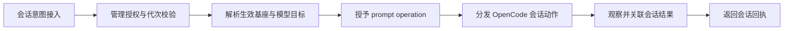
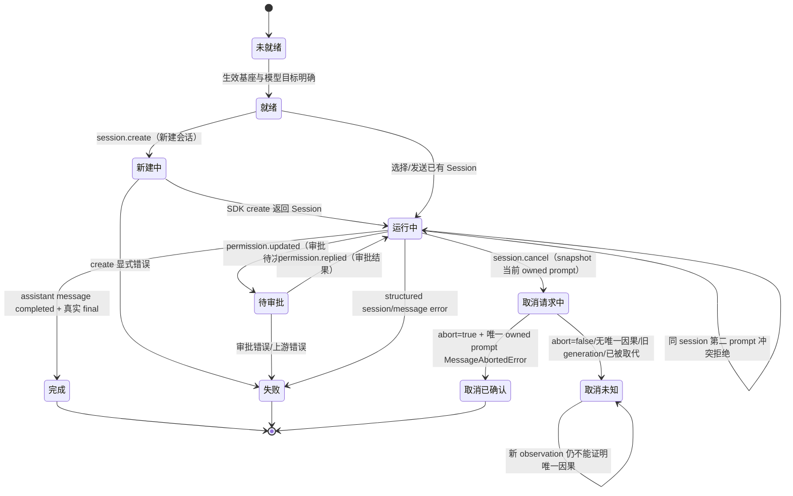

# Teams U6 Session 窄设计：Console 到真实 OpenCode Session

状态：`HISTORICAL PRE-IMPLEMENTATION DESIGN / DELIVERED`。本文正文冻结为 U6 编码前设计，记录当时的缺口。正文中“拟新增”“当前不存在”等表述只描述设计时刻，不代表当前实现状态。当前实现状态和验证证据以 `docs/architecture/*.json` 与本任务候选提交为准；`Console -> Agent -> managed OpenCode` 的安装后真实 Session 验收已由树 `fcb52bdb1b22a9060016805d842a17a9e100981b`（提交 `0edb591edd1f942464880b80346c2d9354dc0bb0`）的安装公开入口回放 receipt 覆盖，见 `docs/evidence/fcb52bdb1b22a9060016805d842a17a9e100981b-u6-installed-session-20261007/validation.md`；该目录由 docs-only 提交发布，因此 `git diff --name-only fcb52bdb1b22a9060016805d842a17a9e100981b HEAD` 不输出任何非 `docs/` 路径。更早的树 `0aca95ef682eca42947d6df48f7452f5505515e8`（提交 `8ffb130832391007c56e02fad79c94856d3a385a`）、`8d27ed963daf25c3ffff3008354eb8208ee5a9f9`（提交 `d3e25daebb4f0853db199bf931865033e1358c30`）与 `882a167990a755414be2cc4b7bd2e2ce18b8fd9b`（提交 `a598a377d3370bcd55f87ef61a2ddfbd7d94da16`）已被该候选取代，它们的 receipt 只覆盖各自那棵树。当前候选修复了五个缺口：一是“有 binding 但无法解析受管可执行文件”的 Agent 必须返回 typed `UNSUPPORTED_OPERATION` 而非 `CREDENTIAL_UNAVAILABLE`（安装回放 `binding-without-owner` 用例）；二是同一 `requestMessageId` 下出现第二个不同 assistant 身份时必须保持绑定未决，`session.cancel` 在任何 abort 之前以 typed `ambiguous-owner` 拒绝，且第一个身份的 `MessageAbortedError` 永不确认取消；三是 adapter 补齐基座真实 `session.status` 的 typed 透传，作为辅助观测而非取消确认依据；四是 adapter 不得把缺失或为空的 tool title 归一化成 `''` 后交给 Console 闭合解析器——该形状必须在本适配器边界判为 `invalid` 单事件，而不是让整条投影回复失败；五是 adapter 不得为基座 SDK 声明为必填的每态字段（pending `raw`、completed `metadata`、error `error`）伪造空值，缺失或类型不符必须同样判为 `invalid`。浏览器验收与 U7 用户驱动用例（BB10/BB12）仍为下游 host gate。

设计修订输入：

- r1 原始审查绑定：base `55c8282cbad3886022790d9ffb4b04a84b776820`，staged tree `41b6ae9b224faeed3e6992639cbc70b93be55c4d`。
- r4 作者输入 HEAD：`c3aa36fc637e2da4ac821d1b26d587eadbbf1268`；r5 审查输入为 `63fe1cb68bf8943a9611ad8df73d4bf95f302bbb` / tree `4361eb51519eb460a9afe1145d805ce5f7097cd6`，正式 FAIL。primary 组合基线为 `b969e9740704977326c5054fb3afbeab8d523e36`，branch `codex/u6-session-design-20261003`。
- r5 修正已提交为 `f5648aa`，tree `18e9b95f2f86badffb2580987d2a45f9813724fc`；r6 独立审查绑定该提交并正式 FAIL，四条 P1：提交后 in-tree 证据仍称“未提交/未准入”、能力门控用了 U2 已删除的用户配置 `openCode`、事件观测缺 ingress/caller/lifetime/cleanup、瞬态事件丢失污染 owner readiness。本轮按这四条重构：门控改用 U2 派生的 `[agents.*.model]` binding，新增 §6.2 事件接入生命周期与 §6.3 独立观察状态，in-tree 证据改为绑定当前提交。以上历史条目只描述当时状态，不再描述当前状态。
- r6 修正已提交为 `3ab0733`，tree `232529628bbda7b1ac7410a778a4ca7b81f6ba33`；r7 独立审查绑定该提交并正式 FAIL，两条 P1：validation 指向的外部 receipt 目录当时没有绑定该候选身份的 receipt，以及 §6/§11 与 §6.2 对事件投影 owner 的表述互相矛盾（adapter 与 Session owner 被写成同一节点）。本轮按这两条修正：投影节点拆成 adapter 的纯分类函数 `projectOpenCodeSessionEvent`（唯一 SDK 形状与 unsupported/invalid 判定）与 Session owner 的流生命周期、缓冲、丢失记录（§6.2/§6.3/§11 表述一致），并在外部 receipt 目录写入绑定当前候选的 receipt。
- SDK 真值：锁文件 `@opencode-ai/sdk@1.18.23` / `@opencode-ai/plugin@1.18.23`；本次只读 `npm pack @opencode-ai/sdk@1.18.23` 的 tarball，shasum `97cea835474420320d24b304604f4dcadc126bf6`。本机 `/Users/fanzhang/.opencode/node_modules/@opencode-ai/sdk` 是旧版本，不作为设计依据。

历史 primary 组合输入为 `4fc38a491089693f61b5901aa15c1c966a664338`。当前 U2 设计已独立准入并合入 `63fe1cb`，其 recover/persistence 产品实现仍待交付；U6 只消费该 owner 的接口，不把已准入设计写成现有产品能力。

## 1. 范围、非目标与设计边界

范围：

- 定义 Console 用户可用的 Session 管理动作：新建、选择/读取、发送业务消息、观察真实 message/tool、回复 permission、取消。
- 定义动作从 Console HTTP/relay 到 `agent-process`、到 `ManagedConfigOwner`、到 OpenCode adapter、到已安装 OpenCode 的真实公开接口映射。
- 定义唯一 Session model target、事件合同、取消终态、错误 owner、运行时 readiness、失败/unknown/cancel/cleanup 终点。
- 定义实现写入边界、真实 caller、focused 合同和 BB10/BB12 产品黑盒合同。

非目标：

- 不实现产品代码；不修改 map、现有 graph、配置真源或 U2/U4/U5/U7 拥有的文件。
- 不创建 session 级 model/config 持久化、第二套 model binding、默认模型、自动 failover、第二套 Session manager、第二套 event store 或第二个 OpenCode child。
- 不把 Session 控制动作塞进业务 payload、`metadata`、特殊 text 或错误链。Console transport 的 `JsonValue` 保持任意和语义等价，不在传输层做 key 黑名单、剥离或改写。
- 本次不启动/重启/安装产品 daemon，不读取凭据，不做远程推理。BB10/BB12 是产品实现后的真实验收，不是本设计任务的执行项。

## 2. 真实架构事实与唯一 owner

| 对象 | 唯一 owner | 当前真实状态 | U6 设计结论 |
|---|---|---|---|
| Console transport | `control-protocol/console-api.ts`、`console-wire.ts` | `ConsoleClientV1.sendSession` 是 `JsonValue`；`console.session` wire 的 `payload` 也是 `JsonValue`；HTTP 直接 JSON.parse 后转发 | 保持任意、完整、语义等价；不在 transport 解析/剥离/黑名单业务 key |
| typed control | `control-protocol/console-api.ts` | `ConsoleCommandV1` 只有 `session.open`、`permission.reply` 等，无 create/cancel | 新增封闭 `session.create`、`session.cancel`；create 不携带 model |
| Session message decoder | `opencode-adapter/src/index.ts`（拟新增） | 当前 `sendOpenCodeMessage` 只接 `text` 和可选 model target；没有 payload decoder | 新增明确命名的 `decodeOpenCodeSessionMessage`，只在 adapter 边界把受支持业务 payload 解码为 SDK prompt 输入 |
| 受管 runtime | `runtime/managed-config-owner.ts` | `apply/use/stop`；`use` 用 `active++`，任意 throw 置 `uncertain=true`；没有 readiness observation | 保留 active 计数但不把它称为串行化；新增 owner-scoped readiness 和 effective model target；expected adapter error 在 callback 内转为结果 |
| OpenCode adapter | `opencode-adapter/src/index.ts` | 有 list/get/prompt/permission reply；无 create/abort/messages/status/event projection | 在同一 adapter/facade 内补齐；不另建 Session manager |
| OpenCode child | `runtime/managed-opencode.ts` | 已有受管 child 和 config readback | Session 只使用当前 effective handle；不启动第二个 child |
| Agent 管理授权 | `agent-host/console-ingress.ts` | 已检查 target/generation/manager policy；generation 错误是 ingress owner | 新命令继续走同一入口；不把 `STALE_GENERATION` 改成 adapter 错误 |
| 配置真源 | U2 的 accepted/effective + CAS | U2 尚未完成；当前有 `RuntimeConfigStore` / `ManagedConfigOwner` 接缝 | U2 的 per-Agent provider/model binding 是唯一用户意图；U6 只读消费，不复制 binding |
| UI Session 消费者 | `ui/teams-console/**`（U5 fixed contract） | 有抽屉、发送、permission 按钮；无 create/cancel、无事件 detail/cancel detail | UI 只消费冻结 contract；U6 不修改 UI owner 文件 |

`sessionCapable` 只有在同一 daemon 已构造 Session owner（U2 的 `[agents.*.model]` binding 加 launcher 启动参数）时才为 true；它表示该 Agent 确有 Session 执行路径，不表示 runtime 当前可用。`sessionAvailability` 表示 owner-scoped readiness。两者都不进入 `AgentDeclaration.capabilities`、endpoint/route、Work 匹配或资源分配。Console 只在 `kind='runtime'`、`sessionCapable=true` 且 `sessionAvailability='current'` 时展示/发送 Session 管理动作；presence 与 Session readiness 是两个事实。没有 Session owner 的 Agent（被动 CLI Agent，或只有 binding 而 launcher 未提供启动参数）收到 Session 命令或消息都明确 `UNSUPPORTED_OPERATION`。

### 2.1 Agent 管理投影的 discriminated row

`ConsoleProjectionV1.agents[*]` 改为精确 `observation.kind` union。它不是 Work capability，也不是配置或 runtime 的第二真源：

```ts
type AgentObservation =
  | {
      readonly kind: 'runtime'
      readonly agentId: string
      readonly label: string
      readonly machineId: string
      readonly generation?: number
      readonly presence: 'online' | 'offline' | 'unknown'
      readonly capabilities: readonly string[]
      readonly sessionCapable: true
      readonly sessionAvailability: 'changing' | 'stopped' | 'no-current' | 'uncertain' | 'current'
      readonly sessionObservation?: SessionObservationState
      readonly sessionEffectiveRevision?: number
      readonly currentSessionId?: string
      readonly providerId?: string
      readonly modelId?: string
    }
  | {
      readonly kind: 'runtime'
      readonly agentId: string
      readonly label: string
      readonly machineId: string
      readonly generation?: number
      readonly presence: 'online' | 'offline' | 'unknown'
      readonly capabilities: readonly string[]
      readonly sessionCapable: false
      readonly sessionAvailability: 'not-applicable'
    }
  | {
      readonly kind: 'directory'
      readonly agentId: string
      readonly label: string
      readonly machineId: string
      readonly generation?: number
      readonly presence: 'online' | 'offline' | 'unknown'
      readonly capabilities: readonly string[]
    }

type ConsoleAgentObservationV1 = AgentObservation
```

形状和禁止项是封闭的：

- `runtime` 行按 `sessionCapable` 再判别：true 行的 availability 来自真实 owner readiness，effective revision 可选但必须满足既有 revision 域；current 必须有实际 effective revision。`sessionObservation` 是独立的可选观察字段（§6.3），与 availability 无耦合：`degraded`/`lost` 不得改变 availability，availability 为 `uncertain` 时也不得反推观察状态。false 行没有 ManagedConfigOwner，availability 必须为 `not-applicable`，effective revision、currentSessionId、providerId、modelId、`sessionObservation` 必须 absent，不能把无 owner 写成 no-current 或 stopped。
- `directory` 行只允许目录身份、presence、capabilities 和生成版本；所有 session/model 字段必须 absent。仅有目录观察时不得伪造 passive runtime 行；真实被动 Agent 自己返回的 false/not-applicable 行是独立的合法 runtime 观察。
- `kind` 缺失、非法 enum、runtime 形状漏必需字段、directory 形状含任一 session/model 字段、非法 presence/revision/capabilities、未知 `sessionObservation.state`/`reason`、`degraded`/`lost` 缺 `detail`、false 行带 `sessionObservation`，一律在 wire decoder 显式 `INVALID_INPUT`；不得 default 成 false、directory、current 或 `live`。
- `runtime/agent-process.ts` 只产生该 Agent 自己的 `kind='runtime'` 行：`sessionCapable` 来自 U2 的派生受管 OpenCode 事实，即该 Agent 的 accepted/effective 配置里是否有 `[agents.*.model]` binding（`primary` 必须命中已声明 provider 与 manual/discovered model）。用户配置里没有也不会有 `openCode` 字段，本设计不读取、不新增、不兼容该字段。能力与 dispatch 必须是同一事实：只有该 daemon 已用 launcher 提供的启动参数构造同一 `ManagedConfigOwner` 与 SessionHost 时才广播 true，其 availability 来自该 owner 的 readiness；launcher 未提供启动参数、无法构造 owner 时，即使存在 binding 也必须广播 false/not-applicable，且 Session 命令返回 `UNSUPPORTED_OPERATION`，不能广播一个没有 dispatch owner 的能力。没有 binding 的被动 Agent 同样产生 false/not-applicable，不构造也不调用不存在的 owner。owner 已构造但尚未 apply 时仍是 true 行加真实 readiness（`changing`/`no-current`）。not-applicable 不是新增 owner state。不同 session 并发不改变 activeOperations 语义。
- `runtime/console-hub.ts` 是 offline/空投影 fallback 的 hub owner。offline directory peer 生成 `kind='directory'`；在线 client 返回 owner runtime 行则原样透传其 session 字段；在线 client 返回 `agents:[]` 且有 directory peer 时，同样由 hub 生成 `kind='directory'`，不从 declared Work capabilities、presence、`currentSessionId`、provider/model 文本或旧 UI fixture 猜能力/effective revision。在线但 owner 明确返回 passive runtime 行时，保留 `sessionCapable:false` 和真实 availability。
- `control-protocol/console-wire.ts` 按 union 封闭验证；relay client 不复制另一 Agent 字段，不做能力推断。UI protocol/model/controller/render/fixtures/tests 必须接受并展示两种 kind。UI 只允许在 `kind='runtime' && sessionCapable=true && sessionAvailability='current' && presence==='online'` 时启用 create/send/cancel；directory row 只显示离线/仅目录目录项，不能展示或发送 Session 动作。
- fixture/caller 同步清单：`ui/teams-console/src/fixture.ts` 的 online owner/passive row 与 directory row；`ui/teams-console/src/client/{api,protocol,model,controller,render}.ts`；`control-protocol/console-wire.spec.ts`、`runtime/console-hub.spec.ts`、`runtime/agent-process.spec.ts`、`console-host/tests/http-api.spec.ts`、UI api/model/controller tests。缺 kind、directory 含 session 字段、runtime 缺 availability、current 缺 revision、false/current、true/not-applicable、passive 含 effective/model 字段、非法或越界 `sessionObservation` 均负向拒绝；并正向覆盖 `degraded`/`lost` 与 availability 解耦（观察降级不改变 availability，availability 不反推观察状态）。

## 3. 唯一 Session model target：U2 binding 到 OpenCode

### 3.1 用户意图 owner

`AgentModelBinding.primary` 是唯一用户模型意图，形状为：

```ts
interface ModelRef {
  readonly providerInstanceId: string
  readonly modelId: string
}
```

`session.create` 不携带 model，不创建 session 级 config，不保存第二份 binding，也不提供默认 model。创建 Session 只表达 OpenCode Session identity；模型选择只属于 U2 的 Agent binding。

### 3.2 精确映射

当前 `compileOpenCodeConfig(config, agentId)` 的映射是：

```text
binding.primary.providerInstanceId
  -> config.providers[providerInstanceId].id
  -> OpenCodeCompiledTarget.provider
  -> OpenCode launch config provider key
  -> session.prompt.model.providerID

binding.primary.modelId
  -> ModelEntry.ref.modelId
  -> OpenCodeCompiledTarget.model
  -> OpenCode launch config model key
  -> session.prompt.model.modelID
```

`createOpenCodeLaunchConfig` 当前用 `provider/model` 作为 `config.model`，并把同一 provider/model 写入 OpenCode provider catalog。`sendOpenCodeMessage` 当前只有在收到 `OpenCodeModelTarget` 时才把 `{ providerID, modelID }` 放进 `session.prompt.body.model`。

### 3.3 effective target 的传递和失败点

U6 实现需要在不新增持久化 owner 的前提下，让 `ManagedConfigOwner.use` 的 owner-scoped handle 提供当前 effective compiled target。拟新增的 handle 字段是：

```ts
interface ManagedEffectiveHandle {
  readonly url: string
  readonly authorization: string
  readonly effectiveRevision: number
  readonly modelTarget: {
    readonly providerID: string
    readonly modelID: string
  }
}
```

该 `modelTarget` 是 `startManagedOpenCode` 已经 readback 的 compiled primary target，不是 Console 传入值，也不是第二个 binding store。发送路径必须：

1. 在 `ManagedConfigOwner.use` 中取得当前 handle；
2. 从 handle 读取 effective `modelTarget`；
3. 只在 target 非空且 effective revision 明确时调用 adapter `session.prompt`；
4. 把 target 原样传给 `session.prompt.body.model`。

如果 U2 binding 不存在、provider/model 不在 effective catalog、provider disabled、credential/config compile 失败、runtime 不是 `current`，则 adapter 或 config owner 必须在任何 `session.prompt` side effect 之前返回明确的 `NOT_FOUND`、`INVALID_INPUT`、`UNAVAILABLE` 或 `CONFLICT`。不得选择 backup、默认 model、旧 revision 或模型名猜测。

模型变更只影响下一次显式 dispatch 使用的 effective revision。U6 不把 model 写进 Session 业务消息，不声称已有 Session 被“重新绑定”；config owner 在 active/uncertain/changing 状态下拒绝替换，由 U2 继续拥有 apply/stop 冲突语义。

## 4. OpenCode 1.18.23 真实能力与不可猜边界

以下来自精确 1.18.23 公开 typings：

| 用户动作 | SDK 公开调用 | 输入/输出语义 | U6 最小新增 |
|---|---|---|---|
| 新建 Session | `client.session.create({ body?: {parentID?, title?}, query?: {directory?} })` | 200 `Session {id, projectID, directory, title, time, ...}`；**没有 model 字段** | adapter `createSession` + typed `session.create` |
| 选择/读取 Session | `client.session.list`、`client.session.get({path:{id}})` | `Session` 列表/单体；404 显式 | 复用现有 list/get；投影真实 session id/title |
| 读取消息/tool | `client.session.messages({path:{id}, query?:{directory?,limit?}})` | `Array<{info: Message, parts: Part[]}>` | adapter `readMessages` + 无状态投影转换 |
| 发送消息 | `client.session.prompt({path:{id}, body:{messageID?, parts:[TextPartInput], model?}})` | 同步返回 `{info: AssistantMessage, parts: Part[]}`；message.updated 可先观察 assistant.id/parentID | 主发送路径保持同步；使用 SDK 已声明的 user messageID 关联活动请求，不把 operationId 冒充 SDK 字段 |
| 立即发送/异步观察 | `client.session.promptAsync(...)` | 立即返回，真实完成要靠 status/messages/events | 本 U6 不作为主发送路径 |
| 回复 permission | `client.postSessionIdPermissionsPermissionId({path:{id,permissionID}, body:{response:'once'|'always'|'reject'}})` | 200 `boolean`；真实 `Permission` shape 另有 id/type/sessionID/messageID/callID?/title/metadata/time | 复用 reply；投影真实 id/decision |
| 取消 | `client.session.abort({path:{id}})` | 200 `boolean`；只表示基座是否接受 abort，不表示已确认取消 | 新增 `cancelSession`；保留 `baseAccepted` 并单独对账 |
| 状态观察 | `client.session.status({query?:{directory?}})` | `{[sessionID]: {type:'idle'|'retry'|'busy'}}` | adapter `readStatus`；辅助判定，不单独确认取消 |
| 事件观察 | `client.event.subscribe(options?)` → `ServerSentEventsResult`，即 `{ stream: AsyncGenerator<Event> }`；选项含 `onSseError`、`sseDefaultRetryDelay`（默认 3000ms）、`sseMaxRetryAttempts`、`sseMaxRetryDelay`（默认 30000ms）。事件含 `session.created`、`message.updated`、`message.part.updated`、`permission.updated`、`permission.replied`、`session.status`、`session.idle`、`session.error` | SSE 流是唯一 ingress；pull 模式、单消费者的 async generator，不是推送回调，也不是第二个 daemon 或 socket | adapter `subscribeOpenCodeEvents` 与纯分类函数 `projectOpenCodeSessionEvent`，加 Session owner 的单流消费、有界缓冲与丢失记录，见 §6.2；不建持久 event store |

### 4.1 SDK 实际给出的形状

- `ToolPart = { id, sessionID, messageID, callID, tool, state }`；`state.status` 为 `pending|running|completed|error`，并分别带 `input`、`raw`、`output`、`error`、`metadata`、`time`、可选 `attachments`。
- `Permission = { id, type, sessionID, messageID, callID?, title, metadata, time }`。
- `permission.replied` 只给出 `{ sessionID, permissionID, response }`，其中 `response` 是 `string`，不是已证明的 `once|always|reject` union。
- `Message` 区分 `UserMessage` 和 `AssistantMessage`；assistant 有 `providerID`、`modelID`、`time.completed?` 和结构化 `error?`。
- `session.error` 的 `sessionID` 和 `error` 都是可选的；`session.idle` 只有 `sessionID`；`session.status` 是 `idle|retry|busy` 的 session-level 状态。
- `TextPart`、`ReasoningPart`、`FilePart`、`ToolPart`、`StepStartPart`、`StepFinishPart`、`SnapshotPart`、`PatchPart`、`AgentPart`、`RetryPart`、`CompactionPart` 是不同语义，不能用一句 `detail` 代替。

### 4.2 不能猜测的边界

- `session.abort` 没有 operation ID；`session.idle` 没有 operation ID，也没有最终 message ID。不能把任意 idle 当成“本次取消已确认”。
- `session.error` 不保证有 `sessionID` 或 `error`；缺失时不能伪造一个失败事件。
- `message.part.updated` 只有 part 本身；part 没有统一的“最终成功”字段，必须按 `part.type` 和 `ToolState` 分支投影。
- `permission.replied.response` 不保证是三个已知 decision 字符串；未知值只能保留为 `unknown` 加原始字符串，不能猜成 reject/once。
- `message.updated` 的 assistant `time.completed` 可作为普通完成证据；`session.idle` 单独不能证明某一次 prompt 完成，也不能证明取消原因。

## 5. Typed control、业务 payload 与真实 caller

### 5.1 typed command：create/cancel 不进入业务 payload

在 `ConsoleCommandV1` 中新增封闭联合成员：

```ts
| {
    readonly kind: 'session.create'
    readonly agentId: string
    readonly title?: string
  }
| {
    readonly kind: 'session.cancel'
    readonly agentId: string
    readonly sessionId: string
  }
```

保留 `session.open` 和 `permission.reply`。`parseConsoleCommand` 必须封闭校验：

- `session.create` 只允许 `kind, agentId, title`；不读取、不持久化、不接受 `model`、`providerId`、`modelId`、`config` 或第二 binding 字段。
- `session.cancel` 只允许 `kind, agentId, sessionId`；`sessionId` 非空。
- `session.open`、`permission.reply` 不接受 create/cancel/model 伪装字段。

### 5.2 Console transport：`JsonValue` 原样保留

`ConsoleClientV1.sendSession(target, payload)` 继续使用 `JsonValue`；`console.session` wire 继续使用 `JsonValue`；`console-host/src/http-api.ts` 继续把任意 JSON body 原样交给 `sendSession`。传输层不得：

- 全局黑名单 `config`、`command`、`token`、`metadata` 或其他合法业务 key；
- 剥离、改写、归一化或重新序列化业务 payload 的字段；
- 把 create/cancel 作为业务 payload 的替代控制入口；
- 因为 payload 含某个 key 就自行推断控制语义。

### 5.3 Adapter decoder：实际命名、支持形状与 caller

当前不存在 Session payload decoder。以下符号是 U6 拟新增，不是现有 API：

```ts
// opencode-adapter/src/index.ts
type OpenCodeSessionMessageV1 = {
  readonly text: string
}

function decodeOpenCodeSessionMessage(payload: JsonValue): OpenCodeSessionMessageV1
```

拟议 invocation：

```text
runtime/agent-process.ts sendSession
  -> ManagedConfigOwner.use
  -> OpenCodeHostActions.sendMessage(sessionId, payload: JsonValue)
  -> decodeOpenCodeSessionMessage(payload)
  -> resolve effective modelTarget from handle
  -> client.session.prompt({ path: { id }, body: { parts: [{ type:'text', text }], model: modelTarget } })
```

支持形状严格为 `{ text: string }`。decoder 必须：

- 对非对象、缺 `text`、`text` 非 string 或空串返回 `INVALID_INPUT`；
- 对当前 adapter 无法语义等价映射的 shape（包括额外字段）返回 `UNSUPPORTED_OPERATION` 或 `INVALID_INPUT`，且必须在 `session.prompt` 前完成；
- 不因为 key 名叫 `config`/`command`/`token`/`metadata` 而在 transport 层拒绝；只有 adapter 无对应映射时才在该 adapter 边界拒绝；
- 不剥离额外字段后继续 dispatch；unsupported/lossy mapping 不得伪装成功。

当前真实 caller 链：

| 层 | 当前入口 | 与 decoder 的关系 |
|---|---|---|
| UI | `ui/teams-console/src/client/api.ts:sendSession` | 只发送任意 `JsonValue`；不调用 decoder |
| Console HTTP | `console-host/src/http-api.ts` `/api/v1/session-message` | 只解析 JSON 和 target；不调用 decoder |
| Relay | `runtime/relay-console-client.ts:sendSession`、`runtime/console-hub.ts:sendSession` | 只转发 `console.session`；不调用 decoder |
| Agent ingress | `agent-host/console-ingress.ts` session branch | 只做 generation/auth；不调用 decoder |
| Runtime | `runtime/agent-process.ts:sendSession` | 当前返回 `UNSUPPORTED_OPERATION`；U6 后调用 owner-scoped adapter send path |
| Adapter | `opencode-adapter/src/index.ts` | U6 新增 decoder；由 `OpenCodeHostActions.sendMessage` 唯一调用 |

`parseConsoleCommand` 是现有 typed control parser；`parseConsoleWireRequest` 是现有 wire parser，当前只检查 `console.session.payload` 存在。二者都不能被描述成 Session message decoder。`decodeOpenCodeSessionMessage` 当前尚不存在，必须作为 U6 adapter 产品变更的一部分新增，并在上述唯一 adapter caller 中调用；不能把“计划新增”写成“已经存在”。

## 6. Session event 合同：kind/state discriminated union

`ConsoleSessionEventView` 不能再是一个全可选字段 bag。拟议合同为：

```ts
type OpenCodeStructuredError = {
  readonly name:
    | 'ProviderAuthError'
    | 'UnknownError'
    | 'MessageOutputLengthError'
    | 'MessageAbortedError'
    | 'APIError'
  readonly data: JsonValue
}

interface ConsoleSessionEventBase {
  readonly eventId: string
  readonly agentId: string
  readonly sessionId: string
  readonly occurredAt?: string
}

type ConsoleSessionEventView =
  | ConsoleSessionEventBase & {
      readonly kind: 'message'
      readonly state: 'pending' | 'completed'
      readonly messageId: string
      readonly role: 'user' | 'assistant'
    }
  | ConsoleSessionEventBase & {
      readonly kind: 'message'
      readonly state: 'failed'
      readonly messageId: string
      readonly role: 'user' | 'assistant'
      readonly error: OpenCodeStructuredError
    }
  | ConsoleSessionEventBase & {
      readonly kind: 'part'
      readonly state: 'pending' | 'completed'
      readonly messageId: string
      readonly partId: string
      readonly partType: 'text' | 'reasoning'
      readonly text: string
    }
  | ConsoleSessionEventBase & {
      readonly kind: 'part'
      readonly state: 'observed'
      readonly messageId: string
      readonly partId: string
      readonly partType:
        | 'file' | 'step-start' | 'step-finish' | 'snapshot'
        | 'patch' | 'agent' | 'retry' | 'compaction' | 'subtask'
      readonly sourcePart: JsonValue
    }
  | ConsoleSessionEventBase & {
      readonly kind: 'tool'
      readonly state: 'pending'
      readonly messageId: string
      readonly partId: string
      readonly callId: string
      readonly tool: string
      readonly input: JsonValue
      readonly raw: string
    }
  | ConsoleSessionEventBase & {
      readonly kind: 'tool'
      readonly state: 'running'
      readonly messageId: string
      readonly partId: string
      readonly callId: string
      readonly tool: string
      readonly input: JsonValue
      readonly title?: string
      readonly metadata?: JsonValue
    }
  | ConsoleSessionEventBase & {
      readonly kind: 'tool'
      readonly state: 'completed'
      readonly messageId: string
      readonly partId: string
      readonly callId: string
      readonly tool: string
      readonly input: JsonValue
      readonly output: string
      readonly title: string
      readonly metadata: JsonValue
      readonly attachments?: readonly JsonValue[]
    }
  | ConsoleSessionEventBase & {
      readonly kind: 'tool'
      readonly state: 'error'
      readonly messageId: string
      readonly partId: string
      readonly callId: string
      readonly tool: string
      readonly input: JsonValue
      readonly error: string
      readonly metadata?: JsonValue
    }
  | ConsoleSessionEventBase & {
      readonly kind: 'permission'
      readonly state: 'pending'
      readonly permissionId: string
      readonly messageId: string
      readonly callId?: string
      readonly title: string
      readonly metadata: JsonValue
    }
  | ConsoleSessionEventBase & {
      readonly kind: 'permission'
      readonly state: 'resolved'
      readonly permissionId: string
      readonly decision: 'once' | 'always' | 'reject' | 'unknown'
      readonly rawResponse?: string
    }
  | ConsoleSessionEventBase & {
      readonly kind: 'final'
      readonly state: 'completed'
      readonly messageId: string
      readonly finish?: string
    }
  | ConsoleSessionEventBase & {
      readonly kind: 'final'
      readonly state: 'failed'
      readonly messageId: string
      readonly error: OpenCodeStructuredError
    }
  | ConsoleSessionEventBase & {
      readonly kind: 'error'
      readonly state: 'failed'
      readonly error: OpenCodeStructuredError
      readonly correlation:
        | { readonly kind: 'session'; readonly sessionId: string }
        | { readonly kind: 'message'; readonly messageId: string }
    }
  | ConsoleSessionEventBase & {
      readonly kind: 'cancel'
      readonly state: 'accepted'
      readonly abortOperationId: string
      readonly operationId: string
      readonly sessionId: string
      readonly runtimeGeneration: number
      readonly effectiveRevision: number
      readonly promptMessageId: string
      readonly baseAccepted: true
    }
  | ConsoleSessionEventBase & {
      readonly kind: 'cancel'
      readonly state: 'rejected'
      readonly abortOperationId: string
      readonly operationId: string
      readonly sessionId: string
      readonly runtimeGeneration: number
      readonly effectiveRevision: number
      readonly promptMessageId: string
      readonly baseAccepted: false
    }
  | ConsoleSessionEventBase & {
      readonly kind: 'cancel'
      readonly state: 'reconciled'
      readonly abortOperationId: string
      readonly operationId: string
      readonly sessionId: string
      readonly runtimeGeneration: number
      readonly effectiveRevision: number
      readonly promptMessageId: string
      readonly baseAccepted: true
      readonly finalState: 'cancelled'
      readonly messageId: string
      readonly errorName: 'MessageAbortedError'
      readonly causalEvidence: 'unique-owned-message'
    }
  | ConsoleSessionEventBase & {
      readonly kind: 'cancel'
      readonly state: 'unknown'
      readonly abortOperationId?: string
      readonly operationId?: string
      readonly sessionId: string
      readonly runtimeGeneration?: number
      readonly effectiveRevision?: number
      readonly promptMessageId?: string
      readonly baseAccepted?: boolean
      readonly reason:
        | 'abort-rejected'
        | 'no-final'
        | 'link-lost'
        | 'uncorrelated-idle'
        | 'ambiguous-owner'
        | 'stale-generation'
        | 'superseded'
    }
```

约束：

- 每个 variant 的必需 identity 不能靠另一个可选字段补齐；variant 只能由实际 SDK event/part 转换。
- `tool` 的 arguments 使用 `input`，result 使用 `output`；error 使用 SDK 原始 string 或结构化 error，不能只投影自然语言摘要。
- `permission` pending 使用真实 `permission.id`/`messageID`；resolved 使用 `permissionID` 和已确认 decision；未知 `response` 保留 `unknown` 与原始字符串。
- `final.completed` 需要真实 assistant `messageId` 和完成证据；`session.idle` 单独不能生成普通 final。
- `cancel` 事件必须带 abort 前 snapshot 的 runtime `operationId`、目标 `sessionId`、effective revision 和 owned prompt 的真实 `promptMessageId`；`abortOperationId` 是本次 cancel attempt identity，不是 OpenCode 字段，也不是持久 event ledger。
- `cancel.reconciled` 只有真实 `MessageAbortedError` 能确认；`session.idle`、status idle 或 HTTP `true` 单独都不能确认取消。
- `error` 的 `correlation` 必须来自真实 `session.error` 的 `sessionID` 或真实 message error 的 `messageId`；缺失时返回 `INVALID_RESPONSE`/`UNSUPPORTED_OPERATION`，不合成事件。

其余九类 part 使用上面的封闭 `partType` + `state:'observed'` 变体，`sourcePart` 为 1.18.23 对应 SDK part 的完整原始业务值，保留全部字段及嵌套值。adapter 核对 tag/shape 与 id/sessionID/messageID；Console wire/UI 同步接受九种类型。不将 observed 写成 message/final 完成。

| SDK Part 类型 | 显式投影 | UI 消费与失败边界 |
|---|---|---|
| FilePart | `partType:'file'` + 完整 sourcePart | 显示文件/附件事实及原始字段详情，不静默丢弃 |
| StepStartPart / StepFinishPart | `step-start` / `step-finish` + 完整 sourcePart | 分别显示步骤开始/结束事实，不猜整个请求终态 |
| SnapshotPart / PatchPart | `snapshot` / `patch` + 完整 sourcePart | 显示快照/修改事实及字段详情，不冒充控制状态 |
| AgentPart | `agent` + 完整 sourcePart | 显示 Agent part 的业务事实，不推断权限或路由 |
| RetryPart | `retry` + 完整 sourcePart | 保留 SDK attempt/error/time 等实际字段，不将重试当 final failed 或触发自动重发 |
| CompactionPart | `compaction` + 完整 sourcePart | 显示上下文整理事实及原始字段，不丢失原意 |
| subtask | `subtask` + 完整 sourcePart | 保留 prompt/description/agent 与 id/sessionID/messageID，不把子任务声明当作新的 Teams 调度指令 |

SDK part 的未知 tag、已知类型非法 shape 或 identity 不一致，adapter 显式返回 `UNSUPPORTED_OPERATION`/`INVALID_RESPONSE`，本次 projection 不得标成完整成功；不忽略该 part，不生成假的 text/final。已有其他业务 part 可以保留为局部观察，但必须同时暴露该失败，不能以部分成功掩盖丢失。`sourcePart` 是单向业务观察值，不是持久 event store、控制资源或可编辑配置。

同一条事件只由一个投影节点处理：adapter 的纯函数 `projectOpenCodeSessionEvent` 把单一 OpenCode event/part 分类成 §6 的 union 或显式 `unsupported`/`invalid` 结果，`runtime/agent-process.ts` 的 Session owner 消费该结果并把丢失记入 §6.3 的 `sessionObservation`；两侧都不重复判定。Console 不重建控制状态。`session.open` 读取/选择后，Console 通过 `readProjection()` 获取当前 Session 的 events；不新增 event store。缺少必需 identity 的事件不进入成功投影，只产生显式 lossy/unsupported 结果；不得把它写成 `sessionAvailability='uncertain'`，也不得改变 owner readiness。

### 6.1 `session.create` 的精确 typed result

`ConsoleCommandResultV1.result` 继续是 `JsonValue`，但 create command 的成功 result 形状和错误 owner 必须封闭，不允许 UI 从任意 JSON 猜字段：

```ts
interface SessionCreateResult {
  readonly kind: 'session.create'
  readonly agentId: string
  readonly sessionId: string
  readonly title?: string
  readonly directory?: string
  readonly time?: Readonly<Record<string, JsonValue>>
}

type SessionCreateSuccess = {
  readonly ok: true
  readonly result: SessionCreateResult
}
```

`opencode-adapter` 的新增公开 `createOpenCodeSession` 只把 1.18.23 `client.session.create` 返回的真实 `Session` 映射为上述 result：`sessionId` 来自真实 `id`，`title/directory/time` 只在 SDK 实际返回且 shape 合法时保留。禁止生成默认标题、猜 id、读取或复制 U2 binding、provider/model、config、effective revision 或 capability。`session.create` 的 `agentId` 由 ingress/runtime 校验后的 target 生成，不来自 SDK。

| owner | required behavior | caller/test |
|---|---|---|
| `opencode-adapter/src/index.ts` | `createOpenCodeSession(client, title?)` 调真实 SDK create；校验 response envelope，保真 `id/title/directory/time` | `opencode-adapter/tests/index.spec.ts` 正反：真实 response、no title、缺 id、extra shape |
| `runtime/agent-process.ts` | 在 `ManagedConfigOwner.use` callback 内调用 adapter，expected error 结果化后返回 `SessionCreateSuccess` | `runtime/agent-process.spec.ts`、`runtime/agent-process-config.spec.ts` |
| `control-protocol/console-api.ts` / `console-wire.ts` | `session.create` 成功 result 仅接受 `SessionCreateResult`；错误按 owner 保留 `ConsoleServiceError` | `console-api.spec.ts`、`console-wire.spec.ts` parser/roundtrip |
| `console-host/src/http-api.ts` 与 `ui/teams-console/src/client/{api,protocol,controller,model,render}.ts` | 消费真实 `sessionId/title`，缺 title 不补默认文本，不使用 model commitment | `console-host/tests/http-api.spec.ts`、UI api/model/controller/fixture tests |

### 6.2 事件接入、生命周期、缓冲与清理

事件投影的唯一 ingress 是已安装 SDK 的 SSE 事件流。1.18.23 的公开形状是
`client.event.subscribe(options?)` 返回 `ServerSentEventsResult`，即
`{ stream: AsyncGenerator<Event> }`；选项含 `onSseError`、`sseDefaultRetryDelay`（默认
3000ms）、`sseMaxRetryAttempts`、`sseMaxRetryDelay`（默认 30000ms）。它是 pull 模式、
单消费者的 async generator，不是推送回调，也不是第二个 daemon、socket 或 event store。

| 节点 | 唯一 owner | 合同 |
|---|---|---|
| 流建立 | `opencode-adapter/src/index.ts` 新增 `subscribeOpenCodeEvents(client, signal)` | 只包装真实 `client.event.subscribe`，把 SDK 的 `StreamEvent`/`Event` 原样交给 caller；不建第二个连接、不自行重试、不缓冲、不持有生命周期状态 |
| SDK 形状分类（纯函数） | 同一 adapter 新增 `projectOpenCodeSessionEvent(raw)` | 唯一把单条 raw event/part 分类成 §6 的 union 视图、`unsupported` 或 `invalid` 的地方；只有 adapter 认识 SDK 形状；纯函数，不持有状态，不做生命周期或观察状态决定 |
| 流消费、缓冲与观察记录 | `runtime/agent-process.ts` 的 Session owner | 每个受管 OpenCode child 最多一条流；调用上面的纯函数，把它的 typed 结果写入投影和 §6.3 的 `sessionObservation`；维护有界缓冲；不重新判定 SDK 形状 |
| 读取 | `runtime/console-hub.ts` → `readProjection()` | 唯一读取者；Console 不重建控制状态，不新增 event store |

投影节点只有一个 owner，两侧不重复实现对方职责：SDK 形状分类（含 `unsupported`/`invalid`
判定）只由 adapter 的纯函数产生，流生命周期、缓冲、丢失记录与观察状态只由 Session owner
拥有。Session owner 记录 adapter 的 typed 结果，不重新判定；adapter 不决定何时丢弃、
不写观察状态、不碰缓冲。

生命周期：

- 流在 owner 达到 `current`、且该 Agent 的 `ManagedConfigOwner.recover()` 完成后由 Session
  owner 建立。建立失败不阻塞 owner readiness，只把观察状态标为 `lost` 并暴露原因。
- 流在以下终点关闭：owner `apply` 替换 child、owner `stop`、进程退出、SDK 重试耗尽或流自然结束。
  关闭由传入的 `AbortSignal` 触发；Session owner 必须 await 消费者退出后再释放缓冲。
- 流结束后不自动静默重连。重新建立只能由同一 owner 的显式动作（新一次 `apply`/`recover`，
  或一条 Session 命令触发的显式重连）发起；任何时刻同一 child 最多一条流，不累积消费者。
- 缓冲随 session 关闭或 owner 替换释放；不写磁盘、不跨进程共享、不进入
  `AgentDeclaration`、endpoint/route 或 Work 匹配。

失败与丢失语义：

- `onSseError`、流异常或重试耗尽不是 Session 业务结果，也不改变 `ManagedRuntimeReadiness`。
- 单条事件缺 identity 或 shape 非法时，adapter/投影显式返回 `UNSUPPORTED_OPERATION`/
  `INVALID_RESPONSE`；该事件不进入成功投影，并按 §6.3 记录一次显式丢失，不伪造 text/final。
- 事件丢失与流中断都不清空已投影事实；已观察事件保持可读，丢失只作为计数与原因暴露。

### 6.3 事件观察状态与 owner readiness 分离

事件投影丢失是观察面事实，不是配置或运行时 owner 状态。它是独立状态：

```ts
type SessionObservationState =
  | { readonly state: 'live' }
  | {
      readonly state: 'degraded'
      readonly reason: 'projection-loss' | 'stream-retry'
      readonly detail: string
      readonly droppedEvents: number
    }
  | {
      readonly state: 'lost'
      readonly reason: 'stream-ended' | 'retry-exhausted'
      readonly detail: string
    }
```

- `sessionObservation` 是 `AgentObservation` runtime 行的独立可选字段，与
  `sessionAvailability` 并列；它不进入 `ManagedRuntimeReadiness`，也不新增该 union 分支。
- 一条不可解析事件最多把 `sessionObservation` 置为 `degraded`；它不能把 owner readiness 置为
  `uncertain`，不能阻塞 `apply`/`use`/`stop`，也不能让 create/send/cancel 被整体拒绝。
- `ManagedRuntimeReadiness.uncertain` 仍只由真正的 ambiguous config exchange 或 U2 durable
  apply fence 产生，并且仍只由同一 owner 的显式 recover/reconcile 解除（§9.2）。
- UI 在 `degraded`/`lost` 时展示观察降级事实，仍允许 owner readiness 允许的 Session 动作；
  只有 owner readiness 本身不是 `current` 时才禁用动作。

## 7. Prompt admission 与 cancel 因果合同

### 7.1 每个 session 最多一个活动 prompt

U6 在 `runtime/agent-process.ts` 为每个 session 最多持有一个活动 prompt operation record。这是显式公开操作准入，不是新 daemon、新 scheduler、持久 store 或全局 Session mutex；不同 session 仍并发。`ManagedConfigOwner.activeOperations` 继续原样表示当前 owner use 数，不改变 apply/stop 语义。

```ts
interface SessionOperationRecord {
  readonly operationId: string
  readonly sessionId: string
  readonly runtimeGeneration: number
  readonly effectiveRevision: number
  readonly requestMessageId: string
  readonly promptMessageId?: string
  readonly abortOperationId?: string
  readonly acceptedAt: string
}
```

claim 在第一次异步 SDK dispatch 前同步完成：读取 exact runtimeGeneration/effective handle identity，分配本进程 operationId，以及 SDK session.prompt 已支持的独立 user messageID，记录为 requestMessageId。effective handle identity 是 `url + effectiveRevision + pid`，与事件流 fingerprint 同构。requestMessageId 作为 SDK body.messageID 发送，不是 SDK operation ID，也不写进 Teams 的业务 parts 或 metadata。同 session 第二 prompt 在 SDK 前 CONFLICT；不同 session 并发。

claim 时 promptMessageId absent，不得声称已取得 assistant id。从同一已验证 handle 的 message.updated（role=assistant）或 messages/同步 response 读取真实 id/sessionID/parentID：sessionID 等于 record.sessionId 且 parentID 等于 requestMessageId 时，才可绑定该 assistant id。旧 parent、旧 handle/generation、未知或多匹配不猜关联；多匹配不能覆盖原 id取得取消确认。SDK 拒绝 caller messageID 时按真实错误返回，不换成无 id 的第二请求。产品测试必须证明当前真实 SDK 接受该 messageID 及真实 parentID 关联，typings 不是运行成功证据。

cancel 只读取当前 session 的唯一 active record。assistant id 尚未绑定或无法唯一关联时，在调用 abort 前返回明确 CONFLICT（prompt-message-unbound/ambiguous-owner），不生成 accepted/rejected/confirmed 事件，保留 active record，允许观察后新的显式 cancel。已绑定时 snapshot exact record并分配 abortOperationId；重复 cancel 冲突，没有 active prompt 返回 NOT_FOUND/CONFLICT。

### 7.2 没有 SDK operation ID 的确认边界

1.18.23 `session.abort({path:{id}})` 只返回 boolean，`session.idle` 只含 `sessionID`；不能虚构 SDK operation ID。确认只能沿公开 prompt/events/messages 查找同一 owned prompt：

- abort 前 snapshot 必须绑定 operationId/sessionId/runtimeGeneration/effective handle identity/effectiveRevision/requestMessageId 和已唯一关联的真实 promptMessageId，并分配 abortOperationId。同步 prompt 尚未返回但真实 message.updated 已完成上述绑定时，取消仍可执行；未绑定不能进入 abort。
- 只有真实 `MessageAbortedError` 所属 assistant message 的 `sessionID === snapshot.sessionId` 且 `id === snapshot.promptMessageId`，并唯一对应当前 owned prompt，才可 reconciled/confirmed。
- session idle/status、同 session 的其他 message error、未知/缺失 message id、多匹配、旧 runtime generation 或 effective handle identity、record 已被新 prompt 取代，一律 unknown。即使单 prompt admission 有效，message identity 不能证明唯一因果时仍不得 confirmed。

### 7.3 Cancel result/detail

```ts
type SessionCancelUnknownDetail = {
  readonly kind: 'session.cancel'
  readonly sessionId: string
  readonly operationId?: string
  readonly promptMessageId?: string
  readonly runtimeGeneration?: number
  readonly effectiveRevision?: number
  readonly baseAccepted?: boolean
  readonly reconciliation: 'unknown'
  readonly finalState: 'unknown'
  readonly reason:
    | 'abort-rejected'
    | 'no-final'
    | 'link-lost'
    | 'uncorrelated-idle'
    | 'ambiguous-owner'
    | 'stale-generation'
    | 'superseded'
  readonly abortOperationId?: string
}

interface SessionCancelConfirmed {
  readonly kind: 'session.cancel'
  readonly sessionId: string
  readonly operationId: string
  readonly promptMessageId: string
  readonly runtimeGeneration: number
  readonly effectiveRevision: number
  readonly baseAccepted: true
  readonly reconciliation: 'confirmed'
  readonly finalState: 'cancelled'
  readonly messageId: string
  readonly errorName: 'MessageAbortedError'
  readonly abortOperationId: string
  readonly causalEvidence: 'unique-owned-message'
}
```

所有返回路径：

| 基座结果 | Console 结果 | 责任 |
|---|---|---|
| `abort=false` | `ok:false`，`code='RESULT_UNKNOWN'`，detail `baseAccepted:false`、`reason:'abort-rejected'` | 保留未知责任，不显示“已取消” |
| `abort=true` + 唯一 `MessageAbortedError` 匹配当前 snapshot | `ok:true`，上方 confirmed shape | 才可显示取消已确认 |
| `abort=true`，无 abort error，仅 idle/status idle | `ok:false`，`baseAccepted:true`、`reason:'no-final'`/`'uncorrelated-idle'` | 不能把任意 idle 当确认 |
| id 缺失、多匹配、其他 message、旧 runtime generation 或 effective handle identity、新 prompt 取代 | `ok:false`，`reason='ambiguous-owner'`/`stale-generation`/`superseded` | 保持 unknown；不得因 single prompt 猜 confirmed |
| 链路断开或异常交换 | `ok:false`，保留实际观察到的 `baseAccepted` 与 `reason:'link-lost'`；未观察到 response 时省略 | absent 是未知，false 只表示确实收到 abort=false |

`baseAccepted` 保持 true/false/absent 三态；wire decoder 和 UI 不得把 absent default 成 false。`accepted/rejected` 只表示 base accept boolean，不等同 confirmed。UI 只把 `reconciliation='confirmed' && finalState='cancelled'` 显示为已取消。

owner/decoder：`control-protocol/console-api.ts` 拥有 result/detail 语义；`console-wire.ts` 封闭 roundtrip 并保留三态；`runtime/agent-process.ts` 是唯一 operation record、snapshot 和 cancel result producer；UI 显示 detail 但不可重建因果。

### 7.4 Release、retention、recovery 与副作用责任

- 只有该 owned prompt 的可信终态，或该 record 所属 runtime 已确认终止，才能 release active record。可信终态必须绑定 requestMessageId/assistant parentID 与真实完成或终态 error；预派发明确拒绝可释放未启动的 record。abort true/false、idle、transport return、cancel unknown receipt 都不等于 prompt 终态，均不能单独释放。
- abort=true/no-final、abort=false 或链路 unknown 时保留同一 active record，新 prompt 仍 CONFLICT；Console 断线和 cancel 请求结束不改变这条准入。后续真实 prompt 终态可释放准入，但不会把之前 unknown 的 cancel 回执改成 confirmed。无法证明终态/终止则保留责任，由同一 U2 owner durable fence 阻止重启后不确定使用。
- unknown 的 snapshot、reason、baseAccepted 三态、error chain 和 attempt receipt 保持完整。Console refresh、record release、owner restart 都不能把 unknown 重写成 current、cancelled 或 confirmed。
- `abort=true/no-final` 是已产生可能副作用的 unknown。后续观察可给出新的 unknown evidence，但只有 §7.2 唯一 message 因果才能升级 confirmed。
- owner restart 只恢复 U2 durable apply fence，不重建 Session operation ownership。U2 fence 与 Session unknown 是独立责任：fence 未解除时拒绝新 dispatch；fence 解除也不证明既有 cancel 完成。进程重启丢失 active record 时，旧 attempt 只能保持 unknown，不能凭旧 message 自动升级 current/confirmed。

## 8. 中文业务 SESE、对象与生命周期

### 8.1 唯一 Session 对象流



唯一 Session object 由以下 identity 组成：真实 `sessionId`、`messageId`、`partId`、`callId`、`permissionId`、本进程 prompt `operationId`、本次 cancel `abortOperationId`、runtime generation、effective revision 与 `providerID/modelID`。业务 payload 的 `JsonValue` 独立于 typed control；控制状态不写入 payload/metadata。

| 节点 | owner | identity / 输入 | guard | 成功 | 失败/unknown/cancel/cleanup |
|---|---|---|---|---|---|
| 会话意图接入 | Console transport | typed command 或 `console.session.payload: JsonValue` | create/cancel 必须是 typed command；message 保持任意 payload | `session.intent` | transport/parser 错误显式；不改变 Session |
| 管理授权与代次校验 | `agent-host/console-ingress.ts` | agentId、generation、manager policy、sessionId | target/generation/policy 全部通过 | `session.authorized` | `STALE_GENERATION`/`FORBIDDEN` 在 ingress owner 返回；无下游副作用 |
| 解析生效基座与模型目标 | `runtime/managed-config-owner.ts` | accepted/effective revision、U2 binding、readiness | readiness=`current` 且 modelTarget 非空 | `runtime.resolved` | no-current/changing/stopped/uncertain 显式拒绝；不选默认/backup |
| 授予 prompt operation | `runtime/agent-process.ts` | sessionId、runtime generation、effective revision | 该 session 无 active record；claim 早于异步 SDK | `session.operation-claimed` | 第二 prompt 明确 `CONFLICT`；不同 session 独立 |
| 分发 OpenCode 会话动作 | `runtime/agent-process.ts` + adapter | typed action；create 无 model；prompt 使用 effective target + owned operation | decoder 先于 side effect；SDK envelope 完整 | `session.dispatched` | adapter typed error 返回；不启动第二 child，不重放 |
| 观察并关联会话结果 | adapter + runtime | SDK event/part/status/message；真实 identity + operation snapshot | variant 必需 identity 完整；cancel 必须唯一匹配 owned prompt | `session.outcome` | lossy event 显式失败；idle 单独不确认；unknown 保留责任 |
| 返回会话回执 | `runtime/agent-process.ts` | result/error detail | 不伪造成功；cancel 保留 baseAccepted | `session.receipt` | unknown/cancel detail 原样返回；不自动 cleanup Session 资源 |

约束：

- 图内无回边改变其他独立功能的真源状态；Session 生命周期可以产生下一次 graph execution。
- `resolve-runtime` 只读 U2 accepted/effective 和 owner readiness；不确定时不进入 dispatch。
- Console 断线只结束 Console 自己的请求，不取消 Session/OpenCode 工作；取消只由显式 `session.cancel` 触发。
- U6 implementation admission 已在唯一 graph 文件中加入 `session.operation-claimed` 节点及其 ARC，使 `session-request.graph.json` 与本节实现的 claim-before-dispatch 顺序一致。

### 8.2 生命周期状态机



中文 guard：

- `未就绪 -> 就绪`：owner readiness 必须是 `current`，effective revision 与 modelTarget 均明确。
- `运行中 -> 待审批`：只由真实 `permission.updated` 且 permission id 进入。
- `待审批 -> 运行中`：只由 `permission.replied` 与 permission id 匹配；未知 response 保留 `unknown` decision。
- `运行中 -> 运行中`：新 prompt 只有在同一 session 的 active record 为空时同步 claim；第二个 prompt 在 SDK 前 `CONFLICT`，不覆盖已有 operation。
- `运行中 -> 取消请求中`：typed `session.cancel` 到达，snapshot 当前唯一 owned prompt 的 operationId/session/generation/effectiveRevision/promptMessageId 并生成 `abortOperationId`；此边不代表取消成功。
- `取消请求中 -> 取消已确认`：必须有 `MessageAbortedError` 且 message 的 session/message identity 唯一匹配 snapshot；`abort=true`、`session.idle`、同 session 其他 message error 单独不成立。
- `取消请求中 -> 取消未知`：`abort=false`、无唯一 causal message、链路失联、旧 runtime generation 或 effective handle identity、或已被取代；保留责任，不自动重放、不伪造成功，重启不恢复 current。
- cleanup：Session 的 Console 请求结束只释放本次 request/connection；OpenCode child、config runtime 和 Agent Work 资源仍由原 owner 管理，不因 unknown/cancel 误释放。

## 9. `ManagedConfigOwner` 生命周期、readiness 与错误 containment

### 9.1 当前事实

当前 `use()` 的行为是：

- `active++` 后调用 callback；它允许并发 use，不能称为串行化。
- 任意 throw 都设置 `uncertain=true`，没有 reset；后续 apply/use/stop 都可能一直失败到进程重启。
- `apply`/`stop` 在 `changing || active || uncertain` 时返回 `CONFLICT`。
- owner 当前只暴露 `apply/use/stop`，没有 readiness observation。

U6 不增加 mutex，也不声称 use 已串行化。`active` 只作为“当前有活动操作”的冲突依据；并发 use 的行为必须诚实保留。

当前 owner API 只有 `apply/use/stop`，没有 `readiness()`、`effectiveRevision()` 或 `modelTarget()` observation。以下 readiness 是 U6 拟新增的 owner-scoped API，不是现有能力；在实现和测试前不得声称它已存在。

### 9.2 owner-scoped readiness（拟新增）

```ts
type ManagedRuntimeReadiness =
  | { readonly state: 'changing' }
  | { readonly state: 'stopped' }
  | { readonly state: 'no-current' }
  | { readonly state: 'uncertain'; readonly effectiveRevision?: number }
  | {
      readonly state: 'current'
      readonly effectiveRevision: number
      readonly modelTarget: { readonly providerID: string; readonly modelID: string }
      readonly activeOperations: number
    }
```

语义：

| state | 产生条件 | Session dispatch | apply/stop |
|---|---|---|---|
| `changing` | 正在替换 runtime | 拒绝，`UNAVAILABLE`/`CONFLICT` | 冲突 |
| `stopped` | owner 已 stop | 拒绝，`UNAVAILABLE` | 已停止 |
| `no-current` | 已构造 owner 但无 current handle | 拒绝，`UNAVAILABLE` | 可 apply |
| `uncertain` | 真正 ambiguous exchange，或启动读取 U2 durable apply fence | 拒绝，`UNAVAILABLE`/`RESULT_UNKNOWN` | 冲突；由同一 owner 的显式 recover/reconcile 解除，重启本身不解除 |
| `current` | 当前 handle 且 effective target 完整 | 允许；`activeOperations` 表示并发 use 数 | `activeOperations>0` 时冲突 |

`runtime/agent-process.ts` 在 Agent 有 U2 派生的 `[agents.*.model]` binding、因而存在同一 ManagedConfigOwner 时调用该 owner 的 readiness；没有 binding 的真实被动 Agent 返回 false/not-applicable，无 effective/model 字段。Console 不猜 owner 状态。not-applicable 只属于 Agent 管理投影，不增加 ManagedRuntimeReadiness 分支。事件观察状态按 §6.2 独立承载，不进入本 union。

配置恢复沿用 U2 的唯一 proposal：`createManagedConfigOwner.recover(options): Promise<'clean' | 'uncertain'>`。同一个 owner 在开放 Session command/消息入口前先 await recover；durable `applyState='uncertain'` 必须在新进程任何 use 前建立 fence。U6 只消费该恢复结果及 owner readiness，不实现第二个恢复器、不写另一份配置状态、不把 Session unknown 直接当作配置已清理。reconcile 缺少真实 readback 或前一基座的 owner/termination 证据时保持 uncertain 与明确责任；只有 U2 owner 确认终止及 exact target 的 apply/readback 后才清除 durable fence。Session 请求本身的 unknown/取消责任仍按 Session identity 返回，不能因配置 reconcile 成功而伪造其最终结果。

### 9.3 expected error 的 containment

Session facade 必须在 `ManagedConfigOwner.use` callback **内部**捕获已知的 expected adapter error，并返回 `ConsoleCommandResultV1`：

- `NOT_FOUND`（404，例如 Session/permission 不存在）；
- `INVALID_INPUT`（400，例如 decoder/SDK body 不合法）；
- `FORBIDDEN` / `UNAUTHENTICATED`（permission/auth 明确失败）；
- `UNSUPPORTED_OPERATION`（adapter 不支持当前 shape）。

这些错误不能让 callback throw，因此不会把 owner 置为 `uncertain`。owner 保持 `current`，后续 use/apply 按 active 计数正常判断。`UPSTREAM_ERROR`、`UNAVAILABLE`、`INVALID_RESPONSE` 或未知 throw 可能代表 side effect 结果不明，允许保留 `uncertain` 责任；不得用 no-op、假 reset 或第二路径“恢复”。

回归要求：

- expected 404/400/permission failure 后，下一次 use 可成功；owner readiness 仍为 `current`；apply 不被永久毒化。
- truly ambiguous exchange 后，owner readiness 为 `uncertain`，apply/stop 冲突；重启不冒充恢复。若同时存在 U2 durable apply fence，Session 必须继续拒绝，直到同一 owner 的真实 reconcile 完成；Session unknown 仍保留独立责任。

## 10. 错误 owner 分层

错误按 owner 分层，不能仅按标签把 `STALE_GENERATION` 或 config `CONFLICT` 搬进 adapter：

| owner | 真实错误域 | U6 映射/行为 |
|---|---|---|
| OpenCode adapter | `OpenCodeAdapterErrorCode = UNAUTHENTICATED | FORBIDDEN | NOT_FOUND | UPSTREAM_ERROR | INVALID_RESPONSE | UNAVAILABLE | UNSUPPORTED_OPERATION | INVALID_INPUT` | 保留 operation/status；`INVALID_RESPONSE` 表示 lossy/非法 SDK envelope |
| OpenCode message decoder | adapter 内部 `INVALID_INPUT` / `UNSUPPORTED_OPERATION` | 在任何 `session.prompt` 前拒绝 unsupported/lossy shape |
| Agent ingress | `STALE_GENERATION`、`FORBIDDEN` | generation 旧或 manager policy 拒绝；不下传 adapter |
| Config owner | `CONFLICT`、`REVISION_CONFLICT`、`NOT_FOUND`、`UNAVAILABLE`、`CREDENTIAL_UNAVAILABLE` | apply/use 的冲突与 U2 accepted/effective 事实；不伪装成 adapter error |
| Runtime owner | `UNAVAILABLE`、`CONFLICT`、`RESULT_UNKNOWN` | no-current/changing/stopped/uncertain 或真实 unknown；保留责任 |
| Console transport/relay | `NOT_FOUND`、`UNAVAILABLE`、`INVALID_INPUT` | 目录/链路/请求 envelope 错误；不推断业务结果 |

`ConsoleServiceError` 的 `detail` 只用于 typed cancel unknown 信息，不是业务 payload，也不是日志镜像。

## 11. 实施写入边界与所有真实 caller

| 路径 | 变更 | 必须同步的真实 caller |
|---|---|---|
| `control-protocol/console-api.ts` + `.spec.ts` | 新增 `session.create` / `session.cancel`；create 无 model 且成功 result 为 `SessionCreateResult`；`ConsoleProjectionV1.agents[*]` 改为 `runtime|directory` union；增加完整 event union、`SessionCancelUnknownDetail` 与 confirmed result | `console-host/src/http-api.ts`、`ui/teams-console/src/client/{api,protocol,model,controller}.ts`、`agent-host/console-ingress.ts`、`runtime/relay-console-client.ts`、`runtime/console-hub.ts` |
| `control-protocol/console-wire.ts` + `.spec.ts` | 继续以 `console.command` 传 create/cancel；继续以 `console.session` 传任意 `JsonValue`；封闭校验 runtime/directory row、create result、event/detail union，保留 cancel acceptance true/false/absent | `runtime/relay-console-client.ts`、`agent-host/console-ingress.ts`、`console-host/tests/http-api.spec.ts` |
| `opencode-adapter/src/index.ts` + tests | 新增 typed `createOpenCodeSession`、abort/messages/status；新增 `subscribeOpenCodeEvents(client, signal)`（§6.2，只包装真实 `client.event.subscribe`，不建第二连接/不自行重试/不缓冲）与纯分类函数 `projectOpenCodeSessionEvent(raw)`（§6.2，唯一做 SDK 形状分类与 `unsupported`/`invalid` 判定，不持有状态、不做生命周期或观察状态决定）；新增 `decodeOpenCodeSessionMessage`；扩展 `OpenCodeSessionClient`、`OpenCodeHostActions.sendMessage(sessionId, payload)`；提供 effective model target 给 owner | `runtime/managed-config-owner.ts`、`runtime/agent-process.ts`、`opencode-adapter/tests/index.spec.ts` |
| `runtime/managed-config-owner.ts` + `.spec.ts` | 新增 `readiness()`；在 handle 上暴露 effective `modelTarget`；expected adapter error 在 callback 内结果化；消费 U2 同一 owner 的 recover，保留 active/uncertain 语义但不加 mutex | `runtime/agent-process.ts`、`runtime/managed-config-owner.spec.ts`；recover 实现及 durable 配置写入归 U2 |
| `runtime/agent-process.ts` + specs | 产生唯一 runtime row + owner readiness（能力门控来自 U2 派生的 `[agents.*.model]` binding）；为每个受管 child 建立并消费唯一事件流、维护每 session 有界投影缓冲与 `sessionObservation`（§6.2/§6.3）；维护每 session prompt operation record/snapshot，并绑定 `url + effectiveRevision + pid` 的 effective handle identity；接 create/send/cancel/projection；在 `use` callback 内接住 expected error | `runtime/agent-process.spec.ts`、`runtime/agent-process-config.spec.ts`、`runtime/console-config.spec.ts` |
| `runtime/console-hub.ts` / `relay-console-client.ts` + specs | offline/空投影生成 directory row；在线 runtime row 原样透传且不跨 Agent 复制；不改 transport payload | `runtime/console-hub.spec.ts`、`network/relay-client.spec.ts` |
| Console/UI | U5 固定 contract；typed command/projection 冻结后由 UI owner 实现 create/cancel、event variant、directory row 离线展示和 cancel detail 展示 | `console-host/src/http-api.ts`、`ui/teams-console/src/client/{api,protocol,controller,model,render}.ts`、`ui/teams-console/src/fixture.ts`、对应 UI tests |
| maps | 由 primary 在 ownership/path/call edge 变更时批准更新；U6 design 不修改 map | 五张 `docs/architecture/` maps |

禁止：

- 不改 `runtime/local-process.ts`（U4/U5 串行边界）。
- 不新增全局 Session manager、持久 event store、第二个 `ManagedConfigOwner`、第二个 OpenCode child 或 session-level model store；prompt operation record 只做该 runtime 内每 session 准入，不是持久调度器。
- 不为事件观察新增第二个连接、第二个消费者、自动静默重连或持久 event store；同一 child 最多一条流，流结束或重试耗尽只暴露显式 `sessionObservation`，不改变 owner readiness，也不静默降级成成功投影。
- 不让 passive CLI daemon 自动获得 Session capability。
- 不通过统一特殊文本、payload 对象、`metadata` 或日志重建 create/cancel/control。
- 不把 `session.create` model、默认 model、backup failover 或 config 写入 Session payload。

## 12. 验证命令合同

### 12.1 本设计任务实际执行

```text
git diff --check
git diff --cached --check
dagpipe graph validate docs/design/dagpipe/graphs/session-request.graph.json
read-only Markdown fence balance + relative-link validator for the three allowed documents
git status --short
targeted rg/read checks for create.model removal, event union, cancel outcome, error containment, readiness and model target caller boundaries
```

### 12.2 U6 产品实现后的 focused 合同

以下命令是设计时刻的实施合同；它们已不再是当前实现状态的唯一依据。当前实现证据必须绑定候选提交，见 `docs/architecture/verification-map.json` 的 `teams-managed-session-contract`。

```text
pnpm install --frozen-lockfile
pnpm exec vitest run --no-file-parallelism --configLoader runner control-protocol/console-api.spec.ts control-protocol/console-wire.spec.ts
pnpm exec vitest run --no-file-parallelism --configLoader runner agent-host/console-ingress.spec.ts
pnpm --dir opencode-adapter exec vitest run --no-file-parallelism --configLoader runner tests/index.spec.ts tests/managed-config.spec.ts
pnpm exec vitest run --no-file-parallelism --configLoader runner runtime/managed-config-owner.spec.ts runtime/managed-opencode-session.spec.ts runtime/managed-config-live.spec.ts
pnpm exec vitest run --no-file-parallelism --configLoader runner runtime/console-hub.spec.ts runtime/console-runtime.spec.ts
pnpm run build:runtime
pnpm --dir opencode-adapter run build
```

期望：

- parser 只接受新封闭命令；create 无 model；create/cancel 不进入 `sendSession` 的业务 payload 伪装。
- transport 对任意 `JsonValue` 不黑名单、不剥离；adapter decoder 在 prompt 前拒绝 unsupported/lossy shape。
- ingress 对旧 generation、未授权 manager、错误 target 返回显式拒绝。
- adapter 的 create/prompt/abort/messages/status/permission 调用透传真实 SDK shape；错误不被吞。
- readiness 在 changing/stopped/no-current/uncertain/current 五种状态正确投影；UI 只在 current 时启用 Session 动作。启动必须先 await U2 的 recover；持久化 apply uncertain 在重启后可见且拒绝 use，真实 reconcile 后才恢复，不能自动清 Session unknown。
- Agent row union 正反合同：runtime row 的 `sessionCapable`/availability/effective revision 来自同一 Agent owner；offline 或 online empty projection 由 hub 生成 directory row；directory row 中任何 session/model 字段、缺 kind、runtime 缺必需字段、current 缺 revision 均显式 `INVALID_INPUT`。在线 agent 返回 runtime 字段原样保留，UI 只在 `runtime && capable && current && presence online` 启用动作。
- expected 404/400/permission error 后 owner 仍为 current；ambiguous exchange 后为 uncertain，且没有假恢复。
- 每 session 单 active prompt admission：第一 prompt 在任何 SDK dispatch 前同步 claim；同 session 第二 prompt 与重复 cancel 在 SDK 前 `CONFLICT`；不同 session 可并发且不影响 `ManagedConfigOwner.activeOperations`。
- 在同步 prompt 仍 pending 时，以真实 SDK user messageID/assistant parentID 关联 message.updated；id 未绑定时 cancel 不调用 abort且保留 record。abort true/no-final、false及unknown后第二 prompt仍 CONFLICT；只有真实 owned prompt终态/已确认runtime终止才释放。旧 parent、其他 message、多匹配及错误 generation 不可确认。
- cancel 的 abort=false 和 abort=true/no-final 都保留 baseAccepted 与 unknown detail。`abort=true` 只有唯一 owned `MessageAbortedError` session/message identity 匹配 snapshot 才可 confirmed；idle、同 session 其他 message error、多匹配、缺 id、旧 runtime generation 或 effective handle identity、supersede、owner restart 均 unknown。
- projection 中 message/part/tool/permission/final/cancel 的 identity 与结构化 error 完整且 owner 不交叉。
- cancel 三态合同：实际abort=true、实际abort=false、未收到response链路失联分别保持true/false/absent；wire roundtrip与UI展示不能将absent变false，accepted/rejected事件仅在观察到相应boolean时生成，confirmed另需唯一 message 因果。
- 每种1.18.23 SDK Part都有显式路径；九类observed part包括subtask，保留完整原始值/identity。逐类型公开adapter consumer→wire/UI断言嵌套数据等价；retry不是final失败，未知tag/非法shape显式失败。
- 派生能力门控：`sessionCapable` 只在同一 daemon 已构造 Session owner（U2 accepted/effective 的 `[agents.*.model]` binding 加 launcher 启动参数）时为 true，不来自任何用户 `openCode` 字段；有 binding 但 owner 已构造且尚未 apply 时是 true 行加真实 readiness，无 binding 或无法构造 owner 时是 false/not-applicable 且不构造 owner。用户配置里出现 `openCode` 字段按 U2 parser 既有规则拒绝，U6 不做兼容或读取。
- 事件接入生命周期：`subscribeOpenCodeEvents` 只包装真实 `client.event.subscribe`；同一 child 最多一条流；`apply` 替换 child、`stop`、进程退出、重试耗尽与流自然结束都关闭流，并 await 消费者退出后再释放缓冲；流结束后不自动静默重连，只有显式 owner 动作能重建，重复重建不累积消费者。
- 事件投影 owner 单一：`projectOpenCodeSessionEvent` 是唯一做 SDK 形状分类与 `unsupported`/`invalid` 判定的纯函数，正反用例覆盖每种 §6 variant、未知 tag 与非法 shape；Session owner 只消费它的 typed 结果并维护流生命周期、缓冲和 `sessionObservation`，不重新判定 SDK 形状；同一事件不得在两侧各判定一次。
- 有界投影缓冲：每 session ring 达到上限后显式计数并暴露，不静默丢弃；已观察事件在后续丢失后仍可读；缓冲不落盘、不跨进程共享、不进入 `AgentDeclaration` 或 Work 匹配。
- 观察状态与 readiness 解耦：单条不可解析事件只把 `sessionObservation` 置为 `degraded`，owner readiness 仍为 `current`，后续 use/apply/stop 正常；`onSseError` 或重试耗尽只置 `lost`；两者都不能把 readiness 置为 `uncertain`，也不能让 create/send/cancel 被整体拒绝；真正的 ambiguous config exchange 仍按 §9.3 置 `uncertain` 并只由同一 owner 的 recover/reconcile 解除。
- wire/UI 的 `sessionObservation` 正反合同：非法 state/reason、`degraded`/`lost` 缺 `detail`、false 行带该字段均显式 `INVALID_INPUT`；`degraded`/`lost` 不改变 availability，availability 不反推观察状态。

### 12.3 BB10：U2 + U6 产品黑盒（产品实现后必须真实推理）

公开入口：安装后的 Console/Session 与 U2 配置入口。BB10 是产品验收，必须通过真实 provider 发起真实推理；本设计任务不执行它，也不把它记成当前证据。

触发：

1. 从当时真源读取当前 provider/model；在 Console 通过 U2 显式选择 primary。
2. 保持 catalog 为空时显式添加/选择 model，发一条 Session 消息。
3. 通过 U2 显式切换 backup；再次发消息。
4. 制造 CAS 冲突或无效凭据。

断言：

- 两个 provider 分别有真实 Session 推理调用结果，不以模型随机文本作固定断言。
- catalog 为空不阻断显式 model；没有隐式默认或 failover。
- accepted/effective readback 明确；CAS/凭据失败显式。
- `session.create` 响应只有 `SessionCreateResult` 的 agentId、真实 Session id/title/directory/time；不含伪造 provider/model commitment。

命令：`scripts/blackbox-user-mvp.mjs --case BB10`（U7 待实现）。当前为 `PENDING`。

### 12.4 BB12：U6 产品黑盒（产品实现后必须真实推理与真实副作用）

公开入口：安装后的 Console HTTP/UI -> Agent relay -> 真实 `ManagedConfigOwner` -> 实际 OpenCode。BB12 必须真实推理、真实 tool dispatch 和真实副作用；本设计任务不执行它。

触发：

1. 新建 Session，Console 收到真实 `sessionId`。
2. 发送 `{text:"..."}`；Console 投影读取真实 message/assistant/parts。
3. 触发真实 bash tool，观察 tool pending/running/completed，input/output 完整。
4. permission once/always/reject 的正反副作用。
5. 分别制造同 session 第二 prompt、重复 cancel、`abort=false`、`abort=true` 唯一 owned `MessageAbortedError`、`abort=true/no-final`、其他 message abort error，检查 CONFLICT、baseAccepted、reconciliation/unknown detail。
6. 对 passive Agent 发相同 `console.command`/`sendSession`。
7. 发送 extra/unsupported payload，验证 adapter 在 prompt 前显式拒绝且无 side effect。
8. 旧 generation、未授权 manager、lossy event mapping 显式失败。

断言：

- Console->Agent->managed OpenCode 是真实公开入口链路，不 mock adapter。
- message/part/tool identity 和 arguments/result 完整；cancel 不能把任意 idle 当确认。
- `abort=false` 与 `abort=true/no-final` 都保留 baseAccepted 和 unknown 责任。
- 第二 prompt/重复 cancel 不产生新 SDK side effect；唯一 owned abort error 才可显示 confirmed，其他同 session abort/error 保持 unknown。
- unsupported/lossy payload 或 event 不产生 prompt/tool side effect。
- passive Agent 明确不支持；无权限/旧 generation 明确失败。

命令：`scripts/blackbox-user-mvp.mjs --case BB12`（U7 待实现）。当前为 `PENDING`。

## 13. 依赖、完成判定与资源清理

以下内容记录设计时刻的完成判定，不是当前候选的交付状态。

| 依赖 | 交接条件 |
|---|---|
| U1 | 安装包/CLI/Console assets 提供真实用户入口；BB10/BB12 只在安装后执行 |
| U2 | 冻结 accepted/effective + CAS、per-Agent provider/model binding 与同一 ManagedConfigOwner.recover；U6 只读消费。durable apply fence 未解除或 effective target 不可用时 Session 明确拒绝 |
| U4 | `agent-process.ts`/`local-process.ts` 串行写入边界；U6 不覆盖 U4 Work 变更 |
| U5 | Console runtime/launcher 与 UI fixed contract；UI 由 UI owner 实现，U6 不直接占用 |
| U7 | `scripts/blackbox-user-mvp.mjs` 与 lifecycle store；U6 提供 BB10/BB12 用例与命令合同 |
| 五 maps | primary 在 U6 实现绑定 ownership/path/call edge 时更新；本设计不修改 |

设计完成证据：

- 本文件、`docs/evidence/u6-session-design-20261003/notes.md` 和 `validation.md` 记录当前 HEAD、r1 绑定、命令、真实 SDK 结论、缺口、依赖。
- `git diff --check`、`git diff --cached --check`、Markdown fence/link 检查和 `dagpipe graph validate` 通过。
- 只改本任务允许路径，不修改产品代码/maps/graph/其他文档。

不构成产品完成：

- 当前 `runtime/agent-process.ts` 的 Session 真接线不存在。
- 当前 UI 无 create/cancel、无完整 event variant、无 cancel detail。
- 当前 adapter 无 create/abort/status/messages/event projection、无 `decodeOpenCodeSessionMessage`、无 effective model target handle。
- BB10/BB12 driver 未实现，不能运行。

资源清理：

- 本任务只使用现有 worktree 和允许的文档路径；不启动 daemon、不安装、不产生 product temp。
- worktree 归 primary 所有；本轮只产生文档提交（见「设计修订输入」），不删除、不 merge、不 push。
- SDK 只读 tarball 临时目录在验证后移除；不保留凭据、进程或产品运行资源。
