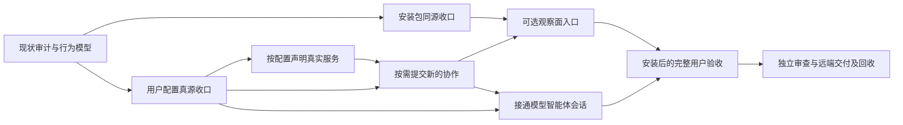

# AgentTeams 本地用户 MVP 交付计划

日期：2026-10-02。输入基线：`5496e1e925e4bbe612d509488368003bd78880d6`。
状态：审计与设计已落盘；下列产品 delivery units 尚未实施。
本文件接替旧 G0/L1-L5 的本地产品任务排序；交付质量仍引用 `teams-long-running-delivery.md`、`development-governance.md` 和当前 AGENTS。不是新 goal/subscription。

## 唯一交付目标

普通用户安装一个 AgentTeams 包，只编辑 `~/.agentteams/config.toml` 即可启动本地 bridge、一个 provider 和一个 receiver；选择提供/使用的真实服务，反复提交新的请求并获得业务结果。可选 Console 能发现它们、观察协作、配置 provider/model，并通过有 Session 能力的 Agent 使用受管 OpenCode。关闭 Console 不终止 Agent Work；停止/重启保持配置，旧代次拒绝，资源有明确收口。

被动能力 Agent 无需模型。config.toml 是用户意图，internal.toml 是不需要用户编辑的运行配置/状态。证书、PID、动态端口、启动 token、子进程 JSON 由系统维护。

不把公网/NAT、STUN、手机、关系治理、自动 provider failover、生产部署或完整 UI 美化拉进本轮。后续公网与 coder2new 工作保留，须等本地用户路径收口。

## 用户路径与实际验收

| 用户动作 | 应看到的结果 | 失败应如何表现 |
|---|---|---|
| 按说明安装，再运行 agentteams init | 在当前 HOME 生成可用用户配置及内部材料，不引用开发者源码目录 | 缺 Node/rg/OpenCode/Camo 等按启用服务说明，不声明不存在的能力 |
| 编辑 config.toml：provider 提供文件搜索，receiver 连接它 | 用户不用编辑 relay.json、Console JSON、provider JSON 或 internal.toml | 无效服务/资源/绑定在唯一 config owner 明确拒绝 |
| agentteams start/status | 一个 bridge、两个独立 daemon；UI/CLI 显示声明与实际服务一致 | 已占端口、鉴权拒绝、子进程失败保留原错误并回收本轮资源 |
| agentteams work 提交 query A，再提交 query B | 两次新的请求 identity、真实结果不同，显示业务结果与状态 | 不重复读同一次 startup receipt；传输 unknown 不自动重发 |
| 按 UI 给出的管理地址打开 Console | 自动发现本机端点、服务/资源、在线状态及 Work | Manager policy 与入口 auth/origin 拒绝明确 |
| 给 OpenCode Agent 选择 RCC 或显式备用 provider/model，再发消息 | accepted/effective 区分；消息/工具/审批经过 Agent 与 adapter 真实接线 | catalog 空可显式添加；配置/请求失败无 silent fallback |
| 关闭 Console，继续 agentteams work | Agent-to-Agent 仍成功，不经过 Console | Console 退出不能终止 Work 或改 provider 账本 |
| stop/start 后再提交新任务 | 用户配置保留，新 generation 正常，旧 generation 拒绝 | 外部 browser 结果未确认时显式保留责任，不假释放 |

上表中新的命令参数、Console 启动方式和首次 provider 编辑细节，由相应 unit 细化到已审设计后实现，不在本计划凭空声明已有 CLI 支持。

## 行为改造与 delivery units

D0 本次已建七个项目 graph：启动、Work、配置、观察、Session、停止、版本交付；只完成静态治理，未接 DAGpipe SDK runtime。
后续每个 unit 从当时最新 origin/main 建外置独立 clean worktree `/Volumes/Intel/playground/agentteams/<unit>`；记录唯一 owner、base、allowed paths、验收、candidate tree。只有已确认可复现缺陷/需跨轮跟踪的内容进入 AppSDK bug，先查询去重，不预造 bug ID。

| Unit / 顺序 | 本次最小交付范围 | 独占修改范围与禁止范围 | 完成 iff |
|---|---|---|---|
| U1 安装生成物 | 用户 CLI 包包含 runtime 与 Console/UI 必需 assets；从安装位置派生路径；稳定版本/入口说明 | package.json、scripts/package-artifact.mjs、scripts/installed-runtime-smoke.mjs、必要 package 配置；不改业务 owner | 离开源码树安装，clean HOME init/start/status/stop；相同安装包可载入真实 Console assets，产物 hash 绑定候选 |
| U2 配置真源 | 用户 provider/model、Console、bridge、endpoint service intent 纳入 config.toml；内部材料归 internal.toml；受管 OpenCode JSON只作派生 | runtime/local-config.ts、runtime/process-config.ts、config/runtime-config.ts、对应测试；不改 CLI/Work executor/UI | 无需第二份 editable 配置；Console CAS 与磁盘意图一致；重启 provider/model 和服务仍有效；旧 JSON 迁移验证后删除旧输入引用 |
| U3 真实服务声明 | enabled adapter 与声明一致；provider 暴露服务/operation/resource，receiver 选择 target；容量配置由 provider 执行 | agent-host/cli-executor.ts、cli-adapter/**、agent/work-resource.ts 仅适用配置接线、对应测试；不改 U2 config parser | file-search 可用；未启用 browser 不可匹配；启用 browser 真实创建/销毁；两 consumer 并发与超容量拒绝；无双账本 |
| U4 按需新 Work | 每次用户提交创建新任务，允许输入不同 payload、读取真实业务结果；保留明确幂等查询能力 | cli/agentteams.mjs、runtime/local-process.ts、runtime/agent-process.ts、runtime/agent-work-client.ts、对应测试；不改配置真源/能力实现 | 连续两请求实际执行两次；关闭 Console 仍可用；失败、unknown、旧代次/target 处理和资源回执真实 |
| U5 可选 Console 用户入口 | 从同一 TOML 与安装包启动可选观察面；目录发现、权限、配置/Work 视图；提供可打开地址 | runtime/local-supervisor.ts、runtime/local-process.ts、runtime/console-process.ts、console-host/**；UI worker 单独拥有 ui/teams-console/** | 干净安装用户无需写 JSON；真实浏览器发现两个 daemon；授权/未授权正反路径；关闭 Console 后新 Work 成功 |
| U6 OpenCode Session 接线 | Agent session owner 使用现有受管基座，接 send/observe/permission/cancel；passive Agent 仍明确不支持 | runtime/agent-process.ts、opencode-adapter/**、必要 console session projection 与对应测试；不扩展网络协议以携带控制 metadata | Console 真消息往返、至少一次真实 tool dispatch/result、ask 批准/拒绝、取消结果确认；重启用持久配置；两个 provider 分别显式使用 |
| U7 可重入交付与用户验收 | 复用 lifecycle stage store，细化受影响依赖；统一同一包的最终黑盒；整理 README/maps 和资源闭环 | scripts/lifecycle-adapter.mjs、既有 records schema 中确有需要的绑定、受影响 docs/maps；不建新 PASS 缓存或 scheduler | 中途失败后恢复跳过有效阶段；绑定图/源/配置/环境/产物变更使适用下游失效；远端 main、review、真实入口、清理全齐 |

U2 跨配置 owner 的事务边界必须先做窄设计 review，不能让 runtime/local-config 与 config store 同时写用户意图。所有产品实现沿本次图定位第一缺边；更新 graph 或调用 owner 时同步现有 maps。

## 顺序与可并发范围



- 第一批：U1 packaging worker 与 U2 config worker 可并发；各写独立 worktree，无共享文件。
- 第二批：U2 集成后 U3 capability worker 与 U4 worker 准备定向测试可并发，但 U4 的最终 E2E 等 U3。U3 不改 parser，U4 不改 executor。
- U5 runtime 与 U6 session 都可能修改 agent-process/local-process 或其 projection；按集成依赖串行，同文件不并发写。U5 的 UI worker 可在固定 contract 下并行，只拥有 UI 路径；fixture 不替代真实浏览器验收。
- U7 的生命周期 reuse 窄单元可与 U3 并发，最终用户安装回放必须等 U1–U6 同一候选集成。任何同路径冲突退回 owner，primary 不手工覆盖隐藏语义冲突。
- Primary 负责架构、DAG/配置 owner 决策、边界调度、证据审核、集成、推送和清理。GCM workers 完成有边界实现与 debug/E2E；独立 reviewer 与作者不同。milestone 使用 oauth + gpt-6.1-sol，无 AGY。

此顺序强调 user path，不把 stage numbers 当成新运行框架。每个 unit 完成后独立合入 main/push/cleanup，不积累多个 dirty worktree 等一个大合并。

## 验收命令和新增黑盒责任

现有定向入口，按该 unit 的实际影响选择，不每次跑全部：

```text
pnpm install --frozen-lockfile
pnpm build:runtime
pnpm --dir opencode-adapter build
pnpm exec vitest run --no-file-parallelism --configLoader runner <该 unit 对应下列测试文件>
```

| Unit | 现有测试文件 | 必须新增或扩展的真实入口证据 |
|---|---|---|
| U1 | cli/agentteams.spec.ts；server/deployment-contract.spec.ts | 从真实 pack 安装位置跑 CLI 和 Console assets；不从源码 generated JS 代替 |
| U2 | runtime/local-config.spec.ts；runtime/agent-process-config.spec.ts；config/runtime-config.spec.ts；runtime/console-config.spec.ts | 只改 TOML，应用→stop/start→readback；provider credential 缺失与 CAS 冲突 |
| U3 | agent-host/cli-executor.spec.ts；agent/work-resource.spec.ts；agent-host/work-host.spec.ts | 真 rg 搜索、按启用配置的 browser 生命周期、两个 consumer 并发/超容量 |
| U4 | runtime/local-process.spec.ts；runtime/local-two-agent.spec.ts；runtime/agent-work-client.spec.ts | 安装后的新请求 A/B；unknown 不重放；业务结果输出；generation 与 Console-offline |
| U5 | runtime/console-hub.spec.ts；runtime/console-runtime.spec.ts；console-host/tests/http-api.spec.ts；ui/teams-console/tests/api.spec.ts | Camo 真用户点击发现、观察、配置；auth/origin/Agent authorization 失败 |
| U6 | runtime/managed-opencode-session.spec.ts；runtime/managed-config-live.spec.ts；opencode-adapter/tests/managed-config.spec.ts | 从 Console→Agent→OpenCode 消息、工具和 ask 正反路径，不只 /v1/models 或 health |
| U7 | scripts/lifecycle-adapter.mjs 的既有测试入口先核实；不猜不存在的命令 | 人为令一个受影响 gate 失败，再恢复，仅重跑首失效节点与下游；证据删除/源改变反向验收 |

每个 unit 在建单时把 `<测试文件>` 展开成精确命令，记录期望与证据位置。新增用户黑盒 harness 的文件/脚本与命令必须在 implementation contract 中声明，未生成前不假定存在。
代码交付以可重复黑盒用例为标准：从真实用户入口或公开接口输入，断言外部结果及受影响成功、失败和副作用；单测、内部 mock、私有状态或源码结构断言不能代替，缺适用黑盒证据不进入架构 review。
首次/最终适用 full source baseline 使用 pnpm verify；pnpm smoke:installed 目前验证旧 governance artifact，U1 改造后必须核对它与用户 pack 对象等价。typecheck/build/AppSDK source/admission 按实际改动及 records applicability 执行。

## 版本交付终点

每个候选在最新 main 组合后完成开发测试、安装包重建、真实入口、独立 exact review，再集成到 clean main、push 并核对远端 SHA。部署或实际运行版本变化须记录 binary/产物 hash，不拿旧回放充新结果。
清理本轮 own child、daemon、listener、临时 HOME/tarball/log 和 worktree；证据留项目 records/evidence，不残留临时资源。dirty worktree 不强删；保留责任必须列 owner/路径/原因/解除动作。

本地用户 MVP 完成 iff：上面的完整用户路径在同一已安装候选通过，Console-offline、restart、失败/拒绝/资源收尾成立，产品 milestone review PASS，远端 main receipt 与 own cleanup 齐备。静态 DAG PASS、单测、旧 live receipts、development_ready 单独均不足以关闭。
