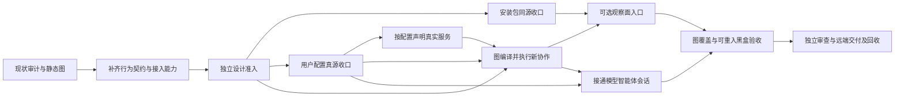

# AgentTeams 本地用户 MVP 交付计划

日期：2026-10-02。原审计源码基线：`5496e1e925e4bbe612d509488368003bd78880d6`；本次计划基线：`946c0734618e2ed8aa6da597b97848699fa3585c`。
状态：审计、中文行为模型及七条静态 graph 已落盘；最终设计准入、SDK 接入和下列产品 delivery units 尚未完成。历史源码/网络证据不代表本次安装后的交付通过。
本文件接替旧 G0/L1-L5 的本地产品任务排序；交付质量仍引用 `teams-long-running-delivery.md`、`development-governance.md` 和当前 AGENTS。不是新 goal/subscription。

## 唯一交付目标

普通用户安装一个 AgentTeams 包，只编辑 `~/.agentteams/config.toml` 即可启动本地 bridge、一个 provider 和一个 receiver；选择提供/使用的真实服务，反复提交新的请求并获得业务结果。可选 Console 能发现它们、观察协作、配置 provider/model，并通过有 Session 能力的 Agent 使用受管 OpenCode。关闭 Console 不终止 Agent Work；停止/重启保持配置，旧代次拒绝，资源有明确收口。

被动能力 Agent 无需模型。config.toml 是用户意图，internal.toml 是不需要用户编辑的运行配置/状态。证书、PID、动态端口、启动 token、子进程 JSON 由系统维护。

不把公网/NAT、STUN、手机、关系治理、自动 provider failover、生产部署或完整 UI 美化拉进本轮。后续公网与 coder2new 工作保留，须等本地用户路径收口。

## 用户路径与实际验收

| 用户动作 | 应看到的结果 | 失败应如何表现 |
|---|---|---|
| 按说明安装，再运行 agentteams init | 在当前 HOME 生成可用用户配置及内部材料，不引用开发者源码目录 | 缺 Node/rg/OpenCode/Camo 等按启用服务说明，不声明不存在的能力 |
| 编辑 config.toml：provider 提供文件搜索，receiver 连接它 | 用户不用编辑 relay.json、Console JSON、provider JSON 或 internal.toml | 无效服务/资源/绑定在唯一 config owner 明确拒绝 |
| agentteams start/status | 一个 bridge、两个独立 daemon；UI/CLI 显示声明与实际服务一致 | 已占端口、鉴权拒绝、子进程失败保留原错误并回收本轮资源 |
| agentteams work 提交 query A，再提交 query B | 两次新的请求 identity、真实结果不同，显示业务结果与状态 | 不重复读同一次 startup receipt；传输 unknown 不自动重发 |
| 按 UI 给出的管理地址打开 Console | 自动发现本机端点、服务/资源、在线状态及 Work | Manager policy 与入口 auth/origin 拒绝明确 |
| 给 OpenCode Agent 选择 RCC 或显式备用 provider/model，再发消息 | accepted/effective 区分；消息/工具/审批经过 Agent 与 adapter 真实接线 | catalog 空可显式添加；配置/请求失败无 silent fallback |
| 关闭 Console，继续 agentteams work | Agent-to-Agent 仍成功，不经过 Console | Console 退出不能终止 Work 或改 provider 账本 |
| stop/start 后再提交新任务 | 用户配置保留，新 generation 正常，旧 generation 拒绝 | 外部 browser 结果未确认时显式保留责任，不假释放 |

上表中新的命令参数、Console 启动方式和首次 provider 编辑细节，由相应 unit 细化到已审设计后实现，不在本计划凭空声明已有 CLI 支持。

## 行为改造与 delivery units

D0 本次已建七个项目 graph：启动、Work、配置、观察、Session、停止、版本交付；只完成静态治理，未接 DAGpipe SDK runtime。
后续每个 unit 从当时最新 origin/main 建外置独立 clean worktree `/Volumes/Intel/playground/agentteams/<unit>`；记录唯一 owner、base、allowed paths、验收、candidate tree。只有已确认可复现缺陷/需跨轮跟踪的内容进入 AppSDK bug，先查询去重，不预造 bug ID。

### 首先关闭的 gap

| Gap | 已有事实与欠缺 | 关闭责任 |
|---|---|---|
| 模型还不能作为执行契约 | 七图静态校验通过；ARC 仍为宽泛 Object，缺完整触发事件、守卫、公开接口与异常收尾绑定；没有最终设计 review PASS | D1 + D2 |
| DAGpipe 没有执行产品请求 | teams.*@1 尚未注册 Operator，没有 SDK compile、CompiledGraph、真实运行及结果消费证据 | D2 + D3/U4 |
| 安装对象不统一 | 用户 pack 缺 Console assets，治理 installed smoke 与用户安装包不是同一个对象 | U1 |
| 用户配置有多处输入 | TOML 已有基础，bridge、Console 和 provider/model 仍依赖独立 JSON；accepted/effective 的持久化事务需定界 | U2 |
| 服务声明与实际能力不一致 | CLI executor 固定声明 browser/file-search，缺失 browser CLI 仍可能广播；资源容量未统一由用户意图驱动 | U3 |
| work 没有按用户请求执行 | 当前 CLI 读取 startup configuredWork 回执；缺每次调用创建新任务及显示真实结果的路径 | D3/U4 |
| UI 与 Session 用户路径未闭合 | Console 缺同包用户启动入口；daemon Session 投影为空且 sendSession 明确不支持 | U5 + U6 |
| 交付证据粒度不足 | 已有 lifecycle stage store 可复用，但缺用户黑盒用例及图/注册表/产物的失效依赖 | D4/U7 |

上述实现偏离以 [审计记录](../design/teams-behavior-audit-20261002.md) 为来源，属于源码审计结论；开始修复时先用当前公开入口确认，不把审计假设写成已经复现的 bug。

### 建模与 DAGpipe 改造责任

| Unit | 产物、边界与 owner | 完成 iff / 验证 |
|---|---|---|
| D1 行为契约补链 | Primary 维护现有 behavior-model、七个 graph 和受影响 architecture maps；逐对象写事件表：生产者、消费者、关联身份、前置状态/守卫、状态变化、公开结果、失败/取消/unknown 与收尾责任。不得按私有函数切节点 | 每条图单源单汇；具体 typed ARC 的数据形状、业务结果与控制资源隔离、Operator effects/replay 约束、输入输出与真实公开接口一一对应；改变的图通过 dagpipe graph validate/inspect |
| D2 SDK 接入能力与设计准入 | Primary 核实 dagpipe sdk path、SDK 版本/API、Node/TS 宿主到 SDK 的最小支持边界及打包方式；在独立实验树用实际 consumer 验证，不修改产品。当前已知安装的是 Rust SDK，不假设存在 TS SDK | 留下可编译/运行的真实 SDK 接入探针和失败路径证据；选定项目自有接入目录及 allowed paths 后，由独立 reviewer 对 D1/D2 精确设计给 PASS，再编码。缺工具链/宿主支持则列具体 blocker、owner、解除动作；静态校验不替代此门禁 |
| D3/U4 可执行 Work 主线 | 同一个有边界的实现单元同时完成按需 Work 和 DAGpipe 执行接线；project-owned Operators 调用现有 network/Agent 公开接口；依 D2 确认后新增唯一 runtime adapter，禁止新建第二个 daemon、资源账本或调度器 | 用户安装入口真正走 registered Operators → SDK compile → immutable CompiledGraph → Runtime → 用户消费结果；绑定 graph/registry/contracts/effects/SDK/产物身份。BB04–BB07、BB11 通过；独立 demo 或 journal 单独不能关闭 |
| D4/U7 覆盖与可重入交付 | 同一个生命周期单元复用现有 stage store；将其他六图逐条标为 executable 或 static-governed，并附当前契约依据、owner、入口和验收边界；不要声称全部已经 SDK 化 | Work 的 executable 路径必须成立；其他对象图与实际接线一致、分类明确。无必要的整体重写；图/registry/contracts/effects/SDK/产物改变使受影响节点及后继失效；BB12–BB14 和最终安装回放通过 |

D1/D2 是编码前的设计与能力准入。只读检查及隔离 SDK 探针可用于关闭未知能力，不允许先写产品实现再倒补设计。D3 与 U4、D4 与 U7 各为同一交付责任，不能派给两个 worker 重复实现。

SDK 是单进程 runtime，不是跨机器执行器；远端 provider 仍通过现有公开协议接纳和执行，资源 admission 真源仍在 provider Agent。若公开接口将资源分配/执行/回执合为一次操作，图节点应表达该真实契约边界，内部资源状态机保留在唯一 owner；不得为迁就图的颗粒度虚构远端 API。业务语义变化必须先修模型并再审。

Effectful Operator 按真实副作用声明能力与 replay 约束。失败 wave 的已启动节点可能已有副作用；项目 owner 必须消费 ExecutionFailure/journal，并进入失败收尾或保留责任终点。取消、重试和 state transition 的图触发由项目 owner 显式驱动；不假设 SDK 自动补偿、清理或安全重放。

| Unit / 顺序 | 本次最小交付范围 | 独占修改范围与禁止范围 | 完成 iff |
|---|---|---|---|
| U1 安装生成物 | 用户 CLI 包包含 runtime 与 Console/UI 必需 assets；从安装位置派生路径；稳定版本/入口说明 | package.json、scripts/package-artifact.mjs、scripts/installed-runtime-smoke.mjs、必要 package 配置；不改业务 owner | 离开源码树安装，clean HOME init/start/status/stop；相同安装包可载入真实 Console assets，产物 hash 绑定候选 |
| U2 配置真源 | 用户 provider/model、Console、bridge、endpoint service intent 纳入 config.toml；内部材料归 internal.toml；受管 OpenCode JSON只作派生 | runtime/local-config.ts、runtime/process-config.ts、config/runtime-config.ts、对应测试；不改 CLI/Work executor/UI | 无需第二份 editable 配置；Console CAS 与磁盘意图一致；重启 provider/model 和服务仍有效；旧 JSON 迁移验证后删除旧输入引用 |
| U3 真实服务声明 | enabled adapter 与声明一致；provider 暴露服务/operation/resource，receiver 选择 target；容量配置由 provider 执行 | agent-host/cli-executor.ts、cli-adapter/**、agent/work-resource.ts 仅适用配置接线、对应测试；不改 U2 config parser | file-search 可用；未启用 browser 不可匹配；启用 browser 真实创建/销毁；两 consumer 并发与超容量拒绝；无双账本 |
| D3/U4 按需新 Work | 每次用户提交创建新任务，通过 DAGpipe 执行公开 Work 契约，读取真实业务结果；保留明确幂等查询能力 | cli/agentteams.mjs、runtime/local-process.ts、runtime/agent-process.ts、runtime/agent-work-client.ts、D2 准入的 SDK adapter 目录、对应测试；不改配置真源/能力实现 | 连续两请求实际执行两次；关闭 Console 仍可用；失败、unknown、旧代次/target 和资源回执真实；SDK compile/run 与安装入口结果关联 |
| U5 可选 Console 用户入口 | 从同一 TOML 与安装包启动可选观察面；目录发现、权限、配置/Work 视图；提供可打开地址 | runtime/local-supervisor.ts、runtime/local-process.ts、runtime/console-process.ts、console-host/**；UI worker 单独拥有 ui/teams-console/** | 干净安装用户无需写 JSON；真实浏览器发现两个 daemon；授权/未授权正反路径；关闭 Console 后新 Work 成功 |
| U6 OpenCode Session 接线 | Agent session owner 使用现有受管基座，接 send/observe/permission/cancel；passive Agent 仍明确不支持 | runtime/agent-process.ts、opencode-adapter/**、必要 console session projection 与对应测试；不扩展网络协议以携带控制 metadata | Console 真消息往返、至少一次真实 tool dispatch/result、ask 批准/拒绝、取消结果确认；重启用持久配置；两个 provider 分别显式使用 |
| D4/U7 可重入交付与用户验收 | 复用 lifecycle stage store，绑定 SDK/graph/registry 依赖；统一同一包的最终黑盒；整理 README/maps 和资源闭环 | scripts/lifecycle-adapter.mjs、scripts/blackbox-user-mvp.mjs（待实现）、既有 records schema 中确有需要的绑定、受影响 docs/maps；不建新 PASS 缓存或 scheduler | 中途失败后恢复跳过有效阶段；绑定图/源/配置/环境/产物变更使适用下游失效；远端 main、review、真实入口、清理全齐 |

U2 跨配置 owner 的事务边界必须先做窄设计 review，不能让 runtime/local-config 与 config store 同时写用户意图。所有产品实现沿本次图定位第一缺边；更新 graph 或调用 owner 时同步现有 maps。

## 顺序与可并发范围



- 首先完成 D1/D2 并取得最终设计准入；Primary 明确 SDK 接入目录和允许修改范围，不将探针成功宣称产品接线完成。
- 第一批：U1 packaging worker 与 U2 config worker 可并发；各写独立 worktree，无共享文件。U1 先收口现有 assets，SDK 产物依 D2 设计纳入同一安装包，D3 实现后补验该产物。
- 第二批：U2 集成后 U3 capability worker 与 U4 worker 准备定向测试可并发，但 U4 的最终 E2E 等 U3。U3 不改 parser，U4 不改 executor。
- U5 runtime 与 U6 session 都可能修改 agent-process/local-process 或其 projection；按集成依赖串行，同文件不并发写。U5 的 UI worker 可在固定 contract 下并行，只拥有 UI 路径；fixture 不替代真实浏览器验收。
- D3/U4 的 SDK adapter 与 Work orchestration 由同一 worker 拥有，不能分开并行修改该路径。D4/U7 的生命周期 reuse 窄单元可与 U3 并发，最终用户安装回放必须等 U1–U6 同一候选集成。任何同路径冲突退回 owner，primary 不手工覆盖隐藏语义冲突。
- Primary 负责架构、DAG/配置 owner 决策、边界调度、证据审核、集成、推送和清理。GCM workers 完成有边界实现与 debug/E2E；独立 reviewer 与作者不同。milestone 使用 oauth + gpt-6.1-sol，无 AGY。

此顺序强调 user path，不把 stage numbers 当成新运行框架。每个 unit 完成后独立合入 main/push/cleanup，不积累多个 dirty worktree 等一个大合并。

## 验收命令和新增黑盒责任

现有定向入口，按该 unit 的实际影响选择，不每次跑全部：

```text
pnpm install --frozen-lockfile
pnpm build:runtime
pnpm --dir opencode-adapter build
pnpm exec vitest run --no-file-parallelism --configLoader runner <该 unit 对应下列测试文件>
```

| Unit | 现有测试文件 | 必须新增或扩展的真实入口证据 |
|---|---|---|
| U1 | cli/agentteams.spec.ts；server/deployment-contract.spec.ts | 从真实 pack 安装位置跑 CLI 和 Console assets；不从源码 generated JS 代替 |
| U2 | runtime/local-config.spec.ts；runtime/agent-process-config.spec.ts；config/runtime-config.spec.ts；runtime/console-config.spec.ts | 只改 TOML，应用→stop/start→readback；provider credential 缺失与 CAS 冲突 |
| U3 | agent-host/cli-executor.spec.ts；agent/work-resource.spec.ts；agent-host/work-host.spec.ts | 真 rg 搜索、按启用配置的 browser 生命周期、两个 consumer 并发/超容量 |
| U4 | runtime/local-process.spec.ts；runtime/local-two-agent.spec.ts；runtime/agent-work-client.spec.ts | 安装后的新请求 A/B；unknown 不重放；业务结果输出；generation 与 Console-offline |
| U5 | runtime/console-hub.spec.ts；runtime/console-runtime.spec.ts；console-host/tests/http-api.spec.ts；ui/teams-console/tests/api.spec.ts | Camo 真用户点击发现、观察、配置；auth/origin/Agent authorization 失败 |
| U6 | runtime/managed-opencode-session.spec.ts；runtime/managed-config-live.spec.ts；opencode-adapter/tests/managed-config.spec.ts | 从 Console→Agent→OpenCode 消息、工具和 ask 正反路径，不只 /v1/models 或 health |
| U7 | scripts/lifecycle-adapter.mjs 的既有测试入口先核实；不猜不存在的命令 | 人为令一个受影响 gate 失败，再恢复，仅重跑首失效节点与下游；证据删除/源改变反向验收 |

每个 unit 在建单时把 `<测试文件>` 展开成精确命令，记录期望与证据位置。新增用户黑盒 harness 的文件/脚本与命令必须在 implementation contract 中声明，未生成前不假定存在。
代码交付以可重复黑盒用例为标准：从真实用户入口或公开接口输入，断言外部结果及受影响成功、失败和副作用；单测、内部 mock、私有状态或源码结构断言不能代替，缺适用黑盒证据不进入架构 review。
首次/最终适用 full source baseline 使用 pnpm verify；pnpm smoke:installed 目前验证旧 governance artifact，U1 改造后必须核对它与用户 pack 对象等价。typecheck/build/AppSDK source/admission 按实际改动及 records applicability 执行。

## 安装后黑盒交付计划

执行对象：从精确候选生成的唯一用户安装包；在源码树之外安装，使用独立 HOME 和公开 CLI/API/真实浏览器。探针、单测或源码中的 helper 不能代替安装入口。模型/credential 引用从当前配置读取，证据不包含秘密。
下面是待实现用例，不是已通过证据。U7 汇总 driver，其他 unit 提供所属用例；driver 不直接调用私有函数、修改内部账本或 mock 执行器。输入及观察走正式控制/查询接口，副作用在真实服务或测试自有文件/进程上核对。

| Case / owner / 图 | 公开输入与触发 | 外部结果及副作用断言 |
|---|---|---|
| BB01 / U1 / B1,B4,B6 | 源码树外安装 pack；init，启动、查询、打开 Console 后停止 | 路径来自安装包；CLI/runtime/UI assets 齐备，无开发目录依赖；退出后本轮进程/listener 不残留；缺必需依赖显式失败 |
| BB02 / U2 / B1,B3 | 只编辑 config.toml，声明 bridge、provider、receiver；start/status | 不需用户编辑其他配置；两个独立 daemon PID，经真实 local socket 注册、广播、发现、协商连接；internal.toml 为派生运行配置 |
| BB03 / U3 / B1,B2 | 禁用 browser 或指向不存在 CLI，再启用可执行 browser；查询目录并提出 browser Work | 禁用/缺失能力不宣告可用、不可匹配且拒绝无执行副作用；启用后实际创建/销毁自己的 browser context，file-search 返回真实文件匹配 |
| BB04 / D3/U4 / B2 | 创建含不同标记的自有文件；公开 work 提交 query A，再 query B；显式查询原请求 | A/B 使用新 Work/request ID，并分别返回对应真实搜索结果；查询原 ID 返回原回执且不重复执行，不读 startup receipt 冒充新结果 |
| BB05 / U3,U4 / B2 | 未授权 consumer/manager、未声明 operation、旧 generation、错误 target 发请求 | 每项明确拒绝，真实服务无新增执行/资源副作用；拒绝不表现为空结果或成功；合法请求仍成功 |
| BB06 / U3 / B2 | 两 receiver 向同 provider 使用真实 browser Work；保持可见活动 context，达到配置容量再发额外请求，关闭后再请求 | 一对多真实成立；超容量明确拒绝且不多建 context；确认释放后可再接纳；通过公开状态及实际 context 观察，不用 mock 账本 |
| BB07 / D3/U4 / B2,B6 | 实际请求执行中断开本轮 socket 或停止自有 provider；查询结果，再恢复/停止 | failed 或 unknown 与事实一致；unknown 不自动重发/假释放；外部资源保留明确 owner、状态和恢复动作；确认销毁后有最终回执 |
| BB08 / U2,U4 / B1,B3,B6 | 应用服务/provider/model 配置；stop/start；用旧与新 generation 发 Work | 用户意图及 accepted/effective 区分持久；新代次有效、旧代次拒绝；旧资源责任不能因重启消失；无第二份 editable JSON |
| BB09 / U5 / B4,B2 | 用真实 Camo 浏览器打开安装后的 Console，发现/config/观察；验证入口 auth/origin 拒绝；关闭 Console，再发新 Work | 展示两个真实 daemon 及权威服务/资源；配置进入同一 owner；未经授权不能管理；Console 离线后新的 Agent Work 仍成功 |
| BB10 / U2,U6 / B3,B5 | 当前 RCC provider 显式模型请求；catalog 空时仍选明确模型；显式切换 backup 后再请求；制造配置冲突/无效凭据 | 两个 provider 分别有真实成功调用；accepted/effective readback 明确；空 catalog 不阻止显式模型；CAS/鉴权失败明确，无自动 failover。地址和凭据只从当时真源读取 |
| BB11 / D3/U4 / B2 | 用安装 CLI 发真实 Work，再以未注册 Operator、ARC 契约错误或缺 effects 的隔离候选执行 compile | 正常用户结果关联精确 graph、SDK、registry、CompiledGraph 和 journal；compile 缺契约/effects 时显式失败且没有业务副作用；不能只跑独立 SDK demo |
| BB12 / U6 / B5 | Console→Agent→OpenCode 发消息和真实工具请求；分别批准/拒绝真实 permission；取消活动请求；对 passive Agent 发 Session | 消息及 tool ID/arguments/result 意义完整；批准产生期望副作用，拒绝无该副作用；cancel 有基座最终确认；被动 Agent 明确不支持。模型随机文本不作为固定断言 |
| BB13 / D4/U7 / B7 | 使一个 stage 确定失败，恢复后重入；再分别改源、图/registry、配置、产物或删除必需证据 | 相同有效输入的已完成阶段不重复执行；只重跑首失效节点及依赖后继；变化不能错误复用 PASS；每次 reuse/invalidate 有已有 store receipt |
| BB14 / U1,U7 / B1,B6,B7 | 制造本轮启动失败；完成 stop 及交付 cleanup；检查自有 children、端口、临时安装和 worktree | 不停止其他 owner 的进程；本轮资源移除且证据保留；dirty 或保留责任资源明确列 owner/路径/解除动作，未核销不得 complete |

统一 driver 命令协议（**待实现，目前不可运行**）：

```text
node scripts/blackbox-user-mvp.mjs --case BB04 --package <本候选安装包绝对路径> --evidence-dir <本单元证据目录>
node scripts/blackbox-user-mvp.mjs --case all --package <最终同一安装包绝对路径> --evidence-dir <最终验收证据目录>
```

各 unit 的派单必须先细化公开 CLI/API 参数和精确 focused/regression/build/blackbox 命令、期望、证据目录；未实现 driver 不伪装可执行。最终 driver 按已批准用例运行 BB01–BB14；故障从公开边界制造，不能靠内部 monkey-patch 成功。

每份 blackbox receipt 绑定 case、candidate commit/tree/base、安装包版本/hash、安装 CLI/SDK binary hash、graph/registry/contracts/effects 指纹、输入配置 revision、必要工具/环境、公开请求及结果、实际副作用、失败终点、资源收尾。业务结果与控制 receipt 物理分离；execution journal 只作执行证据，业务决策不得从日志重建控制真相。

任务状态按现有 run notes 推进：design-pending → design-admitted → implementing → author-verified → review-pass → integrated → pushed → cleanup-complete；失败/阻塞保留首偏离、输入版本、证据和解除动作。已有证据输入不变且仍有效时复用；共享 main/远端/实际 runtime 在动作边界刷新。只读审计和本次文档交付无需跑产品全量测试。

## 版本交付终点

每个候选在最新 main 组合后完成开发测试、安装包重建、真实入口、独立 exact review，再集成到 clean main、push 并核对远端 SHA。部署或实际运行版本变化须记录 binary/产物 hash，不拿旧回放充新结果。
清理本轮 own child、daemon、listener、临时 HOME/tarball/log 和 worktree；证据留项目 records/evidence，不残留临时资源。dirty worktree 不强删；保留责任必须列 owner/路径/原因/解除动作。

本地用户 MVP 完成 iff：D1/D2 最终设计已准入；D3/U4 的真实安装 Work 经 SDK compile/run 并被用户消费；其余图的执行/静态治理分类有依据；U1–U7 和 BB01–BB14 在最终同一安装包通过，Console-offline、restart、失败/拒绝/资源收尾成立；产品 milestone review PASS，远端 main receipt、按项目契约的阶段记忆与 own cleanup 齐备。静态 DAG PASS、单测、SDK demo、旧 live receipts、development_ready 单独均不足以关闭。
