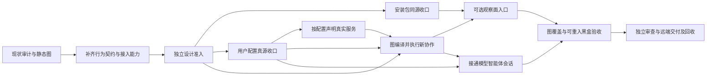

# AgentTeams 本地用户 MVP 交付计划

日期：2026-10-03（UTC）。原审计源码基线：`5496e1e925e4bbe612d509488368003bd78880d6`；本次计划更新输入：`8d143ae8bab7594d25402282a4a2ed33d06919b0`，已 fetch 并核对 main clean 与远端 main 相同。接手时刷新 main/远端及各任务终态；以下状态是本次核对快照，不代替当前 receipt。
状态：D1 行为契约、八条静态 graph 和 D2 真实 SDK consumer 已独立审查 PASS、合入并推送；阶段记忆已晋升 L2，标记 ai-reviewed/human-unreviewed。产品 SDK 接线、U1–U7 和最终安装包 BB01–BB14 尚未交付。历史源码/网络证据及 SDK 探针不代表本次安装后的交付通过。
本文件接替旧 G0/L1-L5 的本地产品任务排序；交付质量仍引用 `teams-long-running-delivery.md`、`development-governance.md` 和当前 AGENTS。不是新 goal/subscription。

## 唯一交付目标

普通用户安装一个 AgentTeams 包，只编辑 `~/.agentteams/config.toml` 即可启动本地 bridge、一个 provider 和一个 receiver；选择提供/使用的真实服务，反复提交新的请求并获得业务结果。可选 Console 能发现它们、观察协作、配置 provider/model，并通过有 Session 能力的 Agent 使用受管 OpenCode。关闭 Console 不终止 Agent Work；停止/重启保持配置，旧代次拒绝，资源有明确收口。

被动能力 Agent 无需模型。config.toml 是用户意图，internal.toml 是不需要用户编辑的运行配置/状态。证书、PID、动态端口、启动 token、子进程 JSON 由系统维护。

不把公网/NAT、STUN、手机、关系治理、自动 provider failover、生产部署或完整 UI 美化拉进本轮。后续公网与 coder2new 工作保留，须等本地用户路径收口。

## 用户路径与实际验收

| 用户动作 | 应看到的结果 | 失败应如何表现 |
|---|---|---|
| 按说明安装，再运行 agentteams init | 在当前 HOME 生成可用用户配置及内部材料，不引用开发者源码目录 | 缺 Node/rg/OpenCode/Camo 等按启用服务说明，不声明不存在的能力 |
| 编辑 config.toml：provider 提供文件搜索，receiver 连接它 | 用户不用编辑 relay.json、Console JSON、provider JSON 或 internal.toml | 无效服务/资源/绑定在唯一 config owner 明确拒绝 |
| agentteams start/status | 一个 bridge、两个独立 daemon；UI/CLI 显示声明与实际服务一致 | 已占端口、鉴权拒绝、子进程失败保留原错误并回收本轮资源 |
| agentteams work 提交 query A，再提交 query B | 两次新的请求 identity、真实结果不同，显示业务结果与状态 | 不重复读同一次 startup receipt；传输 unknown 不自动重发 |
| 按 UI 给出的管理地址打开 Console | 自动发现本机端点、服务/资源、在线状态及 Work | Manager policy 与入口 auth/origin 拒绝明确 |
| 给 OpenCode Agent 选择 RCC 或显式备用 provider/model，再发消息 | accepted/effective 区分；消息/工具/审批经过 Agent 与 adapter 真实接线 | catalog 空可显式添加；配置/请求失败无 silent fallback |
| 关闭 Console，继续 agentteams work | Agent-to-Agent 仍成功，不经过 Console | Console 退出不能终止 Work 或改 provider 账本 |
| stop/start 后再提交新任务 | 用户配置保留，新 generation 正常，旧 generation 拒绝 | 外部 browser 结果未确认时显式保留责任，不假释放 |

上表中新的命令参数、Console 启动方式和首次 provider 编辑细节，由相应 unit 细化到已审设计后实现，不在本计划凭空声明已有 CLI 支持。

## 行为改造与 delivery units

D0 已建启动、Work、配置、观察、Session、停止、版本交付七图；D1 已将 B8 独立 Work 查询图合入，共八图。B2 只负责提交与结果收尾，B8 只查询原请求。图已静态治理，产品尚未接 DAGpipe SDK runtime。
后续每个 unit 从当时最新 origin/main 建外置独立 clean worktree `/Volumes/Intel/playground/agentteams/<unit>`；记录唯一 owner、base、allowed paths、验收、candidate tree。只有已确认可复现缺陷/需跨轮跟踪的内容进入 AppSDK bug，先查询去重，不预造 bug ID。

### 首先关闭的 gap

| Gap | 已有事实与欠缺 | 关闭责任 |
|---|---|---|
| 通用行为建模已准入，配置/Session 窄契约仍缺 | D1 事件/ARC/owner、五节点提交与四节点查询已 PASS；U2 已修订 per-daemon accepted、async/CAS 和内部端口边界，独立审查未结束；U6 独立设计 FAIL，六项 P1 尚待修订 | U2 + U6；不重做 D1 |
| DAGpipe 没有执行安装后的产品请求 | D2 八例及 identity guards 证明已有 Node 宿主能回调真实 Rust SDK；D3/U4 树已有 runtime/dagpipe 草稿，尚无作者完整验证、产品 review 或安装后 compile/run/业务结果回执。当前草稿的 host.call/result/error 仍把 target、policyRevision、channelRef、资源需求与错误材料放在 business；同一 owner 必须修 typed control/error 边界并验证，不能以 ARC 内分离代替跨进程端口分离 | D3/U4 |
| 安装对象不统一且隔离验收有缺口 | 用户 pack 缺 Console assets；U1 设计 r4 和最新 main 组合 r5 均 PASS，基础 package 实现 worker 已启动。动态端口、runner 缺失/hash/平台拒绝及完整 SDK build-input 的同包黑盒仍待产品实现 | U1 |
| 用户配置有多处输入 | TOML 已有基础，bridge、Console 和 provider/model 仍依赖独立 JSON；U2 设计候选包含 per-daemon accepted、异步锁/CAS、迁移与 observations，尚未准入或实现 | U2 |
| 服务声明与实际能力不一致 | CLI executor 固定声明 browser/file-search，缺失 browser CLI 仍可能广播；资源容量未统一由用户意图驱动 | U3 |
| work 没有按用户请求执行 | 当前 CLI 读取 startup configuredWork 回执；缺每次调用创建新任务及显示真实结果的路径 | D3/U4 |
| UI 与 Session 用户路径未闭合 | Console 缺同包用户启动入口；daemon Session 投影为空且 sendSession 明确不支持 | U5 + U6 |
| 交付证据粒度不足且 SDK 前置阻塞 | 已有 lifecycle stage store；真实重入诊断未到后阶段故障注入即失败。项目 pin `0.1.6` 与 canonical `0.1.0010` 不一致；官方 pin-lock 又返回 INVALID_SDK_MIGRATION_RECORD。缺用户黑盒 driver 及图/注册表/产物的失效依赖；重入缺陷仍未确认 | 前置 issue `852c3ac` / upstream `a7cc2a4`，随后 D4/U7 |

上述实现偏离以 [审计记录](../design/teams-behavior-audit-20261002.md) 为来源，属于源码审计结论；开始修复时先用当前公开入口确认，不把审计假设写成已经复现的 bug。

### 当前接手状态与最近完成条件

| 单元 | 当前事实 | 下一步与不能越过的边界 |
|---|---|---|
| D1 行为设计 | `94b4633`，精确 tree `da94159b`，r2 PASS；issue `ed0bada` 已关闭；`1b492fb` 为 L2 阶段记忆；设计/集成/记忆树已回收 | 复用准入；只在受影响契约/图改变时复验，不再修已关闭的 r1 问题 |
| D2 SDK 能力 | `35ca32b`，精确 tree `5acf841b`，r2 PASS；主线重建重放 8/8 与 identity guards；issue `8981687` 已关闭；`78fa8bc` 为 L2 记忆；自有树/cache 已回收 | 复用接入能力；该探针不关闭产品 BB11、portable package 或真实 Work |
| U1 窄安装设计 | r4 PASS；候选 commit `d6cfee64` 已组合 `8d143ae`，tree `77b37da1fc55f859d5185b03f98bb76355f30bd1`；r5-main controller completed/pass、exit 0，仅 P2 | 交付该设计、归档审查并回收设计树；不把设计 PASS 写成安装完成。安装 runner 名固定为 agentteams-dagpipe-runner，完整 SDK 输入身份由 D3 唯一 build receipt 提供 |
| U1 基础 package 实现 | issue `746dd7b`，base `8d143ae`；独占新 GCM worker 经 signal 0 确认 live，无终态 | 唯一 producer/pack root 和源码树外真实安装 consumer；不改业务 owner。基础模式 release_eligible=false，最终 SDK/Console 生命周期仍依赖 U2/U4/U5，不能关闭完整 U1 |
| U2 窄配置设计 | 作者已 exit 0 停写；base `8d143ae`，staged tree `87c4e4ebfcc80bf4a88c40d4baa9cac71e624541`，独立 r1 working；内部端口/heartbeat 已从用户 TOML 示例移出 | 冻结候选，消费正式审查；PASS 后交付设计并派独占配置实现。系统选择新机端口并持久化，既有端口占用显式失败，不静默换端口；迁移/双文件持久保证不得夸大 |
| D3/U4 SDK/Work | issue `4b6c377`，base `8d143ae`；旧 writer 因已证实无界 stdin 实验停止，包装 exit 0 不作完成；独立 r2 GCM 接手同一范围，经 signal 0 确认 live | 先修 fixture 路径、typed stdio 控制/业务/error 分离、有界关闭和唯一 SDK aggregate build receipt；当前候选重新验证。U1/U2 接缝冻结后同一 owner 扩展 CLI/receiver IPC；历史 5/5 不作最终证据 |
| U6 窄 Session 设计 | r1 官方 FAIL：旧审查 tree `41b6ae9b` 六项 P1；当前候选已组合 `8d143ae`，未重新审查。issue `83a8bd1` open，尚未派修订 writer | 按下方六项最小补链修设计，再由独立 reviewer 审新候选；product 等 U2/U4 共享 runtime 接缝释放。不采用第二个 Session model/config store |
| U7 重入诊断 | 作者 exit 0；两次真实 admission 分别返回 PROJECT_SDK_VERSION_PIN_MISMATCH / SDK_BINARY_DIGEST_MISMATCH，未到 smoke 故障注入；自有 PATH shim/监听已回收，证据与工作树待收口 | H1 晚绑定 evidence 导致前序重跑未确认也未证伪；先修官方前置再同入口复现，不选旧 binary、不删除真实性 gate、不建第二 PASS 缓存 |
| U7 SDK prerequisite | `852c3ac` open；clean `8d143ae` pin 实验中 canonical pin-lock 返回 INVALID_SDK_MIGRATION_RECORD，零 tracked 修改；upstream `a7cc2a4` 已 open | 保留失败证据、回收无修改实验树；upstream 唯一 migration reader 用真实旧 bundle 的同入口正反证据定位修复。仅阻断依赖 SDK admission/reentry 的节点，其他产品工作继续 |
| U1–U7 产品交付 | 本次尚无已集成的产品行为改动，也没有最终安装包黑盒通过 | 按下方依赖推进，逐单元 push/cleanup，不用 D1/D2 完成推算产品完成百分比 |

当前有七个既有外置任务树：U1 设计/实现、U2 设计、D3/U4 实现、U6 设计、U7 诊断/pin 实验。恢复时读取各自 HEAD、notes 和终态，不凭旧 PID 重启或删除。U1 设计待独立交付；U7 诊断需归档证据，零修改 pin 实验需核销；其他未交付候选保留。完整 D1/D2 receipts 已保存在 primary 的 task-evidence/agentteams/receipts 中，源内证据见 docs/evidence/d1-behavior-contracts-20261003/ 和 docs/evidence/d2-sdk-probe-20261003/。此表不代替 exact receipt；main 尚无 U1–U7 产品交付。

### 下一轮的确定动作

1. 复用 U1 r5-main PASS，独立交付设计并回收设计树；继续既有基础 package writer，不重复派单。
2. 消费 U2 r1 终态：PASS 则交付设计并开启 U2 产品单元；FAIL 则仅修 findings 及受影响证据。
3. 派新 GCM 修 U6 设计的六条 P1，产品源码只读：移除无基座映射的 create.model，模型意图仅属 U2；任意 JsonValue 的 Console 业务传输保真，支持的 OpenCode 消息形状由 owning adapter 在副作用前显式验证；事件按 kind 要求完整身份及结果；取消保留 baseAccepted 与最终状态/unknown；use 内将明确 404/400 等转成 typed result，不永久污染 owner；配置能力声明与 runtime 可用观察分开。修正错误 owner 表和设计阶段禁止推理与 BB10 真实推理的范围差异。
4. 继续 D3/U4 r2，当前公开 harness 全部通过后才产品 review；U2 冻结/集成后释放 Work CLI 接缝。
5. 保存 U7 两次 preflight 和官方 pin 失败事实，归档诊断资源；跟踪 upstream，不改历史锁/收据假装迁移成功。前置修复后重做同入口后阶段故障注入，未复现前不关闭 U7。
6. 按 P1→P4 收口。当前未完成任何最终安装 BB 用例；实现 driver 前，其命令只作为协议设计，不声称可运行。

### 先闭合的窄模型

设计图只表达业务依赖，状态图表达生命周期事件；重试/重启触发新执行，不在单次 graph 内画回边。每个改变的业务对象须落盘事件、身份、守卫、结果、错误/unknown/取消与清理责任；节点到公开接口及源码 owner 的对应另列映射，不以函数调用图替代。

| 接缝 | 必须先明确的模型 | 准入终点 |
|---|---|---|
| U2 用户配置 → daemon | 机器 source revision/hash 表示用户源；每个 daemon 保持 durable accepted revision 与 effective/apply facts。新 source 不等于所有 daemon 已接受；catalog observation 不推进用户意图 revision。config.toml 只有一个用户意图写 owner，internal.toml 保持各 daemon 已接受内容的可恢复绑定 | 一次配置命令中文 SESE 图；独立配置状态转移图；复用 provider-config.graph.json，按需最小补链并 validate；不批准全机 accepted 替代每 daemon accepted |
| U2 文件事务 → Console/launcher | 唯一 TOML 写入锁与 CAS；固定 async persistence/store 接口及全部真实调用者；保留其他服务/身份/Console 字段；明确 source 变化时拒绝过时 refresh/apply；迁移输入显式指定，不猜路径 | 精确事务/崩溃恢复保证，不能声称现有 temp+rename 已实现双文件原子性/fsync；窄设计独立 PASS |
| U1 生成物 → 安装入口 | 单一 pack root、根版本源、SDK build inputs/runner/graphs 身份；实际使用的端口由系统选择并持久化。测试另有自有隔离端口、HOME、进程责任 | 修改 producer、artifact_paths 与两类 smoke 的同一 owner；端口冲突和 runner 缺失/hash 错误/不支持平台的黑盒终点明确 |
| D3/U4 用户命令 → receiver | 命令携显式 receiver/target/service/operation/request；receiver 是协作宿主，不是 Console。每次新提交新 identity；原请求 get 保留业务 identity，使用新 execution/attempt | 提交/查询沿已准入 B2/B8；先固定 typed IPC/control 与错误契约再扩写 CLI，不能在命令行重建 ledger |
| U6 Console → Session Agent | 新建、发送、观察、审批、取消是明确管理动作；passive Agent 明确不支持，Session Agent 有基座确认；Console 断开不取消 Agent 业务 | 复用 B5，必要最小图/控制契约补链及窄设计 review；保留消息/tool/permission 语义与完整终点 |

D1/D2 准入可复用；上表只约束尚未定义的受影响接缝，不把全部设计重开一遍。

### 图覆盖与实际执行边界

| 业务对象 | 目标执行分类 | 进入实现或交付的缺边 |
|---|---|---|
| B1 启动 / B3 配置 / B4 观察 / B5 Session / B6 停止 / B7 交付 | 当前保持 static-governed；由既有 TS/工具 owner 执行 | 各自 owner、真实入口、生命周期/异常终点及对应 BB 证据；不把静态 validate 写成 SDK runtime 已执行 |
| B2 新 Work 提交 | 必须 executable | 安装入口→Node 宿主→单次 Rust runner→注册 Operators→SDK compile→CompiledGraph→Runtime→现有公开 provider/transport owner→业务结果被用户消费 |
| B8 原 Work 查询 | 必须 executable，独立于 B2 | 新 execution/attempt + 原 Work/request→resolve/open/get→返回原观察；无 propose/request 重放、无隐式资源释放 |

每个改变的节点固定触发事件、关联身份、typed control/业务 ARC/error、唯一 owner、effects、成功/失败/取消/unknown 和清理证据。sdk Object 只验证形状，项目 decoder 负责字段；SDK 不提供自动鉴权、状态触发、补偿或清理。provider 继续独占 admission、容量、执行和结果账本；Node 不再排序图，Rust 不成为第二个常驻 daemon。
八个 graph JSON 是拓扑真源；中文语义图与状态图说明业务，现有 maps 说明实现位置。未改契约不重写图；设计窄审与产品 E2E 后的架构审查是不同准入。

### 建模与 DAGpipe 改造责任

| Unit | 产物、边界与 owner | 完成 iff / 验证 |
|---|---|---|
| D1 行为契约补链 | Primary 维护现有 behavior-model、graph 与受影响 architecture maps；逐对象写事件表：生产者、消费者、关联身份、前置状态/守卫、状态变化、公开结果、失败/取消/unknown 与收尾责任。B2 提交和 B8 原请求查询分开，不重放业务。不得按私有函数切节点 | 每条图单源单汇；具体 typed ARC 的数据形状、业务结果与控制资源隔离、Operator effects/replay 约束、输入输出与真实公开接口一一对应；改变的图通过 dagpipe graph validate/inspect；gate 声明与实际覆盖一致 |
| D2 SDK 接入能力与设计准入 | Primary 核实 dagpipe sdk path、SDK 版本/API、Node/TS 宿主到 SDK 的最小支持边界及打包方式；在独立实验树用实际 consumer 验证，不修改产品。当前已知安装的是 Rust SDK，不假设存在 TS SDK | 留下可编译/运行的真实 SDK 接入探针和失败路径证据；选定项目自有接入目录及 allowed paths 后，由独立 reviewer 对 D1/D2 精确设计给 PASS，再编码。缺工具链/宿主支持则列具体 blocker、owner、解除动作；静态校验不替代此门禁 |
| D3/U4 可执行 Work 主线 | 同一个有边界的实现单元同时完成按需 Work 和 DAGpipe 执行接线；project-owned Operators 调用现有 network/Agent 公开接口；依 D2 确认后新增唯一 runtime adapter，禁止新建第二个 daemon、资源账本或调度器 | 用户安装入口真正走 registered Operators → SDK compile → immutable CompiledGraph → Runtime → 用户消费结果；绑定 graph/registry/contracts/effects/SDK/产物身份。BB04–BB07、BB11 通过；独立 demo 或 journal 单独不能关闭 |
| D4/U7 覆盖与可重入交付 | 同一个生命周期单元复用现有 stage store；B2 提交与 B8 查询均须 executable；其余启动/配置/观察/Session/停止/交付六图逐条标为 executable 或 static-governed，并附当前契约依据、owner、入口和验收边界；不要声称全部已经 SDK 化 | 两条 Work 的 executable 路径必须成立；其他对象图与实际接线一致、分类明确。无必要的整体重写；图/registry/contracts/effects/SDK/产物改变使受影响节点及后继失效；BB12–BB14 和最终安装回放通过 |

D1/D2 是编码前的设计与能力准入。只读检查及隔离 SDK 探针可用于关闭未知能力，不允许先写产品实现再倒补设计。D3 与 U4、D4 与 U7 各为同一交付责任，不能派给两个 worker 重复实现。

SDK 是单进程 runtime，不是跨机器执行器；远端 provider 仍通过现有公开协议接纳和执行，资源 admission 真源仍在 provider Agent。若公开接口将资源分配/执行/回执合为一次操作，图节点应表达该真实契约边界，内部资源状态机保留在唯一 owner；不得为迁就图的颗粒度虚构远端 API。业务语义变化必须先修模型并再审。

Effectful Operator 按真实副作用声明能力与 replay 约束。失败 wave 的已启动节点可能已有副作用；项目 owner 必须消费 ExecutionFailure/journal，并进入失败收尾或保留责任终点。取消、重试和 state transition 的图触发由项目 owner 显式驱动；不假设 SDK 自动补偿、清理或安全重放。

| Unit / 顺序 | 本次最小交付范围 | 独占修改范围与禁止范围 | 完成 iff |
|---|---|---|---|
| U1 安装生成物 | 用户 CLI 包包含 runtime、Console/UI assets 与最终 SDK runner/两图；从安装位置派生路径；根版本为唯一版本源 | package.json、scripts/package-artifact.mjs、scripts/artifact-smoke.mjs、scripts/installed-runtime-smoke.mjs、.appsdk/project.json 受影响 artifact_paths 与 maps；不改业务 owner | 离开源码树安装，隔离 HOME/端口 init/start/status/stop；同包可载入真实 Console/SDK；基础构建不关闭最终 SDK 与 Console 依赖 |
| U2 配置真源 | 用户 provider/model、Console、bridge、endpoint service intent 纳入 config.toml；内部材料归 internal.toml；受管 OpenCode JSON只作派生 | runtime/local-config.ts、runtime/process-config.ts、config/runtime-config.ts、runtime/console-config.ts 与真实 async 调用者/测试；必要 agent-process 配置接缝独占期间禁止 U4/U6 写同文件；不改 Work executor/UI | 无需第二份 editable 配置；磁盘 CAS、per-daemon accepted/effective、observations 和 restart 成立；显式迁移验证后删除旧输入引用 |
| U3 真实服务声明 | enabled adapter 与声明一致；provider 暴露服务/operation/resource，receiver 选择 target；容量配置由 provider 执行 | agent-host/cli-executor.ts、cli-adapter/**、agent/work-resource.ts 仅适用配置接线、对应测试；不改 U2 config parser | file-search 可用；未启用 browser 不可匹配；启用 browser 真实创建/销毁；两 consumer 并发与超容量拒绝；无双账本 |
| D3/U4 按需新 Work | 每次用户提交创建新任务，通过 DAGpipe 执行公开 Work 契约，读取真实业务结果；保留明确幂等查询能力 | cli/agentteams.mjs、runtime/local-process.ts、runtime/agent-process.ts、runtime/agent-work-client.ts、D2 准入的 SDK adapter 目录、对应测试；不改配置真源/能力实现 | 连续两请求实际执行两次；关闭 Console 仍可用；失败、unknown、旧代次/target 和资源回执真实；SDK compile/run 与安装入口结果关联 |
| U5 可选 Console 用户入口 | 从同一 TOML 与安装包启动可选观察面；目录发现、权限、配置/Work 视图；提供可打开地址 | runtime/local-supervisor.ts、runtime/local-process.ts、runtime/console-process.ts、console-host/**；UI worker 单独拥有 ui/teams-console/** | 干净安装用户无需写 JSON；真实浏览器发现两个 daemon；授权/未授权正反路径；关闭 Console 后新 Work 成功 |
| U6 OpenCode Session 接线 | Agent session owner 使用现有受管基座，接 send/observe/permission/cancel；passive Agent 仍明确不支持 | runtime/agent-process.ts、opencode-adapter/**、必要 console session projection 与对应测试；不扩展网络协议以携带控制 metadata | Console 真消息往返、至少一次真实 tool dispatch/result、ask 批准/拒绝、取消结果确认；重启用持久配置；两个 provider 分别显式使用 |
| D4/U7 可重入交付与用户验收 | 复用 lifecycle stage store，绑定 SDK/graph/registry 依赖；统一同一包的最终黑盒；整理 README/maps 和资源闭环 | scripts/lifecycle-adapter.mjs、scripts/blackbox-user-mvp.mjs（待实现）、既有 records schema 中确有需要的绑定、受影响 docs/maps；不建新 PASS 缓存或 scheduler | 中途失败后恢复跳过有效阶段；绑定图/源/配置/环境/产物变更使适用下游失效；远端 main、review、真实入口、清理全齐 |

U2 跨配置 owner 的事务边界必须先做窄设计 review，不能让 runtime/local-config 与 config store 同时写用户意图。所有产品实现沿本次图定位第一缺边；更新 graph 或调用 owner 时同步现有 maps。

## 顺序与可并发范围



- 当前 D1/D2 已准入。立即交付 U1 r5 PASS、消费 U2 窄设计、修 U6 FAIL；既有 U1 packaging 与 D3/U4 owner 在独占范围继续，不触碰尚未冻结的配置接缝。SDK prerequisite 单独跟踪，不让其阻断无依赖工作。
- 第一批：U1 packaging worker 与 U2 config worker 的已准入实现可并发；各写独立 worktree，无共享文件。U1 先收口 assets，SDK 产物由 D3 提供后同包补验；不得以基础包通过关闭 U1 最终安装依赖。
- 第二批：U2 集成后 U3 capability worker 与 U4 worker 准备定向测试可并发，但 U4 的最终 E2E 等 U3。U3 不改 parser，U4 不改 executor。
- U5 runtime 与 U6 session 都可能修改 agent-process/local-process 或其 projection；按集成依赖串行，同文件不并发写。U5 的 UI worker 可在固定 contract 下并行，只拥有 UI 路径；fixture 不替代真实浏览器验收。
- D3/U4 的 SDK adapter 与 Work orchestration 由同一 worker 拥有，不能分开并行修改该路径。D4/U7 的生命周期 reuse 窄单元可与 U3 并发，最终用户安装回放必须等 U1–U6 同一候选集成。任何同路径冲突退回 owner，primary 不手工覆盖隐藏语义冲突。
- Primary 负责架构、DAG/配置 owner 决策、边界调度、证据审核、集成、推送和清理。GCM workers 完成有边界实现与 debug/E2E；独立 reviewer 与作者不同。milestone 使用 oauth + gpt-6.1-sol，无 AGY。

此顺序强调 user path，不把 stage numbers 当成新运行框架。每个 unit 完成后独立合入 main/push/cleanup，不积累多个 dirty worktree 等一个大合并。

## 验收命令和新增黑盒责任

现有定向入口，按该 unit 的实际影响选择，不每次跑全部：

```text
pnpm install --frozen-lockfile
pnpm build:runtime
pnpm --dir opencode-adapter build
pnpm exec vitest run --no-file-parallelism --configLoader runner <该 unit 对应下列测试文件>
```

| Unit | 现有测试文件 | 必须新增或扩展的真实入口证据 |
|---|---|---|
| U1 | cli/agentteams.spec.ts；server/deployment-contract.spec.ts | 从真实 pack 安装位置跑 CLI 和 Console assets；不从源码 generated JS 代替 |
| U2 | runtime/local-config.spec.ts；runtime/agent-process-config.spec.ts；config/runtime-config.spec.ts；runtime/console-config.spec.ts | 只改 TOML，应用→stop/start→readback；provider credential 缺失与 CAS 冲突 |
| U3 | agent-host/cli-executor.spec.ts；agent/work-resource.spec.ts；agent-host/work-host.spec.ts | 真 rg 搜索、按启用配置的 browser 生命周期、两个 consumer 并发/超容量 |
| U4 | runtime/local-process.spec.ts；runtime/local-two-agent.spec.ts；runtime/agent-work-client.spec.ts | 安装后的新请求 A/B；unknown 不重放；业务结果输出；generation 与 Console-offline |
| U5 | runtime/console-hub.spec.ts；runtime/console-runtime.spec.ts；console-host/tests/http-api.spec.ts；ui/teams-console/tests/api.spec.ts | Camo 真用户点击发现、观察、配置；auth/origin/Agent authorization 失败 |
| U6 | runtime/managed-opencode-session.spec.ts；runtime/managed-config-live.spec.ts；opencode-adapter/tests/managed-config.spec.ts | 从 Console→Agent→OpenCode 消息、工具和 ask 正反路径，不只 /v1/models 或 health |
| U7 | scripts/lifecycle-adapter.mjs 的既有测试入口先核实；不猜不存在的命令 | 人为令一个受影响 gate 失败，再恢复，仅重跑首失效节点与下游；证据删除/源改变反向验收 |

每个 unit 在建单时把 `<测试文件>` 展开成精确命令，记录期望与证据位置。新增用户黑盒 harness 的文件/脚本与命令必须在 implementation contract 中声明，未生成前不假定存在。
代码交付以可重复黑盒用例为标准：从真实用户入口或公开接口输入，断言外部结果及受影响成功、失败和副作用；单测、内部 mock、私有状态或源码结构断言不能代替，缺适用黑盒证据不进入架构 review。
首次/最终适用 full source baseline 使用 pnpm verify；pnpm smoke:installed 目前验证旧 governance artifact，U1 改造后必须核对它与用户 pack 对象等价。typecheck/build/AppSDK source/admission 按实际改动及 records applicability 执行。

## 安装后黑盒交付计划

执行对象：从精确候选生成的唯一用户安装包；在源码树之外安装，使用独立 HOME 和公开 CLI/API/真实浏览器。探针、单测或源码中的 helper 不能代替安装入口。模型/credential 引用从当前配置读取，证据不包含秘密。
下面是待实现用例，不是已通过证据。U7 汇总 driver，其他 unit 提供所属用例；driver 不直接调用私有函数、修改内部账本或 mock 执行器。输入及观察走正式控制/查询接口，副作用在真实服务或测试自有文件/进程上核对。

| Case / owner / 图 | 公开输入与触发 | 外部结果及副作用断言 |
|---|---|---|
| BB01 / U1 / B1,B4,B6 | 源码树外安装 pack；init，启动、查询、打开 Console 后停止 | 路径来自安装包；CLI/runtime/UI assets 齐备，无开发目录依赖；退出后本轮进程/listener 不残留；缺必需依赖显式失败 |
| BB02 / U2 / B1,B3 | 只编辑 config.toml，声明 bridge、provider、receiver；start/status | 不需用户编辑其他配置；两个独立 daemon PID，经真实 local socket 注册、广播、发现、协商连接；internal.toml 为派生运行配置 |
| BB03 / U3 / B1,B2 | 禁用 browser 或指向不存在 CLI，再启用可执行 browser；查询目录并提出 browser Work | 禁用/缺失能力不宣告可用、不可匹配且拒绝无执行副作用；启用后实际创建/销毁自己的 browser context，file-search 返回真实文件匹配 |
| BB04 / D3/U4 / B2,B8 | 创建含不同标记的自有文件；公开 work 提交 query A，再 query B；显式查询原请求 | A/B 使用新 Work/request ID，并分别返回对应真实搜索结果；B8 查询使用新 execution/attempt，原 Work/request ID 返回原回执且不重复执行，不读 startup receipt 冒充新结果 |
| BB05 / U3,U4 / B2 | 未授权 consumer/manager、未声明 operation、旧 generation、错误 target 发请求 | 每项明确拒绝，真实服务无新增执行/资源副作用；拒绝不表现为空结果或成功；合法请求仍成功 |
| BB06 / U3 / B2 | 两 receiver 向同 provider 使用真实 browser Work；保持可见活动 context，达到配置容量再发额外请求，关闭后再请求 | 一对多真实成立；超容量明确拒绝且不多建 context；确认释放后可再接纳；通过公开状态及实际 context 观察，不用 mock 账本 |
| BB07 / D3/U4 / B2,B8,B6 | 实际请求执行中断开本轮 socket 或停止自有 provider；经新授权查询连接观察原请求，再恢复/停止 | failed 或 unknown 与事实一致；B8 get 不调用 propose/request，不增加业务执行；unknown 不自动重发/假释放；外部资源保留明确 owner、状态和恢复动作；确认销毁后有最终回执 |
| BB08 / U2,U4 / B1,B3,B6 | 应用服务/provider/model 配置；stop/start；用旧与新 generation 发 Work | 用户意图及 accepted/effective 区分持久；新代次有效、旧代次拒绝；旧资源责任不能因重启消失；无第二份 editable JSON |
| BB09 / U5 / B4,B2 | 用真实 Camo 浏览器打开安装后的 Console，发现/config/观察；验证入口 auth/origin 拒绝；关闭 Console，再发新 Work | 展示两个真实 daemon 及权威服务/资源；配置进入同一 owner；未经授权不能管理；Console 离线后新的 Agent Work 仍成功 |
| BB10 / U2,U6 / B3,B5 | 当前 RCC provider 显式模型请求；catalog 空时仍选明确模型；显式切换 backup 后再请求；制造配置冲突/无效凭据 | 两个 provider 分别有真实成功调用；accepted/effective readback 明确；空 catalog 不阻止显式模型；CAS/鉴权失败明确，无自动 failover。地址和凭据只从当时真源读取 |
| BB11 / D3/U4 / B2,B8 | 用安装 CLI 发真实 Work 并查询原请求，再以未注册 Operator、ARC 契约错误或缺 effects 的隔离候选执行 compile | 提交与查询分别关联精确 graph、SDK、registry、CompiledGraph 和 journal；query 无新增业务执行；compile 缺契约/effects 时显式失败且没有业务副作用；Object 字段约束由 typed boundary 验证，不冒充 SDK Record schema；不能只跑独立 SDK demo |
| BB12 / U6 / B5 | Console→Agent→OpenCode 发消息和真实工具请求；分别批准/拒绝真实 permission；取消活动请求；对 passive Agent 发 Session | 消息及 tool ID/arguments/result 意义完整；批准产生期望副作用，拒绝无该副作用；cancel 有基座最终确认；被动 Agent 明确不支持。模型随机文本不作为固定断言 |
| BB13 / D4/U7 / B7 | 使一个 stage 确定失败，恢复后重入；再分别改源、图/registry、配置、产物或删除必需证据 | 相同有效输入的已完成阶段不重复执行；只重跑首失效节点及依赖后继；变化不能错误复用 PASS；每次 reuse/invalidate 有已有 store receipt |
| BB14 / U1,U7 / B1,B6,B7 | 制造本轮启动失败；完成 stop 及交付 cleanup；检查自有 children、端口、临时安装和 worktree | 不停止其他 owner 的进程；本轮资源移除且证据保留；dirty 或保留责任资源明确列 owner/路径/解除动作，未核销不得 complete |

BB01/BB14 必须隔离端口及监听，不以独立 HOME 冒充完整隔离；系统选择的端口写 internal.toml，用户不因测试需要手填内部材料。端口占用只对本轮自有端口制造，失败不能停止既有 listener。SDK 安装边界必须另验 runner 缺失、内容/hash 不匹配及不支持平台：公开入口显式拒绝、无 runner 执行及新增业务副作用，仍有清理/保留责任回执；测试不能读取进程私有状态代替外部证据。

### 分阶段可用终点

| 阶段 | 用户实际能做什么 | 本阶段收口证据与下一依赖 |
|---|---|---|
| P1 本地协作可用 | 从安装包只配 TOML 启 bridge/两 daemon；文件搜索新请求 A/B，原请求查询；Console 不启动仍可 Work | U1/U2/U3/D3-U4 所需同包证据，BB02/04/05/07/08/11 与适用安装/清理；基础安装通过不等于全 BB01 通过 |
| P2 观察和能力可用 | 真实 Console 发现/配置/观察；browser 能力按启用状态和容量工作；关闭 Console 后再提交 Work | U5 与 BB03/06/09；依赖 P1；UI fixture 不替代 Camo 实际点击和服务副作用 |
| P3 模型 Session 可用 | 真实 OpenCode 消息、工具、审批正反与取消；显式选择两个 provider | U6 与 BB10/12；按 provider/credential 当前真源；空 catalog 不阻断显式模型，真实入口失败不能写成完成 |
| P4 完整用户 MVP | 上述能力来自最终同一安装包，gate 失败可重入，无本轮遗留资源 | U7 与最终 BB01–BB14、独立 milestone、main/远端、阶段记忆/cleanup；之前分阶段证据只在输入仍有效时复用 |

### 可重入 gate 的失效规则

复用 scripts/lifecycle-adapter.mjs 的权威 stage store，不建第二套 PASS 缓存。每节点分别记录待执行/执行中/通过/失败/阻塞及输入指纹，映射到现有 store 状态，不因本计划另建枚举体系；失败恢复从首个失效节点沿依赖边继续。静态拓扑 PASS、SDK compile PASS、真实执行、安装后黑盒、review、merge、push、cleanup 是不同事实，必须独立记录。

| 输入变化/事件 | 必须失效的证据 | 可继续复用的事实 |
|---|---|---|
| graph/registry/contracts/effects/SDK build inputs 改变 | 受影响 compile/run、Work 黑盒、生成物/安装和 exact review | 未依赖这些输入的配置或文档验证 |
| 配置 source/accepted/env/credential 引用或服务 binary 改变 | 对应 apply/readback/Work/Session/容量及后继 | 不受影响的源码/静态图检查 |
| package/runner/UI 产物改变 | 对应安装、资源定位、黑盒及候选 review | 相同源与依赖下仍有效的 focused tests |
| 必需 evidence 缺失或冲突 | 对应节点及依赖后继 | 其他存在且匹配当前输入的 receipts |
| main/远端/PID/runtime 动作边界 | 当时的集成/推送/加载身份核验 | 已冻结候选输入下仍有效的测试，不无条件全量重跑 |

BB13 分别验证未改变输入时跳过成功节点、失败后恢复、变化后必需节点重跑。source baseline 全量在适用初次/最终边界运行；日常推进不反复执行 pnpm verify。

统一 driver 命令协议（**待实现，目前不可运行**）：

```text
node scripts/blackbox-user-mvp.mjs --case BB04 --package <本候选安装包绝对路径> --evidence-dir <本单元证据目录>
node scripts/blackbox-user-mvp.mjs --case all --package <最终同一安装包绝对路径> --evidence-dir <最终验收证据目录>
```

各 unit 的派单必须先细化公开 CLI/API 参数和精确 focused/regression/build/blackbox 命令、期望、证据目录；未实现 driver 不伪装可执行。最终 driver 按已批准用例运行 BB01–BB14；故障从公开边界制造，不能靠内部 monkey-patch 成功。

每份 blackbox receipt 绑定 case、candidate commit/tree/base、安装包版本/hash、安装 CLI/SDK binary hash、graph/registry/contracts/effects 指纹、输入配置 revision、必要工具/环境、公开请求及结果、实际副作用、失败终点、资源收尾。业务结果与控制 receipt 物理分离；execution journal 只作执行证据，业务决策不得从日志重建控制真相。

任务状态按现有 run notes 推进：design-pending → design-admitted → implementing → author-verified → review-pass → integrated → pushed → cleanup-complete；失败/阻塞保留首偏离、输入版本、证据和解除动作。已有证据输入不变且仍有效时复用；共享 main/远端/实际 runtime 在动作边界刷新。只读审计和本次文档交付无需跑产品全量测试。

## 版本交付终点

每个候选在最新 main 组合后完成开发测试、安装包重建、真实入口、独立 exact review，再集成到 clean main、push 并核对远端 SHA。部署或实际运行版本变化须记录 binary/产物 hash，不拿旧回放充新结果。
清理本轮 own child、daemon、listener、临时 HOME/tarball/log 和 worktree；证据留项目 records/evidence，不残留临时资源。dirty worktree 不强删；保留责任必须列 owner/路径/原因/解除动作。

本地用户 MVP 完成 iff：D1/D2 最终设计已准入；D3/U4 的真实安装 Work 经 SDK compile/run 并被用户消费；其余图的执行/静态治理分类有依据；U1–U7 和 BB01–BB14 在最终同一安装包通过，Console-offline、restart、失败/拒绝/资源收尾成立；产品 milestone review PASS，远端 main receipt、按项目契约的阶段记忆与 own cleanup 齐备。静态 DAG PASS、单测、SDK demo、旧 live receipts、development_ready 单独均不足以关闭。
